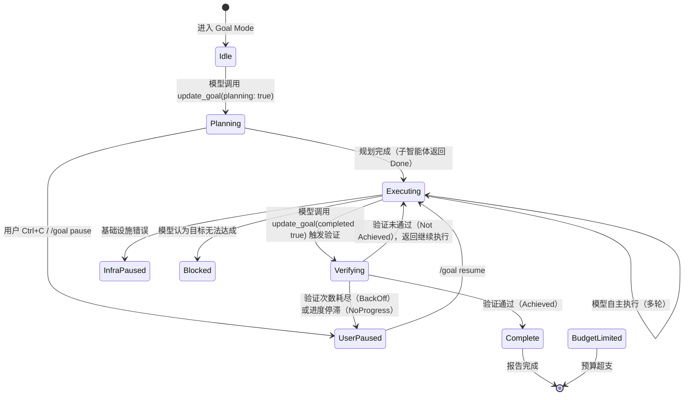
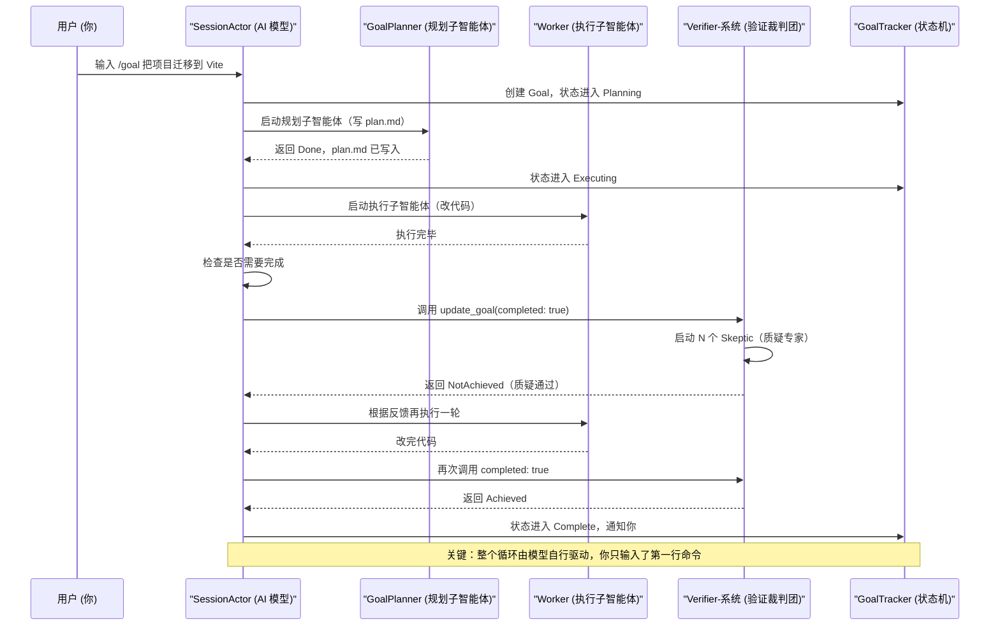

[← 返回首页](index.md)

# Goal Mode 与 Plan Mode：AI 的长期目标和先想后做

## 一句话说清楚：这两个模式解决了什么问题？

普通对话模式里，AI 每轮回答完就结束了——你问一句它答一句，像两个人在微信聊天，没人记得十分钟前说过什么长远规划。

**Goal Mode（目标模式）** 把 AI 从“聊天机器人”变成了“实习生”：你给它一个长期任务，比如“把这个项目从 Vue 2 迁移到 Vue 3”，它会自己规划步骤、执行、检查结果、再调整，直到你说停或它做完，中间不用你每步都指挥。说白了就是**让它自己干活，你只验收最后成果**。

**Plan Mode（计划模式）** 让 AI 先闭嘴想清楚再动手：你给它一个问题，它先写出一份方案给你看，你点头了它才开干。说白了就是**先出图纸再动工，避免做到一半发现方向错了**。

---

## 六点概括：它们怎么玩到一起的

1. **Goal Mode 管理“长期任务”的完整生命周期**：创建→规划→执行→验证→完成/暂停。整个过程模型自动驱动，不需要你每轮干预。
2. **Plan Mode 管“单轮先想后做”**：你提问→AI 出方案→你批准→AI 执行。它在对话层面拦住你，逼你先看方案。
3. **两者互斥但可继承**：一个 session 要么是 Goal Mode、要么是 Plan Mode、要么是普通模式。但一旦进入 Goal Mode，内部会用 Plan Mode 的思维（让 AI 先做规划）。
4. **Goal Mode 的核心是“不断循环”**：规划→执行（可能多轮）→验证（找茬）→如果没通过就回到执行→再验证→直到通过或资源耗尽。
5. **Plan Mode 是一次性的**：出方案→执行→结束，没有验证循环。
6. **两者的状态机都存在于 `src/session/` 下**：Goal Tracker（`goal_tracker.rs`）是 Goal Mode 的状态机，Plan Mode Tracker（`plan_mode.rs`）是 Plan Mode 的状态机。Session Actor 同时持有两者，但同一时间只能激活一个。

---

## Goal Mode 的完整生命周期

### 讲故事：大厨开店怎么管后厨

想象你是一家餐厅的主厨（就是 AI 模型）。顾客点了“整桌满汉全席”——这是 Goal 的创建。你没有直接冲进厨房炒菜，而是先写了一份菜单（**规划阶段**）：凉菜六道、热菜十二道、甜品两道，每道菜需要什么食材、放哪口锅。

菜单写好后，你开始炒菜（**执行阶段**）：炒一道菜，让服务员端上桌。但你不能大厨自己尝咸淡——你有一个**挑刺专家团**（**验证阶段**），每人尝一口你的菜，但凡有一个人说“太咸了”或“火候不够”，整桌菜就退回来重做。你不服，回厨房调整配方再来一轮。直到全部专家都说“可以了”，或者你试了十次还是不行（资源耗尽），你就停下来报告老板（用户）。

### 状态机：Goal 的变迁

图中每个状态转换都是模型通过一个叫 `update_goal` 的工具（详见 `goal_tracker.rs` 里的 `GoalStatus` 枚举）触发的。你作为用户只用两三个命令：`/goal` 建目标、`Ctrl+C` 暂停、`/goal resume` 继续。

### 谁调谁：一个完整验证周期的时序

### 每个阶段的代码藏在哪里

| 组件 | 文件 | 一句话它在干嘛 |
|------|------|----------------|
| 状态机本体 | `crates/codegen/xai-grok-shell/src/session/goal_tracker.rs` | 纯数据结构，没有 I/O，只记录 Goal 在什么状态。类似于记分牌。 |
| 规划子智能体 | `crates/codegen/xai-grok-shell/src/session/goal_planner.rs` | 启动一个“写计划”的子模型，把计划写到 `plan_path` 文件，失败就暂停整个 Goal。属于 **fail-closed**（一出错就停，不冒险）。 |
| 验证裁判团 | `crates/codegen/xai-grok-shell/src/session/goal_classifier.rs` | 启动 N 个“质疑专家”子模型并行找茬，多数投票决定是否通过。默认 3 个专家，你可以调。 |
| 通知发送器 | `crates/codegen/xai-grok-shell/src/session/goal_orchestrator.rs` | 每次状态变化时发通知给 pager UI，让你看到进度条。里面有一堆 `build_goal_updated` 和 `build_goal_cleared` 函数。 |

### 暂停的六种口味

`goal_tracker.rs` 里的 `GoalStatus` 枚举定义了七种状态，其中**五种是暂停**（都继承 `is_paused()` 为 true）：

- **UserPaused**：你按了 Ctrl+C 或敲了 `/goal pause`
- **BackOffPaused**：验证次数用完了（默认 10 次）
- **NoProgressPaused**：验证发现连续多轮模型根本没改痛点（stall detection，默认 2 轮相同指纹就停）
- **InfraPaused**：模型执行时出了基础设施错误（网络断了、推理失败）
- **Blocked**：验证全部专家都说“这活干不了”（环境限制，不是模型能解决的，比如需要你买一台新服务器）

这五种暂停都能用 `resume` 恢复，除了 `Blocked` 和 `InfraPaused` 会携带一个 `pause_message` 说明原因（存储于 `GoalOrchestration.pause_message`）。

---

## Plan Mode 的生命周期：先出方案再动手

### 讲故事：你找程序员外包修 bug

Plan Mode 更简单，相当于你找了一个外包程序员，让他先读完代码给你说“我打算怎么修”，你同意了才让他改。

正常情况下你提问“优化首页加载速度”，模型直接就开始改了。但如果 Plan Mode 开着，模型会先输出一段**计划**（内容像 Markdown 列表：分析瓶颈→缓存图片→懒加载→测试），然后等你回复“批准”或“继续”才实际执行代码变动。

### 与 Goal Mode 的区别

Plan Mode 没有验证循环、没有子智能体并行、没有资源预算管理。它就是一个**开关**：开→先写方案再执行，关→直接执行。状态机定义在 `crates/codegen/xai-grok-shell/src/session/plan_mode.rs` 的 `PlanModeState` 枚举里，只有三个可能值：正常、等待方案、等待执行。很简单。

### 两者怎么共存

Session Actor（`SessionActor`）同时持有 `GoalTracker` 和 `PlanModeTracker` 两个 Mutex。规则就两条：
1. **Goal Mode 中无视 Plan Mode**：一旦进入 Goal Mode，模型的每一步都受 Goal Tracker 的完整状态机驱动，Plan Mode 的“先写方案”对它没意义（它已经在做方案了）。
2. **普通模式下 Plan Mode 生效**：非 Goal Mode 时，如果 Plan Mode 开着，模型每轮都先输出计划再等你批准。

详见代码中的 `handle_session_mode` 函数——它先检查是否是 Goal Mode，是就直接进入 Goal 状态机；否则才检查 Plan Mode 开关。

---

## 怎么用：用户视角的命令

| 命令 | 它在干嘛 |
|------|----------|
| `/goal 帮我把项目迁移到 Vite` | 创建一个长期目标，AI 开始自动推进 |
| `/goal pause` 或 `Ctrl+C` | 暂停当前目标，AI 停止干活等你指示 |
| `/goal resume` | 恢复暂停的目标继续执行 |
| `/goal clear` | 清除当前目标（不算失败，只是你不想做了） |
| `/goal status` | 查看当前目标的进度、已用 token、验证次数 |
| `/plan` | 切换 Plan Mode 开/关（或者加 specific 的 `/plan on` / `/plan off`） |

你可以在 pager 界面看到 Goal Mode 的进度条：当前阶段（规划/执行/验证）、已用 token、活跃子模型数量、验证轮次。这些数据通过 `goal_orchestrator.rs` 中的 `GoalNotifySender` 实时推送。

---

## 进阶：为什么搞这么复杂？

你可能想问：为什么不直接用模型对话解决问题？答案藏在 `goal_classifier.rs` 里的一句注释里：**adversarial skeptic panel**（对抗性质疑专家团）。人类验证代码质量的最好方式是多给几个人审查——AI 也一样。一个模型自己叫“完成了”往往不可信（它可能遗漏了测试或边界情况），但**三个互相独立的质疑专家**——每个人都不知道其他人在想什么——同时挑毛病，结果就可靠得多。

默认 3 个质疑专家（你可以在环境变量 `GROK_GOAL_VERIFIER_N` 里设为 1 到 5），多数投票通过。如果 3 个人里有 2 个说“没完成”，就返回去重做。如果连续两次质疑专家说的“痛点一模一样”（stall detection 触发），就暂停整个目标，避免无意义的死循环。

这整套逻辑写在 `goal_classifier.rs` 里的 `spawn_with_fail_open_retry` 函数里——它甚至考虑到了：如果配置的质疑专家模型比较贵或容易失败，第一次失败后自动回退到当前模型重试一次，还不告诉你（这就是注释里说的 **fail-open**，对应规划阶段的 **fail-closed**——规划阶段出错必须停，但验证阶段出错可以悄悄降级，不能因为一个质疑专家连不上就卡死整个目标）。
