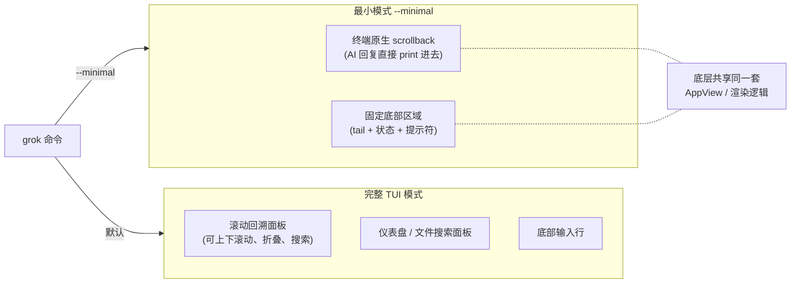
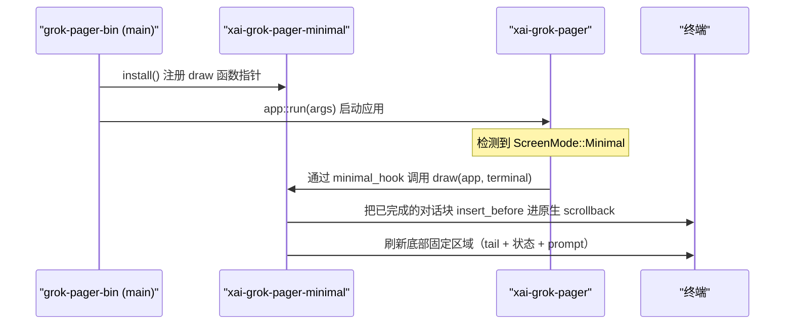
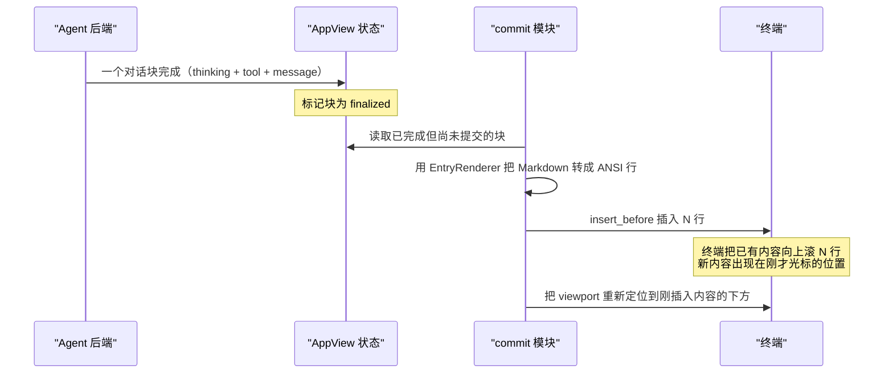

[← 返回首页](index.md)

# Minimal 模式：不画 TUI 也能聊

## 什么是最小模式

最小模式（Minimal Mode）就是"别给我整那个花里胡哨的全屏界面，我就是想在你平常用的终端里跟 AI 聊两句"。你用 `grok --minimal` 启动，它就在你当前终端里一行一行往下打字，跟你平时用 `cat`、`grep` 没区别。

没有滚动面板、没有侧边栏、没有块折叠——整个对话历史直接扔进终端的**原生滚动缓冲区**（就是你平时用鼠标滚轮往上翻的那个东西）。只有最底下留一个小小的**固定区域**显示当前 AI 正在干什么、你的输入提示符和状态栏。



说白了，最小模式就是**把完整 TUI 的上半截拆掉**，对话输出扔给终端自己管，下半截的状态和输入行保留但缩小到几行。

## 跟完整 TUI 的关系

这里有个很容易踩的坑：`xai-grok-pager-minimal` 这个 crate 和主 pager 库 `xai-grok-pager` 之间不能直接互相依赖——那会形成循环依赖（minimal 要读 pager 的内部状态，pager 要调用 minimal 的渲染函数）。

解决办法是一种叫**控制反转**（说白了就是：我预留一个钩子位置，你从外部把函数指针塞进来）的手法。在 `crates/codegen/xai-grok-pager-minimal/src/lib.rs` 里：

```rust
// lib.rs 里的 install 函数——注册最小模式的渲染钩子
pub fn install() {
    xai_grok_pager::minimal_hook::install(xai_grok_pager::minimal_hook::MinimalHooks { draw });
}
```

然后在二进制入口 `crates/codegen/xai-grok-pager-bin/src/main.rs` 的 `main()` 函数第一行就调用它：

```rust
fn main() {
    xai_grok_pager_minimal::install();  // 第一件事：把钩子装上
    // ... 后面才启动整个应用
}
```

这样，pager 内部的 `ScreenMode::Minimal` 分支就知道该调用谁了。当没装钩子的时候，这些分支就什么都不做——就像墙上预留了插座，你插上电器它才通电。



## 每一帧画什么

最小模式的 `draw` 函数在 `crates/codegen/xai-grok-pager-minimal/src/lib.rs` 里，它是整个渲染的心脏——每次终端刷新一帧就调用一次。执行顺序非常讲究，搞反了就会出现输入框跳到屏幕顶上去的 bug。

```rust
pub fn draw(app: &mut AppView, terminal: &mut PagerTerminal) {
    // 0. 开启同步更新 + 先拿到最新的终端尺寸
    let _ = terminal.backend_mut().queue(BeginSynchronizedUpdate);
    let _ = terminal.autoresize();

    // 0.5 同步权限标记（决定哪些块能提交）
    commit::sync_pending_marks(app);

    // 0.6 推进转录导出（如果正在进行的话）
    full_view::pump_transcript(app);

    // 1. 提交欢迎卡片（如果是新会话）
    welcome::maybe_commit_welcome(app, terminal);

    // 2. 提交计划面板到 scrollback
    plan::maybe_commit_plan(app);

    // 3. 根据即将提交的内容计算底部区域高度
    overlay::sync_viewport(app, terminal);

    // 4. 把已完成块写进原生 scrollback
    commit::commit_active(app, terminal);
    commit::expand_pending(app, terminal);

    // 5. 重绘底部固定区域
    live::draw_live(app, terminal);
}
```

每一步干什么：

| 步骤 | 负责模块 | 干了什么 | 为什么这个顺序 |
|------|----------|----------|----------------|
| 0 | `autoresize` | 先抓取终端最新宽高 | 如果先渲染后 resize，已经打印的行宽度是旧的，终端缩小后会自动折行，输出就乱套了 |
| 0 | `BeginSynchronizedUpdate` | 告诉终端"下面的东西打包一起刷新" | 防止多个块先后出现时闪屏（一块刷完等半天才刷下一块） |
| 0.5 | `sync_pending_marks` | 同步哪些块有未完成的权限请求 | 让后面的 viewport 计算和提交判断看到同一份状态 |
| 1 | `maybe_commit_welcome` | 新会话时在对话区顶部印欢迎语 | 欢迎语必须在第一个对话块之前出现 |
| 2 | `maybe_commit_plan` | 如果有计划面板，推到 scrollback | 计划面板像普通块一样提交 |
| 3 | `sync_viewport` | 根据要提交的内容算好底部固定区高度 | **这步必须在 commit 之前**：否则块提交后 viewport 还是旧的（过高的）高度，收缩时输入框会跳到屏幕顶部 |
| 4 | `commit_active` | 把已完成的对话块一行行 `insert_before` 进原生 scrollback | 真正把内容"推上去"给终端 |
| 5 | `draw_live` | 画底部固定区：tail（当前回复流）、状态栏、覆盖层、提示符 | 最后画，盖在正确的位置 |

## 提交到原生 scrollback

这个 `commit` 模块是理解最小模式的关键。完整 TUI 有一个 `ScrollbackPane` 自己管理滚动，往前翻多少行、折叠哪些块都是它控制。但最小模式不用它——直接调用 `xai_ratatui_inline::Terminal::insert_before`，在终端当前光标位置上方插入若干行，把已有内容往上顶。

也就是说，你看到的"AI 回复出现在上面"根本不是什么渲染魔法——就是在你的终端里插入了一些行，终端自己把旧内容向上滚。



## 底部固定区域

叫"固定区域"其实不是真的固定在屏幕底部——它是通过精心计算 viewport 高度来**保持在所有 commit 内容的下方**。`live` 模块负责画这个区域里的一切：

- **tail（尾部）**：当前正在生成的 AI 回复流，还没完成的那些文字
- **status（状态栏）**：当前模型名、token 用量、后台任务数量
- **overlay（覆盖层）**：提示符上方的下拉面板（比如选 model 的弹窗、文件搜索结果）
- **prompt（提示符）**：你打字的地方

`overlay` 模块管理覆盖层的高度——有弹窗时底部区域变高，弹窗消失时缩小。这就是为什么步骤 3 `sync_viewport` 要在 commit 之前算好：你得提前知道最终底部区域有多高，才能正确地把提交内容放到它上面。

## 其他附带功能

除了核心渲染流程，最小模式还附带了几个独立的小模块：

| 模块 | 文件 | 干什么 |
|------|------|--------|
| `auth` | `src/auth.rs` | 没登录时在底部区域里画登录流程，不用切到单独的登录页面 |
| `todo` | `src/todo.rs` | 在提示符上面显示持久化的待办面板 |
| `welcome` | `src/welcome.rs` | 新会话或 `/new` 之后打印欢迎卡片 |
| `full_view` | `src/full_view.rs` | 管理"全屏查看"模式的展开/收缩，以及转录导出 |

## 怎么开启

两种方式：

```bash
# 方式一：启动时加 --minimal
grok --minimal

# 方式二：在配置文件里设
# ~/.grok/config.toml
[cli]
minimal = true
```

最小模式和完整 TUI 可以在运行时用 `/minimal` 命令切换——下次重绘时生效。相关逻辑在 pager 的 dispatch 系统里，[详见《斜杠命令系统》](11-slash-command-system.md)。

## 设计思路小结

用一句话总结：最小模式没做任何"简化"，它只是**换了输出目标**——把原本要画在 ScrollbackPane 里的东西，改成往终端原生 scrollback 里塞。对话状态管理（AppView）、Markdown 转 ANSI（EntryRenderer）、覆盖层逻辑全都是复用的。

这也是为什么 `xai-grok-pager-minimal` 这个 crate 只有两千行不到——它只管"怎么摆放"，不管"渲染成什么"。真正重的活在 `xai-grok-pager` 里，[详见《终端渲染流水线》](09-tui-rendering.md)。
