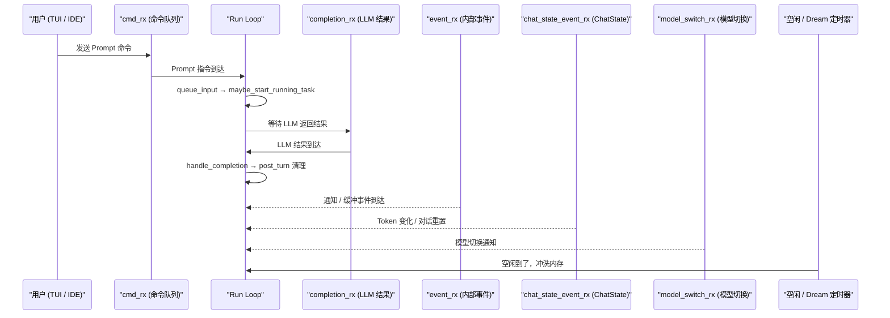
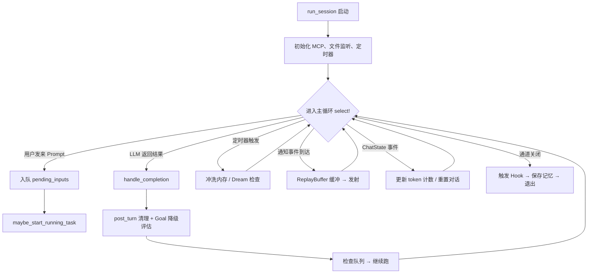

[← 返回首页](index.md)

# Agent 调度核心

这一页聚焦 ACP Session 内部最核心的那个循环——Run Loop。你可以把它想象成一个总机接线员，它同时盯着用户敲进来的新消息、LLM API 返回的流式数据、MCP 服务器发来的事件通知，以及正在执行的后台任务结果。它从不睡觉（除非你关机），不停地在这些消息源之间切换，把每件事分发给正确的处理器。

## 会话是怎么跑起来的

每个 Grok 会话背后，都有一个叫作 `SessionActor` 的角色。它不是操作系统里的线程，而是 Rust 里的一个异步任务（`async fn run_session`），跑在一个专用的 `LocalSet` 里。这个 Actor 持有会话的全部状态——对话历史、工具注册表、权限配置、MCP 客户端池——就像一个管家，所有跟这个会话有关的事都得经过它。

`run_session` 函数的入口在 `crates/codegen/xai-grok-shell/src/session/acp_session_impl/run_loop.rs`，它的签名一眼就能看出它要跟多少东西打交道：

```rust
// run_loop.rs - 片段（简化注释）
pub(super) async fn run_session(
    session: Arc<SessionActor>,
    mut cmd_rx: mpsc::UnboundedReceiver<SessionCommand>,
    mut chat_state_event_rx: mpsc::UnboundedReceiver<xai_chat_state::ChatStateEvent>,
    mut event_rx: mpsc::UnboundedReceiver<SessionEvent>,
    fs_notify_config: Option<ClientFsConfig>,
    codebase_indexes: std::sync::Arc<parking_lot::Mutex<CodebaseIndexManager>>,
    index_root: std::path::PathBuf,
    fs_watch_caps: fs_watch::FsWatchCapabilities,
)
```

它接收的参数分三类：
- **命令通道** (`cmd_rx`)：外部世界（TUI、IDE 插件、Web 前端）发来的指令，比如"把这个 prompt 提交给 AI"、"取消当前任务"。
- **事件通道** (`event_rx`, `chat_state_event_rx`)：内部模块产生的异步通知，比如对话压缩完成、token 预算变更。
- **基础能力** (`fs_notify_config`, `codebase_indexes`, `fs_watch_caps`)：文件监听、代码索引这些"公用设施"。

在进入主循环之前，`run_session` 还会做一系列初始化工作——启动 MCP 调度器、建立文件监听、发起内存定时冲洗——全部在进入 `loop` 之前排好。

## Run Loop 的舞池：`tokio::select!` 调度台

主循环的结构是一个巨大的 `tokio::select!` 块。`tokio::select!` 跟操作系统的 `select()` 系统调用一个意思：同时等着好多个异步消息源，哪个先来就先处理哪个。你可以在脑子里画一个总机接线员面前亮着好几排指示灯，哪盏灯先亮就先接哪条线。



## 命令处理：9 个大类、60 多个变体

`SessionCommand` 是一个巨大的枚举，住在 `crates/codegen/xai-grok-shell/src/session/commands.rs`（虽然我们没拿到完整代码，但从 `run_loop.rs` 里的 match 分支可以反推出来）。它就是外部世界跟会话对话的唯一语言。下面是主要类别：

| 类别 | 核心命令 | 大白话解释 |
|---|---|---|
| **Prompt 相关** | `Prompt`, `Cancel`, `Interject` | 用户说话、中途打断、Ctrl+Enter 插话 |
| **模型配置** | `SetSessionModel`, `OverrideModelName`, `GetCurrentModel`, `GetModelMetadata` | 切换 LLM、查询当前用的是哪个模型 |
| **会话管理** | `CompactSession`, `Rewind`, `RepairHistory`, `Recap` | 压缩历史、回退到上一步、修记录、回顾进度 |
| **MCP 集成** | `UpdateMcpServers`, `ToggleMcpServer`, `ToggleMcpTool`, `CallMcpTool`, `McpAuthTrigger` | 管理外部工具服务器、开/关工具、手动调用、认证 |
| **终端 / 任务** | `KillBackgroundTask`, `ListTasks`, `DeleteScheduledTask`, `BackgroundForegroundCommand` | 管理后台 Shell 任务 |
| **权限 / 模式** | `SetYoloMode`, `SetAutoMode`, `SessionMode`, `RestorePlanApproval` | 切换 Yolo 模式、自动化审批、Plan 模式恢复 |
| **Hook / 插件** | `DispatchSessionStartHook`, `HooksAction`, `PluginsAction`, `NotifyPluginUpdates` | 触发钩子、安装/卸载插件 |
| **反馈与遥测** | `TriggerTestFeedback`, `PersistFeedback`, `GetFeedbackContext` | 用户评价管理 |
| **队列管理** | `RemoveQueuedPrompt`, `ReorderQueue`, `ClearQueue`, `EditQueuedPrompt`, `InterjectQueuedPrompt` | 调整还没发出去的消息顺序 |

每一条命令的处理逻辑都在 `match cmd` 那个巨大的分支里。我们挑一条最常用的——`Prompt`——完整展开看。

## 一条 Prompt 命令的完整旅程

当用户在 TUI 里敲下回车，最终会变成一个 `SessionCommand::Prompt` 发到 `cmd_rx`。Run Loop 接到它的处理过程如下（代码来自 `run_loop.rs` 的 `Prompt` 分支，已适度格式化）：

```rust
SessionCommand::Prompt {
    prompt_id, prompt_blocks, prompt_mode,
    artifact_upload_ctx, client_identifier, screen_mode,
    verbatim, traceparent, json_schema,
    send_now, respond_to, persist_ack, parsed_prompt_tx,
} => {
    // 1. 确保前缀（系统提示词）已就绪
    session.ensure_prefix_ready().await;

    // 2. 判断这个 prompt 的来源
    let origin = super::PromptOrigin::from_prompt_id(&prompt_id);
    if !origin.is_synthetic() {
        // 用户真人在说话 → 重置通知抑制标记
        let mut state = session.state.lock().await;
        state.notifications_suppressed = false;
        session.user_input_generation.fetch_add(1, std::sync::atomic::Ordering::AcqRel);
    }

    // 3. 把 prompt 放进待处理队列
    session.queue_input(
        prompt_blocks, prompt_id, prompt_mode,
        /* ... 其余字段 ... */
    ).await;

    // 4. 当前这个处理因为 send_now 触发了取消 → 停掉正在跑的任务
    if cancel_for_send_now {
        session.cancel_turn_for_send_now(&mut replay_buffer).await;
    }

    // 5. 尝试启动一个 running_task（从队列头部取出一个开始执行）
    SessionActor::maybe_start_running_task(session.clone(), completion_tx.clone()).await;
}
```

执行流程有五步，每一步都值得展开：

### 第一步：前缀就绪

`ensure_prefix_ready` 确保系统提示词块已经构建完成。系统提示词包含了工具列表、技能描述、工作区路径等信息，必须在一轮对话开始前准备好。如果还在异步构建中，这一步会阻塞直到完成。

### 第二步：判断来源

`PromptOrigin` 分两种：
- **用户真正输入的**（非 `synthetic`）：会清除之前 Cancel 留下的消息抑制标记，并递增用户输入计数器（用于懒惰检测）。
- **系统自动生成的**（`synthetic`，如 Goal 系统的自动执行回合）：记录一条 "自动唤醒" 的日志，但不影响用户交互状态。

### 第三步：入队

`queue_input` 把用户的消息块（`prompt_blocks`——通常是 `ContentBlock::Text`，也可能是图片等）包装成一个 `InputItem` 并追加到 `state.pending_inputs` 队列末尾。`InputItem` 定义在 `acp_session.rs`：

```rust
// acp_session.rs - 片段
pub(crate) struct InputItem {
    pub(crate) prompt_id: String,
    pub(crate) prompt_blocks: Vec<ContentBlock>,
    pub(crate) prompt_mode: PromptMode,
    // ... 上传配置、客户端标识、响应发件人 ...
    pub(crate) send_now: bool,   // 是否强插到队列前端
    pub(crate) origin: super::PromptOrigin,
}
```

### 第四步：`send_now` 优先

如果用户用了 "立刻发送"（`send_now`），这个 prompt 会被插到队列最前面，并取消当前正在跑的任务——相当于直接抢过话筒。

### 第五步：启动任务

`maybe_start_running_task` 检查当前是否有任务在跑。如果没有，并且队列不为空，就把队头取出来开始一轮完整的对话回合。注意这里有个微妙的时序：Prompt 命令是**通过 `cmd_rx` 到达**的，但要真正跑起来，却需要通过 **`completion_rx` 来驱动**——因为一但启动，后续的模型调用和工具执行结果都会走 `completion_rx` 回到 Loop。

## 一次对话回合的收尾：`completion_rx` 分支

当 LLM 返回结果（或工具执行完毕）时，结果会通过 `completion_rx` 回来。处理逻辑的骨架：

```rust
maybe_completion = completion_rx.recv() => {
    let Some((prompt_id, result)) = maybe_completion else {
        // 通道关闭 → 清理并退出
        cleanup_session_scratch(&session);
        return;
    };

    // 先排空缓冲区的通知
    if let Some(notification) = replay_buffer.flush() {
        session.emit_buffered(notification).await;
    }

    // 处理本轮结果（包括 Goal 降级计划）
    let (turn_succeeded, infra_pause_message) =
        SessionActor::post_turn_goal_degradation_plan(&result);
    session.handle_completion(prompt_id, result).await;

    // 排空监控事件缓冲区
    session.drain_monitor_buffer_to_pending().await;

    // 基础设施级暂停
    if let Some(message) = infra_pause_message {
        session.apply_infra_pause_after_turn_err(message).await;
    }

    // 收尾处理（记录 token 使用、触发压缩检查）
    session.handle_turn_end(turn_succeeded).await;

    // 冲掉滞留的插话消息
    if session.flush_stranded_interjections().await {
        tracing::info!("Flushed stranded interjection(s) into prompt turns");
    }

    // 再来一次：如果队列里还有任务，继续启动
    SessionActor::maybe_start_running_task(session.clone(), completion_tx.clone()).await;

    // 尝试排放通知
    SessionActor::maybe_drain_notifications(session.clone(), completion_tx.clone()).await;
}
```

关键的步骤链是：**排空缓冲区 → 处理结果 → 评估 Goal 状态 → 结束回合 → 检查队列 → 启动下一轮**。这条链保证了无论上一轮是成功还是失败，会话总能回到一个干净的状态，再决定接下来干什么。

## prompt 队列：先来后到，还能插队

队列的完整状态由 `state.pending_inputs` 维护，这是一个 `VecDeque<InputItem>`。详细管理逻辑在 [详见《会话管理：从出生到归档》](06-session-lifecycle.md)。这里的要点是，Run Loop 在 `completion_rx` 收尾后调用 `maybe_start_running_task`，而这个方法做的事就是把 `pending_inputs` 的队头取出来，变成一个 `running_task`。

`state_is_busy` 函数精确地定义了"什么时候算忙"：

```rust
// acp_session.rs - 片段
pub(crate) fn state_is_busy(state: &State) -> bool {
    state.running_task.is_some() || !state.pending_inputs.is_empty()
}
```

这意味着只要有消息还没被 AI 处理完，或者队列里还有排队的消息，会话就是忙的——外部调用者（比如 Leader 选举系统）会根据这个标记来决定要不要卸载这个会话。

## 定时器：定期体检和记忆冲洗

Run Loop 里有两条以定时器驱动的分支，被放在 `tokio::select!` 的 `biased`（高优先级）位置：

### 空闲冲洗定时器 (`idle_flush_sleep`)

```rust
biased;
_ = &mut idle_flush_sleep, if session.idle_flush_timeout.is_some()
    && session.memory.is_enabled() && !session.memory.is_flushing.load(...) =>
{
    let current_len = session.chat_state_handle.get_conversation_len().await;
    let last_len = session.last_idle_flush_conversation_len.load(...);
    if current_len > last_len {
        // 有新消息，触发内存冲洗
        tokio::task::spawn_local({
            let session = session.clone();
            async move {
                session.run_memory_flush("interval", None).await;
            }
        });
    }
    // 重置定时器
    idle_flush_sleep.as_mut().reset(tokio::time::Instant::now() + timeout);
}
```

它在会话空闲一段时间后，检查是否有新的对话内容需要写入持久化存储。如果上次冲洗后对话长度没变，就直接跳过——避免空转。

### Dream 检查定时器 (`dream_check_sleep`)

类似地，Dream 机制周期性地整理 AI 的长期记忆，把零散的信息提炼成更有用的形式。

```rust
_ = &mut dream_check_sleep, if session.dream_check_timeout.is_some()
    && session.memory.is_enabled() =>
{
    tokio::task::spawn_local({
        let session = session.clone();
        async move { session.maybe_run_dream().await; }
    });
    // 重置定时器
    dream_check_sleep.as_mut().reset(tokio::time::Instant::now() + timeout);
}
```

两个定时器的具体逻辑分别由记忆系统和 Dream 模块负责，详见 [详见《记忆系统：AI 的长期小本本》](31-memory-system.md) 和 [详见《对话压缩：给 LLM 的上下文瘦身》](17-compaction.md)。

## 通知与缓冲：ReplayBuffer 防抖

实际运行时，一秒钟内可能产生十几条通知（比如 LLM 流式输出的每一小段都是一条 `AgentMessageChunk`）。如果每条都立刻发给客户端，不但浪费带宽，还会导致 UI 抖得厉害。Run Loop 用了两层缓冲来解决这个问题：

1. **`ReplayBuffer`**：把连续的小更新攒在一起，达到一定时间间隔或大小阈值再一次性发射。`event_tx_for_flush_timer` 后台任务周期性向 Run Loop 发送 `SessionEvent::FlushReplay` 来触发排放。

2. **突发消费**：在每次收到 LLM 完成或命令处理完成时，Run Loop 也会主动 `flush()` 并 `emit_buffered()`。

这些通知最终变成 `acp::SessionUpdate`，通过 `session.send_update()` 发给所有连接的客户端。具体的渲染和显示由 TUI 层负责，详见 [详见《终端渲染流水线》](09-tui-rendering.md)。

## 会话结束与清理

Loop 的退出有两种情况：
- **命令通道关闭**（`maybe_cmd = cmd_rx.recv()` 返回 `None`）：说明发号施令的人下线了。
- **完成通道关闭**（`maybe_completion = completion_rx.recv()` 返回 `None`）：说明内部处理管道断了。

无论哪种，Run Loop 都会执行一套完整的清理流程：

```rust
// 触发 SessionEnd / Stop hook
session.fire_hook(HookEventName::SessionEnd, ...);
session.fire_hook(HookEventName::Stop, ...);

// 保存记忆摘要
crate::session::memory::hooks::on_session_end(&storage, &conversation, ...);

// 发送遥测
xai_grok_telemetry::session_ctx::log_event(SessionEnded { ... });

// 关闭反馈管理器
session.feedback_manager.shutdown(...);

// 取消同步循环
if let Some(cancel) = &session.sync_loop_cancel {
    cancel.cancel();
}

// 返回，退出 async 任务
return;
```

注意这里的 `sync_loop_cancel`：它不仅仅用来通知 Loop 自己退出，订阅了它的其他后台任务（比如 `moders_manager` 的订阅、Upload Queue 的工作线程）也会收到取消信号并优雅停止。

## 总结：Run Loop 的五个职责

用一个简单的 flow 图来收尾：



最核心的一句话总结：**Run Loop 就是一个永不停止（除非关机）的消息分发器，它把五种不同来源的消息串行化处理，保证每一步操作都在同一个会话状态上安全执行，不会出现并发写乱数据的问题**。这也是为什么它不使用多线程并发处理——`SessionActor` 不是 `Send + Sync` 的，全部动作都跑在同一个 `LocalSet` 里，天然避免了锁竞争。
