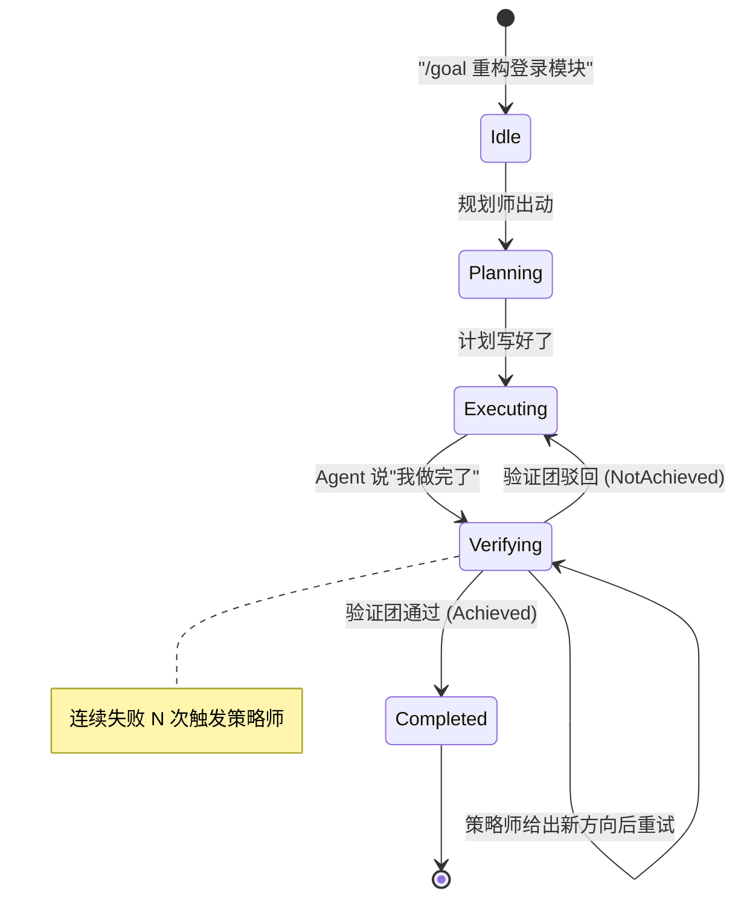
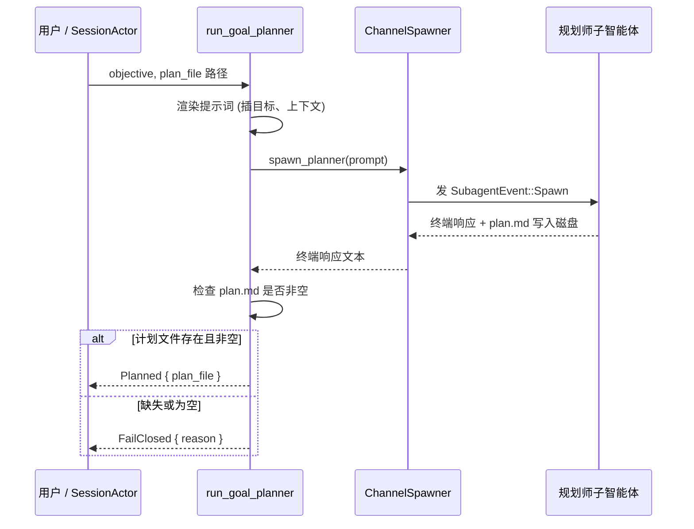
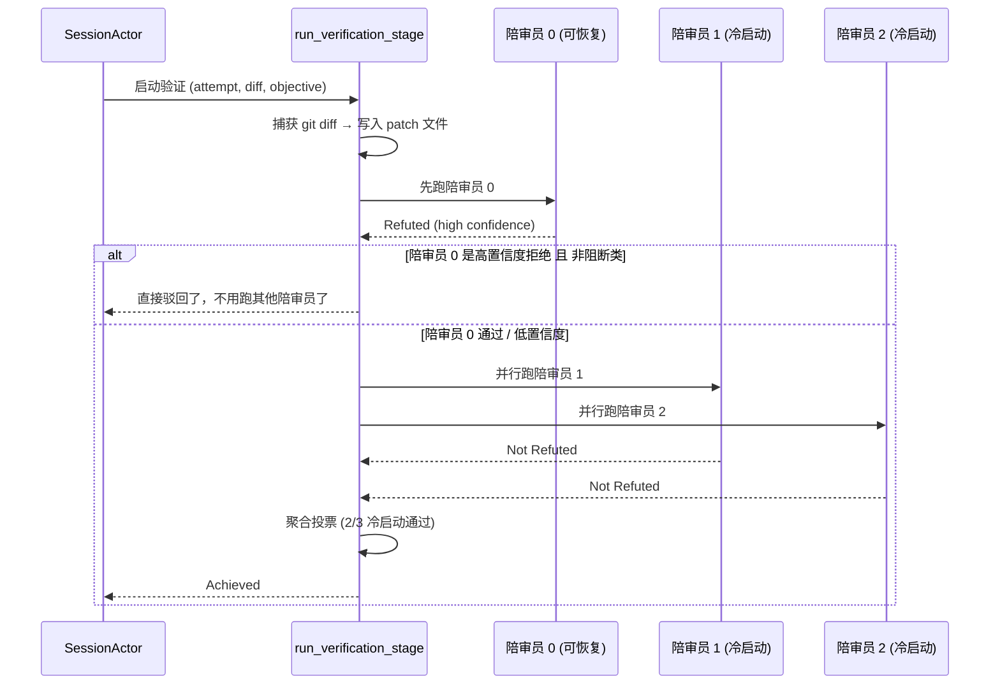
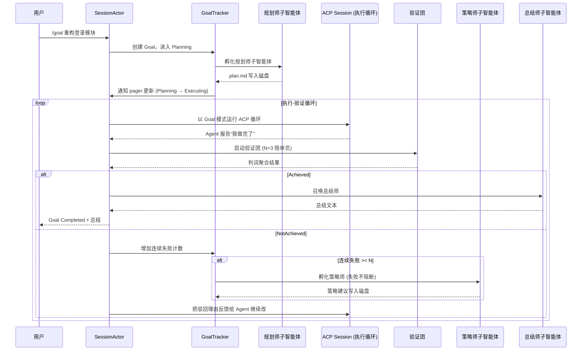

[← 返回首页](index.md)

# Goal 系统：把大任务拆成小步骤

你敲一行 `/goal 重构这个登录模块，加个验证码`，Agent 接到的就是一个**模糊的大任务**。它不能闷头瞎写——得先想清楚"我要改哪些文件？改完怎么算成功？"然后一步步执行，每走一步检查一步是不是跑偏了。

Goal 系统就是干这事的。它本质上是一套**自动编排流水线**，五个角色各司其职：

| 角色 | 文件 | 一句话职责 |
|------|------|-----------|
| 规划师 (Planner) | `crates/codegen/xai-grok-shell/src/session/goal_planner.rs` | 拿到目标，写一份"怎么做、怎么算完成"的计划书 |
| 策略师 (Strategist) | `crates/codegen/xai-grok-shell/src/session/goal_strategist.rs` | 连续失败 N 次后，诊断是不是方向本身就错了 |
| 验证团 (Classifier/Verifier) | `crates/codegen/xai-grok-shell/src/session/goal_classifier.rs` | 验收团——一群"找茬陪审员"审查 Agent 的成果 |
| 总结师 (Summarizer) | `crates/codegen/xai-grok-shell/src/session/goal_summarizer.rs` | 目标达成后，写一段人看得懂的"我干了什么"总结 |
| 调度中心 (Tracker) | `crates/codegen/xai-grok-shell/src/session/goal_tracker.rs` | 管状态、管计数、管"该不该发动策略师"，是整个系统的中枢 |

> **注意：** Goal 系统只管编排"一个大任务的完整生命周期"，具体每轮对话怎么调用 LLM、工具怎么分发，那是 ACP Session 的事。[详见《Agent 调度核心》](15-agent-runtime.md)

---

## 一个目标的一生：五大阶段



**Idle** 是起点。你发一个 `/goal` 命令，系统进入 **Planning** 阶段。规划师写出一份包含验收标准的计划书，然后切到 **Executing**——Agent 开始真正改代码、跑测试。Agent 完成一轮工作后，系统进入 **Verifying** 阶段：一群"找茬陪审员"跑出来审查成果。通过了就 **Completed**，不通过就踢回 Executing 继续改。连续被打回太多次，策略师会被唤醒，给出结构性建议。

---

## 规划师：把"我要一个登录页"变成一份可验证的合同

规划师背后的代码在 `crates/codegen/xai-grok-shell/src/session/goal_planner.rs`。它是一个**子智能体 (subagent)**——系统用 `task` 工具孵化一个独立的 AI 进程，给它一份提示词模板，让它生成 Markdown 计划书。

提示词模板路径在 `crates/codegen/xai-grok-shell/src/session/templates/goal_planner_prompt.md`，核心条文包括：

- **禁止扩大范围：** "do NOT invent scope"——不能把"重构登录"偷偷升级成"重构整个用户系统"
- **验收标准必须可验证：** 不能用"代码优雅"这种模糊标准，必须是"用 test@example.com 登录后页面跳转到 /dashboard"
- **区分"门禁标准"和"锦上添花"：** `gating` 的标准决定 pass/fail，`evidence` 只是加分项，不能单独拦下目标

规划器的运行逻辑（`run_goal_planner` 函数，约 `goal_planner.rs:487`）是这样的：



**规划师是 fail-CLOSED（失败即阻断）的**：计划写不出来，目标就暂停，不会让 Agent 在没计划的情况下瞎跑。对应的错误码定义在枚举 `GoalPlannerFailClosedReason` 里：

```rust
// crates/codegen/xai-grok-shell/src/session/events.rs
pub(crate) enum GoalPlannerFailClosedReason {
    Transport,      // 跟子智能体通讯断了
    Runtime,        // 子智能体运行挂了
    Aborted,        // 用户取消了
    FileWriteFailed,// 计划文件写不进磁盘
    MissingPlan,    // 计划文件不存在或为空
}
```

---

## 验证团（找茬陪审员）：3 个 AI 一起审查你做的东西

这是 Goal 系统最精妙的设计。代码在 `crates/codegen/xai-grok-shell/src/session/goal_classifier.rs`，核心是 `run_verification_stage` 函数。

**核心思想：** 让 Agent 自己审查自己的成果，会很容易"放水"。所以系统**同时派 N 个 AI 当陪审员**（默认 N=3），每个人独立阅读 diff、运行测试、对照验收标准，然后投"Refuted（不通过）"或"Not Refuted（通过）"。只要多数陪审员投了 Not Refuted，目标才算达成。

### 为什么是 3 个陪审员？

代码里写得很清楚（`GOAL_VERIFIER_SKEPTIC_COUNT = 3`）：3 个人里需要 2 票才能通过，单个不靠谱的陪审员（无论是"老好人"还是"乱挑刺"）都左右不了结果。N=2 的话 1-1 平局就卡死了。



### 陪审员 0 的特殊待遇：跨轮次记忆

看到上面"先跑陪审员 0"了吗？这不是性能优化。陪审员 0 是可以**跨轮次恢复 (resume)** 的：

- 第一轮验证驳回后，Agent 根据反馈改代码，然后进入第二轮验证
- 第二轮启动时，陪审员 0 **不是重新冷启动**——它加载上一轮的对话历史，带着"你上次说的第 3 个验收标准没做到，我看看你改了没有"的上下文继续审

这个机制叫 **"Delta re-check"**（增量重检），对应的提示词模板是 `GOAL_VERIFIER_RESUME_PROMPT_TEMPLATE`。代码在 `run_one_skeptic` 里：

```rust
// crates/codegen/xai-grok-shell/src/session/goal_classifier.rs
// 如果 prior_skeptic0_session_id 存在，就发 resume 提示词
if let Some(prior) = resume_from {
    let prompt = render_skeptic_resume_prompt(/* ... */);
    match spawner.spawn_classifier(spawn_id, 0, prompt, &details_raw, Some(prior)).await {
        Ok(terminal) => { /* 正常读取判词 */ }
        Err(err) => {
            // 恢复了但失败了——降级到冷启动
            tracing::info!("skeptic-0 resume spawn failed; falling back to a cold spawn");
        }
    }
}
```

### 每个陪审员怎么交卷？

每个陪审员要交两份材料：

1. **JSON 判词文件** → 写入 `goal-verdict-{verifier_id}-{attempt}-{skeptic_idx}.json`，包含 `refuted`（是否驳回）、`confidence`（高/中/低）、`blocking`（问题是不是结构性死结）
2. **终端令牌** → 最后一行必须是 `Refuted` 或 `Not Refuted`（一个字都不能多），这是快速裁决信号。JSON 才是权威依据。

解析终端令牌的函数很严格：

```rust
// crates/codegen/xai-grok-shell/src/session/goal_classifier.rs
pub(crate) fn parse_skeptic_terminal_response(text: &str) -> Option<bool> {
    let lines: Vec<&str> = text
        .lines()
        .map(str::trim)
        .filter(|l| !l.starts_with("```"))   // 去掉代码块边界
        .map(|l| l.trim_matches('`').trim_end_matches(['.', '!']).trim())
        .filter(|l| !l.is_empty())
        .collect();
    match lines.as_slice() {
        ["Refuted"] => Some(true),
        ["Not Refuted"] => Some(false),
        _ => None,  // 多一个字都不认
    }
}
```

---

## 策略师：连续失败时，"换个思路"的教练

代码在 `crates/codegen/xai-grok-shell/src/session/goal_strategist.rs`。

验证团连续驳回 N 次（默认 N=2），系统会喊策略师出来问："是不是整个方向不对？"它读会话历史、读 diff、读验证团的驳回理由，输出一份结构性建议（比如"拆成两个独立目标"或"先建桩代码再过验收"），保存到磁盘上的策略文件里——**但它绝不碰 plan.md**。

策略师是 **fail-OPEN（失败不阻断）** 的：它是锦上添花的建议，挂了不影响目标继续跑。为了防止它"不小心"改坏合同，`PlanGuard` 这个 RAII 守卫在策略师运行前快照 plan.md，运行后逐字节恢复：

```rust
// crates/codegen/xai-grok-shell/src/session/goal_strategist.rs
struct PlanGuard<'a> {
    plan_file: &'a Path,
    snapshot: PlanSnapshot,
    armed: bool,
}

impl Drop for PlanGuard<'_> {
    fn drop(&mut self) {
        // 取消安全网：如果 restore 还没被调用 (runner future 被中途丢弃)，
        // 在这里做最后一搏恢复
        if let Some(reason) = self.restore() {
            tracing::error!(
                reason = reason.as_const_str(),
                "goal strategist: plan.md restore failed during drop (cancellation)",
            );
        }
    }
}
```

触发逻辑在 `strategist_should_fire` 里，特别设计了"跳窗保护"——如果本来应该在 N=2 时触发，但因为并发原因计数器直接跳到 3，它依然会触发（用 `>=` 而不是 `==` 做判断）：

```rust
pub(crate) fn strategist_should_fire(consecutive: u32, last_fired: u32, every: u32) -> bool {
    every > 0 && consecutive >= last_fired.saturating_add(every)
}
```

---

## 总结师：任务成功后的一句话收尾

代码在 `crates/codegen/xai-grok-shell/src/session/goal_summarizer.rs`。

目标验证通过后，系统喊总结师出来写一段 80 词以内、4 条以内的"我干了什么"总结。它是完全只读的（`SubagentCapabilityMode::ReadOnly`，防止乱改文件），失败不阻断（目标已经成功了），只是一个用户友好的最后一步。

```rust
// crates/codegen/xai-grok-shell/src/session/goal_summarizer.rs
let request = SubagentRequest {
    id: id.to_string(),
    prompt,
    // ...
    runtime_overrides: SubagentRuntimeOverrides {
        capability_mode: Some(SubagentCapabilityMode::ReadOnly),
        ..Default::default()
    },
    // ...
};
```

---

## 调度中心：所有状态追踪在这里

`crates/codegen/xai-grok-shell/src/session/goal_tracker.rs` 是整个系统的数据库。它记录：

- 当前在哪个阶段（Idle / Planning / Executing）
- 验证团跑了多少次、驳回多少次
- 每个陪审员的会话 ID（用于跨轮次恢复）
- token 消耗统计（你已经用了多少 token、还剩多少预算）

这些状态通过 `GoalNotifySender`（`crates/codegen/xai-grok-shell/src/session/goal_orchestrator.rs`）实时推给 GUI，让 pager 上显示"Planning… 第 3 轮验证中"这样的进度条。[详见《滚动回溯引擎》](10-scrollback-system.md)

---

## 一个完整的 Goal 执行时序



---

## 状态追踪：Goal 有哪些状态？

```mermaid
stateDiagram-v2
    [*] --> Active : 用户创建目标

    state Active {
        [*] --> Planning
        Planning --> Executing : 计划就绪
        Executing --> Verifying : Agent 提交成果

        state Verifying {
            [*] --> PanelRunning
            PanelRunning --> Achieved : 多数通过
            PanelRunning --> NotAchieved : 多数驳回
            PanelRunning --> Blocked : 全是结构性死结 (需人工介入)
        }

        Verifying --> Executing : 驳回 (继续改)
        Verifying --> Active : 结构性建议 (策略师介入)
    }

    Active --> UserPaused : 用户暂停
    Active --> BackOffPaused : 限流暂停
    Active --> NoProgressPaused : Agent 没进展
    Active --> InfraPaused : 基础设施故障
    Active --> BudgetLimited : token 预算用完了
    Active --> Blocked : 验证团判定有死结
    Active --> Complete : 最终通过

    UserPaused --> Active : 用户恢复
    Complete --> [*]
```

状态枚举定义在 `crates/codegen/xai-grok-shell/src/session/goal_tracker.rs` 的 `GoalStatus` 里，通过这些状态，`GoalNotifySender` 决定向 GUI 推什么通知。

---

## 配置入口：怎么调整这些参数？

所有 Goal 系统的可调参数都在 `grok.toml` 或远程配置里，由 `xai-grok-config` 解析。[详见《配置体系：三层优先级合并》](28-config-system.md)

常见的可调项：

| 参数 | 默认值 | 说明 |
|------|--------|------|
| `goal_verifier_count` | 3 | 陪审员数量 (1~5) |
| `goal_classifier_max_runs` | 10 | 单个目标最多跑几轮验证（防死循环） |
| `goal_strategist_every` | 2 | 连续失败 N 次触发策略师 |
| `goal_token_budget` | 无上限 | 目标级别的 token 预算 (超出后暂停) |

---

## 总结

Goal 系统把"完成一个大任务"分解成**可规划的步骤、可验证的标准、可纠偏的反馈循环**。五个角色——规划师、策略师、验证团、总结师、调度中心——各司其职，把不可靠的 AI 单步输出变成可靠的渐进式交付。这不是一个"跑得更快"的系统，而是一个"跑对方向"的系统。
