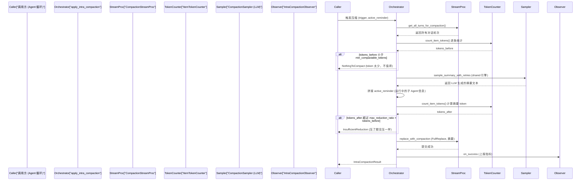
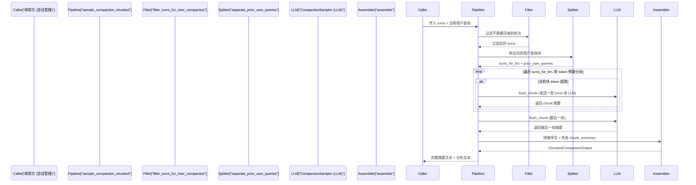

[← 返回首页](index.md)

# 对话压缩：给 LLM 的上下文瘦身

想象一下这个场景：你已经跟 AI 助手聊了 50 轮，从架构讨论到 Bug 排查，又让它重构了两个模块。屏幕上密密麻麻全是 token。你正准备让 AI 继续干活，它突然"失忆"了——不是它想忘，是上下文窗口塞满了。就像往一个固定大小的背包里不断塞东西，塞到一定程度，要么你扔掉一些旧东西腾出空间，要么就什么都装不进去了。

对话压缩就是这个"扔旧东西"的过程，但它不能随便扔——得把旧对话先让 AI 自己写一份"摘要"，然后用这份摘要替换掉原始长对话。这样上下文窗口就空出来了，同时 AI 还能知道之前发生了什么。咱们来看这个过程是怎么设计的。

## 压缩发生在两个层面

Grok 的压缩系统分**对内**和**对外**两种场景，代码里分别叫 `intra_compaction` 和 `inter_compaction`：

- **对内压缩（intra）**：Agent 在跟 LLM 一轮轮交互时，发现自己累积的对话快超过窗口了，就主动触发。相当于"自己给自己瘦身"，发生在一次会话的**中途**。代码在 `crates/common/xai-grok-compaction/src/intra_compaction/compact.rs`。

- **对外压缩（inter）**：用户主动发 `/compact` 命令，或者外部系统（比如 Web 前端）要求压缩会话。相当于"请别人帮你整理笔记"，通常发生在会话**结束后**、下次继续时。代码在 `crates/common/xai-grok-compaction/src/inter_compaction/compact.rs`。

两者的核心流程很像，但对内压缩更复杂——因为它要在 Agent 还在"思考"的时候插一手，不能打断正在进行的工作。

## 触发条件：谁来决定"该瘦身了"？

对内压缩不是拍脑袋做的。有一套检查逻辑（在触发模块里，`crates/common/xai-grok-compaction/src/intra_compaction/trigger.rs`）会看几个信号：

1. **窗口占用率**：当前累积的 token 数超过上下文窗口的某个比例（默认 85%），就开始紧张了。
2. **步数门槛**：不会刚聊两句就压缩，得等到积累了一定轮数（`min_steps_before_compact`）。
3. **最小可压 token 数**：如果总共没多少 token（`min_compactable_tokens`），压缩反而可能亏本——压缩本身也要调用 LLM，有开销。

触发之后，会传入一个 `IntraCompactionTrigger` 结构体，里面带着当前步数、窗口大小、占用百分比，供后续的压缩逻辑做决策。

## 四种压缩模式：按需选择策略

代码里支持四种不同的压缩模式，在 `IntraCompactionConfig::mode` 里定义，`apply_intra_compaction` 函数根据模式分发到不同的处理路径：

```
crates/common/xai-grok-compaction/src/intra_compaction/compact.rs
pub async fn apply_intra_compaction<T, S, P>(
    stream_proc: &S,
    sampler: &P,
    policy: &IntraCompactionConfig,
    trigger: IntraCompactionTrigger,
    token_counter: &dyn ItemTokenCounter<T>,
    observer: &dyn IntraCompactionObserver,
    active_reminder: Option<&str>,
) -> Result<IntraCompactionResult, IntraCompactionError>
```

这个函数内部用 `match policy.mode` 分发到四个分支：

| 模式 | 大白话解释 |
|---|---|
| `FullReplace` | 把整个对话（历史 + 当前步骤）一次性总结，全部替换成摘要。简单粗暴。 |
| `StepsOnly` | 只压缩当前 Agent 循环里的累积步骤，对话历史不动。 |
| `HistoryOnly` | 只压缩之前的对话历史，当前正在干的活儿不动。 |
| `HistoryThenSteps` | 先压历史，压完如果步骤 token 占比还是太高，再接一个步骤压缩。两步走。 |

默认是 `FullReplace`。我们重点看这个模式，因为它最完整地展示了压缩的整个流水线。

## FullReplace 模式：一口吞下全部对话



从代码里能直接看到这个流程：

```rust
// crates/common/xai-grok-compaction/src/intra_compaction/compact.rs
async fn apply_full_replace_compaction<T, S, P>(...) {
    // 1. 读整个对话
    let source_turns = stream_proc.get_all_turns_for_compaction().await;
    let tokens_before: u32 = source_turns.iter()
        .map(|t| token_counter.count_item_tokens(t)).sum();
    if tokens_before < policy.min_compactable_tokens {
        return Err(IntraCompactionError::NothingToCompact);
    }

    // 2. 调 LLM 生成摘要
    let summary_text = sample_shared_summary_with_retries(sampler, &source_turns, policy).await?;

    // 2b. 把运行中的子 Agent 信息追加到摘要末尾
    let summary_text = crate::append_reminder_block(summary_text, active_reminder);

    // 3. 构建替换用的 Developer turn
    let compaction_turn = T::compaction_summary_item(summary_text);
    let tokens_after = token_counter.count_item_tokens(&compaction_turn);

    // 4. 守卫：压缩不划算就丢弃
    if tokens_before > 0
        && tokens_after > (tokens_before as f64 * policy.max_reduction_ratio) as u32
    {
        return Err(IntraCompactionError::InsufficientReduction { ... });
    }

    // 5. 提交：用摘要替换整个对话
    stream_proc.replace_with_compaction(CompactionTarget::FullReplace, turns_compacted, compaction_turn).await?;
}
```

### 那个 `active_reminder` 是干什么的？

这是 FullReplace 模式特有的保护机制。因为 FullReplace 会扔掉**全部**原始对话，包括正在运行的工具调用结果。万一压缩发生时 Agent 正跑着一个后台子任务（比如 `cargo test --watch`），这个子任务的状态信息也会被扔掉——后续 AI 就不知道"哦原来我还有个测试在跑"。

`active_reminder` 就是调用方（Agent 循环）传进来的 `<system-reminder>` 片段，里面写着"当前有哪些子 Agent 还在跑"的 ID 列表。压缩时把它原样追加到摘要后面，这样 AI 醒来后还能继续轮询或取消这些子任务。

## StepsOnly / HistoryOnly：保留了"尾巴"

这两个模式不像 FullReplace 那么激进——它们只压缩**一部分**对话，保留最近的消息作为"尾巴"（tail-keep），让压缩后的上下文还能看到最近发生了什么。

核心逻辑在共享的 `compact_one_pass` 函数里：

```
crates/common/xai-grok-compaction/src/intra_compaction/compact.rs
async fn compact_one_pass<T, S, P>(...) {
    // 1. 读源数据：Steps 读累积步骤，History 读对话历史
    let source_turns = match target {
        CompactionTarget::Steps => stream_proc.get_accumulated_turns_for_compaction().await,
        CompactionTarget::History => stream_proc.get_history_turns_for_compaction().await,
        _ => unreachable!()
    };

    // 2. 选择分割点：要压缩前 N 条，保留剩余作为"尾巴"
    let plan = select_turns_to_compact(&token_counts, &source_turns, target_tokens, ...)?;
    let turns_to_compact = source_turns[..plan.split_idx].to_vec();

    // 3a. History 模式特殊处理：从旧摘要里拆出 <grok_user_queries> 块
    let (turns_for_llm, prior_user_queries) = match target {
        CompactionTarget::History => {
            let separated = separate_prior_user_queries(&turns_to_compact);
            (separated.turns_for_llm, separated.prior_user_queries)
        }
        CompactionTarget::Steps => (turns_to_compact.clone(), None),
        _ => unreachable!()
    };

    // 3b. 调 LLM 生成摘要 (支持 Legacy 和 Shared 两种总结算法)
    let summary_text = match policy.summarizer { ... };

    // 3c. History 模式：重建 <grok_user_queries> 序言
    let final_summary_text = match target {
        CompactionTarget::History => {
            let current_user_queries = extract_user_queries_from_turns(...);
            let preamble = assemble_user_queries_preamble(prior_user_queries, current_user_queries);
            format!("{}{}", preamble, summary_text)
        }
        _ => summary_text
    };

    // 4-6. 构建替换 item、守卫、提交（同 FullReplace）
}
```

一个关键设计在 **3a 和 3c 步骤**：History 模式在压缩"对话历史"时，会遇到一个递归问题——如果在之前的压缩中已经产生过 `<grok_user_queries>` 块（记录了所有用户原始消息），那么这次再压缩的时候，LLM 可能会把旧的 `<grok_user_queries>` 原样复述一遍，越滚越大。所以 `separate_prior_user_queries` 先把旧块拆出来，LLM 只看到纯净的对话内容，最后压缩完了再用 `assemble_user_queries_preamble` 把新旧的用户消息合并回去。这样每轮压缩之后，用户意图不会丢失，但也不会指数膨胀。

## 两种总结器：Legacy 和 Shared

代码里有两套让 LLM 写摘要的算法，通过 `policy.summarizer` 切换：

| 总结器 | 说明 | 差异 |
|---|---|---|
| `IntraSummarizer::Legacy` | 旧的专用算法 | 无清洗、无退化过滤、接受任意短输出 |
| `IntraSummarizer::Shared` | 新的共享核心 | 有清洗（`format_compact_summary`）、有退化检测（太短就重试）、与 grok-build 同步 |

Shared 是默认值，也是推荐的选择。它复用了 `crate::code_compaction::sample_summary_with_retries` 这个公共核心，把 LLM 返回的 `<analysis>...</analysis><summary>...</summary>` 结构化输出提取和清洗，保证摘要质量。

```rust
// 两种总结器的调用路径
let summary_text = match policy.summarizer {
    IntraSummarizer::Legacy => {
        let prompt = build_prompt_for_target(target)?;
        sample_compaction_with_retries(sampler, &turns_for_llm, &prompt, timeout, policy).await?
    }
    IntraSummarizer::Shared => {
        sample_shared_summary_with_retries(sampler, &turns_for_llm, policy).await?
    }
};
```

## 错误处理：哪些错值得重试？

压缩调用 LLM API 时可能遇到各种失败。代码对错误做了精细分类：**确定性错误不重试，瞬态错误才重试**。

```rust
// crates/common/xai-grok-compaction/src/intra_compaction/compact.rs
fn is_transient(err: &IntraCompactionError) -> bool {
    matches!(
        err,
        IntraCompactionError::Timeout           // 超时 → 重试
            | IntraCompactionError::EmptyResponse  // 空响应 → 重试
            | IntraCompactionError::SamplerStream(_) // 流错误 → 重试
            | IntraCompactionError::SamplerStart(_)  // 启动错误 → 重试
    )
    // 以下不重试：SamplerBuild (配置错误), Unsupported, InvalidSplit,
    // InsufficientReduction, NothingToCompact, Apply
}
```

这个重试逻辑对 Agent 的稳定性很关键。如果 LLM 暂时抽风返回空响应，系统不会直接崩掉，而会等几秒再试，最多试 `max_attempts` 次（默认 2 次）。但如果是配置问题（比如 API key 错了），重试没有意义，直接报错让用户知道。

还有一个重要的守卫：**压缩完了发现 token 没省下来怎么办？** 这就是 `InsufficientReduction` 错误。如果摘要的 token 数比原始对话的 `max_reduction_ratio`（默认 0.8，即 80%）还大，说明这次压缩不划算，直接丢弃结果，保持对话原样。

## 对外压缩：用户主动喊的瘦身

当用户敲 `/compact` 或者前端触发压缩时，走的是另一条路径：

```
crates/common/xai-grok-compaction/src/inter_compaction/compact.rs
pub async fn sample_compaction_chunked<T>(...) -> Result<ChunkedCompactionOutput, ...>
```

对外压缩的核心策略是**分块**（chunked）：



支持两种策略，通过 `CompactionStrategy` 切换：

- **Basic**：`UNBOUNDED_CHUNK_LIMIT`（u32::MAX），意味着不管多少内容，全塞进一个 chunk，一次 LLM 调用搞定。
- **DivideAndConquer**：每 chunk 不超过 `dnc_chunk_token_limit`，超了就拆成多个 chunk 分别调 LLM，最后把所有 `<chunk_summary index="i">` 块拼接起来。

对外压缩也做了同样的 `<grok_user_queries>` 保护：在把 turns 喂给 LLM 之前，先用 `separate_prior_user_queries` 把旧的用户查询块拆掉，最后用 `assemble_user_queries_preamble` 把新旧用户查询合并回去。

## 会话级别的压缩调用

上面讲的是压缩引擎的核心逻辑。在实际的 Agent 会话里，还有一层包装，专门负责把对话历史转成 `ConversationItem` 列表、构建提示词、然后调 LLM。代码在：

```
crates/codegen/xai-grok-shell/src/session/helpers/session_compact.rs
```

这个文件里有一个核心函数 `generate_session_compact`，它做了几件事：

1. **构建聊天历史**：`build_compaction_chat_history` 接收原始对话和一个用户可选的附加上下文，在末尾追加一条"请总结对话"的提示词。
2. **选择后端**：支持 ChatCompletions、Responses、Messages 三种 API 后端，每种后端的流处理逻辑略有不同。
3. **流式接收**：用 `StreamTiming` 在线统计 TTFT（首 token 时间）、流持续时间、最大 token 间隔等指标，不缓存每个 token 的时间戳。
4. **分类错误**：`classify_sampling_error` 和 `classify_response_event_error` 两个函数把上游错误分成 `CompactFailure::Deterministic` 和 `CompactFailure::Transient`，决定要不要重试。

构建提示词那段代码展示了`/compact`能接受用户自己加上的附加上下文：

```rust
// crates/codegen/xai-grok-shell/src/session/helpers/session_compact.rs
pub(crate) fn build_compaction_prompt(
    user_context: Option<&str>,
    use_short_prompt: bool,
) -> String {
    if use_short_prompt {
        match user_context {
            Some(ctx) => {
                format!(
                    "{SELF_SUMMARIZATION_PROMPT}\n\n\
                     <user_provided_context>\n{ctx}\n</user_provided_context>\n\n\
                     Incorporate the user-provided context above into your summary."
                )
            }
            None => SELF_SUMMARIZATION_PROMPT.to_string(),
        }
    } else {
        // 长提示词版本，包含 9 个结构化段落要求
        format!(r#"Your task is to produce a faithful, concise summary...
1. Primary Request and Intent...
2. Key Technical Concepts...
3. Files and Code Sections...
..."#)
    }
}
```

## 压缩后的记忆：摘要如何存下来

压缩完成后，摘要会被封装成一个 `Developer` 角色的特殊消息（带 `is_compaction_summary` 标记），写进对话历史里。以后 AI 看这段历史时，能看到"这是之前对话的摘要"，而不是一大段原始记录。

在对外压缩的场景，组装好的完整文本（含 `<grok_user_queries>` 序言和 `<chunk_summary>` 块）会被包装成一个 `ConversationItem::User` 或者特殊格式的消息，下轮对话时 `ChatStateActor` 就能正确识别和使用。详见 [《上下文窗口管理：token 的精打细算》](08-chat-state-context.md)。

压缩后的摘要还有一个作用：给恢复后的 AI 一个"接续"的起点。比如 `AUTO_CONTINUE_PROMPT` 常量：

```rust
pub(crate) use xai_chat_state::compaction_utils::{
    AUTO_CONTINUE_PROMPT, extract_last_real_user_query, ...
};
```

这是一句固定的指令，告诉 AI："根据上面的摘要继续工作，参考'当前工作'和'下一步'段落"。这样压缩后的 Agent 不会呆在原地，而是自动接上之前断掉的工作。

## 压缩模式的配置

用户可以通过配置控制压缩行为。`CompactionMode` 枚举定义了三种外部可见的模式：

```rust
// crates/codegen/xai-chat-state/src/compaction_mode.rs
pub enum CompactionMode {
    Summary,                // 只给摘要
    Transcript,             // 摘要 + 指向原始 transcript 的指针
    Segments(CompactionDetail),  // 摘要 + compaction/ 目录的逐段 Markdown
}
```

- `Summary`模式最简单：压缩完就只留摘要。
- `Transcript`会在摘要后面加一句"如果你需要细节，可以读这个路径下的原始 transcript"。
- `Segments`会把每次压缩的详细内容写成 `compaction/segment_*.md` 文件存到磁盘上，摘要里会告诉 AI："详细内容在 `compaction/segment_*.md`，需要时用 `read_file` 或 `grep` 去查。"

这跟你写代码时看 Git log 差不多——`Summary`等于只读 commit message，`Transcript`等于还告诉你原始 diff 在哪，`Segments`则是直接把每次变更都存档成文件供查阅。

## 小结

对话压缩系统用一个流水线模型，在 Agent 会话中自动或手动触发：

1. **检测**：token 计数器持续监控窗口占用率
2. **选择**：根据模式和策略决定压缩哪部分（全部 / 步骤 / 历史）
3. **采样**：调 LLM 写摘要，支持重试和退化过滤
4. **守卫**：检查压缩效果，不划算就丢弃
5. **提交**：用摘要替换原始对话，更新 parser 状态
6. **报告**：通过 Observer 上报指标，供遥测系统监控

整个过程对用户透明——你只管跟 AI 聊，背后的"收纳师"会自动帮你整理好对话笔记，保证 AI 不会因为背包太满而失忆。
