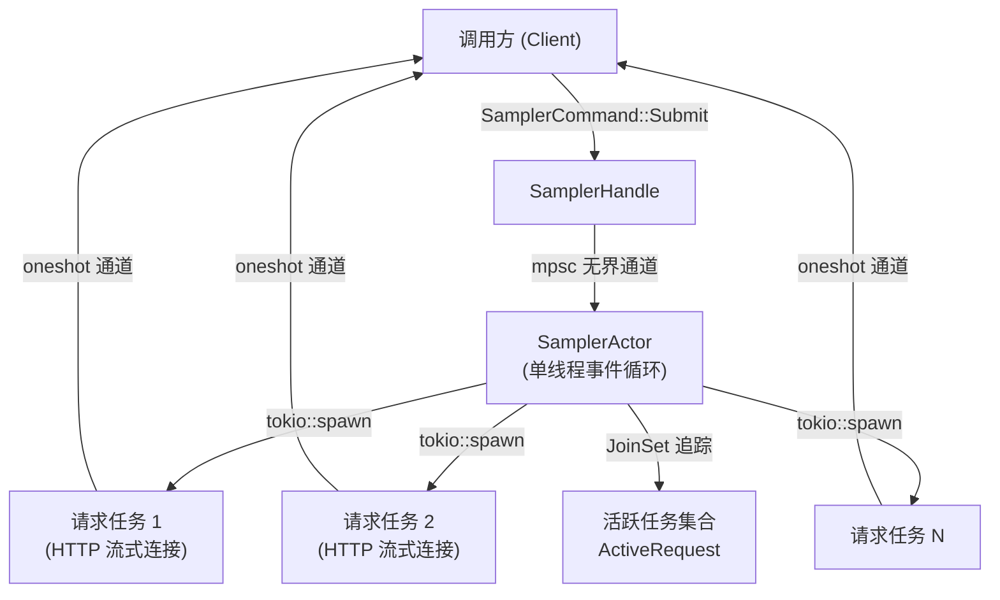
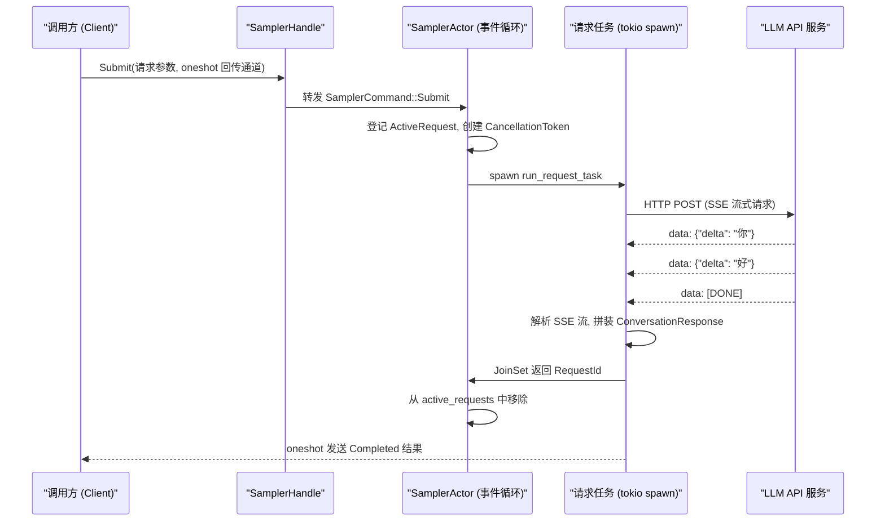
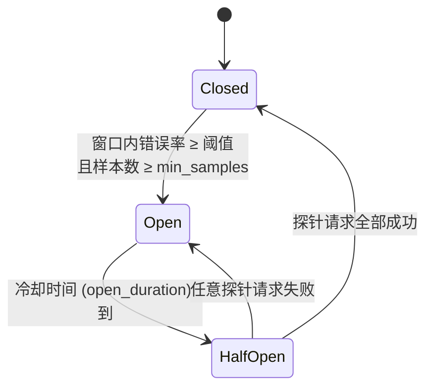
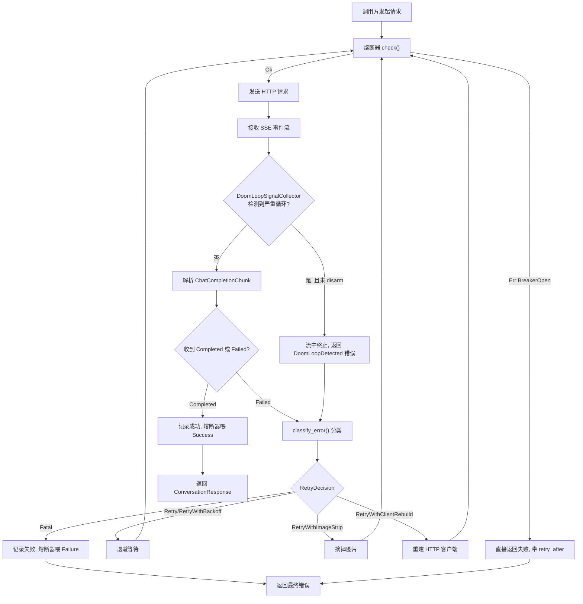

[← 返回首页](index.md)

# 采样器与重试策略

每次你跟 Grok 聊天，背后都有一台"自动电话机"在替你打电话给 LLM API——拨号、等接通、听对方说话、万一断线了还得重拨。这整套逻辑全塞在一个叫 **Sampler**（采样器）的 crate 里。它的核心设计就一条原则：**把脏活累活藏在 Actor 模型背后，对外只留一个干净的请求-响应通道**。

> [Actor 模型（一种并发模式）：每个 Actor 拥有自己的状态，通过消息跟外界通信，内部串行处理，天然不用加锁。](https://en.wikipedia.org/wiki/Actor_model)

这一页我们顺着一次 API 请求的完整生命周期，看看 Actor 怎么调度任务、SSE 流怎么被解析成完整回复、重试策略在什么条件下触发，以及熔断器什么时候"跳闸"保护下游。

## 整体架构：Actor 调度 + 独立请求任务

如果你把 Sampler 想象成一家外卖店的调度台，事情就好懂了：

- **前台下单**：上层代码通过 `SamplerHandle` 发来一个 `SamplerCommand::Submit`——相当于你在 App 上点了一份外卖。
- **调度员接单**：Actor 的事件循环（`SamplerActor::run()`）收到命令，在 `handle_command()` 里登记这个请求，然后把真正的做饭工作交给一个独立的后台任务（`request_task::run_request_task()`）。
- **厨房并行做菜**：每个请求是一个 `tokio::spawn` 出来的异步任务，互不阻塞。Actor 只负责记账——通过 `JoinSet<RequestId>` 追踪哪些请求还在飞，通过 `CancellationToken` 随时可以叫停某一个。
- **外卖送到**：后台任务完成后，把结果塞进一个 `oneshot` 通道送回调用方。



这个设计出自 `crates/codegen/xai-grok-sampler/src/actor/mod.rs`，文件头注释写得明明白白：

> *The actor task itself is single-threaded -- it processes one command at a time -- but it spawns `tokio::spawn` per-request tasks for the actual streaming work, so multiple requests can be in flight concurrently.*

翻译成人话：调度员自己是单线程的，一根筋一次只处理一件事，但厨房里有好几个灶台同时开火。

## Actor 事件循环：调度员的日常工作

`SamplerActor::run()` 是整个 Actor 的心脏，本质是一个 `loop` 里用 `tokio::select!` 同时听两件事：

1. **完工通知**：`self.tasks.join_next()` —— 哪个后台任务做完了，就把它从活跃列表里划掉。
2. **新命令**：`self.cmd_rx.recv()` —— 前台又下了什么单。

代码长这样（摘自 `crates/codegen/xai-grok-sampler/src/actor/mod.rs`）：

```rust
async fn run(mut self) {
    loop {
        tokio::select! {
            biased;
            // 优先处理完工任务，避免活跃列表膨胀
            Some(joined) = self.tasks.join_next(), if !self.tasks.is_empty() => {
                match joined {
                    Ok(request_id) => {
                        self.state.remove(&request_id);  // 从活跃列表里删掉
                    }
                    Err(join_err) => {
                        tracing::warn!(error = %join_err, "request task panicked or was aborted");
                    }
                }
            }
            cmd = self.cmd_rx.recv() => {
                match cmd {
                    Some(cmd) => self.handle_command(cmd),
                    None => break, // 所有 handle 都 drop 了，关门打烊
                }
            }
        }
    }
    // 退出前把还在跑的请求都取消掉，防止泄漏
    for (_, active) in self.state.active_requests.drain() {
        active.cancel_token.cancel();
    }
    self.tasks.shutdown().await;
}
```

`biased` 注解的意思是：如果两个分支同时有东西，优先清理完工的任务。这很合理——你不想一边积压着已完成的请求不清理，一边还接新活儿。

`handle_command()` 支持的几条命令，就是 Sampler 对外暴露的全部能力：

| 命令 | 作用 | 一句话说明 |
|------|------|-----------|
| `Submit` | 发起一次 API 采样请求 | 把请求参数、配置和回传通道交给 Actor，它去 `spawn` 后台任务 |
| `Cancel` | 取消指定请求 | 调用 `CancellationToken::cancel()`，后台任务在下一个 `.await` 点就会停 |
| `UpdateConfig` | 热更新采样配置 | 不用重启就能改超时、重试次数等参数 |
| `IsActive` | 查询某个请求是否还在飞 | 看一眼 `active_requests` 哈希表 |
| `ActiveCount` | 查询当前有多少请求在进行 | 返回 `active_requests.len()` |

## SSE 流的解析：从字节碎片到完整回复

后台请求任务发出去的 HTTP 请求，LLM API 返回的是 **SSE（Server-Sent Events，服务端推送事件）** 格式的流——说白了就是一条长连接，服务端不断往里面塞 `data: {"delta": "你"}` 这样的片段。

Sampler 把这股流分成了两层处理，在 `crates/codegen/xai-grok-sampler/src/stream/` 目录里：

- **Layer 1**（`client.rs` 里的 SSE 解码器）：把原始 HTTP 响应的字节流，按 SSE 协议拆成一个个 `ChatCompletionChunk` 结构体。
- **Layer 2**（`stream/collect.rs` 里的 `stream_chat_completions`）：把这些 `Chunk` 按 `finish_reason`（完成原因——`stop` 正常结束、`length` 长度截断、`tool_calls` 工具调用）拼成完整消息，最终变成 `SamplingEvent` 事件流。

对于不需要流式展示 UI 的场景（比如对话压缩、`/btw` 命令、Dream 机制），可以直接调用 `collect_response()` 把整个事件流"吸干"，拿到最终的 `ConversationResponse` 和延迟统计：

```rust
// 摘自 crates/codegen/xai-grok-sampler/src/stream/collect.rs
pub async fn collect_response(
    stream: impl Stream<Item = SamplingEvent>,
) -> Result<(ConversationResponse, InferenceLatencyStats), SamplingErrorInfo> {
    tokio::pin!(stream);
    while let Some(event) = stream.next().await {
        match event {
            SamplingEvent::Completed { response, metrics, .. } => return Ok((*response, metrics)),
            SamplingEvent::Failed { error, .. } => return Err(error),
            _ => {}  // 中间的 delta、重试通知、元数据事件都丢掉
        }
    }
    // 流结束了却没有 Completed 或 Failed 事件——说明生产者中途 panic 或被取消了
    Err(SamplingErrorInfo {
        kind: SamplingErrorKind::Api,
        message: "stream ended without Completed or Failed".to_string(),
        // ...
    })
}
```

## 时序图：一次完整采样请求的全过程

下面这张时序图，从 Client 发起请求，到 Actor 调度，到后台任务完成，每一步都标清楚了：



注意：Task 完成通知 Actor（通过 `JoinSet`）和 Task 把结果送回 Client（通过 `oneshot`）是两条独立的路径。Actor 只负责记账，不碰业务数据。

## 重试策略：什么该重试、什么该放弃

重试是一门艺术——重太多浪费资源，重太少丢成功率。Sampler 把重试决策抽成一个**纯函数** `classify_error()`，在 `crates/codegen/xai-grok-sampler/src/retry.rs` 里，没有 I/O、没有副作用，只有输入输出。

### 退避算法：指数增长 + 随机抖动

重试不是闷头连续重来，而是隔一段时间再试。这个"隔多久"就是**退避（backoff）**。Sampler 用的策略很简单：

- 从 2 秒起步，每次翻倍（4s, 8s, 16s, ...）
- 封顶 30 秒
- 每次加 ±20% 的随机**抖动（jitter）**，防止大量请求同时重试把服务器打挂（术语叫 thundering herd）

```rust
// 摘自 crates/codegen/xai-grok-sampler/src/retry.rs
pub fn retry_backoff_with_jitter(retry_count: u32) -> Duration {
    let shift = retry_count.saturating_sub(1);
    let base_ms = 2000u64.checked_shl(shift).unwrap_or(u64::MAX).min(30_000);
    let jitter_range = base_ms / 5;  // ±20%
    // 用哈希生成伪随机抖动，避免引入 rand 依赖
    let jitter = hasher.finish() % (jitter_range * 2 + 1);
    Duration::from_millis(base_ms - jitter_range + jitter)
}
```

默认最多重试 15 次（`DEFAULT_MAX_RETRIES = 15`），配合 30 秒封顶，总共给约 6 分钟的恢复窗口。可以通过环境变量 `GROK_MAX_RETRIES` 或模型配置覆盖。

### 错误分类决策树

`classify_error()` 对每种错误给出一个 `RetryDecision`，值如下：

| 决策 | 触发条件 | 大白话 |
|------|---------|--------|
| `EmitToSession` | 认证失败、加密内容不匹配 | 这事 Sampler 管不了，把错误往上抛让 Session 处理（比如刷新 token） |
| `RetryWithImageStrip` | 413 Payload Too Large、图片处理失败 | 请求太大或者图片有问题，把图片摘掉重试一次 |
| `Fatal` | 400/401/403/404/422 等客户端错误、序列化失败、IdleTimeout、上下文超长 | 重试也没用，直接宣告失败 |
| `RetryWithBackoff` (rate limited) | 429 限流 | 按 Retry-After 头或者退避算法等一会儿，但最多只给 2 次机会（`RATE_LIMIT_RETRY_THRESHOLD`） |
| `RetryWithClientRebuild` | 5xx 服务端错误、连接断开（首次） | 重建 HTTP 客户端（切到 HTTP/1.1 回避 HTTP/2 连接池粘连），然后退避重试 |
| `Retry` | 5xx 服务端错误、空回复、Doom Loop（后续） | 普通退避重试 |
| `Retry` (Doom Loop) | 模型陷入"复读机"循环 | 几乎立即重试（0~250ms 微小抖动），因为循环是随机的，重新采样大概率就好了 |

分类的顺序有讲究——代码里按优先级依次检查：

1. 先看是不是认证/加密错误 → `EmitToSession`
2. 再看是不是 413 / 图片处理错误 → `RetryWithImageStrip`
3. 检查服务端是否明确说"别重试"（`x-should-retry: false` 头） → `Fatal`
4. 是不是上下文超长 → `Fatal`（再重试也不会变小）
5. 是不是 Doom Loop → 近乎立即重试
6. 是不是 429 限流 → 限次重试
7. 是不是可重试的 5xx / 传输错误 → 回退重试
8. 以上全不是 → `Fatal`

这个顺序保证了：即使一个本应重试的 500 错误，如果服务端带了 `x-should-retry: false` 头（表示"这错是请求内容导致的，重试没用"），客户端也会尊重它直接 Fatal。

## 熔断器：保护下游的"电闸"

当 LLM API 开始大面积返回错误时，继续往里怼请求只会让两边都更痛苦。这时候需要一个**熔断器**（Circuit Breaker）——名字来自电路里的保险丝，电流太大就自己跳闸。

Sampler 复用了 `crates/common/xai-circuit-breaker` 提供的通用熔断器，它是一个经典的三态状态机：



用大白话解释这个状态机：

- **Closed（闭合，正常工作）**：请求正常通行，熔断器在后台用滑动窗口统计失败率。窗口的大小和失败率阈值都是可配置的。
- **Open（断开，拒绝请求）**：错误率超标了，熔断器"跳闸"。所有请求直接被拒，返回一个 `BreakerOpen` 错误，告诉调用方"请过 `retry_after` 时间再试"。
- **HalfOpen（半开，试探性恢复）**：冷却时间到了，熔断器放少量"探针请求"过去试试水温。如果这些请求成功了，说明 API 恢复了，熔断器回到 Closed；如果有一个失败，立刻重新跳回 Open。

有一个巧妙的设计细节：`CircuitBreaker` 内部维护了一个 `is_open_fast` 原子布尔值，它是状态的"快照镜像"。调用方在热路径上只需一个 `Relaxed` 读就能判断熔断器是否开着，完全不用锁：

```rust
// 摘自 crates/common/xai-circuit-breaker/src/breaker.rs
pub fn is_open(&self) -> bool {
    self.inner.is_open_fast.load(Ordering::Relaxed)
}
```

### 熔断器在 Sampler 中怎么用

Sampler 的请求任务在发起 HTTP 调用之前，先调一遍 `breaker.check()`：

- 返回 `Ok(())` → 放行
- 返回 `Err(BreakerOpen { retry_after })` → 不给 API 发请求了，直接把熔断信号返回给上层

请求结束后，无论成功还是失败，都要调 `breaker.record(outcome)` 把结果喂给滑动窗口。

这样就算熔断器处于 HalfOpen 状态，也只有少数探针请求被放行，其他请求全在门外排队。一旦探针成功，门就重新打开。

## Doom Loop：当 AI 变成复读机

大模型偶尔会陷入一种"思维死循环"——反复生成相同或高度相似的 token，术语叫 **Doom Loop**（末日循环）。xAI 的 API 在服务端检测到这种模式时，会通过一个名为 `response.doom_loop_check` 的特殊 SSE 事件下发信号。

`crates/codegen/xai-grok-sampler/src/doom_loop.rs` 里的 `DoomLoopSignalCollector` 就是专门接收这些信号的。它的工作方式很轻巧：

1. **吸收（absorb）**：SSE 解码器每遇到一帧，先丢给 `absorb()` 看看是不是 doom-loop 事件。如果是，吞掉且不往下传（因为下游的 ChatCompletion 解析器不认识这个自定义事件）。
2. **判断严重程度**：`DoomLoopRecoveryPolicy` 根据信号类型和置信度决定是否触发**流中终止（mid-stream abort）**。比如 `tail_repetition:8@thinking` 比 `tail_repetition:2@response` 严重得多。
3. **武装/解除（arm/disarm）**：每次重试尝试都重新创建 Collector，默认武装。当重试预算用完后，调用 `disarm_abort()` 让最后一次尝试跑完——总得有个结果交给用户。
4. **去重**：API 会重复发送之前累积的信号集合，Collector 用信号的 `raw` 标签做去重。

Doom Loop 触发的重试跟普通重试不同——退避极短（0~250ms 随机抖动），因为循环是随机采样温度导致的，重新摇一次骰子大概率就好了：

```rust
// 摘自 crates/codegen/xai-grok-sampler/src/retry.rs
pub fn doom_loop_backoff(retry_count: u32) -> Duration {
    // 几乎立即重试，只加微小抖动防止多个请求同时返回
    Duration::from_millis(hasher.finish() % 251)
}
```

## 小结：一张图串起所有



这就是 Sampler 的完整心脏——Actor 模型做调度、SSE 流做解析、重试策略做韧性、熔断器做保护、Doom Loop 检测做兜底。每个模块各司其职，组合在一起，让你在终端里打字的每一次对话，背后都有一套工业级的容错机制在守护。

> 关于熔断器的更多细节（滑动窗口算法、HalfOpen 的探针回收机制等），[详见《整体架构：TUI → Agent → Workspace 三层协作》](04-architecture-overview.md) 里关于通用基础库的介绍。关于对话压缩如何触发重采样，[详见《对话压缩：给 LLM 的上下文瘦身》](17-compaction.md)。
