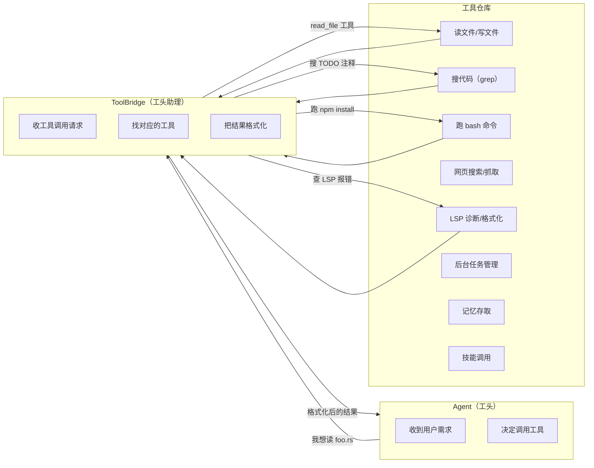
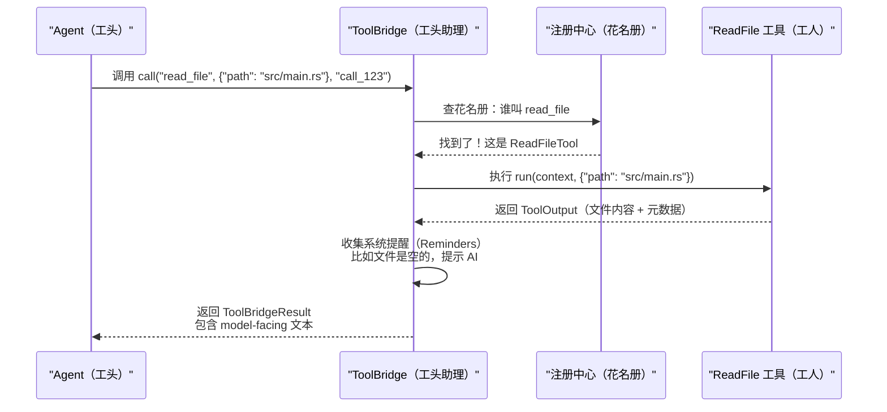

[← 返回首页](index.md)

# 工具箱：AI 的手和眼睛

## 先讲个故事：工地上的工具箱

想象你是一个建筑工头（这就是 Grok Agent），你的大老板（也就是用户）给你一张图纸（需求），让你盖个房子（写个功能）。你自己当然不会砌墙、不会铺电线——你靠的是手下一帮工人，每人拎着自己的工具箱。

这个工具箱就是 `xai-grok-tools` 这个 crate。它把 AI 能调用的所有能力——读文件、搜代码、跑 shell 命令、抓网页、查 LSP 诊断——统统打包成**长得一模一样的工具**。不管工具里面多复杂，对外都是一个把手，你告诉它「我要干什么」，它递给你结果。

## 工具箱里都有什么宝贝

先别看代码，逛一圈工地上都有哪些工人：



每一个工具都是一名专职工人。工头（Agent）不需要知道工人怎么干活，只要喊一声「小王，把 foo.rs 读出来」，助理（ToolBridge）就去找小王，把结果递回来。

## 核心概念一：Tool trait——所有工具的「灵魂契约」

在 Rust 里，trait 就是一种接口（interface）——你可以把它理解成一份合同：只要你签了这份合同，就必须提供合同中规定的所有方法。

`xai-grok-tools` 里所有的工具都签了同一份「灵魂契约」——`xai_tool_runtime::Tool` trait。这个 trait 不在本 crate 里定义（它在兄弟 crate `xai_tool_runtime` 里），但所有工具都实现它。契约要求每个工具提供：

| 方法 | 作用 | 大白话解释 |
|------|------|------------|
| `id()` | 返回工具的唯一标识 | 每个工具的身份证号 |
| `description()` | 返回工具的用途描述 | 告诉 AI 这个工具能干什么 |
| `run()` | 执行工具逻辑 | 真正干活的地方——接收参数，返回结果 |

看看真实的类型定义（来自 `crates/codegen/xai-grok-tools/src/types/tool.rs`）：

```rust
// ToolKind 枚举：把所有工具分成几大类。
// 类型本身在 types/tool.rs，详细的展示名在 tool_taxonomy.rs。
pub enum ToolKind {
    Read,           // 读文件
    Edit,           // 改文件
    Delete,         // 删文件
    ListDir,        // 列目录
    Write,          // 写新文件
    Move,           // 移动/重命名
    Search,         // 搜代码
    Lsp,            // LSP 诊断（IDE 级别的代码检查）
    Execute,        // 执行命令（bash/shell）
    Plan,           // 制定计划
    WebSearch,      // 网页搜索
    WebFetch,       // 抓取网页内容
    BackgroundTaskAction,  // 后台任务操作
    // ... 还有 20+ 种，完整的在 tool_taxonomy.rs
}
```

每个工具都有自己的 `ToolKind`，就像每个工人有自己的工种——你是木工、电工还是水暖工，一看你的 `kind` 就知道。

## 核心概念二：注册中心——工头的花名册

光有工人还不够，工头得知道「我手下到底有哪些人」。`registry` 模块就是一本花名册（来自 `crates/codegen/xai-grok-tools/src/registry/mod.rs`）。

它的核心结构是 `ToolRegistryBuilder`，你往里面塞工具，最后调用 `finalize()` 得到一个 `FinalizedToolset`——一本钉死的花名册，之后工具就固定了，不能随便增删（除了 MCP 动态工具，后面讲）。

真实代码（来自 `crates/codegen/xai-grok-tools/src/bridge.rs`）展示了构建过程：

```rust
// ToolBridge 是工头助理，它自己持有一个 ToolRegistryBuilder
impl ToolBridge {
    pub fn get_builder() -> ToolRegistryBuilder {
        ToolRegistryBuilder::new()  // 建一本空花名册
    }

    pub async fn finalize_builder(
        builder: ToolRegistryBuilder,
        config: ToolServerConfig,
        ctx: SessionContext,
    ) -> Result<Self, xai_tool_runtime::ToolError> {
        // 最终固化花名册——此时所有工具都注册好了
        let finalized_toolset = builder.finalize(config, ctx).map_err(|errs| {
            xai_tool_runtime::ToolError::invalid_arguments(format!(
                "Requirements unsatisfied: {errs:?}"
            ))
        })?;
        // ...
    }
}
```

注册中心还做一件很重要的事：**把工具的客户端名字和 `ToolKind` 对起来**。工头喊「小王」时，助理得知道小王是「木工（Edit）」还是「电工（Execute）」。这个映射关系就在 `bridge.rs` 里维护：

```rust
// 通过客户端名字查 ToolKind
pub fn tool_kind(&self, tool_name: &str) -> Option<ToolKind> {
    self.registry.get_tool_metadata(tool_name).map(|m| m.kind())
}

// 反过来，通过 ToolKind 查客户端名字
pub async fn tool_for_kind(&self, kind: ToolKind) -> Option<String> {
    // 从 TemplateRenderer 里的映射表查
}
```

## 一次工具调用的完整旅程

理论讲完了，我们来追一次真实的调用。假设 Agent 想读 `src/main.rs` 文件：



对应的代码流程（来自 `crates/codegen/xai-grok-tools/src/bridge.rs`）：

```rust
pub async fn call(
    &self,
    client_function_name: &str,  // Agent 喊的名字，比如 "read_file"
    client_params: serde_json::Value,  // 参数，比如 {"path": "src/main.rs"}
    tool_call_id: &str,  // 这次调用的唯一 ID
) -> Result<ToolRunResult, xai_tool_runtime::ToolError> {
    // 直接委托给花名册（FinalizedToolset）的 call 方法
    self.registry
        .call(client_function_name, client_params, tool_call_id, None)
        .await
}
```

步骤很简单：
1. Bridge 拿到请求后，直接交给 `registry.call()`
2. Registry 根据名字找到对应的工具实例，调用它的 `run()` 方法
3. 工具返回 `ToolOutput`——里面有纯数据输出、系统提醒等
4. Bridge 把 `ToolOutput` 包装成 `ToolBridgeResult` 返回

### 系统提醒（Reminder）——工具的「友情提示」

工具执行完后，有些工具会自动附加一条提醒。比如 `ReadFile` 工具读了一个空文件，它会提醒 AI：「注意啊，这文件是空的，别以为读失败了」。

这个机制叫 `Reminder` trait（来自 `crates/codegen/xai-grok-tools/src/types/tool.rs`）：

```rust
#[async_trait::async_trait]
pub trait Reminder {
    /// 这个提醒的激活条件——比如「仅当 output 为空时触发」
    fn requires_expr(&self) -> Expr<ToolRequirement> {
        Expr::True
    }

    /// 收集提醒文本
    async fn collect_reminders(
        &self,
        _resources: SharedResources,
        _tool_output: &ToolOutput,
    ) -> Vec<String> {
        vec![]
    }
}
```

有两种 Reminder：
- **Per-tool Reminder**：每个工具自己带的提醒，比如 `ReadFileTool` 的空文件提醒
- **Cross-cutting Reminder**：全局提醒，比如 `SkillDiscoveryReminder`（发现新技能时提醒 AI）、`TaskCompletionReminder`（后台任务完成时提醒）

## 工具箱的分区：四种工具集

不同场景下，Agent 需要的工具数量不一样。比如代码补全（codex）只需要读文件和搜索，而完整对话（grok_build）需要全套工具。所以工具箱分成好几个**工具集（ToolNamespace）**：

| 工具集 | 命名空间 | 包含哪些 | 适用场景 |
|--------|----------|----------|----------|
| GrokBuild | `GrokBuild` | 全套：bash、文件读写、搜索替换、网页、图像生成等 | 完整的对话交互 |
| GrokBuildConcise | `GrokBuildConcise` | 精简版：只保留 bash、read_file、search_replace | 轻量级对话模式 |
| GrokBuildHashline | `GrokBuildHashline` | 基于哈希行定位的编辑子系统 | 更稳定的搜索替换 |
| Codex | `Codex` | apply_patch、grep_files、list_dir、read_file | 代码补全场景 |
| OpenCode | `OpenCode` | 另一套文件操作工具实现 | 开放代码编辑 |
| MCP | `MCP` | 动态注册的外部工具 | 在运行时接入外部服务 |

从 `ToolNamespace` 枚举定义（`crates/codegen/xai-grok-tools/src/types/tool.rs`）可以看到这些分类：

```rust
pub enum ToolNamespace {
    GrokBuild,           // 完整工具集
    GrokBuildConcise,    // 精简工具集
    GrokBuildHashline,   // 哈希行工具集
    Codex,               // 代码补全工具集
    OpenCode,            // 开放代码工具集
    MCP,                 // 动态 MCP 工具
}
```

## 输出大小限制：别让 AI 被数据撑死

工具的输出（比如读了 10 万行代码）不能直接全扔给 LLM——token 窗口有限，而且大输出会拖慢整个对话。

`lib.rs` 里定义了全局限制（`crates/codegen/xai-grok-tools/src/lib.rs`）：

```rust
/// 工具结果发回模型时的默认最大字节数
/// 40 KB ≈ 10 000 tokens
pub const DEFAULT_TOOL_OUTPUT_BYTES: usize = 40_000;

/// Bash/终端工具结果的最大字符数（硬限制）
/// 20 000 chars ≈ 5 000 tokens
pub const DEFAULT_TOOL_OUTPUT_CHARS: usize = 20_000;

/// MCP 内联工具结果的上限
/// 可以通过环境变量 GROK_MAX_MCP_OUTPUT_BYTES 覆盖
pub const MCP_MAX_OUTPUT_BYTES: usize = 80_000;
```

这些常数不是拍脑袋定的——它们和 `ChatStateActor` 的 token 估算联动，确保工具输出和对话历史加起来不爆窗口。[详见《上下文窗口管理》](08-chat-state-context.md)

## 工具的「身份证」：CanonicalToolMeta

每个工具调用完成后，它的身份信息会被打包成 `CanonicalToolMeta`（标准工具元数据），塞进 ACP 事件流的 `_meta` 字段里，供调试和分析用。

这个类型定义在 `crates/codegen/xai-grok-tools/src/tool_taxonomy.rs`，结构很简单：

```rust
pub struct CanonicalToolMeta {
    pub version: u32,        // 协议版本号（当前为 1）
    pub name: String,        // 工具的客户端名字（如 "read_file"）
    pub kind: ToolKind,      // 工具类型（如 Read）
    pub namespace: ToolNamespace,  // 所属工具集（如 GrokBuild）
    pub label: Cow<'static, str>,  // 可读标签（如 "Read"）
    pub read_only: bool,     // 是否只读
    pub input: Option<serde_json::Value>,  // 归一化后的输入参数
}
```

它的 JSON 长这样：

```json
{
  "x.ai/tool": {
    "version": 1,
    "name": "read_file",
    "kind": "read",
    "namespace": "grok_build",
    "label": "Read",
    "read_only": true,
    "input": { "path": "/src/main.rs" }
  }
}
```

注意那个 `kind` 字段——它是一个**开放的字符串**。也就是说，即使以后加了新工具种类，旧版客户端也不会崩，只会把不认识的 kind 归类到 `Other`。

## MCP 动态工具：在运行时雇临时工

有些工具不是在启动时注册的——它们是运行时通过 MCP 协议动态接入的外部服务。这就像工地突然来了个外包团队，带来了临时工人。

`ToolBridge` 提供了动态注册/注销的接口（来自 `crates/codegen/xai-grok-tools/src/bridge.rs`）：

```rust
// 注册一个 MCP 工具（雇一个临时工）
pub async fn register_mcp_tools<T>(
    &self,
    mcp_name: String,      // MCP 服务名字
    tool: T,               // 工具实例
    input_schema: Option<serde_json::Value>,  // 入参 Schema
) -> Result<(), xai_tool_runtime::ToolError>

// 按前缀注销一批工具（解雇一批临时工）
pub fn unregister_tools_by_prefix(&self, prefix: &str) -> usize

// 按名字注销一个工具（解雇某个临时工）
pub fn unregister_tool_by_name(&self, name: &str) -> bool
```

MCP 工具的详细接入流程见 [《MCP 协议：接入外部工具服务》](25-mcp-integration.md)。

## 完整的工具清单（从 ToolKind 枚举提取）

| 工具类型 | 显示名称 | 只读？ | 一句话说明 |
|----------|----------|--------|------------|
| `Read` | Read | ✅ | 读文件内容 |
| `Edit` | Edit | ❌ | 搜索替换修改文件 |
| `Delete` | Delete | ❌ | 删除文件 |
| `Write` | Write | ❌ | 写新文件 |
| `Move` | Move | ❌ | 移动/重命名文件 |
| `ListDir` | List Files | ✅ | 列出目录内容 |
| `List` | List Files | ✅ | 列文件（另一种实现） |
| `Search` | Search | ✅ | 代码搜索（grep） |
| `Lsp` | Code Intelligence | ✅ | LSP 诊断/格式化/跳转 |
| `Execute` | Run Command | ❌ | 执行 bash/shell 命令 |
| `Plan` | Plan | ❌ | 制定执行计划 |
| `WebSearch` | Web Search | ✅ | 网页搜索 |
| `WebFetch` | Web Fetch | ✅ | 抓取网页内容 |
| `BackgroundTaskAction` | Background Task | ❌ | 后台任务操作 |
| `WaitTasksAction` | Wait for Tasks | ❌ | 等待后台任务完成 |
| `KillTaskAction` | Kill Task | ❌ | 杀掉后台任务 |
| `Skill` | Skill | ❌ | 调用技能 |
| `MemorySearch` | Memory Search | ✅ | 搜索 AI 记忆 |
| `MemoryGet` | Memory Read | ✅ | 读取 AI 记忆 |
| `Task` | Subagent | ❌ | 启动子 Agent |
| `EnterPlan` | Enter Plan Mode | ✅ | 进入计划模式 |
| `ExitPlan` | Exit Plan Mode | ✅ | 退出计划模式 |
| `AskUser` | Ask User | ✅ | 向用户提问 |
| `ImageGen` | Generate Image | ❌ | AI 图片生成 |
| `VideoGen` | Generate Video | ❌ | AI 视频生成 |
| `ImageToVideo` | Generate Video | ❌ | 图片转视频 |
| `ReferenceToVideo` | Generate Video | ❌ | 参考图转视频 |
| `DeployApp` | Deploy App | ❌ | 部署应用 |
| `SearchTool` | Search Tools | ❌ | 搜索可用工具 |
| `UseTool` | Use Tool | ❌ | 使用搜索到的工具 |
| `Monitor` | Monitor | ❌ | 监控事件/日志 |
| `GoalUpdate` | Update Goal | ❌ | 更新执行目标 |
| `Other` | Tool | ❌ | 未分类的工具 |

## 和周边系统的关系

工具箱不是孤立存在的——它和好几个兄弟模块配合工作：

- **Agent 调度核心**：Agent 的 run loop 决定「什么时候调用哪个工具」，然后把调用请求丢给 Bridge。 [详见《Agent 调度核心》](15-agent-runtime.md)
- **终端执行与权限控制**：`Execute` 类工具最终走到 bash 执行，权限策略就是在那层检查的。 [详见《终端执行与权限控制》](20-terminal-tools.md)
- **工作区与文件系统**：所有文件操作工具（Read/Write/Edit/Delete）都通过 Workspace trait 抽象访问文件系统。 [详见《工作区与文件系统》](21-filesystem-workspace.md)
- **记忆系统**：`MemorySearch` 和 `MemoryGet` 对接 SQLite + 向量搜索的记忆后端。 [详见《记忆系统：AI 的长期小本本》](31-memory-system.md)
- **技能系统**：`Skill` 工具让 AI 能调用经前置发现流程注册的外部技能。技能发现的逻辑在 `SkillDiscoveryReminder` 里，这个 Reminder 就是在工具的 `registry/resources` 里维护的。 [详见《插件与钩子系统》](26-plugins-and-hooks.md)

现在你对工具箱的全貌有了认识——知道工头怎么招呼工人、工人怎么干活、结果怎么递回去。如果想知道 Agent 是怎么决定「什么时候该调用工具」的，翻到 [Agent 调度核心](15-agent-runtime.md) 看看那个永不停歇的 Run Loop。
