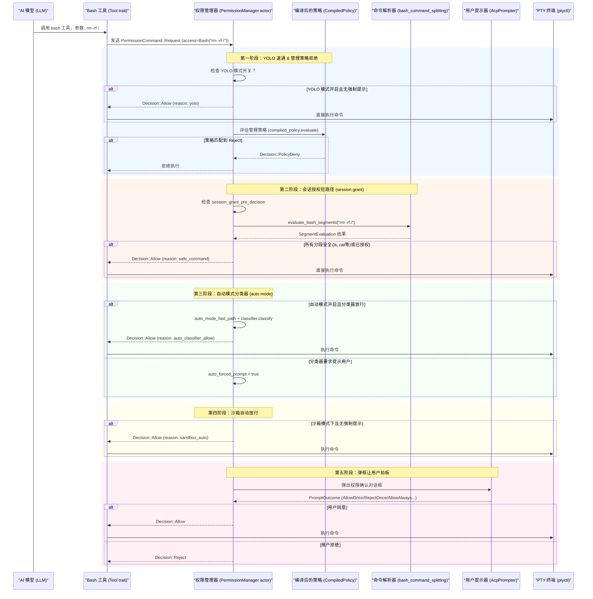
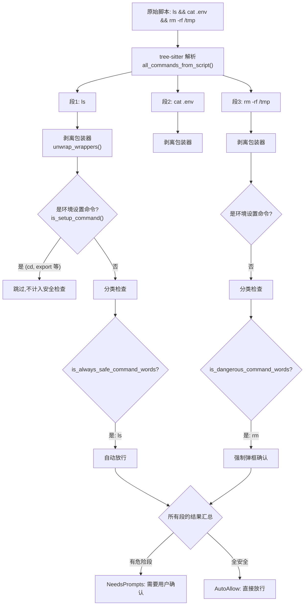
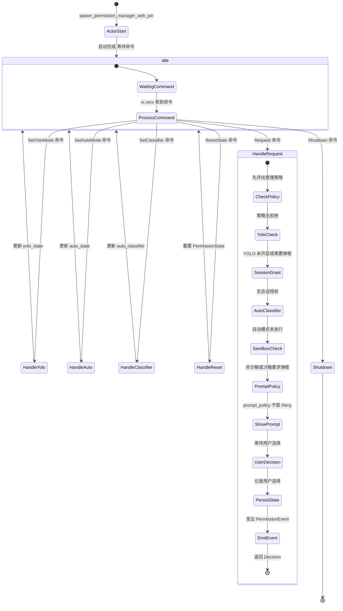
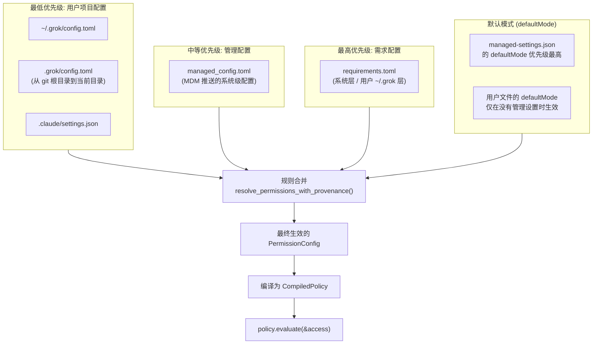

[← 返回首页](index.md)

# 终端执行与权限控制

AI 助手最大的风险不是它说错了话，而是它**真的能干活**——改文件、搜代码、甚至执行 `rm -rf /`。这一页讲的是：当你让 AI 跑一条 bash 命令时，系统怎么决定是直接放行、弹出确认框，还是直接拒绝。

整个权限体系分布在两个关键 crate 里：

- `crates/codegen/xai-grok-workspace/src/permission/` —— 权限策略引擎，负责「该不该让这命令跑」
- `crates/codegen/ptyctl/src/pty.rs` —— PTY（伪终端）封装，负责「真的在终端里跑这个命令」

[配置体系的优先级合并](28-config-system.md)和 [工具箱的注册机制](19-tool-system.md)是这层权限系统的基础设施，这一页只聚焦 bash 命令从「AI 说想跑」到「命令真正进终端」这条链路上的权限决策。

## 从 AI 说想跑到命令真正执行：一次完整的权限检查

想象你在餐厅点菜。你（AI）对服务员说「我要一份 rm -rf /」。服务员不是直接冲向厨房，而是先查手册（策略）、看你点的菜是否在安全清单上（只读命令白名单）、再问经理（你的确认），最后才决定是传菜还是拒单。这就是整个权限检查的流程。



这五道关卡的文件对应关系：

- **第一阶段**：`crates/codegen/xai-grok-workspace/src/permission/manager.rs` 里 PermissionManager actor 的主循环，YOLO 检查在 `PermissionCommand::Request` 分支的最前面
- **第二阶段**：同一文件里的 `session_grant_pre_decision()` 函数，调用 `evaluate_bash_segments()`
- **第三阶段**：`auto_mode_fast_path()` 和 `classifier.classify()`，在 `crates/codegen/xai-grok-workspace/src/permission/auto_mode.rs`
- **第四阶段**：`xai_grok_sandbox::should_auto_allow_bash()` 的调用
- **第五阶段**：`AcpPrompter::request()`，定义在 `crates/codegen/xai-grok-workspace/src/permission/prompter.rs`

## 命令拆分：不是看整条命令，而是逐个分段检查

这是权限系统最精妙的设计。你可能会想：`ls && rm -rf /` 里的 `ls` 是安全的，那整条命令就能自动放行？不行。

权限检查的对象不是「整条脚本字符串」，而是 **tree-sitter 解析出来的每个独立命令段**。`ls && rm -rf /` 会被拆成 `ls` 和 `rm -rf /` 两个段，各自过一遍安全检查。



这里有几个关键函数，全部在 `crates/codegen/xai-grok-workspace/src/permission/manager.rs`：

### 命令拆分：`all_commands_from_script()`

这个函数在 `crates/codegen/xai-grok-workspace/src/permission/bash_command_splitting.rs` 里定义（上面的文件里通过 `use` 引入）。它用 tree-sitter 把 shell 脚本解析成 AST，提取出每个独立命令。如果解析失败（包含 heredoc、命令替换 `$()`、反引号等复杂语法），返回 `None`，整条脚本走保守流程——弹框让用户确认。

### 包装器剥离：`unwrap_wrappers()`

很多命令前面会套一些不影响安全性的「包装器」：

```rust
// 来自 crates/codegen/xai-grok-workspace/src/permission/bash_command_splitting.rs
// 例如: timeout 30 rm -rf /tmp/foo → 剥离 timeout 30 后变成 rm -rf /tmp/foo
// 被剥离的包装器包括: timeout, env, nice, chrt, taskset, ...
let words = unwrap_wrappers(raw_words);
```

如果不剥离包装器，`timeout 30 rm -rf /tmp/foo` 的首词是 `timeout`，它不在危险命令清单里，就会漏网。

### 环境设置命令跳过：`is_setup_command()`

`cd`、`export`、`set` 这类不产生副作用的命令在检查时直接被跳过（continue），不参与安全决策。

### 危险命令清单：`is_dangerous_command_words()`

这些命令**永不自**动放行，即使你在 YOLO 模式：

```rust
// crates/codegen/xai-grok-workspace/src/permission/manager.rs
fn is_dangerous_command_words(words: &[String]) -> bool {
    let joined = words.join(" ");
    matches_command_prefix(&joined, "rm")
        || matches_command_prefix(&joined, "chmod")
        || matches_command_prefix(&joined, "chown")
        || matches_command_prefix(&joined, "chgrp")
        || matches_command_prefix(&joined, "chattr")
        || matches_command_prefix(&joined, "pkill")
        || matches_command_prefix(&joined, "kill")
        || matches_command_prefix(&joined, "killall")
        || matches_command_prefix(&joined, "git push")
}
```

`matches_command_prefix` 用了**单词边界匹配**——`rm` 能匹配 `rm -rf /`，但不会误匹配 `rmdir`。这是为了防止 CWE-183（权限检查被前缀绕过）。

### 安全命令清单：`ALWAYS_SAFE_COMMANDS`

这些只读命令可以直接放行（同样做了边界匹配，`tr` 不会匹配 `truncate`）：

```rust
const ALWAYS_SAFE_COMMANDS: &[&str] = &[
    "ls", "cat", "pwd", "date", "whoami", "hostname", "uptime", "ps",
    "git status", "git branch", "git log", "git diff", "git ls-files", "git show", "git rev-parse",
    "grep", "rg", "cargo check",
    "kubectl get", "kubectl logs", "kubectl describe",
    "bin/explorer ls",
];
```

注意：`rg --pre`（ripgrep 的预处理器模式，可以对每个文件执行任意命令）被特殊处理——在 `rg_has_pre_flag()` 里单独检测，即使主命令是 `rg` 也不会被当作安全命令放行。

### 汇总结果：`SegmentEvaluation`

四个可能的结果：

| 枚举变体 | 含义 | 触发条件 |
|---------|------|---------|
| `AutoAllow { via_session_grant }` | 全部自动放行 | 所有非设置命令段都在安全清单或用户白名单里 |
| `Reject(reason)` | 直接拒绝 | 某个段匹配了 `disallowed_bash_commands` |
| `NeedsPrompts { segments, any_dangerous }` | 需要弹框 | 有段不在任何白名单里，或包含危险命令 |
| `Unparseable` | 解析失败，保守处理 | tree-sitter 无法分解（含 heredoc、命令替换等） |

## PermissionManager：权限决策的大脑

整个权限检查逻辑跑在一个 tokio actor 里，由 `spawn_permission_manager_with_pin()` 启动。这个 actor 通过无界 mpsc 通道接收 `PermissionCommand` 消息，持续循环处理。



核心数据结构：

```rust
// crates/codegen/xai-grok-workspace/src/permission/manager.rs
pub enum PermissionHandle {
    Actor {
        cmd_tx: mpsc::UnboundedSender<PermissionCommand>,
        yolo_state: Arc<AtomicBool>,      // 是否在 YOLO (全自动放行) 模式
        auto_state: Arc<AtomicBool>,      // 是否在自动分类器模式
        side_query_wired: Arc<AtomicBool>, // 分类器是否连接了 LLM
        yolo_pin: Option<&'static str>,   // 管理策略是否强制禁用了 YOLO
        deny_read_globs: Arc<Vec<String>>, // Grep 的读权限拒绝模式
        in_flight: Arc<AtomicUsize>,       // 当前等待中的权限请求数
    },
    AllowAll,  // 直接全部放行 (测试用)
}
```

`yolo_pin` 是一个关键的安全机制：当 IT 管理员通过 `requirements.toml` 设置 `[ui] disable_bypass_permissions_mode = true` 时，即使你手动开启了 YOLO 模式，`clamp_yolo()` 也会强制把它掰回 `false`。

## 权限策略的三层合并：谁的规则说了算

权限规则可以来自三个地方，按优先级排序（后加载的覆盖前面的）：



合并逻辑的核心代码在 `crates/codegen/xai-grok-workspace/src/permission/resolution.rs`：

```rust
// 合并顺序: requirements → managed permissions → managed config → user config → claude settings
all_rules.extend(load_requirements_permissions());
all_rules.extend(managed.permissions.clone());
all_rules.extend(managed_config_rules);
all_rules.extend(config_toml_rules);
// ... claude settings 规则追加
```

规则评估是**顺序无关**的——Deny 永远比 Ask 优先，Ask 永远比 Allow 优先，不管它们来自哪个文件。

### YOLO 锁定（yolo_pin）怎么工作

IT 管理员可以在 `requirements.toml` 里写：

```toml
[ui]
disable_bypass_permissions_mode = true
```

这个值被 `yolo_disabled_by_policy()` 读取（在 `crates/codegen/xai-grok-workspace/src/permission/resolution.rs`），返回值作为 `yolo_pin` 传给 PermissionManager。之后无论你怎么切换 YOLO，`clamp_yolo()` 都会把它压回 `false`：

```rust
fn clamp_yolo(requested: bool, yolo_pin: Option<&'static str>) -> bool {
    requested && yolo_pin.is_none()
}
```

## 权限事件：每一次决策都有迹可循

每次权限检查都会发出一个 `PermissionEvent`，记录完整信息用于遥测和审计：

```rust
// crates/codegen/xai-grok-workspace/src/permission/types.rs
pub struct PermissionEvent {
    pub tool_id: String,            // 工具调用 ID
    pub tool_name: String,          // 工具名
    pub access_kind: String,        // "bash" / "read" / "edit" / "mcp" / "web_fetch"
    pub access_detail: Option<String>, // 具体参数 (bash 时是命令全文)
    pub yolo_mode: bool,            // 当时是否 YOLO 模式
    pub auto_approved: bool,        // 是不是自动放行的
    pub user_prompted: bool,        // 有没有弹框让用户确认
    pub decision: String,           // "allow" / "reject" / "ask" / "cancelled"
    pub prompt_outcome: Option<String>, // 用户的选择 (allow_once, reject_once, allow_always...)
    pub reject_reason: Option<String>,
    pub decision_reason: Option<String>, // 触发决策的原因 (yolo / safe_command / auto_classifier_allow ...)
    pub timestamp: DateTime<Utc>,
    pub wait_ms: Option<u64>,       // 从请求到决策的等待时间
    pub queue_depth: Option<u32>,   // 决策时正在排队的请求数
}
```

所有 `decision_reason` 的合法值都集中定义在一个私有模块里：

```rust
mod reasons {
    pub const YOLO: &str = "yolo";
    pub const POLICY_ALLOW: &str = "policy_allow";
    pub const POLICY_DENY: &str = "policy_deny";
    pub const POLICY_ASK: &str = "policy_ask";
    pub const AUTO_FAST_PATH: &str = "auto_fast_path";
    pub const AUTO_CLASSIFIER_ALLOW: &str = "auto_classifier_allow";
    pub const AUTO_CLASSIFIER_BLOCK: &str = "auto_classifier_block";
    pub const SANDBOX_AUTO: &str = "sandbox_auto";
    pub const PERSISTED_GRANT: &str = "persisted_grant";
    pub const SESSION_GRANT: &str = "session_grant";
    pub const STATIC_ALLOWLIST: &str = "static_allowlist";
    pub const SAFE_COMMAND: &str = "safe_command";
    pub const SESSION_DENY: &str = "session_deny";
    pub const PROMPT_DENY: &str = "prompt_deny";
    pub const NEEDS_USER: &str = "needs_user";
    pub const REQUESTER_GONE: &str = "requester_gone";
}
```

## 用户弹框确认：不只是「同意/拒绝」

当 bash 命令需要用户确认时，`AcpPrompter` 会弹出对话框。用户的选择不止「跑一次」和「拒绝」，还支持语义化的持久授权：

```rust
// crates/codegen/xai-grok-workspace/src/permission/manager.rs
// 来自 bash 权限的用户决策处理
match prompt_outcome {
    PromptOutcome::AllowOnce => (Decision::Allow, "allow_once"),
    PromptOutcome::AllowAlways => {
        state.allowed_bash_commands.insert(cmd.clone());
        persist_state(&cwd, &state, client_id_ref).await;
        (Decision::Allow, "allow_always")
    }
    PromptOutcome::AllowAlwaysBashCommand(prefix) => {
        state.allowed_bash_commands.insert(prefix.clone());
        persist_state(&cwd, &state, client_id_ref).await;
        (Decision::Allow, "allow_always_bash")
    }
    PromptOutcome::RejectOnce => (
        Decision::Reject("User rejected the execution".to_owned()),
        "reject_once",
    ),
    PromptOutcome::RejectAlwaysBashCommand(prefix) => {
        state.disallowed_bash_commands.insert(prefix.clone());
        persist_state(&cwd, &state, client_id_ref).await;
        (Decision::Reject(format!("...")), "reject_always_bash"),
    )
    // ...
}
```

持久化的状态保存在 `~/.grok/sessions/<cwd>/permission.toml`，通过 `load_state_from_disk()` 和 `persist_state()` 读写（在 `crates/codegen/xai-grok-workspace/src/permission/state.rs`）。

## PTY 执行：命令真的跑在哪

一旦权限检查通过，bash 命令就进入真正的执行层。[终端子系统的更多细节](20-terminal-tools.md)。

`crates/codegen/ptyctl/src/pty.rs` 封装了跨平台的 PTY（伪终端）操作：

```rust
// crates/codegen/ptyctl/src/pty.rs
pub struct PtyConfig {
    pub command: Vec<String>,
    pub cols: u16,          // 终端宽度
    pub rows: u16,          // 终端高度
    pub cwd: Option<PathBuf>,
    pub env: HashMap<String, String>,
}

impl PtyHandle {
    pub fn spawn(config: &PtyConfig) -> Result<Self> {
        let pty_system = native_pty_system();
        let pair = pty_system.openpty(pty_size)?;
        
        let mut cmd = CommandBuilder::new(&config.command[0]);
        cmd.args(&config.command[1..]);
        // 设置 TERM 和 COLORTERM 让命令输出正常的颜色
        cmd.env("TERM", "xterm-256color");
        cmd.env("COLORTERM", "truecolor");
        
        let child = pair.slave.spawn_command(cmd)?;
        // 返回 master fd 的 reader/writer
        // ...
    }
}
```

`PtyHandle` 支持 `into_parts()` 拆分成 `PtyMaster`（保留用于 resize）和 `PtyChild`（用于等待进程退出），这样 bash 命令的输出可以流式读取，同时终端窗口变化时还能 resize PTY。

## 权限配置速查表

### 决策理由（decision_reason）

| 决策理由 | 含义 | 触发场景 |
|---------|------|---------|
| `yolo` | YOLO 模式自动放行 | 用户开启了 --always-approve |
| `policy_allow` | 管理策略明确允许 | managed-settings.json 有 Allow 规则 |
| `policy_deny` | 管理策略明确拒绝 | managed-settings.json 有 Deny 规则 |
| `policy_ask` | 管理策略要求弹框 | managed-settings.json 有 Ask 规则 |
| `auto_fast_path` | 自动模式快速通道 | 操作在自动模式的白名单里 |
| `auto_classifier_allow` | LLM 分类器判断安全 | 自动模式下分类器返回 Allow |
| `auto_classifier_block` | LLM 分类器判断危险 | 自动模式下分类器返回 Block |
| `sandbox_auto` | 沙箱环境自动放行 | 运行在 sandbox 里且无强制弹框 |
| `persisted_grant` | 用户之前说「总是允许」| 从磁盘加载的持久授权 |
| `session_grant` | 本次会话中用户授权过 | 运行时 state.allowed_bash_commands |
| `static_allowlist` | 静态白名单 | web_fetch 的域名在静态允许列表里 |
| `safe_command` | 安全命令自动放行 | 命令在 ALWAYS_SAFE_COMMANDS 清单里 |
| `session_deny` | 本次会话中用户拒绝过 | 运行时 state.disallowed_bash_commands |
| `prompt_deny` | prompt_policy = Deny | 策略是「不弹框直接拒绝」 |
| `needs_user` | 需要用户拍板 | 没有自动放行条件，必须弹框 |
| `requester_gone` | 请求者已消失 | 发起请求的 actor 已经关掉了 |

### 沙箱检查

[沙箱隔离系统的更多细节](30-sandbox-security.md)。权限管理器里的沙箱检查很简单——调用 `xai_grok_sandbox::should_auto_allow_bash()`，当沙箱环境（Linux namespace 隔离）处于活动状态时，bash 命令可以自动放行，因为沙箱已经限定了能破坏的范围。

```rust
// crates/codegen/xai-grok-workspace/src/permission/manager.rs
// 在第五阶段（弹框）之前
if matches!(&access, AccessKind::Bash(_))
    && xai_grok_sandbox::should_auto_allow_bash()
    && !policy_forced_prompt
    && !auto_forced_prompt
{
    let decision = Decision::Allow;
    emit_event(&decision, true, false, None, Some(reasons::SANDBOX_AUTO));
    let _ = respond_to.send(decision);
    continue;
}
```
