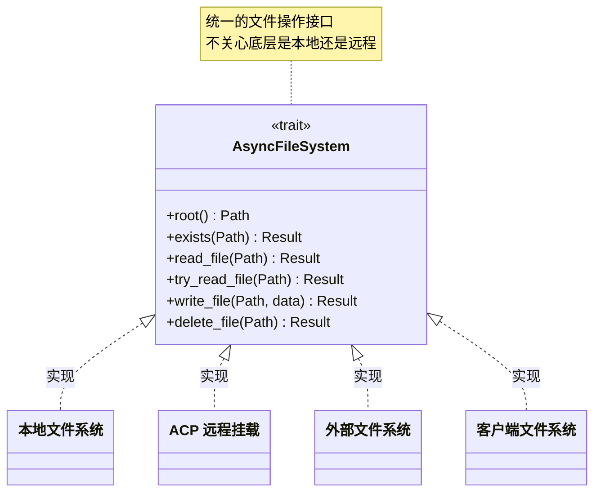
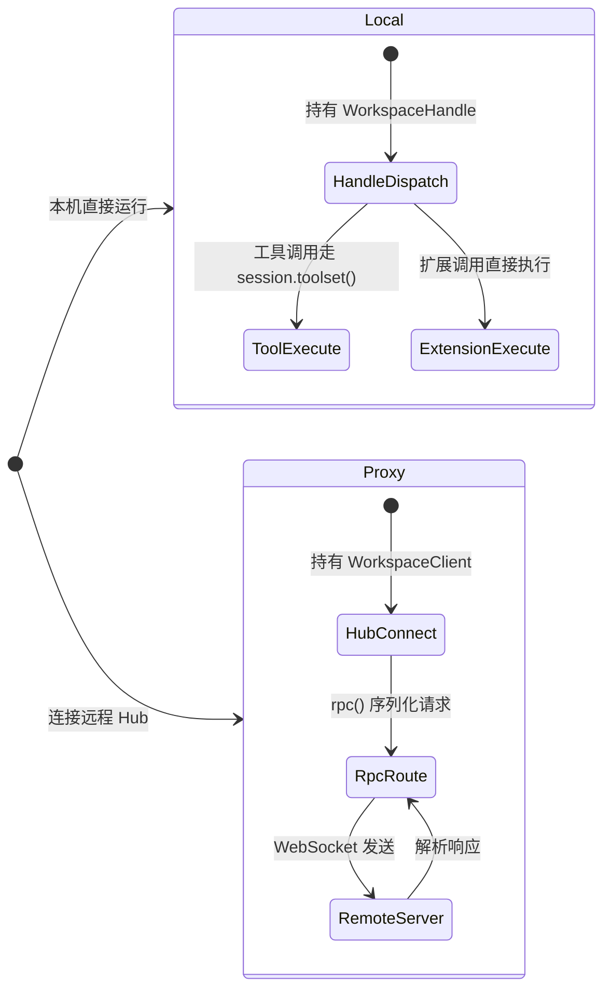
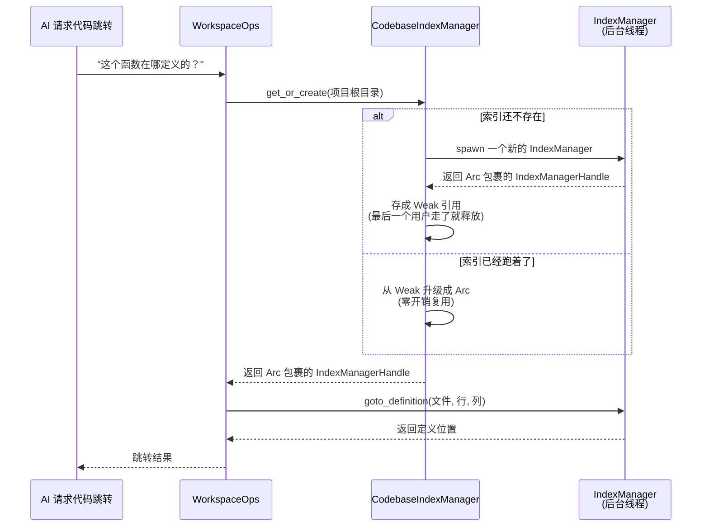
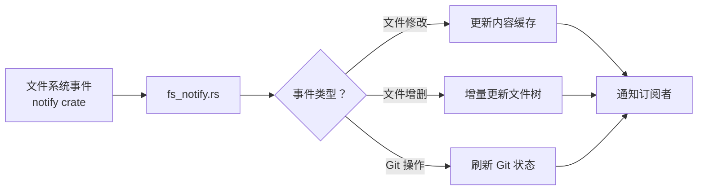
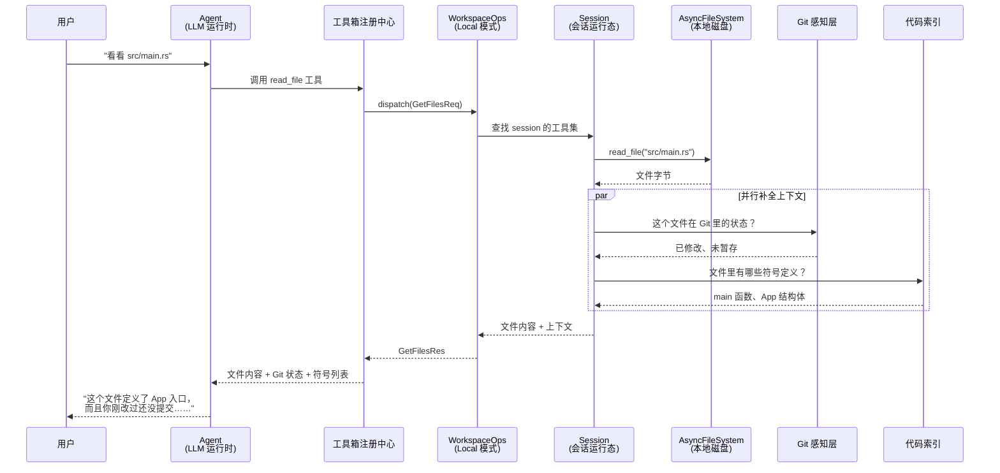

[← 返回首页](index.md)

# 工作区与文件系统

Workspace（工作区）是整个 Grok Build 里最忙的角色——它就是 AI 助手在你项目里安的家。你想让 AI 帮你读文件、搜代码、跑 bash、看 Git 状态？全都经过 Workspace。它把本地磁盘、Git/JJ 版本控制、代码索引、甚至远程文件挂载统统塞进一个统一的入口里。

你可以把 Workspace 想象成一栋写字楼的前台：

- **本地磁盘**是楼里的档案室——存着所有文件
- **Git/JJ 感知**是物业的变更登记簿——谁改了什么、什么时候改的
- **代码索引**是整栋楼的房间号索引——告诉你去哪能找到某个函数
- **远程 ACP 挂载**是快递收发室——你在本地，但能碰到远端的文件

不管你要干什么，先跟前台说，前台帮你找到对的人（或对的文件）。

## 核心抽象：`AsyncFileSystem` trait

所有文件操作都通过一个叫 `AsyncFileSystem` 的 trait 来完成。trait（特质）在 Rust 里就是"接口"——它只定义"能干什么"，不规定"怎么干"。之所以叫"抽象"是因为：调用方不需要知道底层是本地磁盘、网络挂载还是测试用的虚拟文件系统，只管调用 `read_file`、`write_file` 就行。

```rust
// 文件：crates/codegen/xai-grok-workspace/src/file_system/fs.rs

#[async_trait::async_trait]
pub trait AsyncFileSystem: Send + Sync {
    // 返回这个文件系统的根目录——后面所有相对路径都相对于它
    fn root(&self) -> &Path;

    // 判断文件存不存在
    async fn exists(&self, path: &Path) -> Result<bool, FsError>;

    // 读文件，返回字节流
    async fn read_file(&self, path: &Path) -> Result<Vec<u8>, FsError>;

    // 尝试读文件：文件不在就返回 None，不用先 exists 再 read_file（省一次调用）
    async fn try_read_file(&self, path: &Path) -> Result<Option<Vec<u8>>, FsError> {
        if self.exists(path).await? {
            Ok(Some(self.read_file(path).await?))
        } else {
            Ok(None)
        }
    }

    // 写文件
    async fn write_file(&self, path: &Path, data: &[u8]) -> Result<(), FsError>;

    // 删文件（用于回滚操作）
    async fn delete_file(&self, path: &Path) -> Result<(), FsError>;
}
```

这个 trait 的设计很克制：就五个基本操作——存在（exists）、读（read）、试探读（try_read）、写（write）、删（delete）。复杂功能（比如批量读写、文件搜索）都是在这些基本操作上搭建的。



## `AsyncFsWrapper`：让路径处理更顺手

直接调用 `AsyncFileSystem` 有个小麻烦——它只接受绝对路径（`&Path`）。但在真实代码里，你可能拿着相对路径、`AbsPathBuf`、`RelPathBuf` 等各种类型的路径。`AsyncFsWrapper` 就是解决这个问题的：它包装了一层，自动把各种路径类型统一转成绝对路径。

```rust
// 文件：crates/codegen/xai-grok-workspace/src/file_system/fs.rs

#[derive(Clone)]
pub struct AsyncFsWrapper {
    inner: Arc<dyn AsyncFileSystem>,  // 里面包着真正的文件系统实现
}

impl AsyncFsWrapper {
    pub fn new(fs: Arc<dyn AsyncFileSystem>) -> Self {
        Self { inner: fs }
    }

    // 读文件直接返回 String，不用手动转换
    pub async fn read_to_string<P: ToAbsPath>(&self, path: P) -> Result<String, FsError> {
        let bytes = self.inner.read_file(&path.to_abs_path(self.root())).await?;
        bytes_to_string(bytes)  // Vec<u8> → String
    }

    // 试探读：文件可能不存在
    pub async fn try_read_to_string<P: ToAbsPath>(
        &self, path: P,
    ) -> Result<Option<String>, FsError> {
        match self.inner.try_read_file(&path.to_abs_path(self.root())).await? {
            Some(bytes) => Ok(Some(bytes_to_string(bytes)?)),
            None => Ok(None),
        }
    }
}
```

关键点在于泛型参数 `<P: ToAbsPath>`——只要你的路径类型实现了 `ToAbsPath` 这个 trait，就能直接传进去。`Wrapper` 自己会根据文件系统的 `root()` 把它转成绝对路径。

## `WorkspaceOps`：双模式操作中枢

`WorkspaceOps` 是整个 workspace 对外的操作中枢。它有 **两种运行模式**：

- **Local 模式**：进程内直接执行，扩展和工具调用都走本地 `WorkspaceHandle`
- **Proxy 模式**：所有操作通过 WebSocket 发到远程 workspace server



源码里是这样定义的：

```rust
// 文件：crates/codegen/xai-grok-workspace/src/workspace_ops.rs

#[derive(Clone)]
pub enum WorkspaceOps {
    Local { handle: WorkspaceHandle },
    Proxy { client: WorkspaceClient },
}
```

Local 模式的关键方法是 `bind_local_session`——把 Agent 的工具集绑定到某个 session 上：

```rust
pub fn bind_local_session(
    &self,
    session_id: &str,
    cwd: PathBuf,
    hunk_tracker: HunkTrackerHandle,
    toolset: Arc<FinalizedToolset>,
    viewer_ctx: Option<WorkspaceViewerContext>,
) -> WorkspaceResult<()> {
    let Self::Local { handle } = self else {
        return Ok(());
    };
    // 如果 session 还不存在就创建一个
    if handle.session(session_id).is_none() {
        handle.create_session_with_tracker_and_viewer_ctx(
            session_id, cwd, hunk_tracker, ...)?;
    }
    // 替换 session 里的工具集
    let session = handle.session(session_id)...;
    session.replace(session.effective_tool_config(), toolset);
    Ok(())
}
```

`dispatch` 方法统一了两种模式的调用——调用方不用关心自己是 Local 还是 Proxy：

```rust
pub async fn dispatch<Op: WorkspaceOp>(
    &self,
    op: &Op,
    session_id: Option<&str>,
) -> WorkspaceResult<Op::Response> {
    match self {
        Self::Local { handle } => op.execute(handle, session_id).await,
        Self::Proxy { .. } => self.rpc(op).await,
    }
}
```

## 代码库索引：给 AI 装上导航系统

当 AI 想跳转到某个函数定义、或者查找所有引用时，它不能每次都去扫全量文件——太慢了。`CodebaseIndexManager` 维护了一套**代码关系图索引**（详见 [《代码关系图引擎》](22-codebase-graph.md)），但它只管"要不要建"和"谁来用"。



再看一下 Manager 内部是怎么管理索引生命周期的：

```rust
// 文件：crates/codegen/xai-grok-workspace/src/file_system/codebase_index.rs

pub struct CodebaseIndexManager {
    // 用 Weak 引用：不强制持有索引，最后一个使用者走了自动释放
    indexes: HashMap<PathBuf, Weak<IndexManagerHandle>>,
}

impl CodebaseIndexManager {
    pub fn get_or_create(&mut self, cwd: PathBuf) -> (Arc<IndexManagerHandle>, bool) {
        // 先清理已经没人用的死索引（Weak::upgrade 返回 None 的）
        self.indexes.retain(|_, weak| weak.strong_count() > 0);

        // 有活着的就直接复用
        if let Some(handle) = self.indexes.get(&cwd).and_then(Weak::upgrade) {
            tracing::info!("Codebase index already running — reusing shared handle");
            return (handle, false);
        }

        // 没有就新建一个
        let config = IndexManagerConfig::new(cwd.clone()).with_cache_path(cache_path);
        let handle = IndexManager::spawn(config);

        self.indexes.insert(cwd, Arc::downgrade(&handle));
        (handle, true)  // true 表示这次是新创建的
    }
}
```

设计亮点：
1. **惰性启动**：只有第一次代码跳转请求时才建索引，不会在打开项目时就扫全量文件
2. **跨 session 共享**：同一个项目目录不管开几个对话窗口，共用一份索引
3. **自动回收**：用 `Weak` 引用，最后一个使用者下线后索引自动释放，不囤积内存

## 文件变更追踪：`fs_notify`

除了静态索引，Workspace 还通过 `fs_notify.rs` 持续监听文件系统变更。它用的是 `notify` crate（一个跨平台的文件系统事件库），当文件被外部编辑器修改、Git 分支切换、或者 AI 自己写了文件时，它能增量更新相关索引，而不是傻傻地全量重扫。



## 把所有能力串起来：一次完整的文件读取

当你让 AI "帮我看看 `src/main.rs` 在干什么"，整个链路是这样的：



整个过程中，Agent 只调了一个 `read_file` 工具，但 Workspace 在背后默默补全了 Git 状态和代码符号信息，让 AI 能给出更精准的回答。

## 下一步去哪看

- 文件系统底层怎么跟 Git/JJ 交互：[详见《工作区与文件系统》](21-filesystem-workspace.md)（本页讲了上层抽象，底层 VCS 操作在 `session/git.rs` 和 `session/jj.rs`）
- 代码关系图引擎是怎么建 index 的：[详见《代码关系图引擎》](22-codebase-graph.md)
- 工作区怎么跟远程 Hub 通信：[详见《工作区通信协议：RPC 类型字典》](07-workspace-types-protocol.md)
- 终端执行和权限审批的流水线：[详见《终端执行与权限控制》](20-terminal-tools.md)
