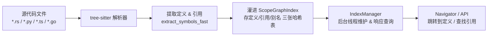
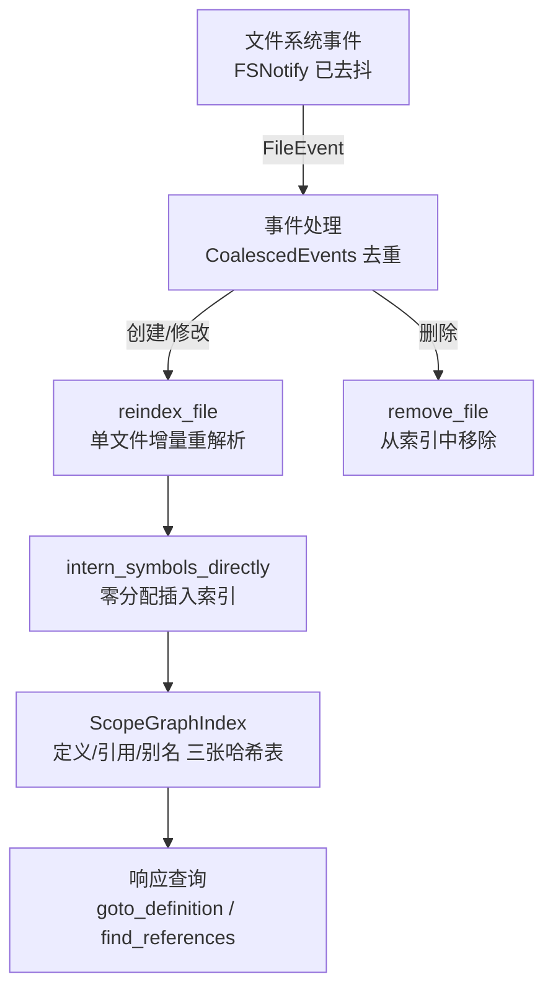
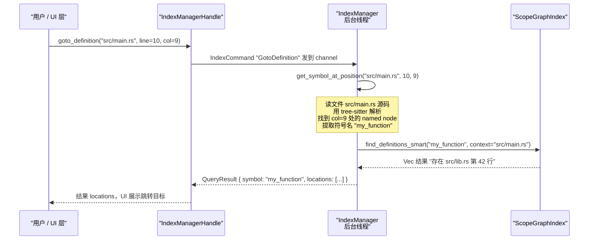

[← 返回首页](index.md)

# 代码关系图引擎

你每天都在写代码、改代码，有没有想过：当你按下"跳转到定义"或者"查找所有引用"的时候，编辑器是怎么在一瞬间找到那些结果的？答案就是它背后有一张巨大的 **关系图**——每个变量定义在哪里、谁调用了这个函数、import 是从哪来的——全都有记录。

`xai-codebase-graph` 这个 crate 就是干这个的。它用 tree-sitter 解析你的代码仓库，生成一张 **ScopeGraph**（作用域关系图），然后挂在 `IndexManager` 后台线程里维护着。文件一有变动，它就增量更新；查询一来，它直接从内存里找，不翻磁盘。

整个过程可以浓缩成一张流水线图：



下面我们按这个流水线一步步拆开看。

## 第一步：发现文件

构建索引的第一步是把要解析的文件都找出来。

`IndexBuilder` 的 `collect_files` 方法（就在 `manager/builder.rs` 里）会优先调用 `git2` 读取 git 的索引（`collect_files_git`），这样比遍历磁盘目录树快得多——git 的索引已经在内存里了，直接读就好。如果当前目录不是 git 仓库，它才退回到传统的目录遍历（`collect_files_walk`），用 `ignore` crate 并行走目录，自动尊重 `.gitignore` 和隐藏文件规则。

一句话总结：尽量用 git 开快车，实在没有才用脚走。

## 第二步：解析文件，提取符号

文件找齐之后，就是核心的解析环节。这里有好几个关键决策点，每一个都是为了快和省内存。

### 语言注册表：谁负责哪种语言

每种编程语言都有一套自己的 tree-sitter 查询规则，存在 `crates/codegen/xai-codebase-grok/src/languages/` 目录下。每个语言文件返回一个 `TSLanguageConfig`，里面装着：

- 语言的识别名称和文件扩展名（比如 Rust 有 `"rs"`）
- 符号种类划分（Rust 分 "class"、"function"、"variable"、"module" 等）
- 一套完整的 tree-sitter 查询语句（S-expression 格式）

以 Rust 为例，看看 `languages/rust.rs` 里的一段真实查询规则——它是怎么从 AST 节点里抓到函数定义的：

```
; function definitions

(function_item
    name: (identifier) @name.definition.function) @definition.function
```

tree-sitter 把 `fn hello() {}` 解析成一棵 AST 树，节点类型叫 `function_item`。这条查询规则的意思是："在 `function_item` 节点下面，找到它的 `name` 子节点，把它标记为 `name.definition.function`"。

对于引用，规则类似但 tag 不同：

```
; Function and method calls
(call_expression
    function: (identifier) @name.reference.call) @reference.call
```

调用 `hello()` 时，tree-sitter 会生成一个 `call_expression` 节点，这条规则把调用名的 `identifier` 节点标记为 `name.reference.call`。

所有语言的 `TSLanguageConfig` 通过 `LanguageRegistry`（`crates/codegen/xai-codebase-grok/src/languages/` 中的注册中心）统一管理，外界只需要调用 `registry.for_file_path("src/main.rs")` 就能拿到正确的解析配置。

### 大规模并行构建：IndexBuilder

`IndexBuilder::build_fast` 是这个 crate 性能的核心，在 `manager/builder.rs` 里。

它用 rayon 线程池（默认 N-1 个核心并行），把文件按 100 个一组切块处理。每个线程维护自己的 parser 和 query 缓存（`thread_local!`），避免重复初始化 tree-sitter 解析器。

解析完每个文件后调用的是 `extract_symbols_fast_inline`（一条内联函数），它**不构建完整的 ScopeGraph**，只提取三样最轻量的数据：

- **定义** `Vec<SymbolOccurrence>`：符号名 + 所在行号
- **引用** `Vec<SymbolOccurrence>`：符号名 + 所在行号
- **别名** `Vec<SymbolAlias>`：别名对（比如 Rust 的 `use Foo as Bar`）

为什么不做完整图？为了速度。全量 ScopeGraph 构建比纯符号提取慢 2~3 倍，因为我们只需要知道"这个符号在哪定义了、在哪被引用了"，不需要每个作用域的层级关系。

提取出来的符号不是立马全扔内存里等着聚合——那会让内存暴增。`build_fast` 采用**分批次合并**策略：每次取 `build_batch_size`（默认 5000 个文件）一批，并行解析 → 合并进 `ScopeGraphIndex` → 释放这批内存，再处理下一批。这样内存峰值只在 O(batch_size)，不会随仓库大小无限制增长。

### 增量更新：IndexManager

`IndexManager` 是整个系统的"管家"，在 `crates/codegen/xai-codebase-grok/src/index_manager.rs` 里。

它不在你能直接看到的代码路径里——它是一个**后台线程**，通过 channel 接收命令，独占式地持有 `ScopeGraphIndex`（用 `Arc` 包裹，配合 `Arc::make_mut` 实现写时复制）。



`reindex_file` 方法对单个文件做增量解析，和全量构建不一样的地方在于它调用 `intern_symbols_directly`——直接从 `&content[byte_range]` 把符号名 intern 到 `StringInterner` 里，跳过中间任何 `Arc<str>` 分配，零额外内存开销。

同时，`IndexManager` 还有一套**事件合并**机制（`CoalescedEvents` 结构体）。编辑器可能在 100ms 内连续触发 5 次"保存"事件，如果每个都去解析就太浪费了。合并规则很简单：

- 多次 "Modified" → 一次就够了
- "Created" 然后 "Removed" → 互相抵消，不用干活
- "Removed" 然后 "Created" → 文件被替换了，按 "Created" 处理

### 防坑检查：二进制文件、超大文件、隐藏目录

不是什么文件都适合解析。

`is_binary_file` 只读文件的前 8000 字节（`crates/codegen/xai-codebase-grok/src/index_manager.rs`），如果里面出现 null 字节就认为是二进制，直接跳过。这避免把一个大视频文件加载到内存里才发现解析不了。

超大文件（超过 5MB，定义为 `MAX_INDEXABLE_FILE_SIZE`）也被跳过。tree-sitter 构建 AST 的内存开销远大于文件本身——一个 6MB 的 minified JS 可能炸出几 GB 的 AST 节点。

还有一类要跳过的：隐藏目录。`is_under_hidden_dir` 检查路径的每个 component 是不是以 `.` 开头。像 `.grok/worktrees/`、`.claude/worktrees/` 这类工具管理的临时工作树，里面有大量源码拷贝，索引它们纯粹是浪费。

## 第三步：存储到 ScopeGraphIndex

符号全部提取出来后，存储在一个巨大的 `ScopeGraphIndex` 结构体里（`crates/codegen/xai-codebase-grok/src/scope_graph/graph.rs` 第 496 行开始）。

它的核心数据结构是四张哈希表和两个反向索引：

- **`definitions: HashMap<StringId, Vec<(StringId, u32)>>`** — 符号名 ID → 它在哪些文件、哪些行号被定义
- **`references: HashMap<StringId, Vec<(StringId, u32)>>`** — 符号名 ID → 它在哪些文件、哪些行号被引用
- **`aliases: HashMap<StringId, StringId>`** — 别名 → 原名（比如 `Bar` 是 `Foo` 的别名）
- **`reverse_aliases: HashMap<StringId, HashSet<StringId>>`** — 原名 → 它有哪些别名（反向查）
- **`file_to_defs: HashMap<StringId, HashSet<StringId>>`** — 文件 ID → 这个文件里定义了哪些符号（删除文件时用）
- **`file_to_refs: HashMap<StringId, HashSet<StringId>>`** — 文件 ID → 这个文件里引用了哪些符号

这里有个关键的内存优化：所有字符串都用 `StringInterner` 存储，存的是 `StringId`（一个 u32 数字），而不是 `String`。想想一个大型 Rust 仓库里 `"fn"` 这个 token 出现几十万次，如果每次都存一个完整的字符串拷贝，内存直接炸裂。用 interner 之后，`"fn"` 的字节只存一次，其他所有地方只存一个 4 字节的 ID。

`line` 字段存的是 `u32` 而非 `usize`，也是经过仔细考量：在 64 位系统上，`(StringId, u32)` 占 8 字节，而 `(StringId, usize)` 占 16 字节。对于有百万级符号的大型仓库，这一项就省下了大量内存。

### 缓存与序列化

索引构建代价不低（全量构建可能几十秒），所以必须支持缓存。

`ScopeGraphIndex::write_to` 和 `read_from` 方法实现了自定义的二进制序列化格式（`crates/codegen/xai-codebase-grok/src/scope_graph/graph.rs`），文件头用魔数 `b"SGIX"` + 版本号 `1` 标识。加载时先检测魔数和版本号，不匹配就走全量重建。

缓存文件默认放在 `get_cache_path(root_path)` 返回的路径。`IndexManager` 会在以下时机自动保存：
- 全量构建完成后
- 每处理至少一次增量更新后，且距离上次保存超过 60 秒（节流）
- 后台刷新完成后
- 进程退出时

### 查询版本：查询变了，缓存也得重来

tree-sitter 查询规则不是一成不变的——哪天我们在 Rust 查询里加了一个捕获规则，旧的缓存文件里就没有这个新符号的信息。所以 `ScopeGraphIndex` 里存了一个 `query_version` 字段，是当前所有查询规则的哈希值。加载缓存时如果发现哈希对不上，就自动触发全量重建，不用用户操心。

## 第四步：响应查询

索引建立好了，怎么查？

所有查询都是通过 `IndexManagerHandle` 发起的（`crates/codegen/xai-codebase-grok/src/index_manager.rs`）。它用 channel 把命令发给后台线程，等结果通过 `oneshot` 通道返回，对调用方来说就是一次普通的异步函数调用。

核心查询接口有四个：

| 接口 | 作用 | 一句话说明 |
|------|------|-----------|
| `goto_definition` / `goto_definition_blocking` | 光标下的符号 → 找到它在哪里定义的 | 相当于在 IDE 里 Ctrl+Click |
| `goto_references` / `goto_references_blocking` | 光标下的符号 → 找到所有引用它的地方 | 相当于 IDE 的 Find All References |
| `find_definitions` / `find_definitions_blocking` | 按符号名搜索 → 返回定义位置 | 你知道函数名，但不知道在哪个文件 |
| `find_references` / `find_references_blocking` | 按符号名搜索 → 返回引用位置 | 看看这个函数在哪些地方被调用了 |
| `has_definition_blocking` | 检查符号是否存在定义 | 只返回 true/false，不克隆索引，特别轻量 |
| `get_snapshot` / `get_snapshot_async` | 获取索引的共享只读快照 | 返回 Arc，零克隆（除非有人同时在写，触发 COW） |
| `get_file_count` / `get_stats` | 获取索引统计信息 | 文件数、定义数、引用数，同样不克隆索引 |

其中 `find_definitions_smart` 和 `find_references_smart` 还做了一层智能化：如果你在 `.ts` 文件里查一个符号，`.ts` 文件里的定义会被排在 `.rs` 文件前面。它是通过 `LanguageRegistry::extensions_same_language` 判断哪些后缀属于同一种语言的。

### 一次查询的完整流程

假设用户在一行代码 `let x = my_function(42);` 上按下"跳转到定义"，光标落在 `my_function` 上：



这整条链路在 `index_manager.rs` 里都能找到对应的函数调用链：`handle_goto_definition` → `get_symbol_at_position` → `find_smallest_named_node_at_point` → `index.find_definitions_smart`。

## 第五步：别名系统

很多语言都有"改个名字"的能力——Rust 的 `use Foo as Bar`、Python 的 `import numpy as np`、TypeScript 的 `import { Foo as Bar }`。

如果只按原始名字去查，`Bar` 的引用就关联不到 `Foo` 的定义上。所以我们在解析时就建立了别名关系：

以 Rust 为例（`languages/rust.rs`）：

```
; use Foo as Bar - captures original and alias
(use_declaration
    argument: (use_as_clause
        path: (identifier) @alias.original
        alias: (identifier) @alias.name))
```

tree-sitter 解析到 `use Foo as Bar` 时，`@alias.original` 捕获 `Foo`，`@alias.name` 捕获 `Bar`。这对数据存进 `ScopeGraphIndex` 的 `aliases` 和 `reverse_aliases` 里。

查询时，`find_definitions` 会走两遍：先用 `symbol` 本身查定义，如果它是个别名，再用它指向的原始名再查一遍。`find_references` 更进一步：除了查符号本身的引用，还要查它所有别名的引用，以及它作为原名时所有别名指向它的引用。这样才能覆盖 `np.array()` 也被计为 `numpy` 的引用。

## 完整目录结构

最后摊开目录，方便你直接去翻源码：

```
crates/codegen/xai-codebase-grok/src/
├── lib.rs                       # crate 入口，re-export 所有公开 API
├── scope_graph/
│   ├── graph.rs                 # ScopeGraph（单文件图）和 ScopeGraphIndex（全局索引）
│   ├── nodes.rs                 # 节点类型：Def、Ref、Import、Scope
│   └── edges.rs                 # 边类型：DefToScope、RefToDef、ImportToScope...
├── manager/
│   ├── mod.rs                   # 缓存读写、文件锁
│   ├── builder.rs               # IndexBuilder：并行全量构建
│   └── lock.rs                  # 跨进程文件锁
├── index_manager.rs             # IndexManager：Channel 架构 + 增量更新
├── languages/
│   ├── mod.rs                   # LanguageRegistry 注册中心
│   ├── rust.rs                  # Rust tree-sitter 查询规则
│   ├── python.rs                # Python
│   ├── typescript.rs            # TypeScript / JavaScript
│   ├── go.rs                    # Go
│   └── types.rs                 # TSLanguageConfig 数据结构
├── navigation.rs                # Navigator：基于位置的跳转 API
├── types.rs                     # Range、FileMeta、SymbolOccurrence 等基础类型
└── interner.rs                  # StringInterner：字符串驻留池
```

和这个 crate 协作的模块包括：
- **xai-grok-paths**：路径规范化（`to_relative_path` 等），确保所有路径在索引里是可移植的相对路径
- **xai-grok-workspace**：Workspace 层调用 `IndexManager::spawn` 启动索引后台线程，详见 [《工作区与文件系统》](21-filesystem-workspace.md)
- **xai-chat-state**：对话中当 AI 需要"跳转到定义"或"查找引用"时，通过 ChatStateActor 访问索引，详见 [《上下文窗口管理》](08-chat-state-context.md)

至于代码跳转给用户展示、在 TUI 里高亮这些工作，不是本模块的职责，它们会在 [《终端渲染流水线》](09-tui-rendering.md) 那一页展开。
