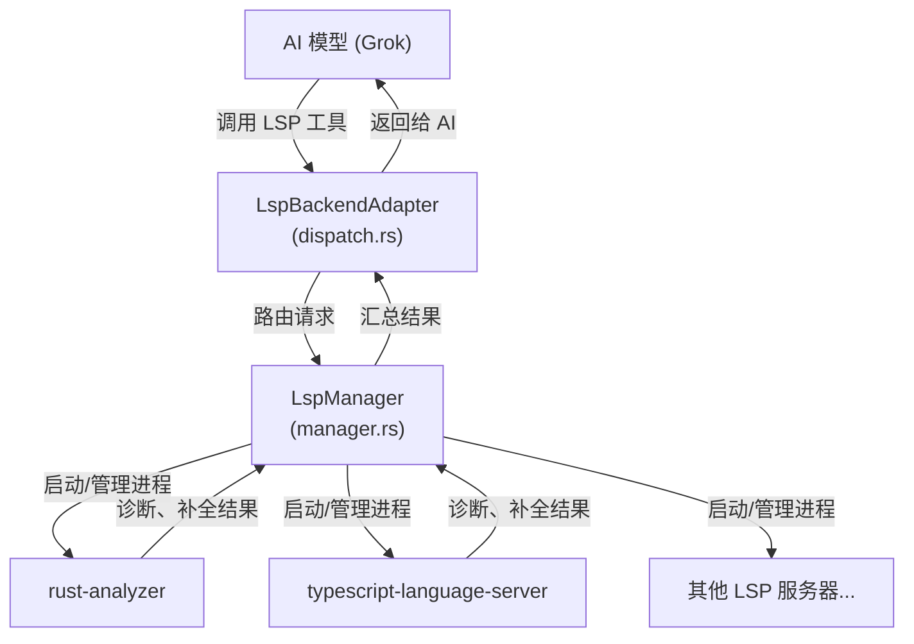
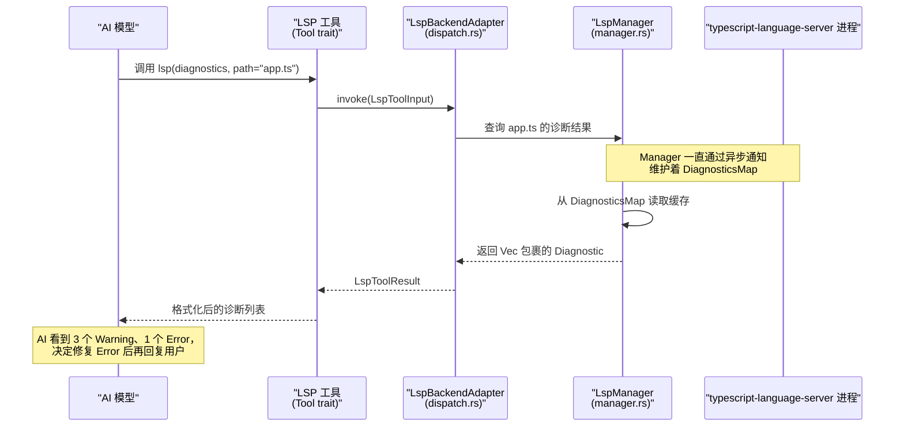

[← 返回首页](index.md)

# LSP 集成：给 AI 装上 IDE 的大脑

你有没有试过在编辑器里写代码，刚打错一个变量名，下面就立刻出现红色波浪线，旁边还告诉你"找不到这个符号"？这是 Language Server Protocol（简称 LSP，一种让编辑器和各种编程语言"聊天"的标准协议）在干活。编辑器把你的代码发给语言服务器，服务器分析完再把诊断结果、补全建议、格式化方案传回来。

Grok 把这个能力直接装进了 AI 工具箱里。AI 不用靠猜来判断代码有没有 bug——它可以直接问语言服务器。这套逻辑全部放在 `crates/codegen/xai-grok-tools/src/implementations/lsp/` 目录下面。

## 整体架构：三个角色一台戏

先搞清楚谁跟谁在说话。整个 LSP 集成有三个关键角色：

- **AI 模型**：就是 Grok 的大脑，它想检查某段代码时，发出一个 LSP 工具调用。
- **LspManager**（`src/implementations/lsp/manager.rs`）：LSP 服务的大管家。它负责启动语言服务器进程、处理初始化握手，然后把这些服务器注册到一个分发器里。
- **LspBackendAdapter**（`src/implementations/lsp/dispatch.rs`）：工具层和大管家之间的"转接头"。AI 调用工具时，请求先到它这里，它再根据请求类型转发给对应的语言服务器。
- **语言服务器进程**：比如 `rust-analyzer`、`typescript-language-server`，它们是真正读懂代码的角色。

一张图看明白：



## LSP 工具：AI 能问什么

所有 LSP 能力通过一个统一的工具暴露出去。这个工具实现了标准的 `Tool` trait（[详见《工具箱：AI 的手和眼睛》](19-tool-system.md)），名字叫 `lsp`。AI 调用它时，需要传一个操作类型和对应的参数。

从 `src/implementations/lsp/types.rs` 可以看到，支持的操作定义在 `LspOperation` 枚举里。主要分这几类：

| 操作类型 | 作用 | 一句话大白话 |
|---------|------|-------------|
| `diagnostics` | 获取文件的诊断信息 | 问"这个文件有哪些错误和警告？" |
| `hover` | 获取光标位置的类型信息 | 问"这个变量是什么类型的？" |
| `completion` | 获取光标位置的补全建议 | 问"这里可以填什么代码？" |
| `definition` | 跳转到符号定义处 | 问"这个函数定义在哪里？" |
| `references` | 查找符号的所有引用 | 问"谁在用这个变量？" |
| `format` | 格式化文档 | 让 AI 帮你自动排版代码 |
| `symbols` | 获取文档中的符号列表 | 问"这个文件里有哪些函数和变量？" |

每个操作怎么实现，下面挑几个典型的好好讲讲。

## 诊断：让 AI 知道代码哪里有问题

诊断是最常用的功能。AI 改完代码后，可以立刻问 LSP："我改的这个文件有报错吗？"流程是这样的：

1. AI 调用 LSP 工具，指定 `diagnostics` 操作和文件路径。
2. `LspBackendAdapter` 把请求转给 `LspManager`。
3. `LspManager` 维护了一个 `DiagnosticsMap`（`src/implementations/lsp/mod.rs` 里定义），这是一个带读写锁的哈希表，key 是文件路径，value 是该文件的所有诊断结果。语言服务器通过异步通知持续更新这个哈希表。
4. 请求到达时，直接从 `DiagnosticsMap` 读取结果返回，不用再问语言服务器，几乎瞬间拿到答案。

看一眼核心类型定义（摘录自 `src/implementations/lsp/mod.rs`）：

```rust
// DiagnosticsMap 就是一张大表，存着每个文件的最新诊断结果
// key 是文件路径字符串，value 是一堆 Diagnostic 对象
pub type DiagnosticsMap = Arc<std::sync::RwLock<HashMap<String, Vec<Diagnostic>>>>;

// DiagnosticsNotify 用于通知"有新诊断结果了"
pub type DiagnosticsNotify = Arc<tokio::sync::Notify>;
```

诊断结果会带上严重级别。从 `types.rs` 导出的 `DiagnosticSeverityLevel` 枚举把 LSP 标准的级别映射成 AI 容易理解的几档：错误（Error）、警告（Warning）、信息（Info）、提示（Hint）。

还有一个实用函数 `drain_lsp_diagnostics`（定义在 `manager.rs`，由 `mod.rs` 公开导出），可以一次性把所有缓存的诊断结果取走，同时把缓存清空。适合 AI 想要"从头开始看所有问题"的场景。

## 请求流程：一次诊断调用是怎么走的

用一张时序图把整个交互过程串起来。假设用户在 TypeScript 项目里工作，AI 刚修改了 `app.ts`，现在想检查有没有引入新的错误。



注意图中 `Manager` 和 `Server` 之间那条虚线注释——语言服务器是一直在后台运行的，它通过异步通知机制把诊断结果源源不断地推给 `LspManager`，Manager 更新 `DiagnosticsMap`。所以当 AI 来查询时，数据已经准备好了，这是异步缓存模式。

## 多语言支持：谁来启动对应的服务器

`LspManager` 怎么知道该启动 `rust-analyzer` 还是 `typescript-language-server`？答案在 `src/implementations/lsp/config.rs` 里。`LspConfig` 结构体定义了每个语言服务器的启动配置：

- **语言 ID**：比如 `rust`、`typescript`、`python`
- **启动命令**：比如 `["rust-analyzer"]`
- **初始化参数**：传递给服务器的初始化选项
- **超时时间**：如果服务器启动超过这个时间还没响应，就算失败

Grok 会根据当前工作区的文件类型，自动启动对应的语言服务器。比如发现仓库根目录有 `Cargo.toml`，就启动 `rust-analyzer`；发现 `tsconfig.json`，就启动 `typescript-language-server`。

这套逻辑和代码关系图引擎（`xai-codebase-graph`）有紧密协作——代码图引擎负责识别项目类型，LSP 系统根据识别结果来决定启动哪些服务器。[详见《代码关系图引擎》](22-codebase-graph.md)

## 错误处理：语言服务器不靠谱怎么办

在实际使用中，语言服务器可能会挂掉、启动超时，或者返回一些奇怪的错误。`src/implementations/lsp/mod.rs` 里定义的 `LspError` 枚举把这些情况都考虑到了：

```rust
#[derive(Debug, thiserror::Error)]
pub enum LspError {
    #[error("failed to spawn LSP server: {0}")]
    SpawnFailed(String),          // 语言服务器启动失败
    #[error("LSP server '{0}' timed out after {1:?}")]
    Timeout(String, std::time::Duration), // 启动超时
    #[error("LSP initialization failed: {0}")]
    InitFailed(String),           // 初始化协议握手失败
    #[error("LSP request failed: {0}")]
    RequestFailed(String),        // 发送请求后收到错误
    #[error("invalid file path")]
    InvalidPath,                  // 文件路径不合法
}
```

当出现 `Timeout` 或 `SpawnFailed` 时，`LspManager` 会尝试重启服务器。重启逻辑在 `src/implementations/lsp/restart.rs` 里，它暴露了一个 `restart_monitor` 函数，用指数退避策略（第一次等 1 秒，第二次等 2 秒，第三次等 4 秒...）来避免频繁重启刷屏。

## 辅助函数：路径到 URI 的转换

LSP 协议要求用 URI 格式标识文件（比如 `file:///home/user/project/src/main.rs`），但我们平时操作文件用的是普通路径。`src/implementations/lsp/mod.rs` 提供了两个小帮手：

```rust
// 把普通文件路径转成 LSP 用的 file:// URI
pub fn file_uri(path: &Path) -> Result<Url, LspError> {
    Url::from_file_path(path).map_err(|_| LspError::InvalidPath)
}

// 组装一个 LSP 协议要求的 TextDocumentPositionParams
// 需要一个文件路径 + 行号 + 列号
pub fn text_document_position(
    path: &Path,
    line: u32,
    column: u32,
) -> Result<TextDocumentPositionParams, LspError> {
    Ok(TextDocumentPositionParams {
        text_document: TextDocumentIdentifier {
            uri: file_uri(path)?,
        },
        position: Position {
            line,
            character: column,
        },
    })
}
```

这两个函数被各个 LSP 子模块频繁调用。比如 `hover` 操作需要知道光标在哪一行哪一列，调用 `text_document_position` 把参数打包好发给语言服务器；`format` 操作只需要文件路径，调用 `file_uri` 就够了。

## 格式化：让 AI 帮你排版

格式化操作值得一提。AI 经常生成代码后会主动调用 `format`，把生成的代码排版整齐再写入文件。这样做的好处是输出稳定——同样的代码逻辑，格式化后每次看起来都一样，用户不会因为代码风格乱而烦躁。

`src/implementations/lsp/format.rs` 负责这部分逻辑。它调用语言服务器的 `textDocument/formatting` 接口，拿到格式化后的文本，再通过工具层返回给 AI，AI 再写到文件里。

整个流程涉及一个关键的安全机制：文件操作锁。`format` 操作会先获取文件锁，确保在读取源文件和写入格式化结果之间，不会有其他工具（比如 bash 工具）同时修改这个文件。这个锁定义在 `src/implementations/lsp/../editor_infra/file_operation_lock` 里。

关于 bash 工具和文件锁的协作细节，[详见《终端执行与权限控制》](20-terminal-tools.md)。

## LSP 和诊断提醒系统

`LspManager` 还有一个重要职责：驱动诊断提醒系统。当语言服务器发现新的错误或警告时，这些诊断结果不仅缓存到 `DiagnosticsMap` 供 AI 查询，还会通过提醒系统通知用户（比如在 TUI 界面右下角弹个小气泡）。

提醒机制的路由也在 `src/implementations/lsp/manager.rs` 里：每次 `DiagnosticsMap` 更新时，`LspManager` 比较新旧诊断结果的差异，如果是新增的错误，就触发提醒。[详见《斜杠命令系统》](11-slash-command-system.md)中关于提醒命令的部分。

## 目录结构与文件清单

最后梳理一下 LSP 子系统的文件组织，方便你直接去翻源码：

```
crates/codegen/xai-grok-tools/src/implementations/lsp/
├── mod.rs          # 公共类型：LspError、DiagnosticsMap、辅助函数
├── manager.rs      # LspManager：启动服务器、管理 DiagnosticsMap
├── config.rs       # LspConfig：定义每种语言的服务器配置
├── dispatch.rs     # LspBackendAdapter：工具层到 Manager 的桥梁
├── client.rs       # 底层 LSP 客户端封装（基于 async-lsp 库）
├── format.rs       # 格式化操作实现
├── restart.rs      # 服务器重启逻辑（指数退避）
└── types.rs        # LspOperation、LspToolInput/Result 等类型定义
```

核心依赖是 `async-lsp` 这个外部 crate，它封装了 LSP 协议的底层通信细节（JSON-RPC over stdio）。Grok 的 LSP 模块在它之上做了一层管理逻辑——多服务器生命周期、缓存、错误重试。
