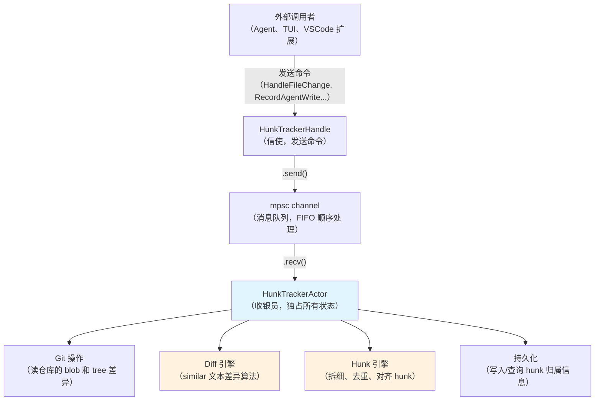
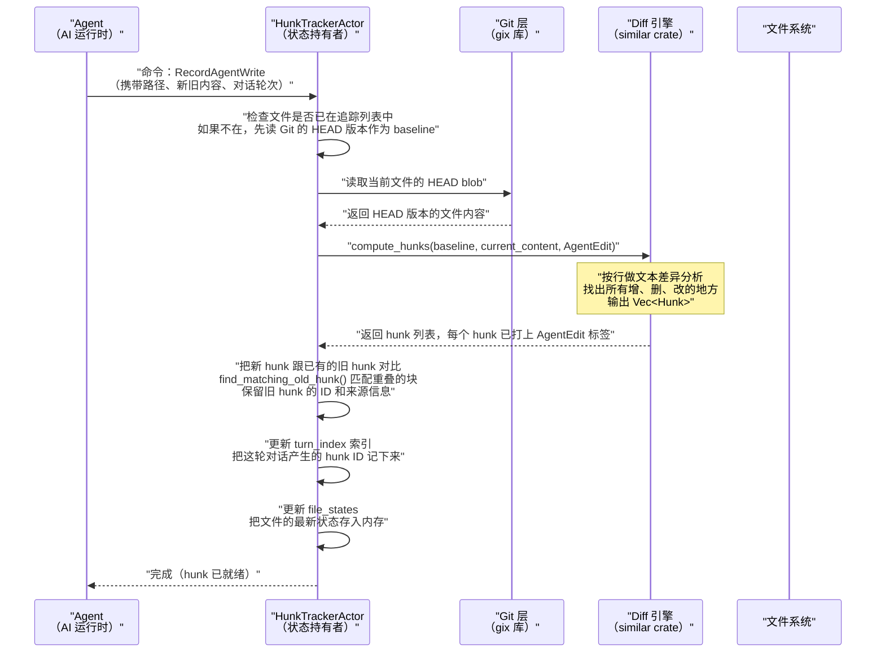
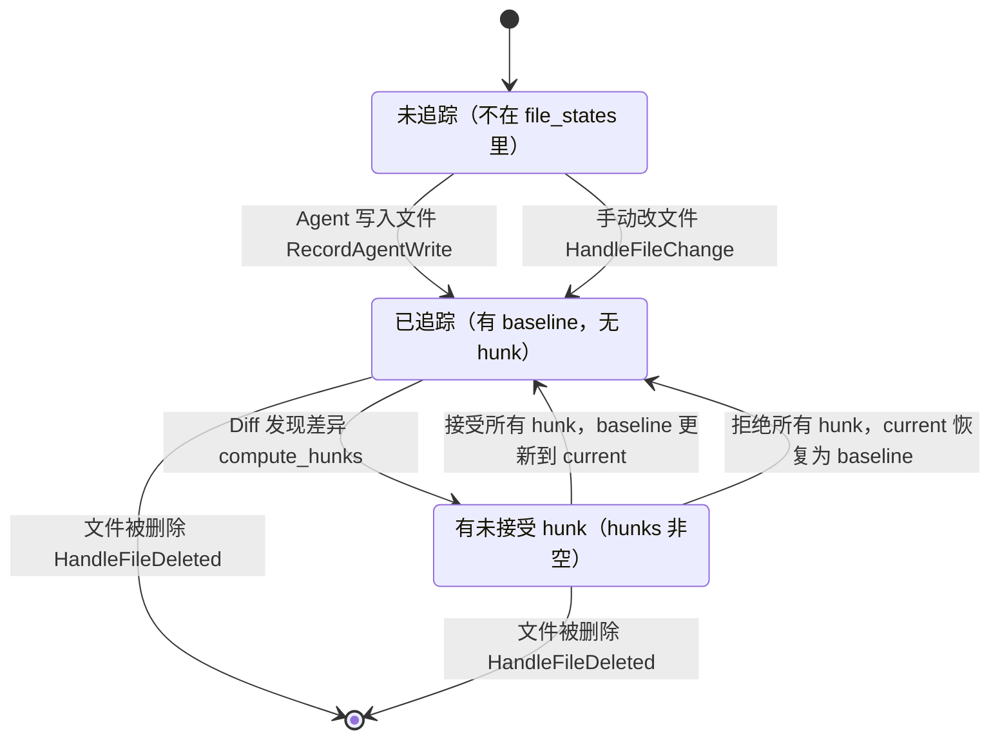

[← 返回首页](index.md)

# 代码溯源：谁写的这行——人还是 AI？

你有没有过这种体验：项目里跑了几个月 AI 编程助手，突然有一天你盯着某段代码想——"这到底是我写的还是 AI 帮我写的？"如果这段代码出了 bug，应该怪我还是怪模型？

`xai-hunk-tracker` 就是来解决这个问题的。它的工作方式很简单：把 git diff 拆成一个个「改动小块」（hunk），然后给每一块打上来源标签——`AgentEdit` 表示 AI 写的，`UserEdit` 表示你手动改的。以后你随时可以查：这个文件里哪些行是 AI 生成的、占比多少、是哪一轮对话生成的。

## 它是怎么工作的？先讲个故事

想象你是一个出版社的校对员，面前摆着两份稿子：一份是作者的原稿（git 里的 HEAD 版本），一份是编辑改过的版本（工作区当前文件）。你的任务是在这两份稿子之间，用红笔圈出所有的改动，然后把每个改动写在便签上——便签要写明：改动位置（第几行到第几行）、改了啥、谁改的。

Hunk Tracker 干的就是这个活，只不过它的"便签"叫 **Hunk**（改动块），它的"红笔"是 **similar** 这个 Rust 库（一个高效的文本差异算法库）。

但有个问题：你一天要校对上万份稿子，不可能每次都从头翻。所以你需要一个聪明的方法：记录每份稿子"上一次校对时是什么样子"（这叫 **baseline**，基线），下次只对比当前稿子和 baseline 的差异就好。当编辑告诉你"我改完了，以后按这个版本算"，你就把 baseline 更新到最新状态——这个过程叫 **accept（接受）**。

## 核心数据结构：一张便签长什么样

判断一段代码是谁写的，首先要理解 Hunk 是什么。它的定义在 `crates/codegen/xai-hunk-tracker/src/types.rs`：

```rust
// 一个改动块就是一张便签，记录：
// - 在哪个文件里
// - 从第几行到第几行变了
// - 旧代码是什么（删掉了什么）
// - 新代码是什么（加上了什么）
// - 谁干的（来源标记）
struct Hunk {
    id: HunkId,              // 每个 hunk 的唯一 ID，就像便签编号
    path: PathBuf,           // 文件路径
    line_info: HunkLineInfo, // 改动位置：old_start/old_count, new_start/new_count
    source: HunkSource,      // 来源：AgentEdit（AI）还是 UserEdit（人）
    old_text: Option<String>,// 删掉/替换掉的内容
    new_text: String,        // 新增的内容
    patch: Option<String>,   // 统一差异格式（unified diff 格式的片段）
    created_at: DateTime,    // 什么时候标记的
    selected: bool,          // 在 UI 里用户有没有选中这个 hunk
}

// 来源标记有两种，一看就懂
enum HunkSource {
    AgentEdit { prompt_index: usize },  // AI 在第几轮对话生成的
    UserEdit,                           // 你手动改的
}
```

`HunkLineInfo` 里的 `old_start` 和 `old_count` 告诉你"在旧文件里删掉了从第几行开始的几行"，`new_start` 和 `new_count` 告诉你在新文件里加上了几行。所以一个修改（modification）就是 old_count=1 且 new_count=1，一次插入（insertion）就是 old_count=0，一次删除（deletion）就是 new_count=0。

## 整体架构：一个收银员，背后一条流水线

Hunk Tracker 采用 **actor 模式**（一种并发模型：把所有状态锁在一个独立的"角色"里，外界只能通过消息跟它对话）。这么做的好处是：HunkTrackerActor 独占所有状态（文件状态、hunk 列表、索引），不会出现多线程同时修改的数据竞争。



所有跟 HunkTrackerActor 的通信都通过命令（Command）进行。看 `crates/codegen/xai-hunk-tracker/src/actor/mod.rs` 的主循环：

```rust
// 主循环：不断从消息队列取命令，取到就处理
async fn run(mut self) {
    loop {
        tokio::select! {
            biased;
            _ = self.cancellation_token.cancelled() => {
                break;  // 被通知关闭时退出
            }
            cmd = self.cmd_rx.recv() => {
                let Some(cmd) = cmd else {
                    break;  // 发送端关闭了，退出
                };

                // 检查这个命令能不能被「合并」（coalesce）
                if Self::is_coalescable(&cmd) {
                    let batch = self.drain_and_coalesce(cmd);
                    if !self.handle_coalesced_batch(batch).await {
                        break;
                    }
                } else if !self.handle_command(cmd).await {
                    break;
                }
            }
        }
    }
}
```

## 命令合并：别一个个处理，攒一批再动手

有时候在同一个 tick 里会涌进来很多文件变更事件——比如 Agent 一次修改了 10 个文件。如果一个一个处理，每个都要重新 diff 和索引，太浪费了。所以 Actor 有一个「合并」机制（coalescing）：

```rust
// 判断哪些命令可以合并到一批里一起处理
pub(crate) fn is_coalescable(cmd: &HunkTrackerCommand) -> bool {
    matches!(
        cmd,
        HunkTrackerCommand::HandleFileChange { .. }
            | HunkTrackerCommand::HandleFileDeleted { .. }
            | HunkTrackerCommand::RefreshAllBaselines
            | HunkTrackerCommand::RefreshGitDirtyCache
    )
}

// 从 channel 里把所有的可合并命令一次性排空
fn drain_and_coalesce(&mut self, first: HunkTrackerCommand) -> CoalescedBatch {
    let mut batch = CoalescedBatch::new();
    batch.add(first);

    while let Ok(cmd) = self.cmd_rx.try_recv() {
        batch.add(cmd);
    }

    batch
}
```

对于同一个文件，多次 `HandleFileChange` 甚至可能被合并成一次操作——比如某个文件先被 Delete 然后又被 Create，最终合成为 `DeletedThenChanged` 动作，只需要处理一次。

## 命令全景：Actor 能接哪些活儿

HunkTrackerActor 能处理的所有命令都在 `HunkTrackerCommand` 枚举里定义，大致分这几类：

| 命令分类 | 典型命令 | 大白话解释 |
|---------|---------|-----------|
| **写入追踪** | `RecordAgentWrite` | "AI 刚写了一个文件，帮我记录下改了哪些行" |
| **文件变更** | `HandleFileChange`、`HandleFileDeleted` | "有文件被改了/删了，重新 diff 一下" |
| **查询** | `GetAllHunks`、`GetHunksForPath`、`GetHunk`、`GetHunksBySource` | "帮我查一下某个文件的 hunk 信息" |
| **批次操作** | `HunkAction`、`FileAction`、`AllAction`、`TurnAction` | "接受/拒绝某批 hunk"（接受 = 把 baseline 更新到当前状态） |
| **会话管理** | `SnapshotState`、`RestoreState`、`SnapshotTurnDelta` | "保存/恢复当前所有的 hunk 状态" |
| **配置** | `SetMode`、`ResetBaseline`、`ResetStats` | "切换追踪模式、重置基线、清空统计" |

### 查询命令详解

查询命令都是通过 `reply` 通道异步返回结果的。比如查某个文件里有哪些 hunk：

```rust
HunkTrackerCommand::GetHunksForPath { path, reply } => {
    let hunks = self.get_hunks_for_path(&path);
    if reply.send(hunks).is_err() {
        debug!("GetHunksForPath reply channel dropped");
    }
}
```

### 操作命令详解

操作命令（Action）让你对 hunk 做接受/拒绝操作。接受一个 hunk 意味着"这段 AI 生成的代码现在成为正式代码了，以后把它当 baseline"；拒绝就是"我不要这段，还原回旧的"。

这些命令支持四种粒度：
- **单个 hunk**：`HunkAction { hunk_id, action, reply }`——对某个具体的 hunk 操作
- **整个文件**：`FileAction { path, action, reply }`——对一个文件的全部 hunk 操作
- **整个对话轮次**：`TurnAction { prompt_index, action, reply }`——对某一轮对话产生的所有 hunk 操作
- **全部**：`AllAction { action, reply }`——对所有文件的所有 hunk 操作

## 一次完整追流：从 Agent 落笔到溯源入库

下面这张时序图讲清楚了 Agent 写了一个文件后，Hunk Tracker 怎么一步步把它拆成带标签的 hunk：



拆解关键步骤：

**第一步：读 baseline。** 在 `crates/codegen/xai-hunk-tracker/src/actor/git.rs` 中，`read_baseline` 函数会用 gix 库（一个纯 Rust 的 Git 实现）去读取文件在 HEAD 提交中的内容。这个内容就是"这份稿子上次校对后确定下来的版本"。

**第二步：diff 文本。** 在 `crates/codegen/xai-hunk-tracker/src/diff.rs` 中，`compute_hunks` 函数是核心：

```rust
pub fn compute_hunks(path: &Path, baseline: &str, current: &str, source: HunkSource) -> Vec<Hunk> {
    // 如果内容完全一样，不用 diff
    if baseline == current {
        return vec![];
    }

    // 防止超大文件导致 diff 卡死（限制 1MB）
    if baseline.len() > MAX_DIFF_FILE_SIZE || current.len() > MAX_DIFF_FILE_SIZE {
        warn!("Skipping diff for file exceeding size limit");
        return vec![];
    }

    // 用 similar 库做逐行差异分析，设了 10 秒超时
    let diff = TextDiff::configure()
        .timeout(DIFF_TIMEOUT)
        .diff_lines(baseline, current);

    // 遍历 diff 结果，把连续的增/删行合并成一个 hunk
    let mut current_hunk: Option<HunkBuilder> = None;
    for change in diff.iter_all_changes() {
        match change.tag() {
            ChangeTag::Equal => {
                // 相同的行：结束当前 hunk（如果有）
                if let Some(builder) = current_hunk.take() {
                    hunks.push(builder.build(path, source));
                }
            }
            ChangeTag::Delete => {
                // 旧文件有、新文件没有的行
                let hunk = current_hunk.get_or_insert_with(|| HunkBuilder::new(old_line, new_line));
                hunk.add_old_line(change.value());
            }
            ChangeTag::Insert => {
                // 新文件有、旧文件没有的行
                let hunk = current_hunk.get_or_insert_with(|| HunkBuilder::new(old_line, new_line));
                hunk.add_new_line(change.value());
            }
        }
    }
    hunks
}
```

这里的关键设计是：similar 库每次返回一个 ChangeTag（Equal、Delete 或 Insert），然后用一个 `HunkBuilder` 把相邻的非 Equal 行攒起来，一遇到 Equal 行就把攒好的 hunk 输出。这样保证每个 hunk 是一段连续的改动，不会被中间的相同行打断。

**第三步：去重和匹配。** 新 diff 出来的 hunk 可能会跟已经存在的旧 hunk 重叠。`find_matching_old_hunk()` 函数会先按内容匹配（`hunks_match_content`），如果内容完全一样就保留旧 hunk 的 ID；内容不匹配时就找重叠面积最大的旧 hunk 继承 ID。这样确保同一个逻辑位置上的 hunk 不会被当成新的。

## 两种追踪模式：盯住全部脏文件，还是只看 Agent 动的

`crates/codegen/xai-hunk-tracker/src/types.rs` 里定义了两个模式：

```rust
pub enum TrackingMode {
    AllDirty,   // 盯住所有未提交的 git 变更（git status 里看到的全部修改）
    AgentOnly,  // 只盯住 Agent 明确动过的文件
}
```

- **AllDirty 模式**：启动时自动扫描所有未提交的文件变更，把它们都纳入追踪。适合你想全面了解"整个仓库里哪些改动是谁做的"。
- **AgentOnly 模式**：只有在 Agent 通过 `RecordAgentWrite` 明确写入文件时才追踪。开销更小，适合只想追踪 AI 行为。

模式切换是通过 `SetMode` 命令实现的。切换时 Actor 会重新扫描或清理状态。

## 快照与增量：断点续传靠它

如果你在对话中途关闭了终端再重开，Hunk Tracker 怎么恢复状态？靠**快照**（snapshot）机制。

```rust
// 全量快照：把所有文件状态、hunk、索引存下来
HunkTrackerCommand::SnapshotState { reply } => {
    let snapshot = self.take_snapshot();
    // snapshot 包含所有 file_states、turn_index、session_stats
}
// 恢复快照
HunkTrackerCommand::RestoreState(snapshot) => {
    self.restore_snapshot(snapshot);
}

// 增量快照：只存某一轮对话产生的 hunk（用于跨会话同步）
HunkTrackerCommand::SnapshotTurnDelta { prompt_index, reply } => {
    let delta = self.take_turn_delta(prompt_index);
    // delta 只包含这轮对话产生的文件状态和 hunk ID
}
```

全量快照（`HunkTrackerSnapshot`）就像给整个 Hunk Tracker 拍了张完整照片——所有文件状态、所有 hunk、索引、统计数据全都存起来。会话管理模块会调用这个来实现断点续传。[详见《会话管理：从出生到归档》](06-session-lifecycle.md)

增量快照（`HunkTurnDelta`）则是"这轮对话改了哪些文件的哪些部分"的摘要。它比全量快照轻得多，适合在会话间传递增量变更。

## Diff 引擎的防御性设计：别让一个大文件卡死系统

`crates/codegen/xai-hunk-tracker/src/diff.rs` 里有几个防御机制，防止 diff 变成性能陷阱：

1. **内容相同直接跳过**：如果 `baseline == current`，不跑 diff 直接返回空向量。
2. **文件大小上限**：超过 1MB 的文件不 diff，避免 similar 算法在超大文件上耗时太久。
3. **超时限制**：`TextDiff::configure().timeout(Duration::from_secs(10))`——如果 diff 计算超过 10 秒，similar 会返回部分结果，Hunk Tracker 会丢弃这些结果并打印警告日志。
4. **patch 惰性生成**：`Hunk` 结构体里的 `patch` 字段默认是 `None`，只在应用层需要展示给用户看时才调用 `generate_hunk_patch()` 生成 unified diff 格式文本。这样节省了计算和内存。

## 状态流转：文件在 Tracker 里的一生



这个状态图的核心概念是 **baseline accepted**：当所有 hunk 被接受后，baseline 更新到当前内容，此时"基线已接受 = 当前内容"，hunk 列表清空。此时如果再修改文件，重新 diff 就只产生新的 hunk，旧的那些已经被"确认"了。

## 内部模块分工

`crates/codegen/xai-hunk-tracker/src/actor/` 目录下按职责拆成子模块：

| 文件 | 职责 | 一句话 |
|------|------|--------|
| `mod.rs` | Actor 主循环、命令分发、快照管理 | 整个 Actor 的"大脑"，接收命令、分发到对应模块 |
| `state.rs` | `FileHunkState`（单文件状态）、`GitRepoState`、`RepoSyncState` | 定义文件在追踪中的完整状态：baseline、当前内容、hunk 列表 |
| `git.rs` | Git 操作封装 | 用 gix 库读 HEAD blob、扫 dirty 文件、算 tree 差异 |
| `diff.rs` | Diff 计算（无状态纯函数） | 把 `compute_hunks`、`generate_hunk_patch` 这些纯计算提取出来 |
| `hunks.rs` | Hunk 的匹配、合并、去重 | 新旧 hunk 怎么对齐、怎么继承 ID |
| `mutations.rs` | 写操作：record_agent_write、handle_file_change | 处理文件变更并更新内存状态 |
| `queries.rs` | 查询操作：get_all_hunks、get_hunks_for_path 等 | 只读查询，不修改状态 |
| `actions.rs` | 批操作：apply_hunk_action、apply_file_action 等 | 接受/拒绝 hunk 的具体执行 |
| `file_utils.rs` | 安全文件读取 | 检测二进制文件、UTF-8 校验 |

## 和其他模块的关系

- **Agent 运行时** 在 AI 写文件后调用 `RecordAgentWrite`，把写入内容、对话轮次传进来。[详见《Agent 调度核心》](15-agent-runtime.md)
- **TUI 界面** 通过查询命令获取 hunk 数据，在终端里展示"这段是 AI 第 N 轮生成的"。[详见《终端渲染流水线》](09-tui-rendering.md)
- **会话管理** 通过 `SnapshotState`/`RestoreState` 保存和恢复 hunk 状态，让对话可以断点续传。[详见《会话管理：从出生到归档》](06-session-lifecycle.md)
- **Git 操作** 依赖 gix 库（`crates/codegen/xai-hunk-tracker/src/actor/git.rs`），执行仓库文件扫描和 blob 读取。

## 一个容易被忽略的细节：为什么用 old_start 而不是 new_start 做重叠检测

在 `hunks_overlap()` 函数里，判断两个 hunk 是否重叠用的是 `old_start/old_count`（基线文件里的行号），而不是 `new_start/new_count`（当前文件里的行号）。原因很简单：多个 hunk 被接受后会改变当前文件的行号偏移，但基线文件的行号是稳定的。用基线行号做重叠检测，避免了"接受了 A hunk 导致 B hunk 的行号变了"造成的匹配错误。

```rust
pub fn hunks_overlap(a: &Hunk, b: &Hunk) -> bool {
    // 用 old_start/old_count（基线相对）做重叠检测，行号稳定
    let a_start = a.line_info.old_start;
    let a_end = a.line_info.old_start.saturating_add(a.line_info.old_count);
    let b_start = b.line_info.old_start;
    let b_end = b.line_info.old_start.saturating_add(b.line_info.old_count);
    // ...
}
```

这个设计在整个 hunk 匹配和合并逻辑中非常关键——它是保证 hunk 跨多次 accept 操作后仍然能被正确追踪的基础。
