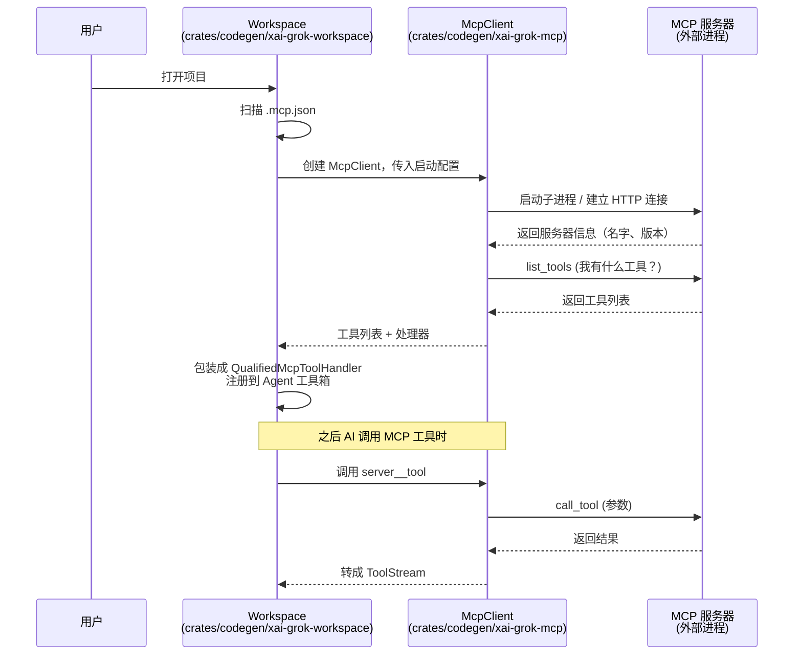
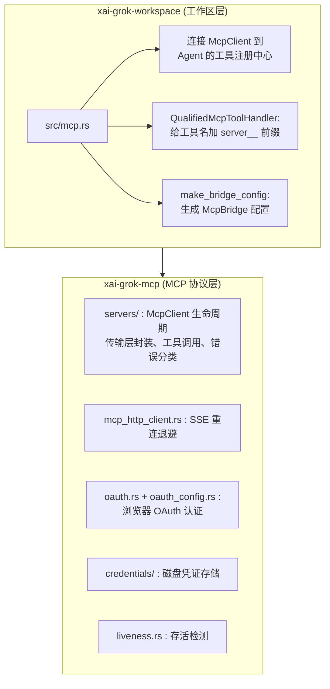
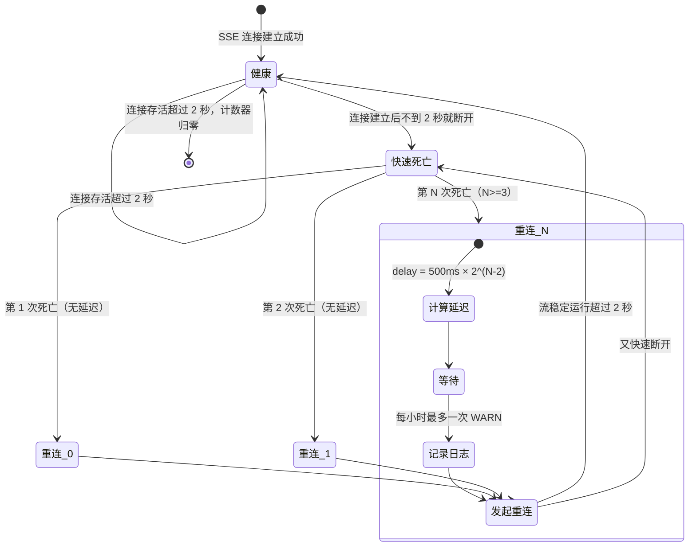

[← 返回首页](index.md)

# MCP 协议：接入外部工具服务

## 先讲个故事：AI 的“万能插座”

你肯定用过那种带 USB 口的插排——插排本身只管供电，但你插上手机充电线就能充电，插上小风扇就能吹风，插上台灯就能照明。**插排不关心你插的是什么，它只提供一套标准的接口：形状是 USB，协议是 5V 直流电。**

MCP（Model Context Protocol，模型上下文协议）就是这个“万能插座”，不过是给 AI 用的。你的项目里可能有个管理数据库的命令行工具，或者有个查天气的本地服务，再或者有个操作浏览器的自动化脚本——这些东西本来跟 Grok 八竿子打不着。但只要它们实现了 MCP 协议，往项目里的配置文件一写，Grok 就能像调用内置工具一样调用它们。

整个流程用一句话概括：**你在 `.mcp.json` 里声明“我这有个工具，这么启动它”，Grok 启动时帮你拉起来，问它“你能干啥”，然后把它能做的事全列在 AI 的工具箱里。**



## 两个 crate 的分工

整个 MCP 集成由两个 crate 配合完成，各司其职：



**xai-grok-mcp**（`crates/codegen/xai-grok-mcp/src/lib.rs`）是纯 MCP 协议层。它依赖 `rmcp` 2.1（Rust MCP SDK），但因为 `rmcp` 2.1 要求 `reqwest` 0.13，而整个仓库其它地方都在用 `reqwest` 0.12，所以这个 crate 另外承担了一个职责：**把版本冲突隔离在内部，不污染外部**。你不需要知道 `reqwest` 有几个版本，反正用 `xai_grok_mcp::rmcp::*` 拿到的类型就是对的。

**xai-grok-workspace**（`crates/codegen/xai-grok-workspace/src/mcp.rs`）是“桥梁层”。它拿到 `McpClient` 之后，把它包一层 `McpClientTransportAdapter`，适配到 workspace 内部统一的 `McpTransport` trait 上，这样后面的注册中心就不需要知道底层是通过 stdio 还是 HTTP 跟 MCP 服务器通信。

## 从配置文件到可调用工具：完整流程

### 第一步：发现 MCP 服务器

打开一个项目时，Workspace 会扫描目录下的 `.mcp.json` 文件。这个文件长这样（你可以在项目根目录自己写）：

```json
{
  "mcpServers": {
    "my-database-tool": {
      "command": "npx",
      "args": ["-y", "my-mcp-server"],
      "env": {
        "DATABASE_URL": "postgres://localhost/mydb"
      }
    }
  }
}
```

每个服务器配置里至少要有启动命令，Workspace 把它交给 `McpClient` 去处理。

### 第二步：启动和初始化

`McpClient`（定义在 `crates/codegen/xai-grok-mcp/src/servers/` 里）是 MCP 服务器的“遥控器”。它支持两种传输方式：

1. **子进程（stdio）**：像上面示例那样，`McpClient` 帮你启动一个子进程，通过标准输入输出与它对话。
2. **Streamable HTTP**：如果你的 MCP 服务器跑在远端，`McpClient` 就用 HTTP + SSE（Server-Sent Events，服务器推送事件）跟它保持连接。HTTP 发请求，SSE 收推送。

不管是哪种方式，启动后第一件事是 `initialize()`——握手。`McpClientTransportAdapter` 把这个过程包裹得很干净：

```rust
// crates/codegen/xai-grok-workspace/src/mcp.rs
async fn initialize(&self) -> Result<McpServerInfo, ...> {
    let service = self
        .client
        .ensure_initialized()  // 懒初始化：第一次调用才真正启动
        .await
        .map_err(|e| ...)?;
    let info = service.peer_info().ok_or_else(|| ...)?;
    Ok(McpServerInfo {
        name: info.server_info.name.clone(),
        version: info.server_info.version.clone(),
        capabilities: serde_json::to_value(&info.capabilities).unwrap_or_default(),
    })
}
```

注意 `ensure_initialized()`——它是懒初始化的，你打开了项目但还没用到这个 MCP 工具时，服务器进程根本没启动。直到 AI 第一次需要调用这个工具时，`McpClient` 才会真正拉进程、做握手。

### 第三步：拉取工具列表

初始化完成后，`McpClient` 就问服务器：“你能干什么？”——这对应 MCP 协议的 `list_tools`。服务器可能返回几十甚至几百个工具，所以代码里用游标分页循环拉取：

```rust
// crates/codegen/xai-grok-workspace/src/mcp.rs
async fn list_tools(&self) -> Result<Vec<McpToolDefinition>, ...> {
    let service = self.client.ensure_initialized().await...;
    let mut all_tools = Vec::new();
    let mut cursor: Option<String> = None;
    loop {
        let result = service
            .list_tools(Some(
                rmcp::model::PaginatedRequestParams::default()
                    .with_cursor(cursor.clone()),
            ))
            .await...;
        all_tools.extend(result.tools.into_iter().map(|t| McpToolDefinition {
            name: t.name.to_string(),
            description: t.description.map(|d| d.to_string()),
            input_schema: serde_json::to_value(&t.input_schema).ok(),
        }));
        match result.next_cursor {
            Some(next) => cursor = Some(next),
            None => break,  // 没有下一页了
        }
    }
    Ok(all_tools)
}
```

每拉一页就往 `all_tools` 里追加，直到 `next_cursor` 为空。

### 第四步：注册到 Agent 工具箱

拿到工具列表后，每个工具被包装成 `QualifiedMcpToolHandler`。这个名字很拗口，但做的事很简单：**给工具名加一个 `server__` 前缀**。比如 `my-database-tool` 这个服务器里有个工具叫 `query`，注册到工具箱时就变成 `my-database-tool__query`。这样即使两个不同的 MCP 服务器碰巧有同名工具，也不会冲突。

```rust
// crates/codegen/xai-grok-workspace/src/mcp.rs
pub(crate) struct QualifiedMcpToolHandler {
    qualified_id: ToolId,
    qualified_name: String,  // 比如 "my-database-tool__query"
    inner: Arc<McpToolHandler>,
}
```

它实现了 `ToolServerHandler` trait，这意味着它可以无缝接入 Agent 的工具调用体系（关于 Agent 怎么调度工具，[详见《Agent 调度核心》](15-agent-runtime.md)；关于整个工具箱的注册机制，[详见《工具箱：AI 的手和眼睛》](19-tool-system.md)）。

### 第五步：调用工具

AI 决定调用一个 MCP 工具时，流程走到 `call_tool`。这里有一个细节很值得注意：**MCP 协议要求参数必须是一个 JSON 对象**，但 AI 可能会传 `null` 或者某些非对象的奇怪值。代码做了一层容错：

```rust
// crates/codegen/xai-grok-workspace/src/mcp.rs
async fn call_tool(&self, name: &str, arguments: Value) -> Result<...> {
    let service = self.client.ensure_initialized().await...;
    // 如果参数不是对象，就包一层
    let args_object = match arguments {
        Value::Object(map) => Some(map),
        Value::Null => None,
        other => {
            let mut wrapper = serde_json::Map::new();
            wrapper.insert("value".to_string(), other);
            Some(wrapper)
        }
    };
    let result = service.call_tool({
        let mut params = rmcp::model::CallToolRequestParams::new(name.to_string());
        params.arguments = args_object;
        params
    }).await...;
    // 把返回值里的 ContentBlock 分两类：文本和图片
    Ok(McpCallResult {
        content: result.content.into_iter().map(|c| match c {
            rmcp::model::ContentBlock::Text(t) => McpContent::Text { text: t.text },
            rmcp::model::ContentBlock::Image(img) => McpContent::Image {
                mime_type: img.mime_type,
                data: img.data,
            },
            _ => McpContent::Text {
                text: "[unsupported content type]".to_string(),
            },
        }).collect(),
        is_error: result.is_error.unwrap_or(false),
    })
}
```

返回值目前支持文本和图片（Base64 编码的二进制），其他类型直接标记为“不支持”。

## Streamable HTTP 的“疯狂重连”问题

如果 MCP 服务器是通过 HTTP 连接的（而不是子进程），就会遇到一个棘手的问题。

HTTP 模式下，`McpClient` 建立一条 SSE 长连接来接收服务器推送。SSE 的本质是“服务器给你一个永远不会结束的 HTTP 响应，有新数据就往里写”。但这个连接可能因为网络抖动、服务器重启、代理超时等各种原因断开。

**`rmcp` 2.1 有个坑**：SSE 连接断开后，`rmcp` 会立刻重连——毫秒级、不停地连、连上又断、断了再连。这就是所谓的“零退避重连循环”。如果服务器真的挂了，客户端会变成一个疯狂发请求的僵尸，CPU 飙升、日志爆满。

`mcp_http_client.rs` 就是专门解决这个问题的。它给 `StreamableHttpClient` 包了一层智能退避逻辑：



用大白话讲就是：前两次快速死亡不处罚，第三次开始每次多等一会儿（500ms → 1s → 2s → 4s → 8s...），最多等到 30 秒。同时每小时的 WARN 日志只有一条，防止日志刷屏。一旦连接稳定超过 2 秒，计数器归零，退避重置。

这个逻辑的核心在 `ThrottleState` 结构体和 `plan_on_get_stream` 方法里：

```rust
// crates/codegen/xai-grok-mcp/src/mcp_http_client.rs
impl ThrottleState {
    fn plan_on_get_stream(&mut self, now: Instant) -> Option<BackoffPlan> {
        // 判断上一次连接是否活了不到 2 秒
        let rapid = self.last_established
            .is_some_and(|t| now.duration_since(t) < STABLE_STREAM_THRESHOLD);
        if rapid {
            self.consecutive_rapid = self.consecutive_rapid.saturating_add(1);
        } else {
            // 活够了，重置计数器
            self.consecutive_rapid = 0;
            self.episode_warned = false;
        }
        let attempt = self.consecutive_rapid;
        if attempt < 2 {
            return None;  // 前两次不处罚
        }
        // 决定日志级别：每小时最多一次 WARN，其余 DEBUG
        let log = if self.episode_warned {
            ReconnectLog::Debug
        } else if self.warn_budget.try_consume(now) {
            self.episode_warned = true;
            ReconnectLog::Warn
        } else {
            ReconnectLog::SuppressedWarn
        };
        Some(BackoffPlan {
            attempt,
            delay: Self::delay_for_attempt(attempt),  // 指数退避，上限 30s
            log,
        })
    }
}
```

## OAuth 认证流程

有些 MCP 服务器（尤其是第三方的 SaaS 工具）需要用户登录授权。`oauth.rs` 和 `oauth_config.rs` 处理了这件事：打开浏览器让用户完成 OAuth 授权，拿到 token 后存到磁盘的 `mcp_credentials.json`（由 `credentials/` 模块管理），以后 `McpClient` 发起请求时自动带上。

这部分因为涉及浏览器拉起和跨进程协调，比较复杂。`xai-grok-mcp` 的 `lib.rs` 文档里提到了“跨进程 + 进程内去重”，意味着如果你同时开了多个 Grok 终端窗口，它们不会弹出一堆浏览器标签页让你重复授权——只有一个会弹，其他的等着共享结果。

## 小结

整个 MCP 集成就像给 Grok 装了一个“万能插座”。流程不复杂：

1. `.mcp.json` 声明有哪些外部工具
2. `McpClient` 启动它们（子进程或 HTTP）
3. 初始化握手、拉工具列表
4. 工具注册到 Agent 工具箱（带 `server__` 前缀防冲突）
5. AI 调用时透明转发

唯一需要操心的就是 HTTP 模式下的疯狂重连——但 `mcp_http_client.rs` 已经用指数退避把它管住了。

如果想了解 MCP 工具在 Agent 里具体怎么被调度，见 [《Agent 调度核心》](15-agent-runtime.md)。如果想看 MCP 工具和其他内置工具怎么统一管理，见 [《工具箱：AI 的手和眼睛》](19-tool-system.md)。如果想了解 MCP 协议的网络传输细节，见 [《工作区通信协议：RPC 类型字典》](07-workspace-types-protocol.md)。
