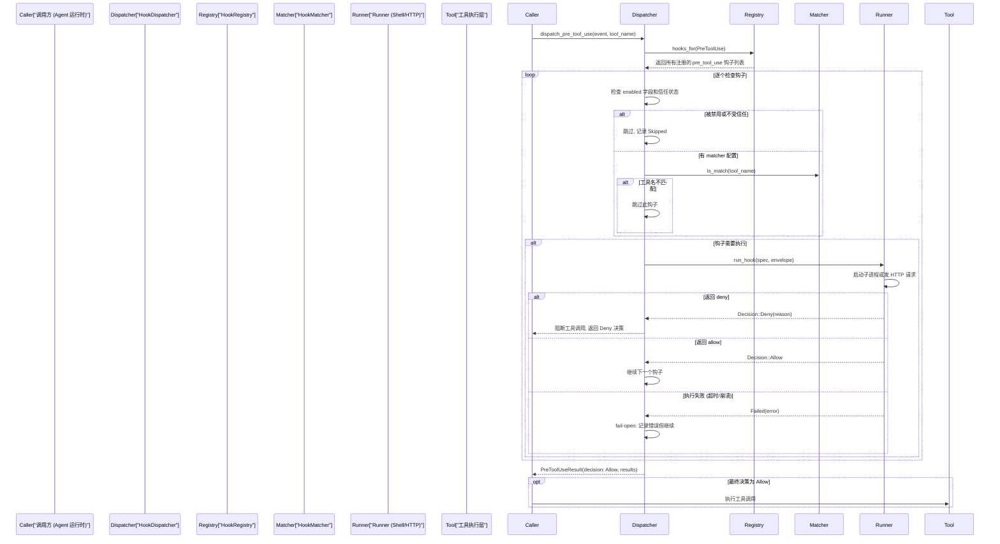
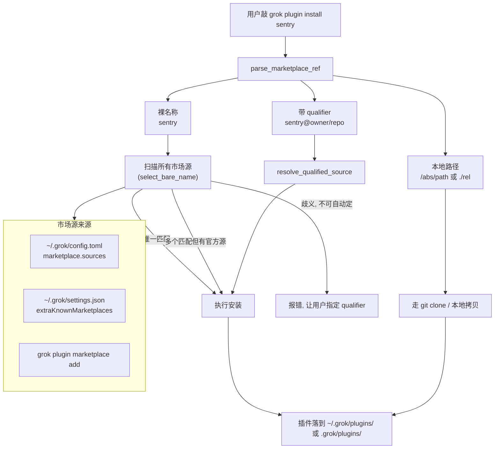
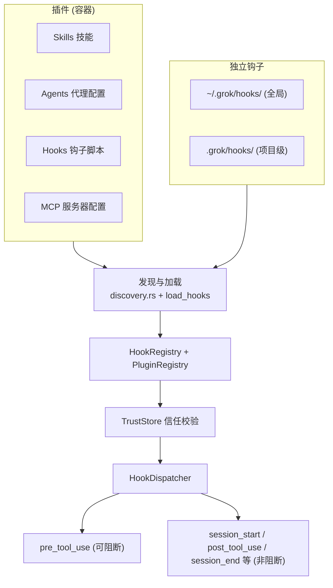

[← 返回首页](index.md)

# 插件与钩子系统

打开 Grok，你可能会好奇：我能让 AI 调用某个特定工具之前先检查一下安全策略吗？能不能在每次对话开始时自动往数据库里写条记录？或者安装一个别人写好的"插件"来一次性获得技能、工具和钩子？

这就是插件与钩子系统的用武之地。用一句话说清楚它们的区别：

- **钩子**（Hooks）：像自动化脚本。系统在某个时机（比如工具调用前后、会话开始结束）自动触发你写的 shell 命令或 HTTP 请求。轻量、单一职责。
- **插件**（Plugins）：像 App Store 里的应用。它是一个打包好的目录，里面可以同时装技能、Agent 定义、钩子和 MCP 服务器配置。一次性安装，就能用全家桶。

钩子的核心代码在 `crates/codegen/xai-grok-hooks/`，插件的核心代码分散在 `crates/codegen/xai-grok-agent/src/plugins/` 和市场插件仓库 `crates/codegen/xai-grok-plugin-marketplace/` 里。

---

## 钩子系统：在关键时刻自动插一脚

### 钩子是什么？讲个故事

想象你是餐厅经理。你制定了几条规矩：
- 每天早上开门前，让清洁工打扫一遍（`session_start`）。
- 服务员给客人下单前，你瞄一眼餐单——如果点了"特辣火锅"，你得亲自确认客人要不要（`pre_tool_use`）。
- 客人吃完走人后，服务员记一下桌号（`session_end`）。

钩子就是这些"规矩"。系统在关键时刻停下来，看看有没有匹配的钩子需要跑，跑完了再继续原来的流程。

### 四种事件类型

从 `crates/codegen/xai-grok-hooks/src/lib.rs` 的注释里能直接看到，当前支持的四种事件：

- **`session_start`**：对话刚开始。非阻塞——失败了也不会阻止对话进行。
- **`session_end`**：对话关闭。非阻塞。
- **`pre_tool_use`**：AI 要调用某个工具之前。**这是唯一能挡路的钩子**——如果钩子返回 `deny`，工具调用就会被阻断。
- **`post_tool_use`**：工具调用完成之后。非阻塞，用来记日志、发通知等。

实际支持的远不止这四种——看 `crates/codegen/xai-grok-hooks/src/dispatcher.rs` 里的 `hub_hook_kind` 测试能发现 15 种事件变体，包括 `Notification`、`PreCompact`、`PostCompact`、`SubagentStart` 等。[详见《一次完整对话的旅程》](05-one-full-turn.md) 会讲到这些事件在对话流程里的触发顺序。

### 钩子的生命周期：从发现到执行

下面这张图展示了系统遇到一个 `pre_tool_use` 事件时，钩子怎么被发现、筛选、执行的完整链路。



要点提炼：
1. **顺序执行**：一个接一个，不是并发的。
2. **Fail-open 策略**：钩子崩了不会挡路。只有显式返回 `deny` 才会阻断。这是有意为之——在受保护环境里，钩子挂掉本身不构成安全威胁，之前的 fail-closed 姿势反而因为超时之类的原因误杀了很多无辜的工具调用。
3. **谁先 deny 谁赢**：一旦某个钩子说了"不"，直接返回，后面的钩子不跑了。

### 钩子怎么配置：JSON 文件

钩子存在两个目录下，系统启动时自动扫描：

- `~/.grok/hooks/`（全局，你机器上所有项目生效）
- `.grok/hooks/`（项目级，只对当前仓库生效）

每个钩子是一个 JSON 文件，最少要写清楚"什么时候触发"和"跑什么命令"。来看 `crates/codegen/xai-grok-hooks/examples/hooks/safe-shell.json` 里的一个典型结构：

```json
{
  "name": "safe-shell",
  "event": "pre_tool_use",
  "matcher": "run_terminal_cmd",
  "command": "~/.grok/hooks/scripts/deny-dangerous.sh",
  "timeout_ms": 3000
}
```

- `name`：钩子的名字，随便取但最好有意义。
- `event`：触发时机，填 `session_start` / `pre_tool_use` / `post_tool_use` / `session_end` 等。
- `matcher`：可选。只有 `pre_tool_use` 和 `post_tool_use` 事件会用到它——指定这个钩子只对哪些工具生效。比如上面的例子只匹配 `run_terminal_cmd`。如果不写，就对所有工具生效。
- `command`：要执行的 shell 命令。系统会通过标准输入把事件详情（JSON）喂给这个命令，命令只需往标准输出打印结果 JSON。
- `timeout_ms`：超时时间，毫秒。超时算失败，遵循 fail-open 策略。

钩子命令的输出格式很简单——往 stdout 打印一行 JSON：

```json
{"decision": "allow"}
```

或者：

```json
{"decision": "deny", "reason": "rm -rf is too dangerous"}
```

### 信任校验：不是谁都能跑

钩子可以来自全局目录、项目目录，也可以跟着插件一起装进来。这时候就有一个问题：**你怎么知道项目目录里的钩子没有被篡改过？**

`crates/codegen/xai-grok-hooks/src/trust.rs` 负责做信任校验。简单说：
- 全局钩子（`~/.grok/hooks/`）默认信任——那是你自己的目录，你放的你负责。
- 项目级钩子（`.grok/hooks/`）需要显式信任。系统会弹提示问"这个项目的钩子你信不信？"，你确认后状态会记在 `TrustStore` 里。
- 插件的钩子跟着插件的信任机制走——你安装了插件就等于信任了整个插件包。

`dispatcher.rs` 里有一行 `crate::trust::is_hook_disabled(&spec.name)` 的调用——如果信任校验没通过，钩子会被静默跳过。

---

## 插件系统：一站式能力包

### 插件和钩子到底啥关系？

**插件是容器，钩子是里面的零件。**

一个插件是一个目录，里面打包了这些东西中的任意组合：

- **Skills**：自定义技能，教 AI 做特定的事情。
- **Agents**：预定义的 Agent 配置（Markdown+YAML 格式），[详见《Agent 调度核心》](15-agent-runtime.md)。
- **Hooks**：和上面讲的钩子完全一样，只不过是从插件目录里加载的。
- **MCP 服务器配置**：告诉系统怎么连外部工具服务，[详见《MCP 协议》](25-mcp-integration.md)。

所有这些由 `plugin.json` 清单文件描述。解析逻辑在 `crates/codegen/xai-grok-agent/src/plugins/manifest.rs` 里。

### 插件从哪来：三个来源



翻译成人话就是三种安装方式：

1. **从市场装**：`grok plugin install sentry`。系统去你配置的所有市场源里翻名字叫 `sentry` 的插件。只有一个匹配就直接装；多个匹配但其中有官方源（xai-org）的就选官方的；其他情况歧义了会报错让你指定源。
2. **指定源装**：`grok plugin install sentry@owner/repo`。`@` 后面是限定词，可以是 GitHub 的 `owner/repo`、本地的 `local/slug`、或是非 GitHub Git 仓库的 `git/slug`。
3. **从本地路径装**：`grok plugin install ./my-dev-plugin`。传一个本地目录路径，适合开发调试。

安装和解析逻辑分布在这些文件里：

- `crates/codegen/xai-grok-agent/src/plugins/discovery.rs`：扫描文件系统，找出 `~/.grok/plugins/`、`.grok/plugins/` 以及 CLI 传进来的 `--plugin-dir`。
- `crates/codegen/xai-grok-plugin-marketplace/src/install_resolve.rs`：解析用户输入的安装参数，判断是裸名还是 `name@qualifier`，然后从市场源里匹配。
- `crates/codegen/xai-grok-agent/src/plugins/git_install.rs` 和 `local_refresh.rs`：实际执行 git clone 或本地拷贝。

### 信任模型：安装即信任

插件的信任比钩子简单粗暴：**你主动安装了它，就代表你信任它。**

`crates/codegen/xai-grok-agent/src/plugins/trust.rs` 里的 `TrustStore` 记录了"哪些项目的插件被信任"。当 Grok 打开一个工作目录时，会自动检查项目下的 `.grok/plugins/` 目录——如果是你之前没见过的项目，系统会弹出对话框问你是否信任这个项目的插件。插件里的 MCP 服务器尤其敏感，没通过信任校验的不会启动。

### 环境变量：让插件里的脚本知道自己在哪

插件里的钩子被执行时，系统会自动注入两个环境变量：
- `GROK_PLUGIN_ROOT`：插件目录的根路径。脚本可以用它来定位插件内部的资源文件。
- `GROK_PLUGIN_DATA`：插件的数据目录，写持久化数据的地方。

---

## 操作指南：在 TUI 里管理一切

Grok 提供了一个统一的管理界面来处理钩子和插件。按下 `Ctrl+L` 就能呼出（VS Code/Cursor/Windsurf/Zed 这些编辑器里用 `/plugins` 命令）。

### 三个标签页

| 标签页 | 打开方式 | 干什么 |
|--------|---------|--------|
| Hooks | `/hooks` 命令或在插件面板里切 tab | 查看、启用/禁用、增删钩子 |
| Plugins | `/plugins` 或 `Ctrl+L` | 查看已安装插件、启停 |
| Marketplace | `/plugins` 面板里切到 Marketplace tab | 浏览和安装市场上的插件 |

用 `Tab` / `→` 往右切标签，`Shift+Tab` / `←` 往左切。

### 钩子标签页操作速查

| 快捷键 | 作用 |
|--------|------|
| `l` | 重新加载所有钩子（改了配置文件后刷新） |
| `a` | 从路径添加新钩子 |
| `r` | 删除选中的钩子 |
| `e` | 启用 / 禁用选中的钩子 |
| `Space` | 展开 / 折叠分组 |

每个钩子会显示它监听的 **事件类型**、执行的**命令或 URL**、**超时时间**、以及**启用状态**。

### 插件标签页操作速查

| 快捷键 | 作用 |
|--------|------|
| `r` | 重新加载所有插件 |
| `i` | 从路径安装插件 |
| `e` | 启用 / 禁用选中的插件 |
| `Space` | 展开看插件详情（名称、版本、范围、技能数、Agent 数、钩子数、MCP 状态、描述、冲突警告） |
| `/` | 按名称搜索插件 |

### 市场标签页操作速查

| 快捷键 | 作用 |
|--------|------|
| `i` | 安装选中的插件 |
| `d` | 卸载选中的插件 |
| `r` | 刷新市场源（重新拉取 git 仓库） |
| `u` | 更新所有已安装的市场插件 |
| `a` | 添加市场源（git URL、GitHub 简写、或本地路径） |
| `Space` | 展开 / 折叠源或插件详情 |

### 添加市场源

除了在 TUI 里按 `a`，也可以用命令行：

```bash
# 添加一个 git 仓库当市场源
grok plugin marketplace add https://github.com/my-org/plugins.git

# 用 GitHub 简写
grok plugin marketplace add my-org/plugins

# 用本地目录（开发调试用）
grok plugin marketplace add ~/dev/my-plugins
```

这些配置会落到 `~/.grok/config.toml` 里：

```toml
[[marketplace.sources]]
name = "My Team Plugins"
git = "https://github.com/my-org/plugins.git"

[[marketplace.sources]]
name = "Local Dev"
path = "~/dev/my-plugins"
```

也可以写到 `~/.grok/settings.json`（兼容 `.claude/settings.json`）：

```json
{
  "extraKnownMarketplaces": {
    "my-marketplace": {
      "source": { "source": "git", "url": "git@github.com:my-org/plugins.git" },
      "autoUpdate": true
    }
  }
}
```

---

## 自己写一个钩子：最小示例

假设你想在每次 AI 调用终端命令后，把命令记到一个日志文件里。

**第一步**，创建钩子配置文件 `~/.grok/hooks/log-shell.json`：

```json
{
  "name": "log-shell-command",
  "event": "post_tool_use",
  "matcher": "run_terminal_cmd",
  "command": "~/.grok/hooks/scripts/log-cmd.sh",
  "timeout_ms": 2000
}
```

**第二步**，写脚本 `~/.grok/hooks/scripts/log-cmd.sh`：

```bash
#!/bin/bash
# 系统会把事件 JSON 通过 stdin 喂进来
INPUT=$(cat)
TOOL_NAME=$(echo "$INPUT" | jq -r '.payload.tool_name')
COMMAND=$(echo "$INPUT" | jq -r '.payload.tool_input.command')

# 记到日志文件
echo "[$(date -Iseconds)] $TOOL_NAME: $COMMAND" >> ~/.grok/cmd-history.log

# post_tool_use 是非阻塞事件，随便返回都行
echo '{"decision":"allow"}'
```

**第三步**，给脚本执行权限：

```bash
chmod +x ~/.grok/hooks/scripts/log-cmd.sh
```

**第四步**，在 Grok 里按 `Ctrl+L` 打开插件面板，切到 Hooks 标签页，按 `l` 重新加载。新钩子应该出现在列表里了。

---

## 总结：一张图看清两者关系



核心逻辑就一句话：**钩子是原子能力，插件是能力包。** 无论钩子来自独立配置还是插件内部，最终都走同一套发现、注册、信任校验、分发的流水线。想深入某个环节，对应的模块入口都标在上面的图里了。
