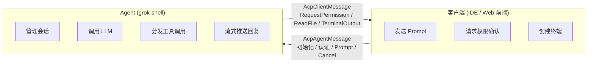
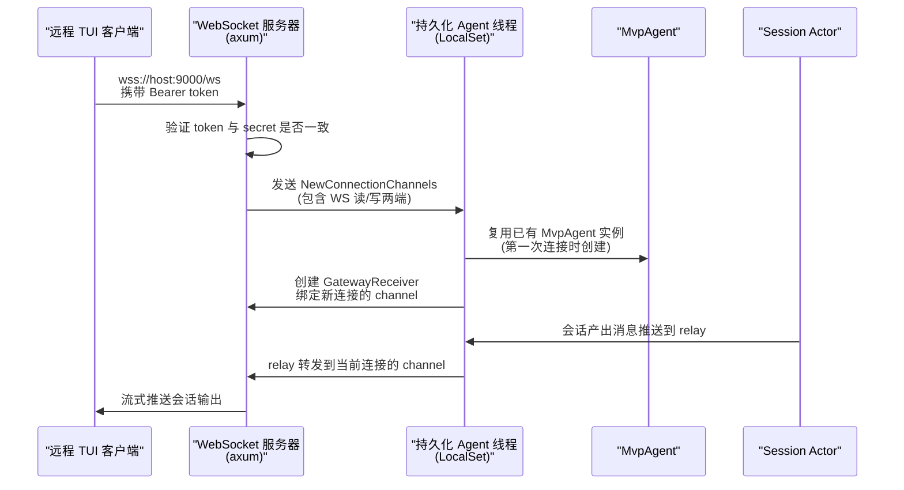
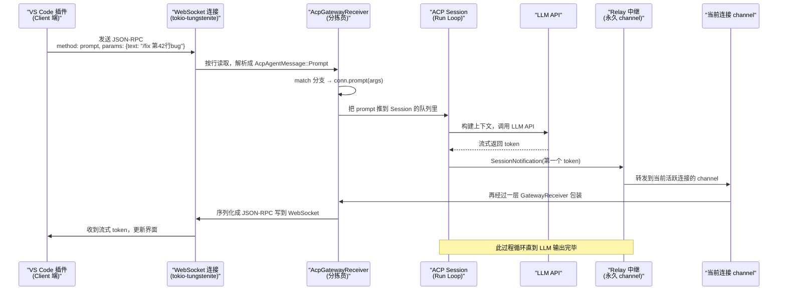

[← 返回首页](index.md)

# Agent Client Protocol：与编辑器通信

Grok 不是一座孤岛。它能跑在终端里，也能被 VS Code、Web 前端甚至另一个 Grok 实例远程操控。ACP（Agent Client Protocol）就是它们之间沟通的"外交语言"——基于 JSON-RPC 的一套约定，定义了谁该在什么时候说什么话、以什么格式说。

## 一句话理解：ACP 就是 Agent 的 HTTP

你可以把 ACP 想象成浏览器和服务器之间用的 HTTP 协议，只不过它把"请求-响应"模式套在了 AI Agent 和它的客户端之间。客户端（比如 VS Code 插件）说："帮我创建一个新会话"，Agent 回答："好的，这是会话 ID"。客户端说："把这条提示词发给模型"，Agent 就源源不断地推送模型吐出的每一个 token。

但和 HTTP 有一个关键区别：ACP 不只是请求-响应，它还支持**服务器推送**。Agent 可以在你没有主动问的情况下，主动告诉你"嘿，你上次让跑的测试跑完了"或者"权限不够，帮我确认一下要不要 sudo"。这种双向通信是 Agent 能持续工作的基础。

## ACP 的两种角色：Client 和 Agent

ACP 把连接的两端分成两个固定角色：**Client（客户端）**和 **Agent（服务端）**。

- **Client** 是发起方——可能是 VS Code 插件、浏览器里的 Web 前端、甚至另一个 grok-shell 实例。它负责展示界面、收集用户输入、把输入转发给 Agent。
- **Agent** 是响应方——跑着真正的大模型推理和工具执行。它拿到 Client 发来的 prompt，启动一个会话（Session），在里面调用 LLM、执行工具、整理回复，再把结果推回给 Client。

这个角色分工在代码里表现得一清二楚。看 `crates/codegen/xai-acp-lib/src/message.rs` 里的类型定义：

- `AcpAgentMessage` 枚举列出了 Agent 能接收的所有请求：初始化、认证、创建会话、发提示词、取消操作……
- `AcpClientMessage` 枚举列出了 Agent 需要 Client 帮忙做的事：请求用户许可、读写文件、创建终端、推送会话更新通知……

下面这张图展示了这两个角色之间的对话关系：



Client 说话的时候，用的消息类型都是 `AcpAgentMessage`；Agent 回嘴或者主动通知的时候，用的都是 `AcpClientMessage`。代码里这个设计很干净——你永远不用猜"这条消息是谁发给谁的"，看类型名就知道了。

## Gateway：消息的"快递收发室"

光有消息格式还不够，消息得有个地方排队、分拣、投递。这就是 Gateway（网关）干的活。

`crates/codegen/xai-acp-lib/src/gateway.rs` 里定义了 `acp_gateway` 函数，它会创建一对"收发搭档"：`AcpGatewaySender`（发件口）和 `AcpGatewayReceiver`（收件口）。

**发件口（Sender）**：Agent 的各个模块——Session Actor、Tool Extension、Goal 系统——手里都攥着一个 `Sender` 的克隆。它们想给 Client 发消息时，就往这个 `Sender` 里一塞，不用管对面到底是 WebSocket 还是 stdio。

**收件口（Receiver）**：它内部抱着一条真实的网络连接（比如一个 WebSocket），在一个死循环里不断从 channel 取消息，调用连接对象的方法把消息发出去：

```rust
// 从 crates/codegen/xai-acp-lib/src/gateway.rs 摘的真实代码
impl<C: acp::Agent + 'static> AcpGatewayReceiver<acp::ClientSide, C> {
    pub async fn run(mut self) {
        let conn = Rc::new(self.conn);
        while let Some(msg) = self.rx.recv().await {
            let conn = conn.clone();
            match msg {
                AcpAgentMessage::Initialize(args) => {
                    handle!(args, self.tracing, conn, initialize, spawn, on_meta);
                }
                AcpAgentMessage::Prompt(args) => {
                    handle!(args, self.tracing, conn, prompt, spawn, on_meta);
                }
                // ... 每个消息类型都有对应的分支
            }
        }
    }
}
```

这段代码像个勤勤恳恳的分拣员：从 channel 里掏出一条消息，看一眼是啥类型，然后喊一声"initialize！"或者"prompt！"，把消息扔给对应的方法去处理。

这设计好在解耦——发消息的人不需要知道传输层是什么，换传输方式（比如从 stdio 换到 WebSocket）只需要换 Gateway 底下的那根连接，上层代码完全无感。

## 三种传输方式：消息怎么从 A 到 B

ACP 协议本身是一堆 JSON-RPC 格式的字符串，用换行符（`\n`）分隔。这些字符串怎么从一个进程传到另一个进程，有三种姿势。

### 1. stdio：最朴素的方式

Agent 进程的标准输入输出就是天然的通信管道。Client 往 Agent 的 stdin 写 JSON，Agent 处理完往 stdout 写回复。

`crates/codegen/xai-acp-lib/src/stdin_reader.rs` 里有个 `spawn_stdin_line_reader` 函数，专门负责从 stdin 一行一行读数据，包装成 `LineBufferedRead`。而 `crates/codegen/xai-acp-lib/src/line_reader.rs` 里的 `LineBufferedRead::spawn_local` 则把异步的字节流转换成按行输出的流——因为 ACP 的每条 JSON-RPC 消息都是独立的一行。

这种方式最简单，不需要网络栈，适合本地启动子进程的场景。Grok CLI 启动 Agent 服务时，如果没指定网络地址，默认就是 stdio。

### 2. WebSocket：远程操控的标配

当你在办公室的破笔记本上跑 VS Code 插件，想要连上机房的 GPU 服务器上跑的 Grok Agent 时，stdio 就使不上劲儿了。这时候 WebSocket 登场。

`crates/codegen/xai-grok-shell/src/agent/server.rs` 里实现了一套完整的 WebSocket 服务器，用的是 axum（Rust 生态里一个很流行的 Web 框架）。核心流程是这样的：



这里有几个设计上的精妙之处值得展开：

**Agent 跨连接存活**。WebSocket 断线重连的时候，Agent 不会跟着死。`run_persistent_agent` 函数创建一次 `MvpAgent` 后就一直活着，新的 WebSocket 连接上来时，只是把网关的"出水口"切换到新连接上。你正跟 Agent 聊着天，WiFi 断了又连上，Agent 还在那儿默默帮你写代码，等你重连回来，它会一口气把积攒的输出全推给你。

**Relay 中继**。Agent 内部的所有组件（Session Actor、Extension 等）都往一个"永久网关 channel"（`gw_tx`）里发消息。这个 channel 永远不会关闭。有一个 relay 任务专门盯着它，把消息转发给"当前活跃连接"的 channel。没有连接的时候，消息就安静地掉在地上（代码里用 `let _ = ...` 吞掉了错误），不会堆积也不会崩溃。一旦有新连接上来，`relay_dest` 一更新，消息立刻就能流过去。

**会话通知的特殊处理**。注意看 `crates/codegen/xai-acp-lib/src/gateway.rs` 里 `session_notification` 的实现，它没有用普通的 `forward`（会等待响应），而是用了 `forward_fire_and_forget`：

```rust
// 从 gateway.rs session_notification 注释摘录
// Fire-and-forget: session notifications carry no meaningful response
// (the ACK is `()`), so we must not block the caller waiting for the
// client to acknowledge. When the agent→relay→client path is degraded
// (e.g. a Slack session whose ephemeral WebSocket died mid-turn), the
// relay write can stall for minutes (TCP retransmit timeout). Blocking
// here freezes the terminal streaming loop.
async fn session_notification(&self, args: acp::SessionNotification) -> AcpResult<()> {
    self.forward_fire_and_forget(args);
    Ok(())
}
```

翻译成人话：Agent 在流式输出 token 时，每秒可能发几十条 `SessionNotification`。如果每一条都傻等 Client 回复 ACK，一旦中间某个环节卡住了（比如 Slack 机器人的临时 WebSocket 挂了，TCP 重传在那儿死等），整个会话的流式输出就会被冻住。扔出去就跑，不回头看爆炸，这才是正确的做法。

### 3. HTTP CONNECT 代理：翻墙去连远程 Agent

很多公司内网的开发机不能直接访问外网，必须通过一个 HTTP 代理（也叫"企业出口代理"）才能出去。如果你的 Agent 服务器刚好在公司外面，客户端就得先跟代理服务器打好招呼："哥们儿，帮我开个隧道到 xxx.com:443"。

`crates/codegen/xai-grok-shell/src/agent/proxy.rs` 就干这个。它不需要用户额外装任何东西，只要设置了 `HTTPS_PROXY` 环境变量，Grok 客户端就会自动走代理。

整个过程就三步：

1. **发现代理**：`resolve_proxy_for_host` 函数读 `HTTPS_PROXY`、`HTTP_PROXY`、`NO_PROXY` 这几个环境变量，判断目标主机要不要走代理。逻辑跟 curl 的行为一模一样——`NO_PROXY` 里的域名不走代理，其余的全走。
2. **建立隧道**：`open_connect_tunnel` 函数连上代理服务器，发一条 `CONNECT target_host:443 HTTP/1.1`，代理回复 `HTTP/1.1 200` 之后，这条 TCP 连接就变成了透明的隧道。
3. **TLS 包裹**：`tls_wrap` 函数在隧道上面再包一层 TLS，用的是系统原生的根证书（`rustls_native_certs`）。这样最终拿到手的就是一条标准的 `MaybeTlsStream`，跟直连的效果一模一样，`tokio-tungstenite` 完全感觉不到代理的存在。

```rust
// 从 proxy.rs 摘的入口函数签名
pub async fn connect_via_proxy(
    proxy_url: &str,
    target_host: &str,
    target_port: u16,
) -> anyhow::Result<MaybeTlsStream<TcpStream>> {
    let stream = open_connect_tunnel(proxy_url, target_host, target_port).await?;
    let tls_stream = tls_wrap(stream, target_host).await?;
    Ok(MaybeTlsStream::Rustls(tls_stream))
}
```

TLS 配置也做了懒加载缓存（`OnceLock`），因为加载系统根证书需要读 `/etc/ssl/certs` 或者 macOS Keychain，一次读完后面所有连接复用就行。

## 认证：谁有资格连上 Agent

ACP 本身不规定认证方式，但 Grok 的 WebSocket 服务器加了一层自己的门禁。

在 `crates/codegen/xai-grok-shell/src/agent/server.rs` 的 `ws_handler` 函数里，每个 WebSocket 升级请求都要先过 `validate_auth` 这一关：

```rust
// 从 server.rs 摘的认证逻辑
fn validate_auth(headers: &HeaderMap, query: &WsQueryParams, expected_secret: &str) -> bool {
    // 先看 Authorization 头
    if let Some(token) = headers
        .get("authorization")
        .and_then(|v| v.to_str().ok())
        .and_then(|v| v.strip_prefix("Bearer "))
    {
        return token == expected_secret;
    }

    // 再看 URL 查询参数（浏览器 WebSocket 不支持自定义头）
    if let Some(ref key) = query.server_key {
        return key == expected_secret;
    }

    false
}
```

支持两种传递密钥的方式：标准的 `Authorization: Bearer <token>` 头（适合编程调用），以及 URL 查询参数 `?server-key=<token>`（适合浏览器的 WebSocket API，因为它没法自定义请求头）。密钥对不上就直接 401 拒绝，不给升级。

这个 `secret` 来自服务器启动时的 `ServerConfig`，由运维人员自己设置。它不是 OAuth 也不是 JWT——就是一把最简单的预共享密钥，适合"机房内部 Agent 服务器对着公司内网开放"的场景。

## ACP 消息类型速查表

把 `crates/codegen/xai-acp-lib/src/gateway.rs` 里 `AcpGatewayReceiver` 两个 `impl` 块中匹配的所有消息类型整理成表，方便你快速查阅：

### Agent 接收的消息（Client → Agent）

| 消息方法 | 对应的 Rust 变体 | 干什么用 |
|---------|-----------------|---------|
| `initialize` | `AcpAgentMessage::Initialize` | 初次握手，交换双方能力信息（支持什么协议版本、什么扩展） |
| `authenticate` | `AcpAgentMessage::Authenticate` | 用户登录认证，拿到登录凭据 |
| `new_session` | `AcpAgentMessage::NewSession` | 创建一个新的对话会话 |
| `load_session` | `AcpAgentMessage::LoadSession` | 从磁盘或远端加载一个已有的会话继续聊 |
| `set_session_mode` | `AcpAgentMessage::SetSessionMode` | 切换会话模式（比如从聊天模式切到终端模式） |
| `prompt` | `AcpAgentMessage::Prompt` | 最核心的方法：把用户输入发给 Agent 让 LLM 处理 |
| `cancel` | `AcpAgentMessage::Cancel` | 让 Agent 停下手头正在生成的内容 |
| `set_session_model` | `AcpAgentMessage::SetSessionModel` | 更换当前会话使用的模型（比如从 Grok-2 切到 Grok-2-mini） |
| `ext_method` | `AcpAgentMessage::ExtMethod` | 扩展方法调用——插件或者外部系统自定义的 RPC |
| `ext_notification` | `AcpAgentMessage::ExtNotification` | 扩展通知——同样是插件自定义的，单向无回复 |

### Agent 发给 Client 的消息（Agent → Client）

| 消息方法 | 对应的 Rust 变体 | 干什么用 |
|---------|-----------------|---------|
| `request_permission` | `AcpClientMessage::RequestPermission` | Agent 想执行一个危险操作，弹框问用户同不同意 |
| `read_text_file` | `AcpClientMessage::ReadTextFile` | Agent 请客户端帮忙读一个文件的完整内容 |
| `write_text_file` | `AcpClientMessage::WriteTextFile` | Agent 请客户端帮忙把内容写入文件 |
| `session_notification` | `AcpClientMessage::SessionNotification` | 流式推送会话更新：模型每吐一个 token、工具执行结果、状态变更——全走这个通道 |
| `create_terminal` | `AcpClientMessage::CreateTerminal` | Agent 申请创建一个新的 PTY 终端 |
| `terminal_output` | `AcpClientMessage::TerminalOutput` | 终端的输出流，持续推送给客户端 |
| `release_terminal` | `AcpClientMessage::ReleaseTerminal` | Agent 用完终端了，通知客户端可以关掉 |
| `wait_for_terminal_exit` | `AcpClientMessage::WaitForTerminalExit` | 等待终端里运行的命令结束 |
| `kill_terminal` | `AcpClientMessage::KillTerminalCommand` | 强制杀死终端里正在跑的命令 |
| `ext_method` | `AcpClientMessage::ExtMethod` | 扩展方法调用——Agent 端插件向 Client 端发起 RPC |
| `ext_notification` | `AcpClientMessage::ExtNotification` | 扩展通知——Agent 端插件给 Client 端的单向消息 |

## 消息流转全链路：从 WebSocket 敲字到 Agent 响应

最后用一张时序图把上面所有概念串起来——假设你在 VS Code 里连上了远程 Grok Agent，发了一条 "/fix 第 42 行的 bug"：



图中"Relay 中继"和"当前连接 channel"是两个独立的东西，这正是在 `server.rs` 的 `run_persistent_agent` 里实现的解耦——Session 往永久 channel 发，中继任务负责桥接到当前 WebSocket 的连接 channel。

## 跟周边系统的关系

- ACP Session 内部的 Run Loop 怎么处理 `prompt` 消息、怎么调用 LLM、怎么分发工具调用，这是 Agent 调度的核心逻辑——[详见《Agent 调度核心》](15-agent-runtime.md)。
- ACP 协议的类型定义全部来自 `agent_client_protocol` 这个 crate，编译时强类型校验保证 Client 和 Agent 之间不会出现字段名拼错的问题——请求信封、响应块、事件推送的结构都在那里面，[详见《工作区通信协议：RPC 类型字典》](07-workspace-types-protocol.md)。
- 插件和钩子系统可以通过 `ext_method` 和 `ext_notification` 这两个通用通道在 ACP 协议上跑自己的自定义 RPC——[详见《插件与钩子系统》](26-plugins-and-hooks.md)。
- WebSocket 服务器启动时会配套一个 Tokio LocalSet 运行时，Agent 实例在其中以单线程协作式调度运行，这跟 TUI 的渲染线程是分开的——[详见《整体架构：TUI → Agent → Workspace 三层协作》](04-architecture-overview.md)。

---

**总结**：ACP 就是一个用 JSON-RPC over 换行分隔流实现的双向 RPC 协议。Gateway 负责把消息从 channel 搬到网络连接上，Sender 和 Receiver 成对出现让上层代码完全不用关心传输细节。传输层支持 stdio（本地）、WebSocket（远程）和 HTTP CONNECT 代理（企业内网穿透）。你如果想写一个自定义的 Grok 客户端，只要实现 ACP 协议里 Client 那半边的方法，Agent 这半边已经在 grok-shell 里完整实现了。
