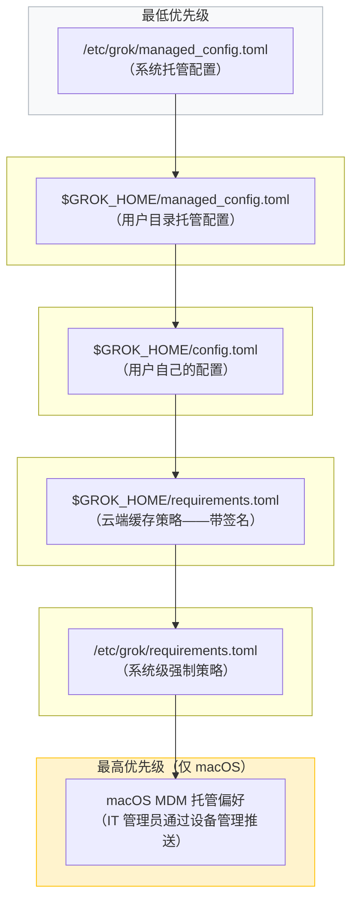
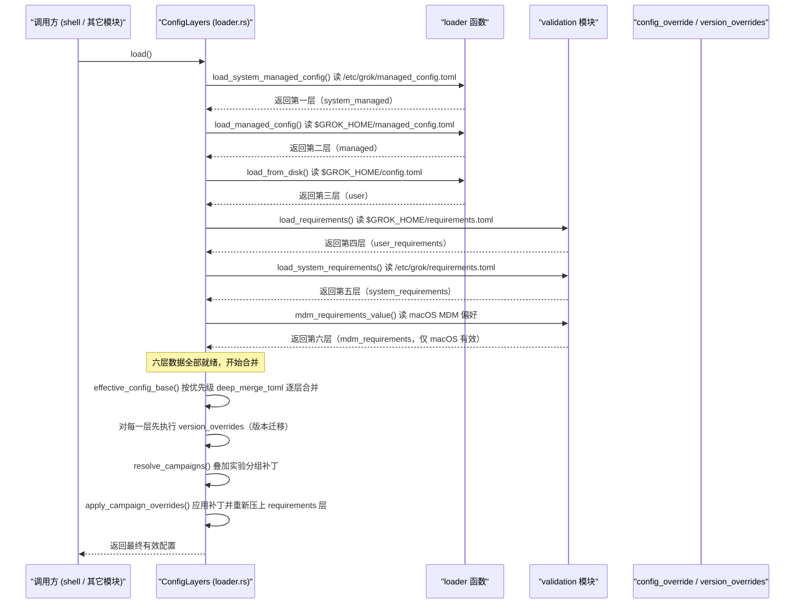
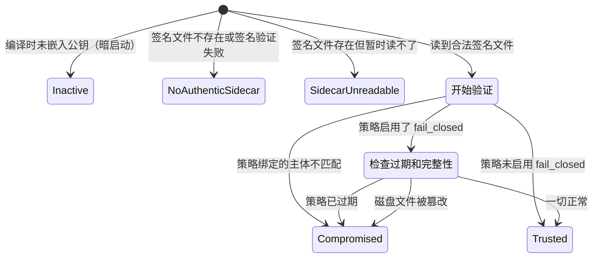

[← 返回首页](index.md)

# 配置体系：三层优先级合并

Grok 的配置不是从单一文件读出来的。它是一个层层叠加的"千层饼"——从最低优先级的系统托管配置，到用户自己的 `config.toml`，再到 IT 管理员用数字签名锁死的强制策略。每一层都可以设置相同的字段，高优先级的直接覆盖低优先级的，最终合并出一份"有效配置"。

整个配置加载的入口在 `crates/codegen/xai-grok-config/src/lib.rs` 里，核心协调器是 `crates/codegen/xai-grok-config/src/loader.rs` 里的 `ConfigLayers` 结构体。

## 六层配置，一张图理清优先级

先别急着看代码，用下面这张图把六层的来源和优先级关系印在脑子里：



图里的箭头方向就是合并方向：`managed_config.toml`（托管配置）垫底，`config.toml`（用户配置）压在上面，`requirements.toml` 系列（强制策略）最终盖上去。macOS 上还有 MDM 这个终极覆盖层。

## 合并规则：深度递归，标量覆盖，数组替换

六层配置怎么"合体"成一个最终值？代码里靠的是一个递归函数 `deep_merge_toml`，在 `crates/codegen/xai-grok-config/src/loader.rs` 里：

```rust
// src/loader.rs 里的合并核心
pub fn deep_merge_toml(base: &mut toml::Value, overrides: &toml::Value) {
    if let toml::Value::Table(overrides_table) = overrides
        && let toml::Value::Table(base_table) = base
    {
        for (key, value) in overrides_table {
            if let Some(existing) = base_table.get_mut(key) {
                // 两个都是 Table → 递归进去继续合并
                deep_merge_toml(existing, value);
            } else {
                // base 里没有？直接插进来
                base_table.insert(key.clone(), value.clone());
            }
        }
    } else {
        // 不是两个都是 Table 的情况（比如标量、数组）→ 整个替换
        *base = overrides.clone();
    }
}
```

用人话翻译一下合并规则：

- **两个都是表（table）**：递归进去，逐字段合并。比如 `[telemetry]` 下面有好几个子字段，只覆盖你改的那个，其他的保留原样。
- **只要有一边不是表**：整块替换，不商量。比如 `models = "claude-sonnet"` 这样的标量值，直接把旧值干掉换成新的。
- **数组字段**：完全替换，不会拼接。比如 `allowed = ["a", "b"]` 被覆盖层配成 `allowed = ["c"]`，最终结果就是 `["c"]`，不是 `["a", "b", "c"]`。

单元测试把这个行为钉死了：

```rust
// src/loader.rs 的测试，验证数组是替换不是拼接
let arr: Vec<_> = base["server"]["allowed"]
    .as_array()
    .unwrap()
    .iter()
    .filter_map(|v| v.as_str())
    .collect();
assert_eq!(arr, vec!["c"]);   // 只有 "c"，"a" 和 "b" 被整个替换掉了
```

## 一次完整合并的时序追踪

下面这张时序图从 `ConfigLayers::load()` 被调用开始，追踪六层数据怎么一步步加载、合并，最终产出有效配置。参与的角色都在 `crates/codegen/xai-grok-config/src/loader.rs` 和 `crates/codegen/xai-grok-config/src/validation.rs` 里：



关键细节：`effective_config_base()` 做完基础合并之后，`apply_campaign_overrides` 会再跑一次 `reapply_requirements`——这叫"二次确认"，保证管理员在 `requirements.toml` 里写的限制，绝不可能被低优先级层的实验补丁偷偷改掉。

## 配置的三种"出身"：托管、用户、强制

从配置的意图来分，六层其实可以归为三大类：

| 类别 | 对应层 | 谁来写 | 能不能改 |
|------|--------|--------|----------|
| **托管配置** | `/etc/grok/managed_config.toml`、`$GROK_HOME/managed_config.toml` | IT 管理员或部署脚本 | 用户可见但不能直接改（会被覆盖） |
| **用户配置** | `$GROK_HOME/config.toml` | 用户自己 | 随便改 |
| **强制策略（Requirements）** | `requirements.toml` 系列 + macOS MDM | IT 管理员（带签名） | 完全锁定，用户改不了 |

### 托管配置（managed_config）

托管配置是给团队或企业用的。管理员可以在 `/etc/grok/managed_config.toml` 里写默认设置，所有用这台机器的用户都生效。用户自己目录下也可以有一份 `$GROK_HOME/managed_config.toml`，优先级比系统级的高。

这两层在代码里通过 `managed_config_layers()` 加载：

```rust
// src/loader.rs
pub fn managed_config_layers() -> Vec<ManagedConfigLayer> {
    managed_config_layers_at(system_config_dir().as_deref(), user_grok_home().as_deref())
}
```

返回的是一个数组，系统级在前面（低优先级），用户级在后面（高优先级），合并时后面的压前面的。

### 用户配置（config.toml）

这就是你最熟悉的 `~/.grok/config.toml`。你在里头的所有设置——模型选择、快捷键、主题颜色——都从这层进来。它在合并顺序里排在托管配置之上、强制策略之下，也就是说：你能覆盖管理员的默认值，但覆盖不了管理员锁死的限制。

### 强制策略（Requirements + MDM）

`requirements.toml` 是整个配置体系里最硬的一层。它和托管配置最大的区别：**它是带数字签名的**。管理员在服务端签发策略文件，客户端用内置公钥验证签名，确保文件没被篡改。签名验证逻辑全在 `crates/codegen/xai-grok-config/src/signed_policy.rs` 里。

macOS 上还有终极武器：IT 管理员可以通过 MDM（移动设备管理）直接推送配置偏好，应用层通过 `crates/codegen/xai-grok-config/src/macos_managed.rs` 读取。这一层优先级最高。

## 签名验证：不怕你改文件，就怕改了还能用

托管配置没有签名，用户可以手动编辑（虽然下次同步会被覆盖）。但 `requirements.toml` 不行——每一份合法的强制策略文件都附带一个 Ed25519 数字签名。

验证流程的核心在 `signed_policy.rs` 里的 `signed_cache_compromised` 函数。用一张状态图来概括它对磁盘上签名缓存的各种判断：



状态说明：

- **Inactive**：代码里没嵌公钥（`EMBEDDED_DEPLOYMENT_CONFIG_PUBKEYS` 是空数组），签名验证不生效，一切照旧。
- **NoAuthenticSidecar**：没找到签名文件，或者签名验不过。默认情况下这不算异常（可能是新安装），但如果管理员启用了 `fail_closed` 选项，这种情况就得拒绝启动。
- **Compromised**：签名文件验过了，但内容对不上——可能被篡改、过期了、或者绑定了别的团队。这时直接拒绝加载、不让启动。
- **Trusted**：一切正常，验签通过。

公钥是编译时写死在二进制里的常量，不在任何配置文件里，所以攻击者不可能自己签一份假的策略文件：

```rust
// src/signed_policy.rs
/// 编译时嵌入的可信公钥，空数组 = 暗启动（不验证）
pub const EMBEDDED_DEPLOYMENT_CONFIG_PUBKEYS: &[(&str, &[u8])] = &[];
```

## 版本兼容：老配置文件自动升级

Grok 升级后，配置文件格式可能会变。比如 1.0 版本配的 `model = "grok-1"`，到 2.0 版本可能改名叫 `default_model = "grok-2"`。让用户手动改配置文件肯定不行，所以有了 `version_overrides` 机制。

每个配置层都可以包含一个 `[[version_overrides]]` 数组，声明"当 CLI 版本 >= X.Y.Z 时，把配置里的某些字段自动迁移"。

逻辑在 `crates/codegen/xai-grok-config/src/version_overrides.rs` 里，由 `loader.rs` 在加载每一层的时候自动调用：

```rust
// src/loader.rs
pub fn load_config_file(path: &Path) -> std::io::Result<toml::Value> {
    let mut v = load_toml_file(path)?;
    apply_version_overrides_with_registered(&mut v)?;  // ← 在这里执行迁移
    Ok(v)
}
```

`apply_version_overrides_with_registered` 会先拿 `xai_grok_version::installed_semver()` 获取当前版本，然后对这一层配置里的所有 `[[version_overrides]]` 条目逐一匹配：当前版本符合 `minimum_version` 条件的，就把那条目里的补丁字段合进配置。处理完之后，`version_overrides` 这个键本身会被删掉，不会残留到最终配置里。

## 总控入口：外部只关心两个函数

整个 `xai-grok-config` 箱子对外暴露的入口非常克制。你在代码库里其他地方看到的所有配置读取，最终都收敛到这两个函数：

| 函数 | 作用 | 一句话大白话 |
|------|------|------------|
| `ConfigLayers::load()?.effective_config_disk_only()` | 纯磁盘加载，不联网 | "把所有配置文件读进来按优先级压一遍，别管服务器" |
| `load_effective_config`（在 shell 里） | 磁盘层 + 远程实验补丁 | "先把本地配置压好，再叠上服务端下发的实验分组覆盖" |

第二个函数在 `xai-grok-shell` 里而不是 `xai-grok-config` 里，因为远程实验补丁的加载逻辑在 shell 层。config 箱子只负责"磁盘上有啥就给你合成啥"，不碰网络。

关于实验分组（Campaigns）的实现细节，[详见《配置体系：三层优先级合并》里的实验分组章节](28-config-system.md)。

## 环境变量展开：在配置里用 $VAR

在 `config.toml` 里可以直接写 `$HOME`、`$API_KEY` 这样的环境变量引用，加载的时候会被自动展开。这个功能由 `shellexpand` 库驱动，包装在 `loader.rs` 里：

```rust
// src/loader.rs
pub fn expand_env_vars_in_string(input: &str) -> String {
    let context = |name: &str| std::env::var(name).ok();
    shellexpand::env_with_context_no_errors(input, context).into_owned()
}
```

这个展开发生在 `load_toml_file` 解析完 TOML 之后立刻执行，对配置里的每一个字符串值递归处理。所以你可以放心地在配置路径里写 `$GROK_HOME/sessions`，启动时它会自动变成 `/home/you/.grok/sessions`。

## 原子写入：断电也不怕配坏

写配置文件的时候，如果直接写目标文件、写到一半断电了，磁盘上就剩一个损坏的配置。下次启动物理报错、启动不了。

`crates/codegen/xai-grok-config/src/fs_atomic.rs` 里实现了标准的"先写临时文件，再 rename"方案：

```rust
// src/fs_atomic.rs（简化示意）
pub fn write_atomically(path: &Path, content: &str, mode: Option<u32>) -> io::Result<()> {
    // 1. 在同目录下创建一个 .tmp 文件
    // 2. 把内容完整写进去
    // 3. 设置权限（比如签名侧车文件设 0600）
    // 4. fsync + rename 替换正主
}
```

这个原子写入被签名侧车（`write_sidecar`）和缓存更新等多个场景共用，保证任何时候中断，留下的要么是完整的旧文件，要么是完整的新文件，绝没有半截。

## 调试技巧：打印最终生效的配置

想知道当前所有层合并之后到底是什么效果？Grok 内置了一个斜杠命令来打印有效配置的 JSON 表示。关于这个命令的具体用法，[详见《斜杠命令系统》](11-slash-command-system.md) 中的 `/config` 条目。

如果你只想在代码层面快速查看，可以调用：

```rust
let effective = ConfigLayers::load()?.effective_config_disk_only();
println!("{}", toml::to_string_pretty(&effective).unwrap());
```

这会输出所有层合并后的完整 TOML，帮你排查"我明明改了 config.toml 为什么没生效"——大概率是上层有 `requirements.toml` 或 MDM 设置的值把你覆盖了。
