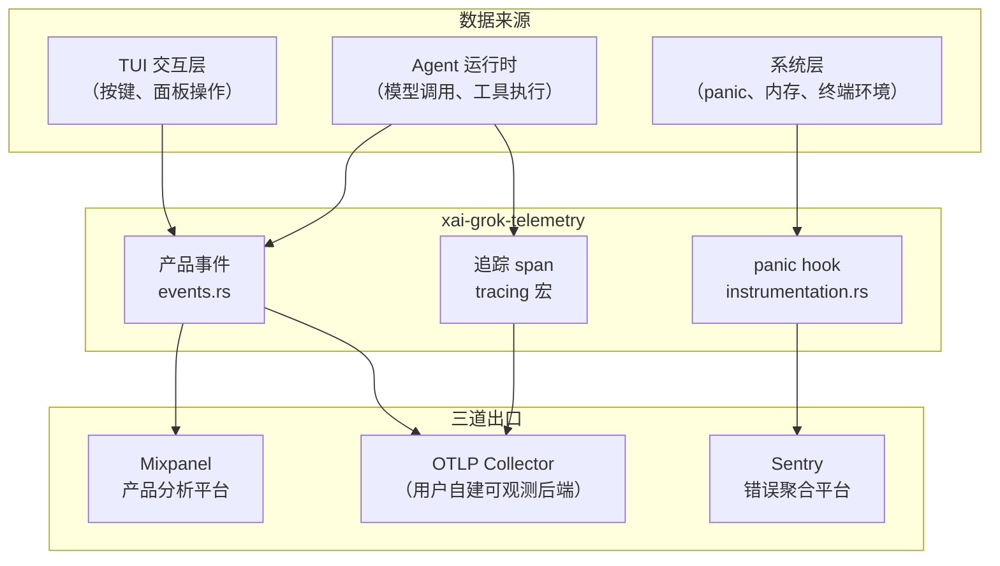
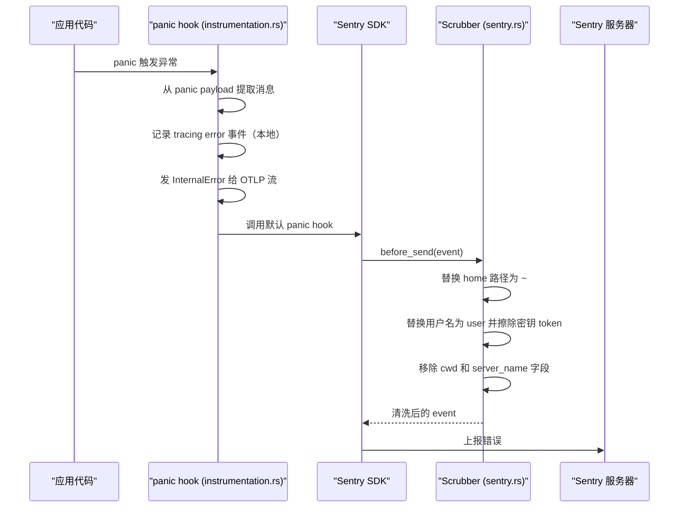

[← 返回首页](index.md)

# 遥测与可观测性

想象你在开一架 F1 赛车。车上装了三套设备：

- **方向盘上的仪表盘**（Mixpanel 产品事件）：告诉你这一圈跑了多少秒、引擎转速多少、有没有切到运动模式——关心的是"车手在做什么"。
- **车身上的传感器阵列**（OpenTelemetry 追踪）：记录变速箱温度、悬挂行程、刹车压力随时间的变化曲线——关心的是"车子跑得好不好、哪里在抖"。
- **黑匣子**（Sentry 错误上报）：撞车那一刻自动弹出，把撞击前后的所有参数冻结保存——关心的是"为什么炸了"。

这三套设备共享同一根 CAN 总线（`xai-grok-telemetry` crate），但它们记录的数据类型、发送目的地、和使用场景完全不同。这一页就把它们拆开来看清楚。

## 三套体系的分工



一句话概括：Events 管"发生了什么"（发给 Mixpanel + 可选 OTLP），Tracing 管"花了多久"（只发 OTLP），Sentry 管"哪里炸了"（只发 Sentry）。

## 产品事件：从声明到发送

所有产品事件的"户籍"都在 `crates/codegen/xai-grok-telemetry/src/events.rs` 里。每个事件就是一个 Rust struct，打上 `Serialise` 派生，再用 `telemetry_event!` 宏给它起个名字：

```rust
// events.rs 里的真实代码
#[derive(Serialize)]
pub struct SlashCommandUsed {
    pub command: String,
    pub args_provided: bool,
}

// 把 struct 和字符串名字绑定
telemetry_event!(SlashCommandUsed, "slash_command_used");
```

这个宏帮 struct 实现 `TelemetryEvent` trait（定义在同文件顶部），也就是告诉系统"这个 struct 可以当遥测事件用"。有些事件还绑了一个 `external` 映射函数，能把内部结构转成发给 OTLP 的外部格式——`external/schema.rs` 里统一管这些映射，保持 OTLP 出口的 schema 可 review。

### 事件怎么被触发？

业务代码不直接构造 HTTP 请求发 Mixpanel。它只干一件事——调用 `log_event`：

```rust
// 来自 session_ctx.rs 的公开 API
crate::session_ctx::log_event(SlashCommandUsed {
    command: "review".to_string(),
    args_provided: true,
});
```

`log_event` 负责往事件里自动注入 `session_id` 和 `turn_number`（这两个字段在每个 struct 里不需要自己写），然后把事件塞进 Mixpanel 发送队列。事件的"户籍"在 `events.rs`，但"上户口"的动作分散在整个代码库各个角落——TUI 触发 TUI 事件，Shell 触发会话事件，Agent 触发工具调用事件。

### 成对事件：CompactionScope 模式

有些事件必须成对出现——比如压缩开始和压缩结束，它们共享同一个 `compaction_id` 来关联。`events.rs` 提供了一个 `CompactionScope` 助手 struct，在构造时自动发 `CompactionTriggered`，在 `.complete()` 时自动发 `CompactionCompleted`：

```rust
// events.rs 里的真实 struct
pub struct CompactionScope {
    pub compaction_id: String,
    pub tokens_before: u64,
    pub model_id: String,
    start: std::time::Instant,
}

impl CompactionScope {
    pub fn begin(/* ... */) -> Self {
        // 1. 生成 UUID 作为 compaction_id
        // 2. 立即 log_event(CompactionTriggered { ... })
        // 3. 记录开始时间，返回 Self
    }

    pub fn complete(self, tokens_after: u64) {
        // log_event(CompactionCompleted { duration_ms, tokens_after, ... })
        // duration_ms 由 self.start.elapsed() 自动算出来
    }
}
```

调用方只需要拿到 scope，做完事调用 `.complete()`，两个事件保证都会发，且带上同一个 `compaction_id`。

## 追踪 span：性能数据去哪了

这套基于 Rust 生态的 `tracing` 框架。业务代码里到处是这种宏：

```rust
// 伪示例——真实代码散落在 shell、agent、pager 等 crate
tracing::info_span!("model_call", model_id = "grok-3").in_scope(|| {
    // 调用 LLM API...
});
```

这些 span 不直接发网络。中间隔了一层 `instrumentation layer`（在 `crates/codegen/xai-grok-telemetry/src/instrumentation.rs`），它会根据环境变量决定把 span 数据写到哪：

| 环境变量 `GROK_INSTRUMENTATION` 的值 | 行为 |
|---|---|
| 不设 | 默认走 OTLP 导出到用户配置的 OpenTelemetry Collector |
| `1` / `true` / `log` / `jsonl` | 写 JSON 行到 `~/.grok/logs/instrumentation.log` |
| `chrome` / `trace` | 写 Chrome Trace 格式到 `~/.grok/logs/instrumentation.trace.json`，可在 Chrome `chrome://tracing` 里打开 |
| `server` | 仅走 OTLP 导出 |
| `disabled` / `off` | 完全关闭，零开销 |

写文件是用 `tracing_appender::non_blocking` 异步写的，不会拖慢主线程。Chrome 模式额外包了一层 `tracing-chrome` crate，输出浏览器可以直接可视化的火焰图。

### 本地文件的后处理

`instrumentation.rs` 提供了一个 `generate_chrome_trace` 函数，能把 JSON 行日志离线转成 Chrome Trace 格式。它会遍历每一行 JSON，只挑 `target == "xai_grok_instrumentation"` 且 `event == "timing"` 的记录，把它们变成 `ph: "X"` 的完整事件（有开始时间和持续时间）。

## Sentry 错误上报：撞车黑匣子

`crates/codegen/xai-grok-telemetry/src/sentry.rs` 封装了 Sentry SDK 的初始化和事件清洗。关键流程：



### Scrubber：敏感信息脱敏

Sentry 事件在出发前必须过一遍 `before_send` 回调。它干三件事：

1. **丢噪音**：`Broken pipe`、`os error 32`、`No space left on device` 这类环境问题直接扔掉，不污染错误统计。
2. **路径脱敏**：`/Users/alice/code/foo.rs` → `~/code/foo.rs`（用 `replace_home_prefix` 做完整路径段匹配，不会把 `/Users/aliceapp.log` 误杀）。
3. **用户名脱敏**：路径中完整的用户名段（`/srv/alice/data`）替换为 `<user>`。（通过环境变量 `$USER`/`$USERNAME` 收集本机用户名）

### 初始化时机

`init(config)` 要在进程启动早期调用，返回的 `ClientInitGuard` 必须存活到进程退出。配置里带了 `client` 标签（区分 `grok-pager` 还是 `grok-shell`），`release` 版本号，以及 `environment`（debug 构建是 `development`，release 是 `production`）。

追踪采样率固定为 1%（`TRACES_SAMPLE_RATE = 0.01`），因为在 Sentry 那边存完整 tracing 数据很贵，只采一小部分做关联分析就够了。

## OTLP 出口：给高级用户的自建可观测

整个 `xai-grok-telemetry` 的"外部流"支持把产品事件和性能 span 一起导出成 OTLP 协议，发到用户自己的 OpenTelemetry Collector。这部分实现在 `otel_layer/` 和 `otlp_http.rs` 里。

`otlp_http.rs` 里有一段有意思的工程细节：OpenTelemetry 官方 HTTP 客户端绑定的是 reqwest 0.13，但这个版本在 Windows arm64 上会栈溢出——因为它的 rustls 握手线程栈很小，挡不住。所以这个 crate 用 reqwest 0.12 写了一个 `BlockingOtlpClient` wrapper，实现了 `opentelemetry_http::HttpClient` trait，在独立线程上创建客户端，绕开了这个坑：

```rust
// otlp_http.rs 真实代码
pub(crate) fn build_blocking_client(
    timeout: std::time::Duration,
) -> Result<BlockingOtlpClient, String> {
    std::thread::Builder::new()
        .name("otlp-client-build".into())
        .spawn(move || {
            reqwest::blocking::Client::builder()
                .timeout(timeout)
                .build()
                .map(BlockingOtlpClient)
                .map_err(|e| format!("building blocking OTLP HTTP client: {e}"))
        })
        .map_err(|e| format!("spawning OTLP client builder thread: {e}"))?
        .join()
        .map_err(|_| "OTLP client builder thread panicked".to_string())?
}
```

## 事件字典（部分核心产品事件）

从 `events.rs` 中列出跟会话和工具相关的最常见事件。具体的枚举定义（`AccessKind`、`PermissionOutcome` 等）都在文件里直接翻。

| 事件名 | 触发时机 | 一句话说明 |
|---|---|---|
| `session_new` | 创建新会话 | 记录会话 ID、客户端版本、是否在 git 仓库里 |
| `session_load` | 从磁盘加载旧会话 | 带上了压缩次数、回合数、工具调用次数等历史指标 |
| `session_started` | 会话 harness 构建完成 | 比 `session_new` 更晚，带上了 model、agent、MCP/插件/LSP 等完整环境快照 |
| `prompt_submitted` | 用户提交 prompt | 记录 prompt 长度和模型 ID（prompt 文本本身受 `#[serde(skip)]` 保护，只在外部流且开着 gate 时才发） |
| `turn_completed` | 一轮对话结束 | 记录结果（完成/取消/错误）、耗时、工具调用次数 |
| `tool_call_completed` | AI 调用一个工具完成 | 记录工具名、结果（成功/失败/跳过）、耗时 |
| `model_response_received` | 收到 LLM 回复 | 记录模型 ID、耗时、token 用量（prompt/completion/reasoning/cached） |
| `compaction_triggered` | 触发对话压缩 | 记录触发方式（手动/自动）、当前 token 用量和窗口占比 |
| `compaction_completed` | 压缩完成 | 记录压缩前后 token 数、耗时（与 `compaction_triggered` 共享 `compaction_id`） |
| `permission_prompted` | 弹出权限请求 | 工具名、访问类型（读/写/bash/grep/MCP/web）、权限模式 |
| `permission_decision` | 用户做出权限决定 | 带上了 `wait_ms`（用户犹豫了多久）、决定来源（config/user_reject 等） |
| `slash_command_used` | 使用斜杠命令 | 命令名、是否带了参数 |
| `plan_mode_toggled` | 切换计划模式 | 是开还是关、谁触发的（用户/工具）、当时是否有正在进行的回话 |
| `session_ended` | 会话结束 | 总时长、总回合数、总工具调用次数、总压缩次数 |
| `model_switched` | 切换模型 | 旧/新模型 ID、是否成功、失败原因码 |

## 内存遥测和会话指标

除了 `events.rs` 里的产品事件，`xai-grok-telemetry` 还有两个特殊子系统：

- **内存遥测**（`memory_telemetry.rs` + `memory_log.rs`）：定期采集进程的 Jemalloc 内存分配/释放/驻留统计，同样作为 tracing span 输出。事件 struct 定义在 `memory_telemetry.rs`，包括 `MemorySessionInit`、`MemorySearch`、`MemoryFlushStart` 等，都用 `telemetry_event!` 宏注册。详见 [《记忆系统：AI 的长期小本本》](31-memory-system.md)。

- **会话指标**（`session_metrics.rs`）：记录会话级和回合级的生命周期事件，如 `SessionStarted`、`Turn`、`TurnCompletedLifecycle`、`DoomLoopRecovery`（死循环恢复），以及 `TraceUploadAttempted/Succeeded/Skipped/Failed`（追踪文件上传状态）。详见 [《会话管理：从出生到归档》](06-session-lifecycle.md)。

## InstrumentationTimer：性能打点小工具

`instrumentation.rs` 还提供了一个 RAII 风格（"构造时开始计时，析构时自动输出"）的计时器：

```rust
// instrumentation.rs 真实代码
pub struct InstrumentationTimer {
    name: &'static str,
    start: Instant,
    fields: Vec<(String, Value)>,
    mode: InstrumentationMode,
}

impl InstrumentationTimer {
    pub fn new(name: &'static str) -> Self { /* ... */ }

    pub fn with_field(&mut self, key: impl Into<String>, value: impl Into<Value>) -> &mut Self {
        // 链式调用，给计时事件加标签
    }
}

impl Drop for InstrumentationTimer {
    fn drop(&mut self) {
        // 自动输出一条 tracing::info!(target: TARGET, event = "timing", name = ..., elapsed_us = ...)
    }
}
```

用法：业务代码创建一个 `InstrumentationTimer::new("my_operation")`，它就开始计时。离开作用域时自动输出耗时。如果想带标签，就链式 `.with_field("key", "value")`。Disable 模式下不做任何事，零开销。

## 配置开关总览

`config.rs` 和 `instrumentation.rs` 里的环境变量共同控制三条管道的开关：

| 环境变量 | 控制什么 |
|---|---|
| `SENTRY_DSN` | Sentry 上报目标地址 |
| `GROK_INSTRUMENTATION` | 本地追踪文件模式（见上表） |
| `GROK_INSTRUMENTATION_LOG` | 覆盖追踪文件默认路径 |
| `GROK_TELEMETRY_ENABLED` | 产品事件总开关（Mixpanel） |
| `GROK_OTEL_EXPORTER_OTLP_ENDPOINT` | OTEL Collector 地址（OTLP 出口） |

更多配置合并细节见 [《配置体系：三层优先级合并》](28-config-system.md)。
