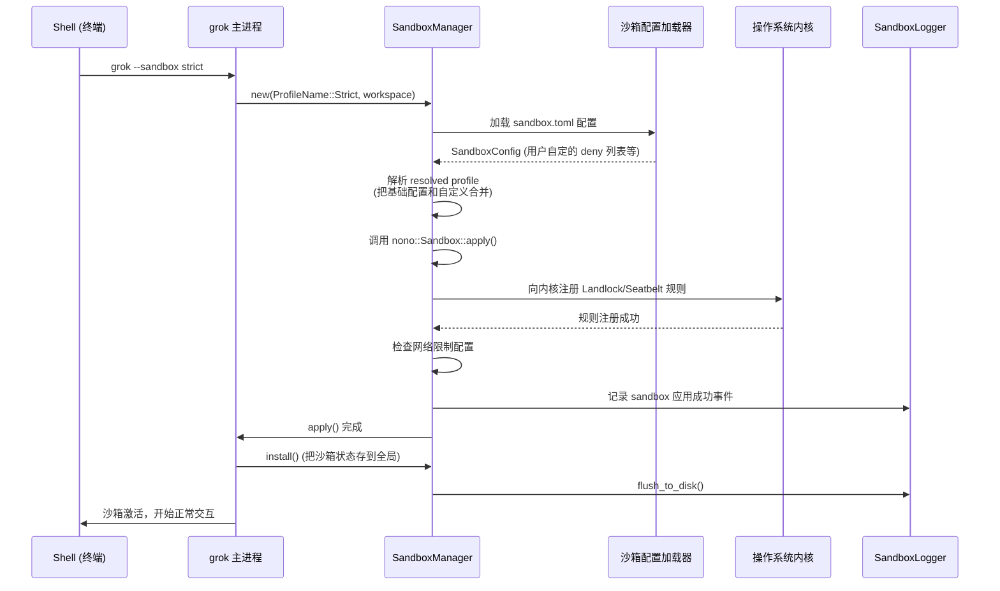
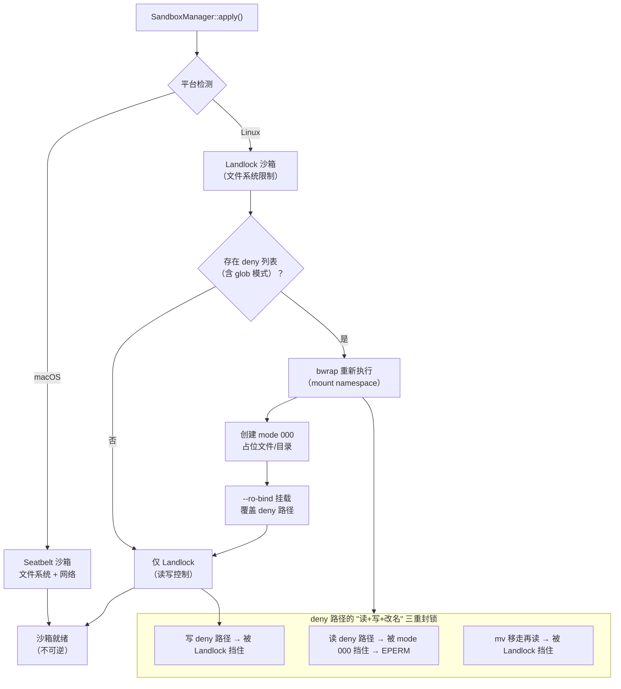
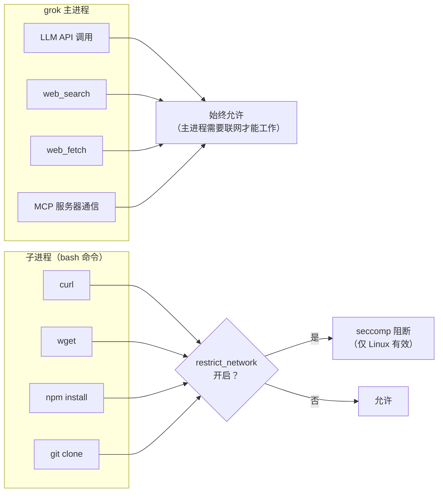
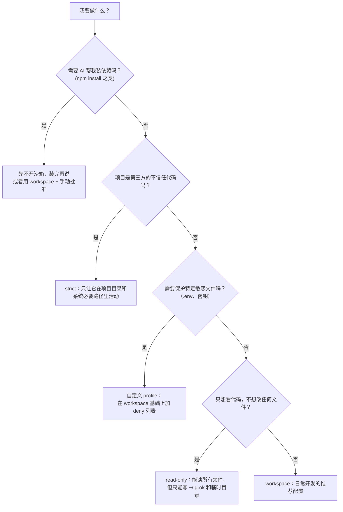

[← 返回首页](index.md)

# 沙箱隔离

打个比方：你在家里招待一个刚认识的朋友，你会让他随便翻你的抽屉、打开你的保险柜吗？不会。你会说："客厅和厨房你随便坐，但我卧室的柜子你别碰。"沙箱（Sandbox）就是给 AI 助手划定的活动范围——让它能在你的项目目录里工作，但碰到敏感文件（比如 `.env`、SSH 密钥）或者它不该去的地方时，操作系统内核直接拦住，AI 自己改不了这个限制。

这个 crate 是整个安全体系的最后一道防线。它不靠 AI 自觉，不靠配置文件里写"请不要读这个文件"，而是在操作系统内核层面把权限锁死——Linux 用 Landlock，macOS 用 Seatbelt。一旦生效就不可逆，进程自己都解不开。

核心逻辑都在 `crates/codegen/xai-grok-sandbox/src/lib.rs` 里头。我们一层一层拆开看。

## 整体流程：从启动到上锁

沙箱的生效时机非常早——在 Grok 进程启动的时候就完成。先看一张完整的时序图，了解从命令行敲下 `grok --sandbox strict` 到内核锁生效的全过程：



这之后，AI 或者它执行的任何子进程发出的文件操作、网络请求，都得先过内核这一关。对于 `deny` 列表里标记过的路径，连读都读不了（不是只禁止写入，后面会细讲）。

## 三种内置 Profiles：什么场景用哪个

沙箱不是一刀切的，Grok 给你准备了五个档位，从完全不设防到最严格的一步步收紧。配置文件在 `crates/codegen/xai-grok-sandbox/src/profiles.rs` 里定义。

| Profile | 能读什么 | 能写什么 | 子进程网络 | 适用场景 |
|---------|---------|---------|-----------|---------|
| `off` | 全部 | 全部 | 不限制 | 完全信任的环境，或者需要 AI 帮你全局安装依赖的时候 |
| `workspace` | 全部文件 | 仅工作目录 + `~/.grok/` + 临时目录 | 允许 | 日常开发——能读系统库和依赖，但不会弄脏你其它项目 |
| `devbox` | 全部文件 | 除 `/data` 外的所有顶级目录 | 允许 | 一次性开发 VM，想把 `/data` 锁死让它碰不到 |
| `read-only` | 全部文件 | 仅 `~/.grok/` + 临时目录 | Linux 上阻断 | 代码审查、学习陌生仓库，禁止任何修改 |
| `strict` | 仅工作目录 + 系统必要路径 | 仅工作目录 + `~/.grok/` + 临时目录 | Linux 上阻断 | 审查不信任的第三方代码，最大限度隔离 |

`paths.rs` 里定义了哪些是"系统必要路径"，来看看代码：

```rust
// crates/codegen/xai-grok-sandbox/src/paths.rs
// 设备文件——少了这些，git、curl、ssh 统统罢工
pub(crate) const DEVICE_FILES: &[&str] = &[
    "/dev/null",    // 输出黑洞——几乎所有 CLI 工具都会往里扔东西
    "/dev/zero",    // 零值源——内存分配器用
    "/dev/random",  // 真随机数——加密/TLS 需要
    "/dev/urandom", // 伪随机数——加密/TLS 需要
    "/dev/tty",     // 控制终端——git、ssh、gpg 需要
    "/dev/ptmx",    // PTY 分配——终端 spawn 需要
];
```

`strict` profile 只允许读工作目录，但这些设备文件仍然可访问——不然 AI 连 `git status` 都跑不了。

## 平台双通道：macOS Seatbelt vs Linux Landlock

两个平台用完全不同的内核机制，但对上层代码来说接口是统一的。`crates/codegen/xai-grok-sandbox/src/lib.rs` 里的 `SandboxManager::apply()` 方法做了平台分支：

```rust
// crates/codegen/xai-grok-sandbox/src/lib.rs
impl SandboxManager {
    #[cfg(all(feature = "enforce", unix))]
    pub fn apply(&mut self, workspace: &Path) -> anyhow::Result<()> {
        if self.profile == ProfileName::Off {
            return Ok(());  // off 档位直接跳过
        }
        // 先检查当前平台支不支持沙箱
        let support = Sandbox::support_info();
        if !support.is_supported {
            // 不支持就记录日志，继续运行（降级，不是拒绝启动）
            self.logger.log(SandboxEvent::apply_failed(...));
            return Ok(());
        }
        // 加载用户自定义的 sandbox.toml 配置
        let config = profiles::load_sandbox_config(workspace);
        // 把 profile 翻译成 nono 库能理解的"能力集"
        let caps = self.profile
            .to_capability_set_with_config(workspace, &config)?;
        // 真正生效——调用 nono，由 nono 再调用各自的平台 API
        match Sandbox::apply(&caps) {
            Ok(_) => {
                self.applied = true;
                // ...
            }
            Err(e) => { /* 降级：记录失败，但不阻止启动 */ }
        }
    }
}
```

关键点：**如果平台不支持沙箱（比如旧内核），Grok 不会拒绝启动**。它会记录一条警告日志，然后继续运行。唯独一种情况会 fail fast：你显式指定了自定义 profile 且带了 `deny` 列表，但 Linux 上找不到 `bubblewrap`，这时候 Grok 拒绝启动——因为 `deny` 列表是你明确要求保护的，做不到就应该停下，而不是假装保护了。

## Linux 上的双重防线：Landlock + bubblewrap

Linux 的沙箱其实有两层，各管一摊：



Landlock 管"能不能写"，bubblewrap（通过 mount namespace）管"能不能读"。为什么需要两个？因为 AI 也可以通过 `cat`、`grep` 这些读命令来偷看你的 `.env` 文件，光禁止写入不够。`bwrap_blocked_source_for_path` 函数会创建一个权限被设为 mode 000 的占位文件，然后通过 `--ro-bind` 把它挂载到 deny 路径上面——这样任何读操作都会收到 EPERM（权限不足）。

```rust
// crates/codegen/xai-grok-sandbox/src/lib.rs
// 为 deny 路径创建 mode 000 的占位文件，确保 bwrap 绑过去后任何读操作都返回 EPERM
#[cfg(all(feature = "enforce", target_os = "linux"))]
fn bwrap_blocked_placeholder(name: &str, want_dir: bool) -> Option<PathBuf> {
    // 文件名带 PID，避免多个 grok 进程同时跑时互相踩
    let path = paths::grok_home().join(format!("{name}.{}", std::process::id()));
    // 创建文件或目录，然后 chmod 000
    // ...
    chmod_000(&path)?;
    Some(path)
}
```

## 自定义 Profile：哪些文件打死不能碰

如果你想在某个内置 profile 的基础上额外保护一些文件（比如所有 `.env`、`*.pem` 密钥文件），可以写自定义 profile。配置文件放在 `~/.grok/sandbox.toml`（全局）或 `.grok/sandbox.toml`（项目级）：

```toml
# ~/.grok/sandbox.toml
[profiles.my-project]
extends = "workspace"        # 在 workspace 基础上再收紧
restrict_network = false     # 子进程允许联网

# 这些路径/glob 模式在操作系统级别被禁止读写
deny = [
    ".env",                  # 项目根目录的 .env
    "**/*.pem",              # 任何目录下的 .pem 密钥文件
    "/etc/shadow",           # 绝对路径也可以
]
```

然后启动时指定：

```bash
grok --sandbox my-project
```

`deny` 列表里的 glob 模式支持 `*`（匹配一层）、`**`（跨目录）、`?`（单个字符）和 `[abc]`（字符类），但不支持 `{a,b}` 花括号展开。macOS 上这些 glob 在运行时实时匹配——文件哪怕在 Grok 启动后才创建，也能被拦住。Linux 上只在启动时做一次展开（mount namespace 不支持运行时 glob），所以新建的匹配文件不会被覆盖。对安全要求高的文件，建议在 Linux 上写精确路径。

`deny` 的解析逻辑在 `crates/codegen/xai-grok-sandbox/src/deny.rs`，包括 glob 展开、路径分区（精确路径 vs glob）和展开上限保护——如果 glob 匹配的文件太多，Grok 会直接拒绝启动，而不是半不拉地保护一部分。

## 网络隔离：进程内 vs 子进程

你可能注意到了，沙箱对网络的处理是分两层的：



为什么主进程不能断网？因为 LLM API 在主进程里调用，断了网 AI 就哑巴了。所以网络限制只针对子进程——当 profile 的 `restrict_network` 为 true 时，所有由 AI 发起的 bash 命令（像 `curl`、`npm install`）在 Linux 上会被 seccomp 拦住。

这部分逻辑在 `crates/codegen/xai-grok-sandbox/src/child_net.rs` 里实现（精读材料没包含这个文件，但 `lib.rs` 里的 `should_restrict_child_network()` 函数和 `RESTRICT_CHILD_NETWORK` 原子变量就是它的接口）。

## 沙箱和权限系统的联动

沙箱不是一个孤立的安全层，它和权限管理器有直接的联动。看 `crates/codegen/xai-grok-workspace/src/permission/manager.rs` 里的这一段：

```rust
// 当沙箱激活且配置了自动批准 bash 时，
// 跳过权限提示，直接放行
if matches!(&access, AccessKind::Bash(_))
    && xai_grok_sandbox::should_auto_allow_bash()
    && !policy_forced_prompt
    && !auto_forced_prompt
{
    tracing::debug!("sandbox: auto-approving bash");
    let decision = Decision::Allow;
    // ...
}
```

意思很直白：如果沙箱已经锁死了文件系统和网络的边界，bash 命令的权限审批就可以省掉一部分——因为在沙箱的笼子里，AI 能造成的破坏已经被内核限制住了。这是一种"信任但验证"的思路：沙箱从技术上把破坏半径缩小到可接受范围，然后权限系统就可以少弹一些窗烦用户。

什么时候 `should_auto_allow_bash()` 返回 true？

```rust
// crates/codegen/xai-grok-sandbox/src/lib.rs
pub fn should_auto_allow_bash() -> bool {
    AUTO_ALLOW_BASH.load(Ordering::Relaxed) && is_active()
}
```

它要求两个条件同时成立：沙箱正在生效（`is_active()`），并且这个自动批准开关被显式打开了（`AUTO_ALLOW_BASH`）。开关由 `set_auto_allow_bash(enabled)` 控制。

## 事件日志：事后审计

沙箱的所有关键动作都会记录到 `~/.grok/sandbox-events.jsonl`：

```rust
// crates/codegen/xai-grok-sandbox/src/lib.rs
// 记录违规事件
pub fn log_violation(target: &str, operation: &str) {
    if let Some(state) = SANDBOX.get() {
        state.logger.log(SandboxEvent::fs_violation(
            &state.profile,
            target,
            operation,
        ));
        let _ = state.logger.flush_to_disk();  // 立刻刷盘，不缓存
    }
}
```

事件类型在 `crates/codegen/xai-grok-sandbox/src/types.rs` 里定义，包括：
- `ProfileApplied`：沙箱应用成功，记录用的是哪个 profile、在哪个工作目录
- `ApplyFailed`：沙箱应用失败（平台不支持或其他错误），带有失败原因
- `FileSystemViolation`：进程试图访问（读或写）被 deny 的路径，被内核拦下

日志立写立刻 flush 到磁盘，因为违规事件可能紧接着就是进程崩溃或被 kill，丢日志就找不到线索了。

## 会话恢复时的沙箱绑定

每个会话创建时用的沙箱 profile 会被记录在会话元数据里。当你用 `grok --resume` 或 `grok --continue` 恢复会话时，Grok 会检查当前指定的 profile 和会话保存的是否一致。如果不一致，直接拒绝启动——你不能把一个在 `workspace` 下跑的会话，恢复时换成 `strict`，反之亦然。

具体逻辑在会话管理模块里（`crates/codegen/xai-grok-workspace/src/session/`），沙箱这里只做"我是什么 profile"的声明和检查。详见《会话管理：从出生到归档》（06-session-lifecycle.md）。

## 什么时候该用哪个 Profile：决策树



一句话总结：**workspace 够大多数人用，strict 留给不信任的代码，自定义 profile + deny 列表是最细颗粒的保护**。

## 与其它模块的关系

沙箱不是孤岛。它在整个系统里的位置和交互对象：

- **Workspace 初始化**：在 `crates/codegen/xai-grok-workspace/src/workspace_ops.rs` 的启动流程中，沙箱是最早被调用的几个组件之一。详见《工作区与文件系统》（21-filesystem-workspace.md）。
- **权限审批流水线**：沙箱激活后，通过 `should_auto_allow_bash()` 影响 bash 命令的审批决策。详见《终端执行与权限控制》（20-terminal-tools.md）。
- **采样器/子进程管理**：子进程（bash 命令）的网络访问由沙箱的 `child_net` 模块控制，通过 seccomp 在 Linux 上阻断。详见《采样器与重试策略》（18-sampler-and-retry.md）。
- **配置体系**：用户通过 grok.toml 里的 `[sandbox]` 段和 `.grok/sandbox.toml` 来自定义沙箱行为。详见《配置体系：三层优先级合并》（28-config-system.md）。

## 代码里的全局状态

沙箱生效后，状态存在一个全局单例里（`OnceLock<GlobalSandboxState>`），整个进程生命周期只写一次：

```rust
// crates/codegen/xai-grok-sandbox/src/lib.rs
static SANDBOX: OnceLock<GlobalSandboxState> = OnceLock::new();
static RESTRICT_CHILD_NETWORK: AtomicBool = AtomicBool::new(false);
static AUTO_ALLOW_BASH: AtomicBool = AtomicBool::new(false);

struct GlobalSandboxState {
    profile: String,       // 用的是哪个 profile（"workspace" / "strict" …）
    logger: SandboxLogger, // 事件日志记录器
    applied: bool,         // 是否成功应用（注意：可能平台不支持导致 false）
}
```

全局 API 都是读操作——`is_active()`、`profile_name()`、`should_restrict_child_network()`、`log_violation()`。写操作只在 `SandboxManager::install()` 里发生一次。

## 注意事项和常见误区

1. **沙箱是不可逆的**。`SandboxManager::apply()` 一旦调用，内核就锁死了限制，不存在"暂时关闭"或"降级"。这是设计如此——如果 AI 能自己降级沙箱，那沙箱就没意义了。

2. **Linux 上的 deny glob 不是运行时的**。在 Linux 上用 `deny = ["**/*.pem"]`，它只会拦住在启动时已经存在的 `.pem` 文件。运行中新建的不被保护。macOS 没有这个限制。

3. **子进程网络阻断只在 Linux 有效**。在 macOS 上用 `strict` 或 `read-only` profile，子进程仍然能联网。这是 Seatbelt 的限制，不是 bug。

4. **`devbox` 的 `/data` 保护不依赖 `enforce` feature**。即使编译时去掉了 `enforce` feature，Linux 上的 `devbox` 仍然会用 bwrap 把 `/data` 挂载为只读——因为这个操作是 mount namespace 层面的，不需要内核 Landlock 支持。

5. **多进程安全**。`bwrap_blocked_placeholder` 函数在创建占位文件时会带上 PID，避免多个 grok 进程同时跑时互相踩脚。
