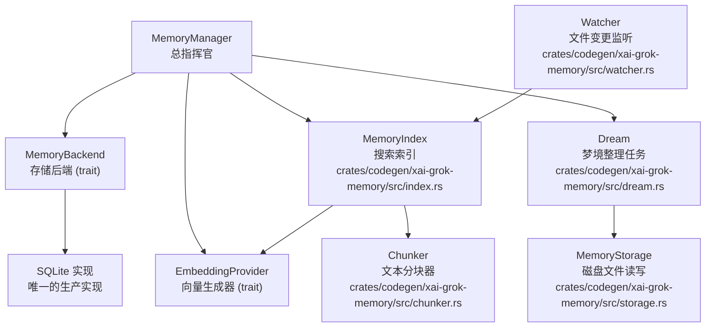
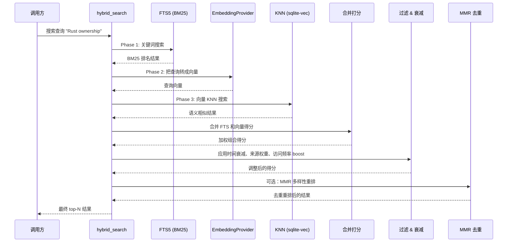
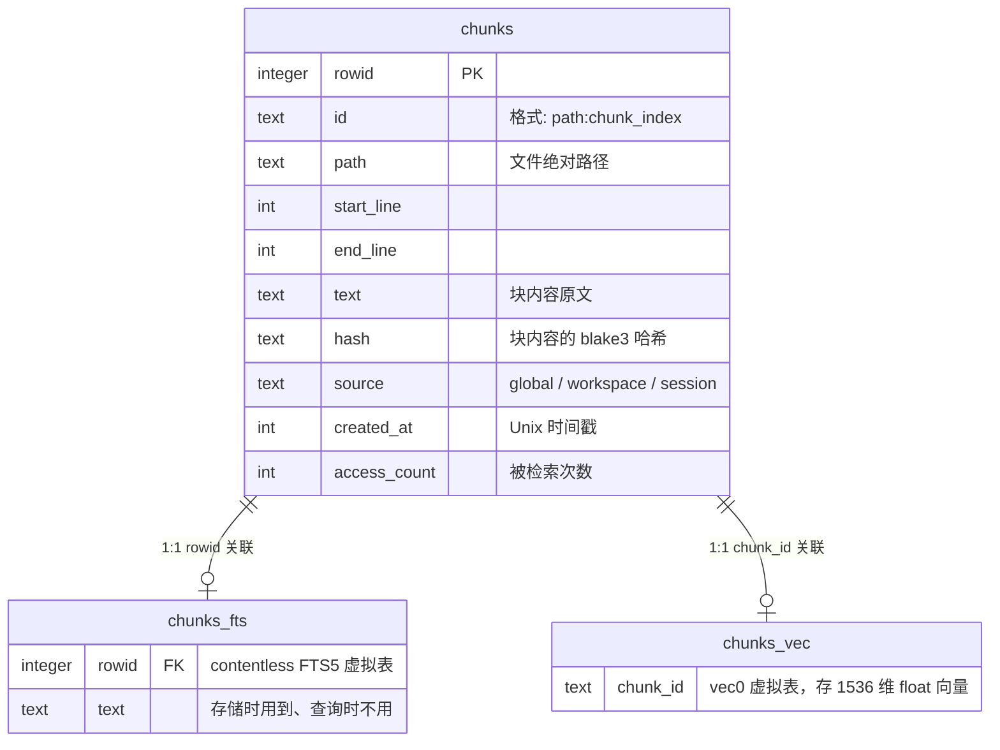
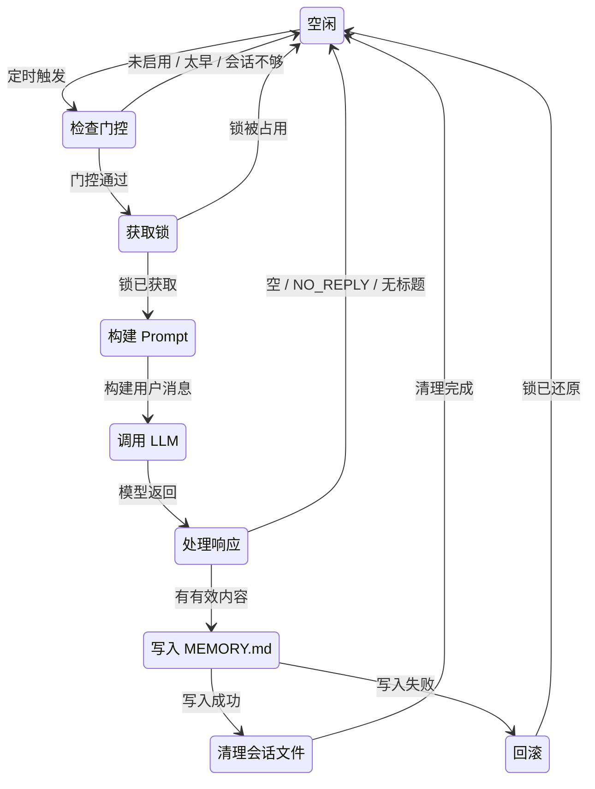

[← 返回首页](index.md)

# 记忆系统：AI 的长期小本本

你肯定遇到过这种场景：上周跟 AI 聊了两个小时，把项目架构、决策原因、注意事项全交代了一遍，这周打开新会话，它又一脸茫然地问你"请问你的项目是做什么的？"。

这就是记忆系统要解决的问题。它就像 AI 随身带的一个小本本，把重要的信息存下来，下次聊天时自动翻出来用。更聪明的是，这个小本本会自己"做梦"——定期回顾之前的笔记，把零碎信息合并成有条理的知识，顺便把不重要的东西忘掉。

在 Grok Build 里，这套系统被打包成一个叫 `xai-grok-memory` 的 Rust crate，位于 `crates/codegen/xai-grok-memory/` 下面。咱们一点点拆开看。

## 数据存哪儿：磁盘上的文件布局

记忆系统的底层存储非常简单——就是 Markdown 文件。文件都放在 `~/.grok/memory/` 下面，按作用域分目录：

```text
~/.grok/memory/
  ├── MEMORY.md                         # 全局知识（跨所有项目）
  └── {workspace_hash}/                 # 每个工作区的目录
      ├── MEMORY.md                     # 项目级知识
      └── sessions/
          └── YYYY-MM-DD-{slug}-{sid8}.md  # 每次会话的日志
```

`workspace_hash` 是用 blake3 对工作区路径取哈希的前 16 位字符。为什么这么干？因为不同项目可能有重名目录，用哈希保证隔离，不会有串数据的问题。

从这块我们能看出来，记忆分了三种"来源"（代码里叫 source）：`"global"`（全局）、`"workspace"`（项目级）、`"session"`（某次会话的日志）。这个分类在后面搜索和遗忘的时候至关重要——`global` 和 `workspace` 是"常青"的，永远不会被时间衰减淘汰；`session` 是临时的，会随着时间慢慢"褪色"。

相关实现见 `crates/codegen/xai-grok-memory/src/storage.rs`。

## 架构全景：MemoryManager 是总指挥

别被"架构"这个词吓到。记忆系统的核心就一个主控角色——MemoryManager，它手里攥着几件家伙：



MemoryManager 自己不干脏活累活，它只负责协调。真正干活的是这几个模块：

- **MemoryIndex**：建立在 SQLite 上的搜索索引。用 FTS5 做关键词检索，用 sqlite-vec 做向量相似度搜索。写记忆或删记忆的时候，它负责更新索引。
- **Dream**：定时任务，把零碎的会话日志合并成摘要，写入 MEMORY.md，然后删掉源文件。
- **Watcher**：盯着 `~/.grok/memory/` 目录的变动，增删改都能感知到，自动触发增量索引更新。
- **Chunker**：把长文本切成适合检索的小段。不切的话，向量搜索效果很差。
- **EmbeddingProvider**：调用外部 API 把文本转成向量。当前用的是 OpenAI 兼容的 embeddings 端点，具体实现在 `crates/codegen/xai-grok-memory/src/embedding.rs`。

## 搜索流水线：BM25 + 向量 + MMR 三步走

这是记忆系统最精妙的部分。你搜一个词"Rust ownership model"，它不是简单地 grep 一下，而是经过一条精心设计的流水线。

整条流水线的入口函数是 `hybrid_search`，在 `crates/codegen/xai-grok-memory/src/search.rs` 里。



这个流水线有个很巧妙的设计：**优雅降级**。如果 sqlite-vec 没加载成功（比如编译时没带这个扩展），向量搜索这一步直接跳过，FTS 的关键词搜索权重自动变成 1.0——也就是说，退化成了纯文本搜索，功能不受影响。

下面分步讲讲每个阶段在干什么。

### Phase 1：FTS5 关键词搜索

SQLite 内置的 FTS5 引擎用的是 BM25 算法，简单理解就是**不只看命中多少次，还看这个词在文档里到底有多稀有**。比如搜"Rust ownership"，一个文档里"Rust"出现了 50 次但"ownership"只出现 1 次，BM25 能分清楚哪个文档才是真正在讲 ownership 的。

代码在 `search_fts` 和 `search_fts_by_sources` 里（`crates/codegen/xai-grok-memory/src/index.rs`）。这里有个重要的细节：搜索之前会调用 `extract_keywords`（在 `query_expansion.rs` 里）过滤掉停顿词，然后用 `OR` 连起来。所以当你问"how do I use Rust ownership"，它实际搜的是 `Rust OR ownership`，而不是逐词匹配整句话。

另外，`hybrid_search` 在这个阶段做了一个**双重查询**：除了全量搜索，还会单独搜一轮 `global` 和 `workspace` 来源。这么做是因为全局和项目级记忆的文档数少，但非常重要，如果只做一轮查询，很容易被大量的 session 日志"淹没"。

### Phase 2：向量语义搜索

关键词搜索有个缺陷：搜"内存管理"找不到写"GC 策略"的文档，虽然它们说的是同一件事。向量的核心价值就在这儿——把文字变成一串数字，语义越接近的词，数字越像。

`hybrid_search` 先从 `EmbeddingProvider` 拿到查询的向量，然后丢给 `vector_search`（在 `index.rs` 里），用 sqlite-vec 的 KNN（K Nearest Neighbors，就是"离最近的 K 个邻居"）功能搜出最相似的文档块。

向量距离怎么算？用的是 L2 距离（欧几里得距离）。对于归一化到单位长度的向量（大部分 embeddings API 都这么干），两个向量的 L2 距离范围是 [0, 2]，转换公式很简单：

```
相似度 = 1.0 - 距离 / 2.0
```

这段逻辑在 `search.rs` 的 `hybrid_search_merge` 函数里，你搜 `MAX_L2_DISTANCE` 就能找到。

### Phase 3：合并打分

这才是真正的重头戏。两条搜索路径各产出一组结果，怎么把它们合成一个分数？

代码里的做法很朴素（见 `search.rs` 的 `hybrid_search_merge`）：

- **两个信号都有**：FTS 得分乘以 `text_weight`，向量得分乘以 `vector_weight`（默认都是 `0.5`），加起来。但！如果加权后的分数低于纯 FTS 分数，取 FTS 分数。这是为了防止"向量结果拖累关键词结果"的尴尬情况。
- **只有 FTS 结果**：直接用完整的 FTS 分数，不乘任何权重。这是为了防止 FTS 独有的好结果被"砍半"后掉出阈值。
- **只有向量结果**：用向量分数乘以 `vector_weight`。

FTS5 的 BM25 分数是负的（值越小匹配越好），向量距离是正的小数，所以代码先把两者都归一化到 [0, 1] 区间，0 表示不相关，1 表示完美匹配。

### 时间衰减：让旧记忆慢慢褪色

不是所有记忆都同等重要。一周前的会话日志和今天的全局笔记，显然后者更可靠。

`hybrid_search_merge` 在每个结果上施加了时间衰减：

- **`global` 和 `workspace` 来源**：衰减倍数永远是 1.0，不受时间影响。这叫"常青"（evergreen）来源。
- **`session` 来源**：用指数衰减公式，好比放射性元素的半衰期——`e^(-λ × age_days)`，其中 `λ = ln(2) / half_life_days`。默认半衰期 30 天，30 天前的会话日志得分就只有今天的一半了。

双层衰减后的例子：一个完美的 FTS 匹配（得分 1.0），如果来自 60 天前的 session，得分就只有 0.25；如果来自 90 天前的 session，得分会掉到 0.125。而 `global` 和 `workspace` 的结果不受影响。这个机制天然地让旧知识"退休"。

### 更多信号层

除了时间衰减，还有三个调整因子：

- **来源权重**：`global`、`workspace`、`session` 可以分别配置权重。比如你可以设 `session` 为 0.5，让临时笔记的重要性和知识库差一截。
- **访问频率 boost**：记忆被检索到的次数越多，下次得分就越高。公式是 `1 + ln(1 + access_count) × 0.05`——被访问 1 次提升不显眼，被访问 100 次也只提升约 23%。这个 boost 只影响**排名**，不影响**显示的得分**。换句话说，两个得分都是 1.0 的结果中，被访问更多的那个排前面。
- **内容过滤**：空白的 scaffold 模板（比如刚建项目时自动生成的 `MEMORY.md` 壳子）会在搜索阶段就剔除掉，干脆不进结果集。实现逻辑在 `is_content_free` 函数里。

### MMR 多样性重排

搜 10 个结果，如果前 5 个都是一模一样的段落复述，用户体验有多差不用说了吧。

MMR（Maximal Marginal Relevance，最大边界相关性）算法就是干这个的。它是可选功能，在 `crates/codegen/xai-grok-memory/src/mmr.rs` 里实现。默认关闭，配置项 `mmr.enabled = true` 打开。

原理很简单：每次选一个结果加入最终列表时，不只看它跟查询多相关，还会惩罚跟已选结果太像的——相似度通过文本 embedding 算。结果就是，列表前面 10 条覆盖了不同角度的信息，没有重复。

配置里有个 `lambda` 参数，控制"相关性 vs 多样性"的权衡。`lambda=1.0` 就是纯相关性排序，`lambda=0.0` 就是纯多样性排序。默认 `0.7`，略偏向相关性。

## 双层索引：chunks 表 + FTS5 + vec0

前面一直在说搜索，那索引本身是什么样子的？`openssl` 或者说 `crates/codegen/xai-grok-memory/src/index.rs` 里的 `MemoryIndex` 用 SQLite 建了三张表：



建表的 SQL 在 `crates/codegen/xai-grok-memory/src/schema.rs` 里。

几个关键设计：

1. **contentless FTS5**：FTS5 不存文本副本，只建索引。因此插入和删除 FTS 条目时，**必须手动提供原始文本**。否则 FTS5 没法计算词的统计信息。你在代码里会看到 `INSERT INTO chunks_fts(chunks_fts, rowid, text) VALUES('delete', ...)` 这种孤立的写法——这就是删 FTS 条目的方式。

2. **vec0 存量嵌入缓存**：向量搜索结果本身就存在 vec0 虚拟表里，不需要另建缓存。查 `chunks_without_embeddings`（查询哪些块还没生成向量）然后调用 `embed_missing_chunks`（在 `lib.rs` 里）批量补齐就行。

3. **索引事务**：`reindex_file` 里面所有对 chunks、chunks_fts、chunks_vec 的增删改都包在一个事务里。保证不会出现"chunks 表删了但 FTS 里还在"这种中间状态。

## "做梦"机制：Dream 怎么自动管理和遗忘记忆

Dream 是这个系统最有意思的概念。它模拟的就是人睡觉时的记忆巩固过程——白天经历了一堆零碎对话，晚上 Sleeping 的时候把它们梳理成有用的知识，顺便清理掉废话。



Dream 的判断逻辑分三道门（`check_dream_gates` 函数，在 `crates/codegen/xai-grok-memory/src/dream.rs` 里）：

1. **开关门**：配置里 `dream.enabled` 必须是 `true`。
2. **时间门**：距上一次整理至少过了 `dream.min_hours` 小时（默认 24 小时）。
3. **数量门**：上一次整理之后，新增了至少 `dream.min_sessions` 次会话（默认 5 次）。

只有三扇门全部打开，Dream 才会触发。

然后它用 `DREAM_SYSTEM_PROMPT` 调用 LLM，系统提示会告诉模型"你正在做梦想整理"，要求它把零碎的对话合并、解决矛盾、丢弃客套话、保留决策和架构信息。用户消息则是把上一次整理之后所有 session 日志的内容拼接起来（最长 32K 字符）。

模型返回后，`process_dream_response` 检查返回值——如果是 `NO_REPLY`、空内容、或没有任何 Markdown 标题，就当没生成。通过检查的话，用 `write_long_term` 写入 `MEMORY.md`（`crates/codegen/xai-grok-memory/src/storage.rs` 里），然后 `clean_processed_sessions` 负责删掉源 session 文件。

**锁机制**是整个 Dream 流程的关键保障。几个人同时开终端聊天时，只有一个人能执行 Dream。具体用的是文件锁 `.dream-lock`，里面记录"谁拿了锁 + 什么时候拿的"。如果旧锁超过 `stale_lock_secs`（单位秒），新进程可以抢占。写入过程中如果失败，锁会回滚（删掉锁文件），保证下次重试时能正常工作。

## 索引维护：Watcher 当哨兵

记忆系统不是只在搜索时才想起来更新索引的。有个持续运行的 Watcher 盯着 `~/.grok/memory/` 目录：

- 新文件出现 → 触发 `reindex_file`
- 文件改了 → 触发 `reindex_file`（基于块哈希判断哪些真变了）
- 文件删了 → 触发 `delete_path`（从 chunks、chunks_fts、chunks_vec 三张表一并清掉）

`reindex_file` 在 `index.rs` 里，它用 `chunker::chunk_markdown` 把文件切成块，用 `blake3` 给每块算哈希。跟已有的索引比对，哈希没变就不动，变了就更新。

`delete_path` 也是纯索引操作——它把三张表里的条目在一个事务里清掉，即使文件被意外删除，也不会有"索引里有但文件没了"的游离状态。

## 关键词提取：让 FTS 搜得更准

你肯定不会对搜索引擎说"how do I use Rust ownership"这类话，但 AI 会。`query_expansion` 模块（`crates/codegen/xai-grok-memory/src/query_expansion.rs`）就是做这件事的——把口语化的查询转成有效的 FTS5 查询词。

具体来说，它会：
- 去掉常见的英语停顿词（a、the、is、how、do 等）
- 只保留可能是关键词的词（通常是名词）

如果一句话所有词全是停顿词，FTS 阶段直接跳过，回退到纯向量搜索。

## 写入路径：从数据到索引的闭环

整个写入流程是：应用调用 `MemoryStorage` 的方法写磁盘 → Watcher 感知变化 → `reindex_file` 更新索引 → `embed_missing_chunks`（`lib.rs` 顶层函数）批量补齐向量。

其中 `embed_missing_chunks` 是个异步函数，在 `lib.rs` 里。它查到索引里缺向量的 chunk，用 `EmbeddingProvider` 批量生成，然后 upsert 进 vec0。用的是 32 个一批的方式，因为 API 有批量大小限制。

## 其它模块

- `archive`（`crates/codegen/xai-grok-memory/src/archive.rs`）：把记忆数据打包导出。
- `dream_lock`（`crates/codegen/xai-grok-memory/src/dream_lock.rs`）：Dream 锁的底层管理、会话文件的扫描和统计。
- `text_utils`（`crates/codegen/xai-grok-memory/src/text_utils.rs`）：检查是否包含 Markdown 标题、判断是否 NO_REPLY 响应等文本辅助函数。

## 跟其它系统的关系

记忆系统的搜索结果会被注入到对话上下文中。AI 在多轮对话时，能根据当前问题自动在记忆里搜索相关片段，混入 prompt。[详见《对话压缩：给 LLM 的上下文瘦身》](17-compaction.md)里讲 token 预算分配的时候会细说怎么用的。

Memor 系统还依赖 `xai-grok-config-types` 里的 `MemorySearchConfig` 和 `MemoryIndexConfig` 来配置搜索参数、索引策略等。[详见《配置体系：三层优先级合并》](28-config-system.md)。

向量搜索需要调用外部的 embeddings API，认证方式通过 `xai-grok-auth` 的 token 管理实现。

整个系统是可选的——用 `--experimental-memory` 命令行参数或 `GROK_MEMORY=1` 环境变量控制开关。关掉时，`xai-grok-memory` 这个 crate 不会被初始化，完全不影响其它模块。
