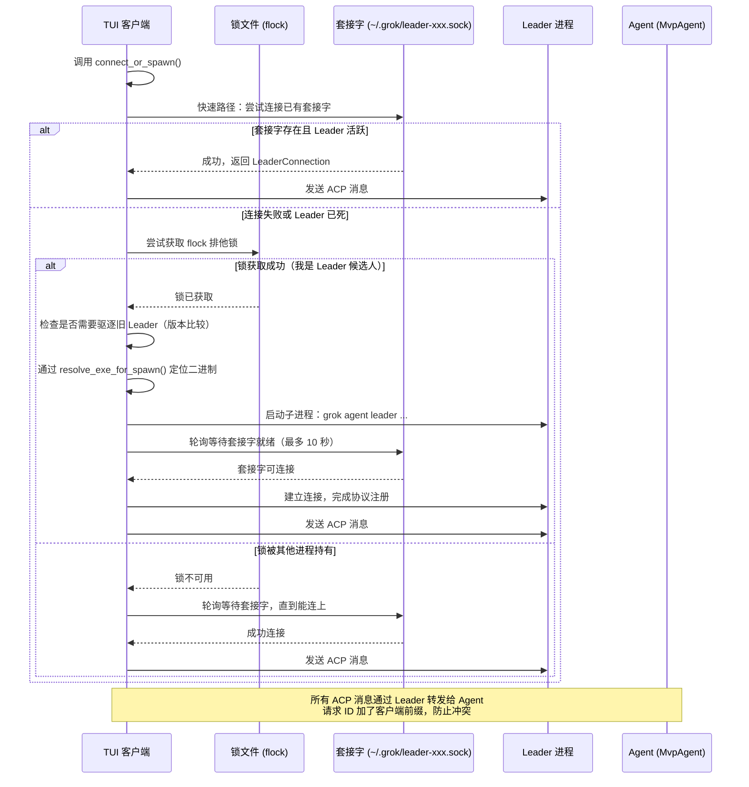
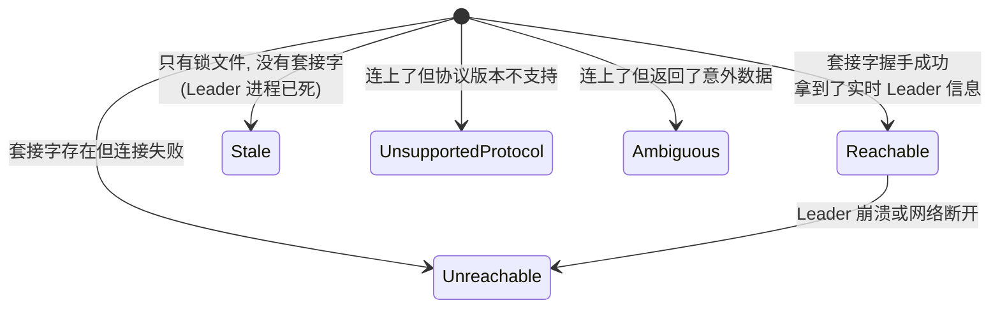
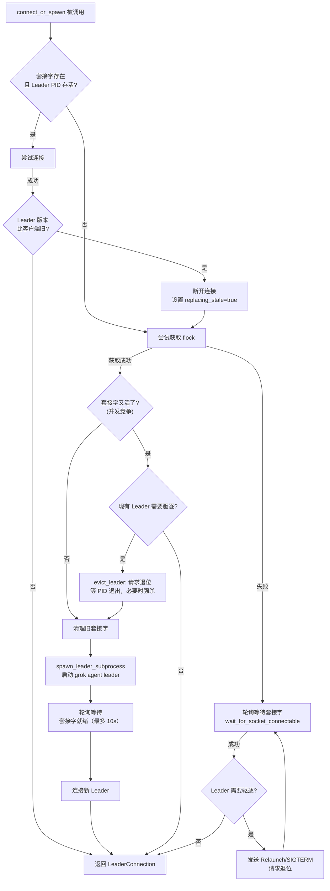
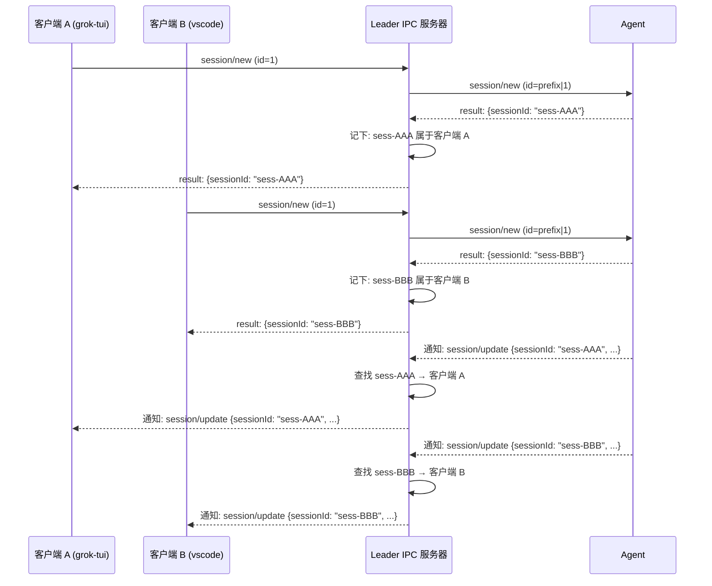

[← 返回首页](index.md)

# Leader 选举：多实例协作

你有没有遇到过这种情况：在终端开了两个 Grok，又在 VS Code 里装了个 Grok 插件，三个窗口同时怼着同一个项目目录——这时候谁负责把 AI 的回复写进对话历史？谁负责处理模型切换？如果三个进程各写各的，聊天记录就乱了套。

Leader 选举就是为了解决这个问题。它的核心逻辑很简单：**同一台机器上，同一个工作区只允许一个 Leader 进程**。Leader 是唯一有资格写入对话历史和 Agent 状态的那个；其他进程（我们叫它"客户端"）想跟 AI 对话，必须通过 IPC 把请求转发给 Leader，再由 Leader 统一处理。

整个过程收敛到最新版本：如果 Leader 是从旧版本二进制（比如 0.1.100）启动的，而你刚更新到 0.1.200 然后打开了 Grok，新客户端会自动让旧 Leader 退位，然后自己顶上——方向永远是 **新版本替换旧版本**，反过来不会发生，防止来回抢权（我们内部叫 anti-thrash）。

---

## 架构总览：Leader 和客户端的物理关系

别被代码吓到，物理上就三样东西——一个 Leader 进程、一堆客户端进程、以及一把进程锁。架构注释图就写在了 `crates/codegen/xai-grok-shell/src/leader/mod.rs` 头部，我翻译成人话：

```text
┌──────────────────────────────────┐
│          Leader 进程              │
│  ┌────────────────────────────┐  │
│  │    Agent (MvpAgent)        │  │  ← 唯一的读写权限
│  │    - 所有客户端共享的状态    │  │
│  │    - 持久化到 ~/.grok/      │  │
│  └────────────────────────────┘  │
│               ▲                   │
│               │ ACP 协议           │
│  ┌────────────┴───────────────┐  │
│  │  IPC Server (Unix 域套接字) │  │
│  │  - 在客户端和 Agent 之间转发 │  │
│  │  - 给请求 ID 加命名空间前缀  │  │  ← 防止多客户端 ID 冲突
│  └────────────┬───────────────┘  │
└───────────────┼─────────────────┘
                │ Unix 域套接字
                │ (~/.grok/leader-xxx.sock)
    ┌───────────┼───────────┐
    ▼           ▼           ▼
┌────────┐  ┌────────┐  ┌──────────┐
│  TUI   │  │  IDE   │  │ Headless │
│ 客户端  │  │ 扩展   │  │    CLI   │
└────────┘  └────────┘  └──────────┘
```

通信走的是 Unix 域套接字（如果读者用的是 Windows，也有对应的管道实现，不过核心逻辑一样），文件放在 `~/.grok/` 目录下，文件名格式固定为 `leader{suffix}.sock`。比如生产环境套接字路径是 `~/.grok/leader.sock`，开发环境是 `~/.grok/leader-dev.sock`。对应的进程锁文件叫 `leader{suffix}.lock`，用 flock 做互斥——谁抢到锁，谁就有资格启动 Leader。

---

## 从发现到连接：完整的时序图

把上面那张静态结构图变成一次真正的连接过程，大概是这样的：



---

## 关键数据结构：发现、目标与邻居

整个 Leader 模块的工作可以分为三步：**发现已有的 Leader → 确定当前应该连哪个 → 连接或自己启动**。每一步对应一套核心类型。

### 1. 发现：LeaderDescriptor

函数 `discover_leaders()` 扫描 `~/.grok/` 目录，把看到的 `.lock` 和 `.sock` 文件配对，然后和活着的 Leader 套接字握手，生成一个 `LeaderDescriptor`。这个结构体定义在 `crates/codegen/xai-grok-shell/src/leader/mod.rs`：

```rust
#[derive(Debug, Clone, PartialEq, Eq)]
pub struct LeaderDescriptor {
    pub pid_from_lock: Option<u32>,       // 锁文件里记录的 PID（可能已死）
    pub lock_path: Option<PathBuf>,        // 锁文件路径
    pub socket_path: Option<PathBuf>,      // 套接字路径
    pub ws_url_suffix: String,             // WebSocket URL 后缀（区分环境）
    pub classification: LeaderDiscoveryState, // 状态分类（见下文）
    pub environment: Option<GrokBuildEnvironment>, // 推断出的运行环境
    pub live_info: Option<LiveLeaderInfo>, // 从活着的 Leader 拿到的实时信息
    pub target_error: Option<LeaderTargetErrorCode>, // 无法连接的诊断信息
}
```

每个 `LeaderDescriptor` 的核心字段是 `classification`，它是一个枚举：



只有 `Reachable` 状态的 Leader 才有资格被选中为连接目标。

### 2. 确定目标：LeaderTarget 和 resolve_leader_target()

你知道自己要到哪个环境去（生产还是开发），但不知道 Leader 的套接字路径。`LeaderTarget` 就是用来精确描述目标的：

```rust
pub enum LeaderTarget {
    Environment(GrokBuildEnvironment),  // 按环境找（Production / Staging 等）
    WsUrl(String),                      // 按具体的 WebSocket URL 找
    Pid(u32),                           // 按 PID 精确匹配
}
```

`resolve_leader_target()` 把你给的 `LeaderTarget` 和 `discover_leaders()` 的发现结果做匹配：

- 如果是 `Environment` 或 `WsUrl`，筛选出 `ws_url_suffix` 和 `environment` 匹配的 Leader；
- 在匹配结果中，优先选 `Reachable` 的；
- 如果只有一个匹配 → 直接返回；多个匹配 → 报 `AmbiguousTarget` 错误；
- 如果是 `Pid`，要求锁文件的 PID 和活 Leader 的 PID 一致，否则报 `PidVerificationFailed`。

### 3. 客户端视角：LeaderClient 和 LeaderConnection

对于上层调用者（TUI、IDE 扩展等），最常见的入口是 `connect_or_spawn()`。它的签名在 `crates/codegen/xai-grok-shell/src/leader/mod.rs`：

```rust
pub async fn connect_or_spawn(
    client_type: &str,          // 例如 "grok-tui"、"vscode"
    mode: ClientMode,           // Stdio 或 Headless
    env_urls: &LeaderEnvUrls,   // WebSocket URL 等环境变量
    capabilities: ClientCapabilities, // 客户端能力（yolo_mode 等）
) -> Result<LeaderConnection, ConnectionError>
```

返回值 `LeaderConnection` 是对 `LeaderClient` 的简单包装，提供 `send()`、`recv()`、`send_control()` 三个方法。内部就是用 `mpsc::unbounded_channel` 把消息发给 Leader 的 IPC 服务器。

---

## 一次性讲清楚：connect_or_spawn 的决策树

上面这张时序图只画了"正常情况"的一次流程，实际上 `connect_or_spawn()` 有三个关键决策分支，需要在脑子里先有这张状态图：



这里有个重要的细节：版本驱逐是**单向的**。`should_evict()` 在 `mod.rs` 中的实现：

```rust
fn should_evict(leader_version: Option<&str>, client_version: &str) -> bool {
    leader_version.is_some_and(|v| leader_is_older_than(v, client_version))
}
```

只有当 Leader 的解析出来的 semver **严格小于**客户端的版本时，驱逐才会发生。如果你的客户端版本是 `"unknown"`（开发编译），就永远不会驱逐任何人——避免开发机和线上版本打架。

---

## 多客户端消息路由：ID 命名空间与会话归属

当一个 Leader 背后挂着一堆客户端时，消息怎么不乱套？靠两样东西：

### 1. 请求 ID 命名空间

每个客户端在注册时拿到一个数字 `ClientId`。客户端发来的 JSON-RPC 请求里的 `id` 字段，在转发给 Agent 之前会被重写为 `"{ClientId}|{原始id}"` 格式。Agent 回复时原样把重写后的 ID 带回来，Leader 再反向解析出原始 ID 和目标客户端。

单元测试 `test_multiple_clients_same_message_ids`（位于 `crates/codegen/xai-grok-shell/tests/test_leader_stdio_integration.rs`）验证了这个场景：三个客户端同时发 `"id":1` 的请求，Leader 给每个请求的 ID 加上不同的前缀（用 `|` 分隔符），Agent 返回后 Leader 再把 ID 还原成 `1`，各自投递到正确的客户端。说白了就是：**用管道分隔符给每个客户端开了一个独立的 ID 空间**。

### 2. 会话归属

有些消息没有 `id` 字段——比如 Server-Sent Events 格式的通知和 Agent 推送的模型切换事件——于是没法靠请求 ID 路由。Leader 的解决方案是**持续跟踪会话归属**：当 Agent 返回一个 `session/new` 的结果，Leader 会解析出 `result.sessionId`，然后把 `"这个 session 属于客户端 X"` 记下来。

之后的推送（比如 `session/update`）只需要在参数里带上 `sessionId`，Leader 就能找到对应的客户端：



测试 `test_session_ownership_from_response_routes_notifications` 和 `test_two_clients_session_isolation` 都在 `test_leader_stdio_integration.rs` 里有完整覆盖。

---

## 客户端注册时的能力注入

客户端连接 Leader 时会带上一个 `ClientCapabilities`：

```rust
pub struct ClientCapabilities {
    pub yolo_mode: bool,            // AI 是否可以自动执行高风险操作
    pub default_model: Option<String>, // 默认模型，如 "grok-3-fast"
    pub code_nav_enabled: bool,     // 是否支持代码导航
    pub client_version: Option<String>, // 客户端版本（用于版本不匹配检测）
    // ... 还有更多字段
}
```

Leader 在转发客户端的第一个 `session/new` 请求时，会把 `yolo_mode`、`default_model`、`code_nav_enabled` 注入到 `params._meta` 里。这几个测试分别验证了：

- `test_session_new_without_model_id_no_default`：没有 default_model 时不会注入 modelId
- `test_code_nav_capable_client_gets_true_injected_into_session_new`：声明了 code_nav_enabled=true 的 web 客户端，在 session/new 中收到 `codeNavEnabled: true`
- `test_yolo_mode_injection_preserves_explicit_false`：即使客户端默认 yolo_mode=true，如果请求中显式传了 `_meta.yoloMode: false`，以请求为准

注入**只发生在 `session/new` 和 `session/load`**，不会污染其他方法（`test_capabilities_not_injected_into_non_session_new` 验证了这一点）。

---

## 版本驱逐与自动退位

当新客户端发现已有 Leader 的版本比自己旧时，它会触发驱逐流程。有两种驱赶方式：

1. **优雅退出**：如果旧 Leader 支持 `relaunch` 能力（`leader_capabilities.control_v1` 为真），新客户端会发一个 `RelaunchForUpdate` 控制命令。Leader 收到后设置 `shutdown_tx` 为 `AutoUpdate`，广播 `ShuttingDown` 通知给所有客户端，然后等 Agent 空闲后自动退出。新客户端随后通过 `connect_or_spawn` 重新抢锁并启动。

2. **硬杀**：如果旧 Leader 不支持 `relaunch`，新客户端直接发 SIGTERM 把旧进程杀掉，等最多 8 秒（`EVICT_WAIT_TIMEOUT`），如果还没死就强制 SIGKILL。

测试 `test_relaunch_for_update_accepts_and_shuts_down` 验证了优雅退出路径：Leader 在收到 `RelaunchForUpdate` 后，调用 `shutting_down_reason()` 的客户端可以观察到 `Some(AutoUpdate)`，于是客户端可以主动重连。

---

## 启动就绪门：防止 Leader 还没准备好就收消息

Leader 子进程启动时，里面有几件事比较慢——认证、拉取工作区数据等。如果 Leader 一启动就对外接受连接，客户端发的第一个 `initialize` 请求可能因为在 Leader 内部被排队而报错。

Leader 的解决方案是引入了**启动就绪门**：

```rust
// 在 run_leader_server 内部
let (ready_tx, ready_rx) = watch::channel(false); // 初始不就绪
// ... Auth 和 prefetch 完成后
ready_tx.send(true).unwrap(); // 信号：现在就绪
```

客户端这边，`LeaderClient::connect()` 在收到 `ServerMessage::Registered { ready: false }` 后会阻塞，直到收到 `ServerMessage::LeaderReady` 才返回。测试 `test_connect_waits_for_leader_ready`（也在 `test_leader_stdio_integration.rs`）精确验证了这一点：设置了 150ms 的延迟后再发就绪信号，connect 调用花费的时间必须 ≥ 150ms。

---

## Reconnector：自动重连的引擎

网络断了、Leader 崩了、或者 Leader 因为自动更新重启——对于 TUI 客户端来说，不能每次都让用户手动重连。`LeaderReconnector` 负责这件事：

```rust
pub struct LeaderReconnector {
    client_type: String,
    mode: ClientMode,
    env_urls: LeaderEnvUrls,
    capabilities: ClientCapabilities,
    status_tx: watch::Sender<ConnectionStatus>,
    next_generation: AtomicU64,
}
```

重连策略分两种：

- `ReconnectPolicy::Unbounded`：无限重试（TUI 用），直到用户主动取消
- `ReconnectPolicy::Bounded { max_attempts }`：只试 N 次（headless 模式用，默认 5 次）

退避时间是指数级的：1s → 2s → 4s → … → 最多 30s。

重连成功后，`LeaderReconnector` 不会自动发送 `ConnectionStatus::Connected`——必须先让调用方把旧通道替换成新通道，然后显式调用 `notify_connected()`。这就防止了观察者在通道还没换完时就往死通道里发消息的竞态条件。

测试 `reconnect_with_does_not_publish_connected_before_swap` 验证了这个设计：`reconnect_with` 成功后 `ConnectionStatus` 仍是 `Reconnecting`，直到 `notify_connected()` 被调用才变成 `Connected { generation: 1 }`。

---

## 二进制定位：Leader 子进程从哪启动

正常用户不会手动启动 `grok agent leader`——是 `connect_or_spawn()` 帮他们启动的。但启动哪个二进制是个讲究：如果你刚通过自动更新升了级，`current_exe()` 可能还指向旧二进制（Linux 上 `/proc/self/exe` 是符号链接，更新后旧的可执行文件可能已经被替换或移动）。

解决办法是 `resolve_exe_for_spawn()`（`crates/codegen/xai-grok-shell/src/leader/mod.rs`）：

```rust
fn resolve_exe_for_spawn() -> Result<PathBuf, ConnectionError> {
    // 如果当前二进制的路径在 ~/.grok/ 下（托管安装），
    // 优先用 ~/.grok/bin/grok （更新时原子替换的符号链接）
    // 否则用 std::env::current_exe()
    // 兜底：~/.grok/bin/grok
}
```

子进程参数固定为：

```
grok agent leader --no-exit-on-disconnect --relay-on-demand \
    --grok-ws-url <url> --grok-ws-origin <origin>
```

stdout 和 stdin 重定向到 `/dev/null`，stderr 重定向到 `~/.grok/leader.log`。

---

## 与其它系统的关系

- **Agent 通信协议**：Leader 和客户端之间走的是自定义的 JSON-RPC 风格协议（`ServerMessage` / `ClientMessage` 枚举），Leader 和 Agent 之间走的是 ACP（[详见《Agent Client Protocol：与编辑器通信》](27-acp-protocol.md)）。
- **配置体系**：Leader 模式可以通过配置文件或策略完全禁用（`leader.enabled = false`），禁用后所有客户端独立运行（[详见《配置体系：三层优先级合并》](28-config-system.md)）。
- **自动更新**：`RelaunchForUpdate` 信号最终由自动更新子系统消费——下载新二进制后，由它发控制命令让 Leader 优雅重启（[详见《自动更新子系统》](33-update-autoupdate.md)）。
- **会话管理**：Leader 模式下，会话持久化、压缩、回退都在 Leader 内部完成，客户端完全不关心这些（[详见《会话管理：从出生到归档》](06-session-lifecycle.md)）。

---

## 小测验

看完这一页，你应该能回答这几个问题：

1. **两个 Grok TUI 同时按回车发消息，Agent 怎么知道哪个回复给哪个窗口？**  
   答：靠 Leader 在转发请求时给 JSON-RPC 的 `id` 字段加前缀（`ClientId|原始id`），回复时再解析回来。

2. **为什么 `connect_or_spawn` 有时候会等很久？**  
   答：可能是因为 Leader 子进程正在启动（Auth + 预取数据），客户端卡在 `LeaderClient::connect()` 里，等 `LeaderReady` 信号。最多等 10 秒（`SPAWN_WAIT_TIMEOUT`）。

3. **版本不匹配时谁会退位？**  
   答：只有旧版本退位——`should_evict()` 要求 Leader 的 semver 严格小于客户端版本。新版杀旧版，旧版绝对不会杀新版。`"unknown"` 版本永远安全。
