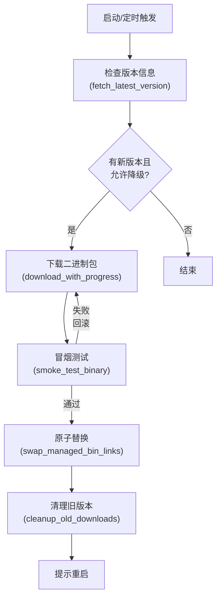
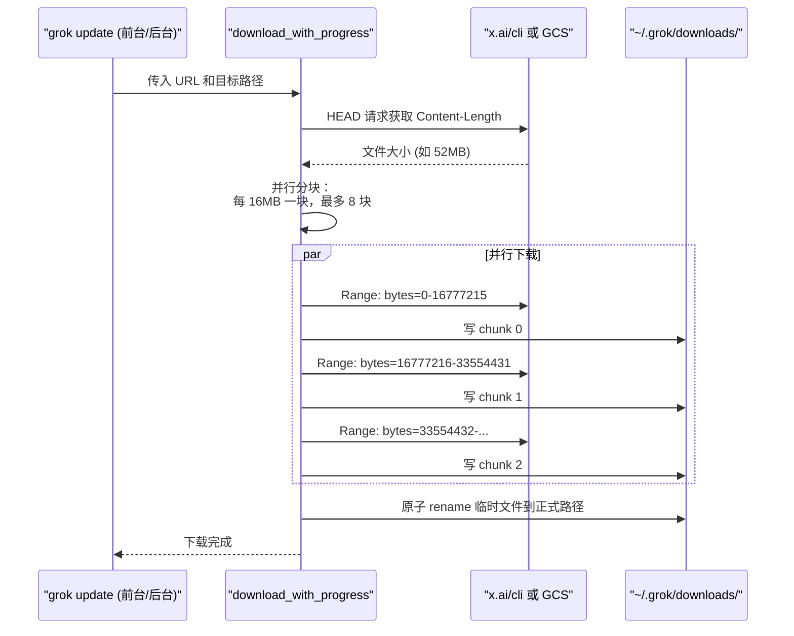
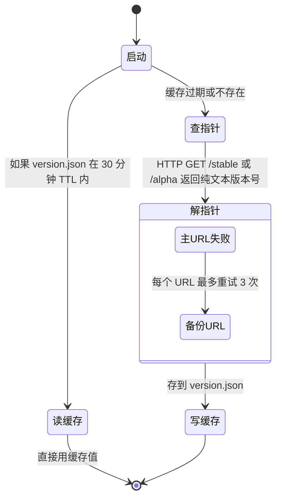
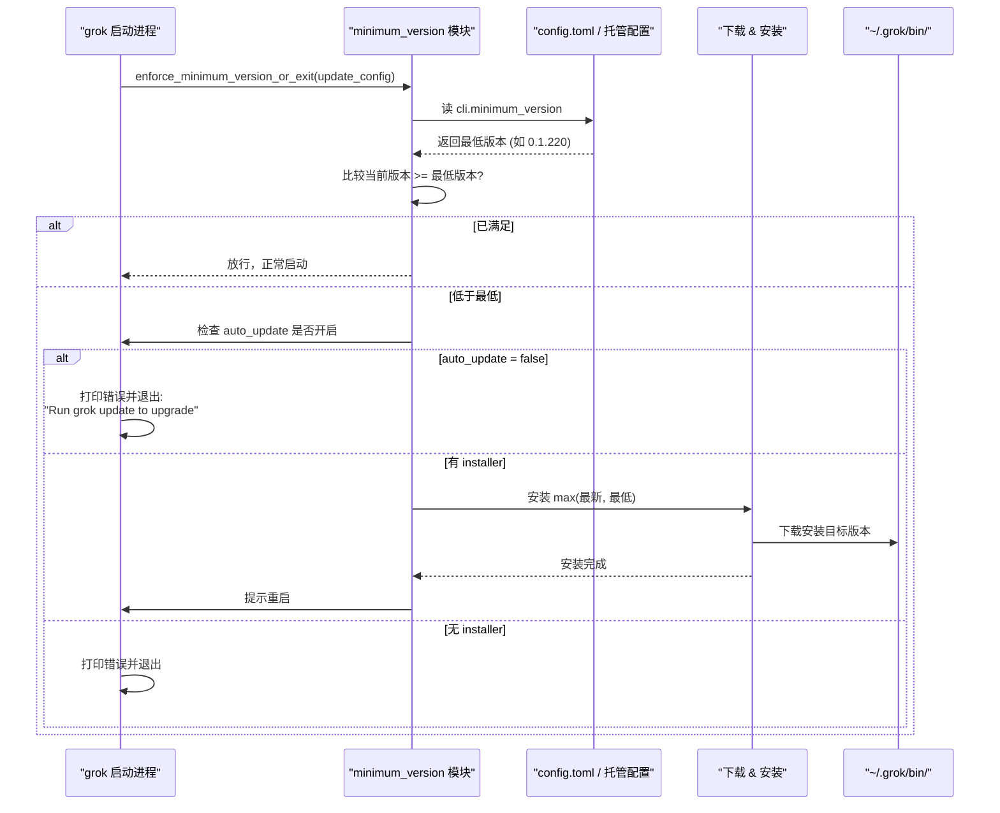

[← 返回首页](index.md)

# 自动更新子系统

Grok Build 不会让你手工下载新版本。它像手机 App 一样，在后台自己检查、下载、验证、安装，然后提示你重启。整个过程你几乎感知不到，除非你主动敲 `grok update` 去看眼进度。

## 整体架构：一条更新流水线

把自动更新想象成快递公司处理包裹的流水线：从仓库取货（查询新版本）、验货（SHA256 校验）、拆包签收（安装到本地），最后通知客户取件（重启应用）。每一步都有针对平台差异和失败回滚的策略。



这张图里每一步在 `crates/codegen/xai-grok-update/src/auto_update.rs` 都有对应函数，行文里会逐个讲到。

## 版本信息检查：去哪里看有没有新版本

升级前得先知道最新版本是多少。这一步叫“版本检查”，由 `fetch_latest_version` 统一入口，根据安装方式分发到不同后端。

### 三种安装器的版本来源

Grok 知道你当初是通过哪个渠道安装的。这个渠道叫“安装器”（Installer），存在环境变量或 `config.toml` 里。`crates/codegen/xai-grok-update/src/auto_update.rs` 的 `get_installer()` 函数负责判断当前是什么安装器：

```rust
pub async fn get_installer() -> Option<&'static str> {
    // 先检查环境变量
    if let Some(i) = env_installer() {
        return Some(i);
    }
    // 再读配置文件
    let cfg = config::load_config().await;
    match cfg.cli.installer.as_deref() {
        Some("npm") => Some("npm"),
        Some("gh-release") => Some("gh-release"),
        _ => Some("internal"),
    }
}
```

三种安装器对应三种版本查询方式，在 `crates/codegen/xai-grok-update/src/version.rs` 里实现：

| 安装器 | 识别方式 | 版本来源 | 核心函数 |
|--------|---------|---------|---------|
| `npm` | 环境变量 `GROK_MANAGED_BY_NPM` 或 `npm_config_user_agent` | `npm view` 命令查 dist-tag（`@latest` 或 `@alpha`） | `fetch_npm_version()` |
| `gh-release` | 环境变量 `GROK_INSTALLER=gh-release` | `gh release list` 命令查 GitHub Releases | `fetch_gh_release_version()` |
| `internal` | 默认，或 `GROK_MANAGED_BY_INTERNAL` | 从 GCS/Cloudflare 的纯文本“频道指针”读版本号 | `fetch_gcs_version()` |

### 频道指针：一个 URL 就是一个版本号

`internal` 安装器用的是一种关键设计：**频道指针**。它不是复杂的 JSON 接口，而是一个普通的 HTTP URL，返回的内容就是纯文本的版本号，比如 `0.1.220`。

`crates/codegen/xai-grok-update/src/version.rs` 里定义了主备份两个 URL：

```rust
pub(crate) const CLI_BASE_URL_PRIMARY: &str = "https://x.ai/cli";
pub(crate) const CLI_BASE_URL_FALLBACK: &str =
    "https://storage.googleapis.com/grok-build-public-artifacts/cli";
pub(crate) const CLI_BASE_URLS: &[&str] = &[CLI_BASE_URL_PRIMARY, CLI_BASE_URL_FALLBACK];
```

查询时拼接成 `https://x.ai/cli/stable` 这样的地址，拿到版本号后进行 semver 解析。如果主 URL 不可达，自动退到备份 URL。

> **alpha 频道的特殊逻辑**：alpha 用户同时查 `alpha` 和 `stable` 两个指针，取 semver 更大的那个。这是为了防止 alpha 频道长期停滞时，用户错过稳定版的安全修复。代码在 `fetch_gcs_version()`：
> 
> ```rust
> if channel == "alpha" {
>     let (alpha_v, stable_v) = tokio::try_join!(
>         fetch_gcs_channel_pointer("alpha", base_url),
>         fetch_gcs_channel_pointer("stable", base_url),
>     )?;
>     return semver_max(&alpha_v, &stable_v);
> }
> ```

### 版本缓存：30 分钟内不重复查

每次查版本都走网络太慢了。`version.rs` 里有个 30 分钟的 TTL 缓存，写到 `~/.grok/version.json`：

```rust
const TTL_SECONDS_BEFORE_AUTO_UPDATE: Duration = Duration::from_secs(60 * 30);
```

`is_version_cache_fresh()` 读这个文件，如果时间戳在 TTL 之内就跳过网络请求。缓存里除了当前版本，还会附一个 `stable_version` 字段——这是用来算频道标签的（`[alpha]` 还是 `[stable]`），后面会讲到。

## 下载阶段：并行分块 + 断点续传

确定新版本号后，开始下载二进制文件。核心函数是 `download_with_progress`（带进度条）和 `download_silent`（不带进度条），都在 `crates/codegen/xai-grok-update/src/auto_update.rs`。



### 并行下载：大文件不再傻等

如果服务器支持 `Content-Length` 且文件超过 16MB，下载器会自动切成多个块并行拉取。代码在 `try_parallel_download()`：

```rust
const PARALLEL_DOWNLOAD_MIN_BYTES: u64 = 16 * 1024 * 1024;
fn parallel_chunk_count(size: u64) -> u64 {
    let size_mb = size / (1024 * 1024);
    (size_mb / 16).clamp(1, 8)
}
```

22MB 的文件会切成 2 块同时下载，52MB 的切 4 块。每个块是一个 `Range` 请求，写到预分配的临时文件的不同偏移位置。

### 原子替换：临时文件保护机制

下载时写到一个带 PID 和序列号的临时文件，下载完成后用 `rename` 原子替换到正式路径。这样即使下载中途崩溃，正式文件也不会被破坏。临时文件名规则在 `tmp_download_path()`：

```rust
fn tmp_download_path(dest: &std::path::Path) -> std::path::PathBuf {
    unique_temp_sibling(dest, "tmp")
}
// 生成类似 grok-0.1.220-linux-x86_64.12345-0.tmp 的名字
```

### 进度条：终端里的小动画

下载时终端会出现一个蓝色进度条，显示字节数和预计剩余时间。这是用 `indicatif` 库实现的。如果服务器不返回文件大小，就退化成旋转动画加字节计数。

## 冒烟测试：启动前先试跑

下载完成不代表二进制能用。`auto_update.rs` 里的 `smoke_test_binary()` 在新二进制上执行一次 `grok --version`，验证它不崩溃、不报错：

```rust
async fn smoke_test_binary(binary_path: &std::path::Path) -> bool {
    let mut cmd = tokio::process::Command::new(binary_path);
    cmd.arg("--version")
        .stdin(std::process::Stdio::null())
        .stdout(std::process::Stdio::null())
        .stderr(std::process::Stdio::null());
    // 10 秒超时，避免被挂起的进程卡住
    match tokio::time::timeout(SMOKE_TEST_TIMEOUT, cmd.status()).await {
        Ok(Ok(status)) => status.success(),
        _ => false,
    }
}
```

测试失败会立即删除下载文件，当前运行版本不受影响，错误信息里会给出手动安装的命令。

## 安装激活：把新二进制变成默认入口

下载验证通过后，需要把 `~/.grok/bin/grok` 和 `~/.grok/bin/agent` 这两个入口链接指向新的二进制。这是整个更新流程最关键的一步——必须确保在任何时刻都不会出现“grok 命令找不到可执行文件”的状态。

### 原子符号链接替换

`auto_update.rs` 里的 `atomic_symlink_swap()` 是核心。它不走“删除旧链接 → 创建新链接”的两步操作，而是创建一个带 `.tmp-link` 后缀的新链接，然后直接 `rename` 盖过去：

```rust
#[cfg(unix)]
async fn atomic_symlink_swap(target: &std::path::Path, link_path: &std::path::Path) -> Result<()> {
    sweep_stale_tmp_links(link_path, STALE_TMP_AGE).await;
    let tmp_link = unique_temp_sibling(link_path, "tmp-link");
    let _ = tokio::fs::remove_file(&tmp_link).await;
    tokio::fs::symlink(target, &tmp_link).await?;
    tokio::fs::rename(&tmp_link, link_path).await?;
    Ok(())
}
```

`rename` 是一个**原子操作**——要么成功、要么保持原样，不存在中间状态。这对 macOS 尤其重要：旧二进制被 mmap 到了运行中的进程内存里，如果直接删除旧文件，内核会 SIGKILL 还在运行的进程（因为代码签名无法验证）。`rename` 只替换目录项，旧文件节点依然存在，运行中的进程不受影响。

### 全部或全不：两个入口一起换

`swap_managed_bin_links()` 同时替换 `grok` 和 `agent` 两个入口。每个入口都会先做一个“快照”，记录替换前的状态：

```rust
enum LinkRollback {
    Absent { link_path: std::path::PathBuf },     // 以前不存在
    Present {                                      // 以前存在
        link_path: std::path::PathBuf,
        prior_target: std::path::PathBuf,          // Unix：旧目标
        backup_path: std::path::PathBuf,            // Windows：备份文件
    },
}
```

如果第二个入口替换失败，第一个已替换的会被自动回滚到快照状态。同时清理临时文件和 Windows 的 `.rollback.bak` 备份。

### Windows 特殊处理：运行中的 exe 被锁定

在 Windows 上，正在运行的 `.exe` 文件被内核锁定，不能直接覆盖。`windows_replace_exe()` 的策略是把旧文件 `rename` 到 `.old` 文件，再把新文件拷贝进去。如果连 `rename` 都失败（因为 `.old` 文件也被另一个进程锁定），它会生成一个带唯一后缀的 `.old` 文件名重试。

## 触发时机：后台静默 vs 前台交互

更新不是只在一个地方触发。`auto_update.rs` 里暴露了多个入口，各自对应不同场景。

### 前台更新：`grok update` 命令

用户主动敲 `grok update` 时走 `run_update()` 函数。它执行完整的“查版本 → 下载 → 安装 → 提示重启”流程。用户可以通过 `--version` 精准指定版本、用 `--stable` 或 `--alpha` 切换频道。

### 后台自动检查：启动时静默进行

TUI 启动时会调用 `check_update_background()`，做一次非阻塞检查：

```rust
pub async fn check_update_background(update_config: &UpdateConfig) -> BackgroundUpdateCheck {
    // 1. 检查版本缓存，如果还在 30 分钟 TTL 内就直接返回
    // 2. 如果用户关闭了 auto_update，不检查
    // 3. 查最新版本，有更新时计算是否需要下载
    // 4. 如果磁盘上还没有目标版本，启动子进程 `grok update` 后台下载
    // 5. 返回 BackgroundUpdateCheck { update, download }
}
```

TUI 拿到这个结果后，如果 `update` 有值就会在界面上显示“有新版本可用，重启后生效”，如果 `download` 有值还会在退出时等待下载完成。

### 定时检查：Leader 进程每小时一次

这是专门针对 Leader 进程的设计——负责文件操作的那个主进程。代码在 `ensure_latest_on_disk()`：

```rust
pub async fn ensure_latest_on_disk(update_config: &UpdateConfig) -> Result<EnsureLatestOutcome> {
    // 1. 先查磁盘上已有的版本（不只看自己跑的这个进程的版本）
    // 2. 如果磁盘版本已经最新，不下载
    // 3. 如果磁盘落后，下载安装
    // 4. 返回 { installed, relaunch_needed }
}
```

这解决了一个问题：后台 TUI 下载了新版，但 Leader 进程还不知道，会一直跑旧版本。通过检查 `~/.grok/bin/grok` 链接指向的真实文件版本，Leader 能发现“磁盘上已经有新版本了”，然后通知调用方重启。

## 频道管理：stable、alpha 与渠道切换

版本频道机制让不同风险偏好的用户吃不同的“狗粮”。

### 频道指针的运作方式



### 频道标签显示

`version.rs` 里的 `channel_label()` 通过比较“当前运行版本”和“缓存的稳定版指针”来判断当前在哪个频道。如果 `当前版本 > stable`，就显示 `[alpha]`，否则显示 `[stable]`。

```rust
fn derive_channel<'a>(current: &str, stable: &str) -> Option<&'a str> {
    let current_v = semver::Version::parse(current).ok()?;
    let stable_v = semver::Version::parse(stable).ok()?;
    if current_v > stable_v {
        Some("alpha")
    } else {
        Some("stable")
    }
}
```

> 这个标签是纯显示用的，让用户知道自己在用什么频道——它直接出现在命令输出里，比如 `Grok Build - v0.1.220 [alpha]`。

### 切换频道

`apply_channel_switch()` 处理 `--stable` 和 `--alpha` 参数，更新 `config.toml`，然后在下一次更新时生效。切换后不会立刻降级当前版本——只影响下次 `grok update` 拉取的指针。

## 最低版本阻断：服务端强制更新

有时候服务端需要“杀死”太旧的客户端——比如某个旧版本有安全漏洞，或者 API 协议已经改了。这种情况下，IT 管理员或服务端会下发一个 `cli.minimum_version` 配置。

### 阻断流程



### 实现要点

`minimum_version.rs` 里 `enforce_minimum_version_or_exit()` 函数是唯一的入口，被 pager 和 TUI 启动路径调用。它做了这几件事：

1. 从配置里读取 `cli.minimum_version`，支持三层优先级合并（[详见《配置体系：三层优先级合并》](28-config-system.md)）
2. 调用 `evaluate_minimum_version()` 比较当前版本和最低版本：
   ```rust
   fn evaluate_minimum_version(
       current_version: &str,
       minimum_version: Option<&str>,
   ) -> Result<MinimumVersionDecision, MinimumVersionError>
   ```
3. 如果低于最低版本且 `auto_update` 没被禁用，尝试安装 `max(latest, minimum)`——即选“最新发布版本”和“最低要求版本”里更大的那个
4. 安装完成后再次检查：如果磁盘上的版本仍低于最低要求，报 `NoSatisfyingVersion` 错误退出

> 这里有个细节：`evaluate_minimum_version` 对“当前版本无法解析”的情况**也视为不满足**。这是故意设计——一个无法识别版本号的开发构建不能绕过管理员设定的版本底线。

## 安全细节：删除文件会 crash，所以我们不删

整个更新流程里，**旧二进制文件从不被删除**。

`atomic_symlink_swap()` 替换的是符号链接，不是文件节点。`cleanup_old_downloads()` 清理旧版本时，也会保留当前版本和最近一个旧版本（`current + 1`），代码注释直接说清了原因：

> `Keeps the current version plus one previous version (in case a process is still running the old binary and hasn't fully loaded all pages yet — deleting it on macOS causes SIGKILL because the kernel can no longer verify the code signature).`

macOS 的代码签名验证机制会在进程执行时持续检查 mmap 的每一页——如果文件节点被删除，内核无法验证签名，直接 SIGKILL 整个进程。所以旧文件只会在确认没有进程使用后（通过年龄判断）被清理。

## 与其它系统的衔接

- 更新下载的二进制是 npm 包的一部分，具体分发机制看 [详见《npm 二进制分发机制》](34-npm-distribution.md)
- 配置里的 `cli.auto_update`、`cli.installer`、`cli.minimum_version` 怎么从三层优先级里取到，看 [详见《配置体系：三层优先级合并》](28-config-system.md)
- 更新相关的遥测事件（如更新检查、下载失败）的上报，看 [详见《遥测与可观测性》](29-telemetry.md)
