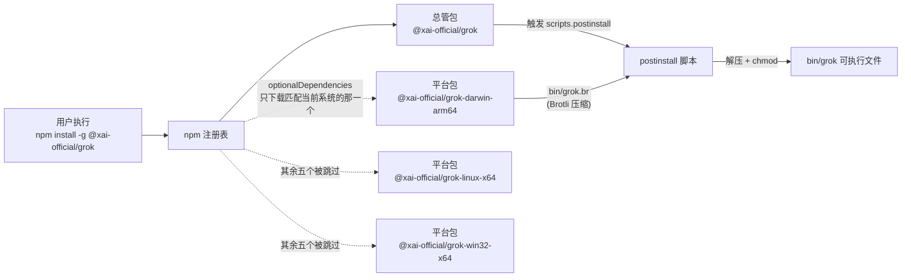
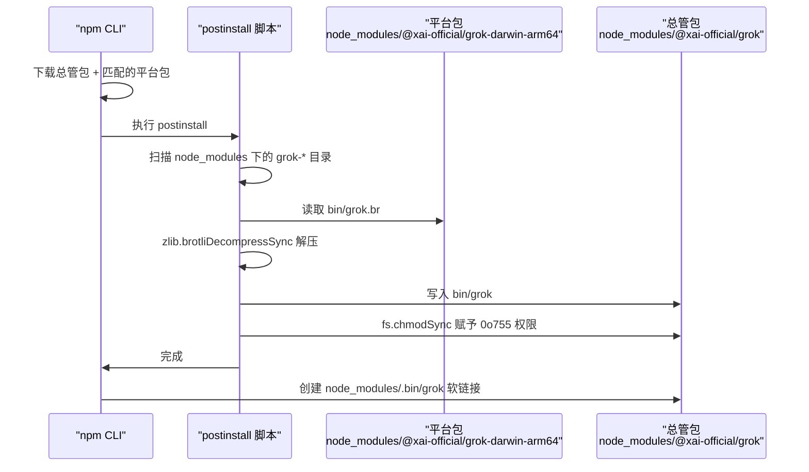
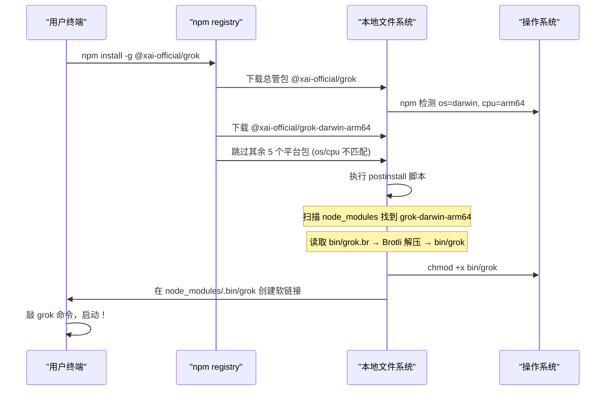

[← 返回首页](index.md)

# npm 二进制分发机制

## 这套机制解决什么问题

Grok 是一个用 Rust 写的命令行工具，编译出来就是一个独立的二进制文件。但问题来了：每个用户的操作系统和 CPU 架构不一样——macOS ARM（M1/M2/M3 芯片）、macOS Intel、Linux x64、Windows ARM……每个平台都需要一个不同的二进制。

如果让用户自己下载然后放到 PATH 里，光"选哪个文件"就能劝退一半人。这套 npm 分发机制就是为了做到一句 `npm install` 搞定一切——跟装一个普通 npm 包一模一样，背后自动完成平台检测、下载解压、权限设置。

## 三样东西，一台戏

整个分发方案就靠三种 npm 包打配合。先看一张全景图，然后我们逐个拆解。



- **总管包**（`@xai-official/grok`）：用户直接安装的就是这个。它本身不包含任何二进制文件，只负责两件事——声明六个"可选的"平台依赖，以及在安装后运行一个组装脚本。
- **平台包**（`@xai-official/grok-{os}-{arch}`）：一共六个，每个只包含一个平台的原生二进制，用 Brotli 压缩后放在 `bin/` 目录下。
- **postinstall 脚本**：npm 在安装完所有依赖后自动执行的一段 Node.js 代码，负责找到那个被下载的平台包，把二进制解压、改名、赋予执行权限，最后放到总管包的 `bin/` 目录。

## 总管包：声明依赖，不持有二进制

打开总管包的 `package.json`（`crates/codegen/xai-grok-pager/npm/grok/package.json`），一眼就能看懂它的套路：

```json
{
    "name": "@xai-official/grok",
    "bin": {
        "grok": "bin/grok"
    },
    "scripts": {
        "postinstall": "node bin/postinstall.js"
    },
    "optionalDependencies": {
        "@xai-official/grok-darwin-arm64": "0.1.220-alpha.4",
        "@xai-official/grok-darwin-x64": "0.1.220-alpha.4",
        "@xai-official/grok-linux-arm64": "0.1.220-alpha.4",
        "@xai-official/grok-linux-x64": "0.1.220-alpha.4",
        "@xai-official/grok-win32-arm64": "0.1.220-alpha.4",
        "@xai-official/grok-win32-x64": "0.1.220-alpha.4"
    }
}
```

关键点在 `optionalDependencies`。这是 npm 的一个特殊字段，跟普通的 `dependencies` 不同——如果某一个 optional 包装不上，npm 不会报错，只会安静跳过。六个平台包的 `package.json` 里都声明了 `"os"` 和 `"cpu"` 过滤条件（比如 `grok-darwin-arm64` 声明 `"os": ["darwin"]`、`"cpu": ["arm64"]`），npm 在安装时会自动比对当前系统。结果就是：**六个包里只有一个能匹配上并下载，其余五个被当空气。**

用 `optionalDependencies` 而不是 `dependencies` 的原因是：如果用了 `dependencies`，npm 会尝试把所有六个都下载下来，但其中五个会因为 os/cpu 不匹配而安装失败，最终整个安装报错。`optionalDependencies` 允许它们静默失败——这正是我们想要的。

## 平台包：只装一个压缩二进制

每个平台包的结构极其简单。以 `grok-darwin-arm64` 为例（`crates/codegen/xai-grok-pager/npm/grok-darwin-arm64/package.json`）：

```json
{
    "name": "@xai-official/grok-darwin-arm64",
    "description": "darwin-arm64 binary for @xai-official/grok. Do not install directly; install @xai-official/grok instead.",
    "files": [
        "bin/",
        "THIRD_PARTY_NOTICES.md"
    ],
    "os": ["darwin"],
    "cpu": ["arm64"]
}
```

`"files": ["bin/"]` 告诉 npm 发布时只打包 `bin/` 目录。这个目录里就一个文件：`grok.br`——原始 Rust 二进制（100~150 MB）经过 Brotli 压缩后的产物（30~40 MB）。

**为什么是 Brotli 而不是 gzip？** `assemble-platform-packages.js` 的头部注释说得很直白：npm 单个包的 tarball 上限约 200 MB，原始二进制每个平台 100~150 MB，gzip 压下来还有 70~90 MB，六个包一起发会有点悬。Brotli 最高压缩级别能压到 30~40 MB，给后续二进制体积增长留出了足够余地。而且 Node.js 内置的 `zlib.brotliDecompressSync` 就能解压，不引入任何原生依赖。

## postinstall 脚本：组装流水线

这是整套机制的大脑。总管包的 `postinstall` 指向 `bin/postinstall.js`（实际文件位于 `crates/codegen/xai-grok-pager/npm/grok/scripts/assemble-platform-packages.js`——从路径看这两个应该是同一份脚本，postinstall.js 可能是软链接或构建时拷贝过去的）。

脚本做的事可以概括成下面这张时序图：



实际代码中的目录扫描逻辑大致是：

```javascript
// assemble-platform-packages.js 的核心打包逻辑（npm publish 前用）
// postinstall 阶段运行的是 bin/postinstall.js，逻辑类似但方向相反
const targets = [
    {
        platform: 'darwin', arch: 'arm64', binName: 'grok',
        envVar: 'GROK_DARWIN_ARM64',
        defaultSource: path.join(xaiRoot, 'target', 'release', 'xai-grok-pager'),
    },
    {
        platform: 'linux', arch: 'x64', binName: 'grok',
        envVar: 'GROK_LINUX_X64',
        defaultSource: path.join(xaiRoot, 'target',
            'explorer_cross_x86_64-unknown-linux-gnu',
            'x86_64-unknown-linux-gnu', 'release', 'xai-grok-pager'),
    },
    // ... 其余四个平台
];
```

`packPlatform` 函数对每个目标做三件事：
1. **版本号对齐**：把平台包的 `package.json` 版本改成跟总管包一致
2. **Brotli 压缩**：读原始二进制 → `brotliCompress` 最高质量 → 写入 `bin/grok.br`
3. **拷贝第三方声明**：把 `THIRD_PARTY_NOTICES.md` 复制进平台包

压缩部分的关键代码：

```javascript
const raw = fs.readFileSync(source);
const compressed = await brotliCompress(raw, {
    params: {
        [zlib.constants.BROTLI_PARAM_QUALITY]: zlib.constants.BROTLI_MAX_QUALITY,
    },
});
fs.writeFileSync(outBr, compressed);
console.log(
    `[assemble] grok-${platform}-${arch}@${VERSION}: ` +
    `${(raw.length / 1048576).toFixed(1)} MB -> ${(compressed.length / 1048576).toFixed(1)} MB ` +
    `(${path.relative(npmRoot, outBr)})`
);
```

六个目标用 `Promise.all` 并行处理，充分利用 Node.js 的 libuv 线程池（Brotli 压缩在 worker 线程上跑，可以真正并行）。

## 用户视角：一句命令的完整旅程

用户执行 `npm install -g @xai-official/grok` 时到底发生了什么？让我们跟踪全程：



用户从头到尾只敲了一行命令，完全不用关心自己是 M1 Mac 还是 Intel Linux 服务器。

## 发布前的组装阶段

`assemble-platform-packages.js` 是给 **CI 发布流程**用的，不是给终端用户执行的。它在 `npm publish` 之前运行，负责：
- 从各平台的交叉编译产物目录找到原始二进制
- Brotli 压缩后放到对应平台包的 `bin/` 下
- 统一版本号

源码里通过环境变量灵活定位二进制路径，也给了默认值 fallback 到 cargo 的标准输出目录。这样 CI 里可以指定自定义路径，本地测试时也能直接跑。

## 跨页面导航

这套分发机制是"用户怎么拿到 Grok"的最后一公里。相关主题：
- [《代码仓库导览》](03-repo-tour.md) —— `crates/codegen/xai-grok-pager/npm/` 在整个仓库中的位置
- [《自动更新子系统》](33-update-autoupdate.md) —— 装好之后应用怎么静默升级自己
- [《5 分钟上手》](02-quickstart.md) —— 安装完成后怎么开始第一次对话
