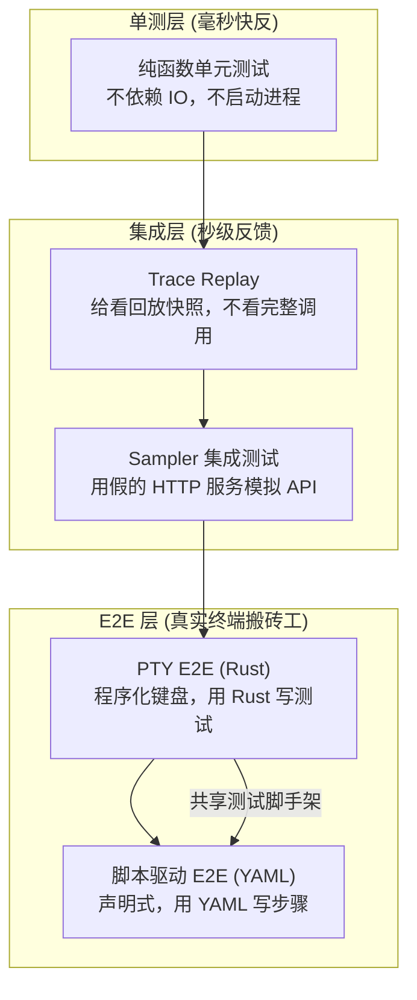
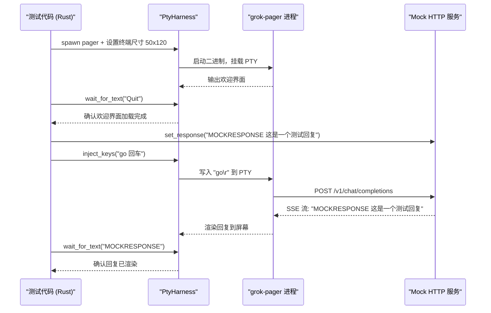
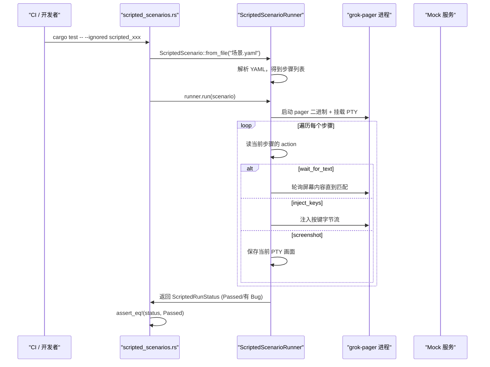
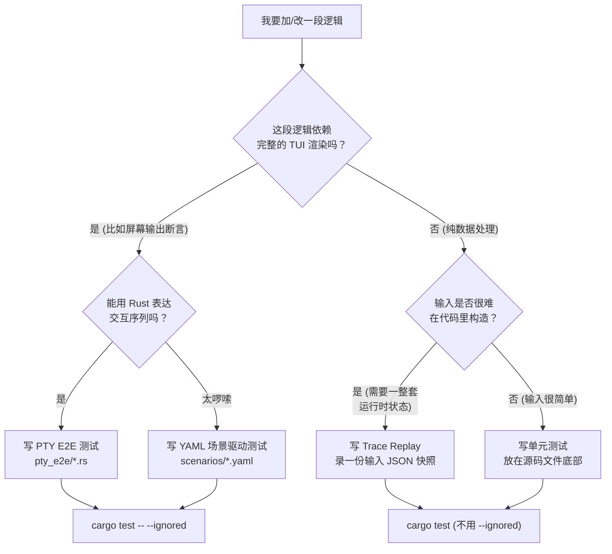

[← 返回首页](index.md)

# 测试策略与基础设施

## 先讲个故事：你为什么要关心测试

想象你在造一辆自动驾驶汽车。你当然不会只测方向盘——你得把整辆车开到真实路上，看它能不能识别红绿灯、会不会撞绿化带。软件测试也一样：测一个函数叫单元测试，测整个系统跑起来叫端到端测试。Grok Build 是一个跑在终端里的 AI 助手，它的"真实路况"是什么？**就是一个真实的命令行终端**。

所以这个项目的测试基础设施围绕一个疯狂但正确的想法展开：**用程序模拟整个终端，然后让程序去操作程序和观察程序**。听起来像套娃？往下看就明白了。

---

## 三层测试金字塔：怎么决定测什么、怎么测

整个项目的测试分成三层，从快到慢、从孤立到真实：

| 层级 | 跑一次多久 | 测什么 | 例子 |
|------|-----------|--------|------|
| 单元测试 | 毫秒级 | 单个函数的纯逻辑 | `evaluate_todo_gate` 判断要不要提醒用户继续干活 |
| 集成测试 | 秒级 | 几个模块拧在一起 | 模拟 API 返回一串 SSE 事件，验证 Sampler 解析正确 |
| 端到端测试 | 几秒到几十秒 | 完整启动真实二进制，走入真实代码路径 | 启动 `xai-grok-pager` 进程，模拟键盘输入，检查屏幕输出 |

下面这张图帮你快速建立方位感：



三层从来不是让你选一个，而是**不同问题用不同武器**：

- 想证明"这个条件分支逻辑没错" → 单元测试，毫秒出结果。
- 想证明"API 返回的 SSE 流被正确解析成工具调用" → 集成测试，用假的 HTTP 服务。
- 想证明"用户按 Ctrl+U 清空输入框后，屏幕真的会出现撤销提示" → 端到端测试，启动真实二进制。

---

## PTY 端到端测试：把终端放进笼子里测

### 什么是 PTY？三句话讲清楚

PTY（Pseudo Terminal，伪终端）说白了就是**一个假的终端**。真实的终端有三个角色：键盘（输入）、屏幕（输出）、终端程序（处理）。PTY 把它变成：

1. 一个"虚拟键盘"——你可以往 PTY 里写字，就像用户在敲键盘。
2. 一个"虚拟屏幕"——PTY 里的程序输出会被捕获成字节流。
3. 一个**完全可控**的环境——你可以设终端的行数、列数，甚至塞假的认证信息。

所以 PTY 端到端测试的本质就是：**启动真的 `xai-grok-pager` 二进制，把它关进一个 PTY 笼子里，然后通过写键盘、读屏幕来验证行为**。

### 核心武器：`PtyHarness`

所有 PTY E2E 测试的共同起点是 `PtyHarness`，定义在 `crates/codegen/xai-grok-pager-pty-harness` 这个 crate 里。它的定位像一个"全功能遥控器"——你可以用它来：

- 启动 pager 进程并挂载到 PTY（`PtyHarness::new`）
- 注入按键序列（`inject_keys`）
- 等待屏幕上出现特定文字（`wait_for_text`）
- 读当前屏幕内容（`screen_contents`）
- 读原始 PTY 字节流（`raw_output`）
- 优雅退出（`quit`）

`crates/codegen/xai-grok-pager/tests/pty_e2e/common.rs` 是整个测试公共库的核心，它导出了所有测试文件共享的常量和 helper 函数：

```rust
// 所有测试都用相同的终端尺寸——50 行 × 120 列
pub(crate) const DEFAULT_ROWS: u16 = 50;
pub(crate) const DEFAULT_COLS: u16 = 120;

// 等待欢迎界面的超时时间
pub(crate) const WELCOME_TIMEOUT: Duration = Duration::from_secs(20);

// 欢迎界面上用来确认加载完成的关键词
pub(crate) const WELCOME_SCREEN_SENTINEL: &str = "Quit";

// 发送给 Agent 的简短提问
pub(crate) const PROMPT: &str = "go";

// 模拟服务器流式返回的回复里，用来做断言锚点的词
pub(crate) const MOCK_RESPONSE_SENTINEL: &str = "MOCKRESPONSE";
```

### 一个完整的 PTY E2E 测试长什么样

下面是一个典型 PTY 测试的流程——从零开始、打出第一句话、验证回复出现：



实际代码比流程图更简洁——来看 `spawn_polling_session` 这个高频使用的 helper，它一口气完成了"启动、等欢迎页、发消息、等回复"四步：

```rust
// crates/codegen/xai-grok-pager/tests/pty_e2e/common.rs
pub(crate) fn spawn_polling_session(
    content: &ContentController,
    oauth_user: &str,
) -> PtyHarness {
    // 1. 种一个假的 OAuth 认证信息（跳过真实登录流程）
    seed_fake_oauth(content, oauth_user);
    let env = oauth_env_for_pager(content);

    let binary = pager_binary().expect("resolve pager binary");
    // 2. 启动 pager，设好终端尺寸
    let mut harness = PtyHarness::new_in_dir(
        &binary,
        DEFAULT_ROWS,   // 50 行
        DEFAULT_COLS,   // 120 列
        &[],
        &env_refs,
        Some(content.home()),
    ).expect("spawn pager with polling session auth");

    // 3. 等欢迎界面渲染好
    harness
        .wait_for_text(WELCOME_SCREEN_SENTINEL, WELCOME_TIMEOUT)
        .expect("welcome text");

    // 4. 输入问题并回车，触发 Agent 会话
    harness
        .inject_keys(format!("{PROMPT}\r").as_bytes())
        .expect("submit prompt to enter session");

    // 5. 等 AI 回复出现
    harness
        .wait_for_text(MOCK_RESPONSE_SENTINEL, Duration::from_secs(30))
        .expect("session response");

    harness
}
```

### 鼠标拖拽怎么测？直接注入 ANSI 转义序列

在终端里，鼠标操作不是通过"坐标+按钮"这种高层抽象传递的，而是通过 ANSI 转义序列——SGR 鼠标编码。PTY 测试也直接注入这些原始字节：

```rust
// crates/codegen/xai-grok-pager/tests/pty_e2e/common.rs

/// 生成一个 SGR 鼠标事件的原始字节
/// btn: 按钮号，row/col: 0-based 坐标，suffix: 'M'=按下, 'm'=释放
pub(crate) fn sgr_mouse(btn: u16, row: u16, col: u16, suffix: char) -> String {
    format!("\x1b[<{btn};{};{}{suffix}", col + 1, row + 1)
}

/// 模拟一整条拖拽线：按下 → 拖到中点 → 拖到终点 → 释放
pub(crate) fn mouse_drag_line(row: u16, from_col: u16, to_col: u16) -> String {
    let mut out = String::new();
    out.push_str(&sgr_mouse(0, row, from_col, 'M'));           // 按下
    out.push_str(&sgr_mouse(32, row, (from_col + to_col) / 2, 'M')); // 拖中
    out.push_str(&sgr_mouse(32, row, to_col, 'M'));            // 拖终
    out.push_str(&sgr_mouse(0, row, to_col, 'm'));             // 释放
    out
}

/// 模拟"按下后飞出去没释放"的异常场景
/// 真实情况：鼠标移出终端窗口时释放事件丢失
pub(crate) fn mouse_drag_no_release(row: u16, from_col: u16, to_col: u16) -> String {
    let mut out = String::new();
    out.push_str(&sgr_mouse(0, row, from_col, 'M'));   // 按下
    out.push_str(&sgr_mouse(32, row, from_col + 1, 'M')); // 开始拖
    out.push_str(&sgr_mouse(32, row, to_col, 'M'));    // 拖到终点
    // 注意：没有释放事件！
    out
}
```

### Mock 服务：ContentController 是幕后的"假 AI"

测试里绝对不会真的去调 xAI 的 API。取而代之的是 `ContentController`——一个假的 HTTP 服务器，它在测试启动时占一个随机端口，把你预先编排好的 SSE 事件按顺序吐出来。

```rust
// 设置一个 mock 回复
content.set_response("MOCKRESPONSE 这是模拟的 AI 回复");

// 更精细的控制：编排一个带工具调用的响应
let events = responses_api_tool_call_events(
    "call_read_hdr",          // 调用 ID
    "read_file",              // 工具名
    r#"{"target_file":"/tmp/test.txt"}"#,  // 参数
);
content.enqueue_response("/v1/responses", ScriptedResponse::sse(events));
```

`ContentController` 还记录所有发给它的 HTTP 请求体，你可以在测试里事后检查 AI 到底收到了什么消息：

```rust
/// 提取所有请求中的用户消息内容（按顺序）
pub(crate) fn all_user_messages(content: &ContentController) -> Vec<String> {
    content
        .request_bodies()
        .iter()
        .flat_map(|b| {
            b["messages"]
                .as_array()
                .into_iter()
                .flatten()
                .filter(|m| m["role"] == "user")
                .map(|m| m["content"].as_str().unwrap_or_default().to_owned())
                .collect::<Vec<_>>()
        })
        .collect()
}
```

---

## YAML 场景驱动测试：不会写 Rust 也能加用例

### 问题：PTY 测试好是好，但要会 Rust

PTY E2E 测试虽然强大，但每个测试都是一个 `.rs` 文件，需要编译。产品经理、QA、甚至想贡献测试的社区用户可能不会写 Rust。而且有些交互非常繁琐，用 Rust 表示也很啰嗦。

**解决方案：把测试步骤写成 YAML，运行时解析执行。**

### 一个 YAML 场景长什么样

场景文件放在 `crates/codegen/xai-grok-pager/tests/scenarios/` 下，以 `.yaml` 结尾。每个场景描述了一个"输入序列 + 预期断言"的完整故事。

下面是一个简化的例子（实际项目的 YAML 结构更复杂，但核心逻辑一致）：

```yaml
name: undo_tip_clear_shows
description: |
  Ctrl+U 清空一个超过 20 字符的输入框时，屏幕底部应该显示撤销提示

steps:
  # 步骤 1：等欢迎界面加载
  - action: wait_for_text
    text: "Quit"
    timeout_sec: 20

  # 步骤 2：输入 25 个 a（够长才能触发撤销提示）
  - action: inject_keys
    keys: "aaaaaaaaaaaaaaaaaaaaaaaaa"

  # 步骤 3：Ctrl+U 清空（0x15 是 Ctrl+U 的字节）
  - action: inject_keys
    keys: "\x15"

  # 步骤 4：断言屏幕出现"to undo"
  - action: wait_for_text
    text: "to undo"
    timeout_sec: 10

  # 步骤 5：截图（测试报告用）
  - action: screenshot
```

目前在 `scenarios_parse` 测试的登记表里已有接近 **30 个 YAML 场景**：

| 场景文件 | 验证什么 |
|----------|---------|
| `mermaid-affordances.yaml` | Mermaid 代码块渲染为 Unicode 艺术图，操作行出现 `[Open Image] [Copy Image Path] [Copy Source]` |
| `path_space_hyperlink.yaml` | 文件路径里有空格（`Demo App.app`）时 OSC 8 超链接不会被截断 |
| `undo_tip_clear_shows.yaml` | Ctrl+U 清空长文本后出现撤销提示 |
| `undo_tip_ctrl_c_clear_shows.yaml` | Ctrl+C 清空也触发撤销提示 |
| `undo_tip_short_draft_no_show.yaml` | 短文本（<20 字符）清空不触发撤销提示 |
| `undo_tip_short_terminal_no_show.yaml` | 终端太矮时不显示撤销提示 |
| `undo_tip_completion_accept_no_show.yaml` | 接受 @-file 补全不误触撤销提示 |
| `inline_edit_resubmit.yaml` | 选中历史消息编辑后重新提交的完整流程 |
| `vim_modal_command_palette.yaml` | Vim 模式下命令面板的模态切换 |
| `paste_chip_double_click.yaml` | 双击 `[Pasted: N lines]` 芯片展开为可编辑文本 |
| `shortcuts_help_detail.yaml` | 快捷键帮助弹窗的展开/折叠/详情/关闭全流程 |
| `dashboard_model_list_click.yaml` | 模型列表鼠标点击不穿透到下层 |
| `folder_trust_prompt.yaml` | 首次打开带 `.mcp.json` 的目录时弹出信任询问 |
| `slash_resize_storm.yaml` | 斜杠命令下拉框打开时疯狂 resize 终端不会崩 |
| `image_inputs.yaml` | 图片粘贴、路径规范化、损坏图片丢弃 |

### 脚本驱动是怎么跑起来的



所有脚本测试都用 `#[ignore]` 标记，因为要启动完整二进制，走完整启动流程，实在太慢了。跑法：

```bash
# 跑一个特定的脚本场景
cargo test --package xai-grok-pager --test scripted_scenarios \
  scripted_undo_tip_clear_shows -- --ignored --nocapture

# 一次性跑所有脚本场景
cargo test --package xai-grok-pager --test scripted_scenarios \
  -- --ignored
```

---

## Trace Replay：给函数放回放快照

有个特殊但极有价值的需求：**要测的那个函数依赖一大堆运行时状态**——比如 `evaluate_todo_gate` 需要知道当前 todo 列表的内容、状态、以及"正在执行的任务数"。真去跑一遍完整会话来构建这个状态太重了（又是几十秒的 E2E）。

**Trace Replay 的解法：把函数输入"冻"成 JSON 快照，存下来，测试时直接喂给函数。**

### 它在测什么

`evaluate_todo_gate` 是 Agent 运行时的一个判断函数。它看当前的 todo 列表，决定要不要提醒用户"你还有任务没做完"。输入是 `CollectedTodoGateInput`（todo 快照 + 背景任务计数），输出是 `TodoGateDecision`（Nudge：提醒 / Continue：继续）。

### JSON 快照长什么样

`crates/codegen/xai-grok-shell/tests/fixtures/synthetic_*.json`：

```json
{
  "name": "synthetic_clean_completion",
  "description": "所有 todo 已完成，应返回 Continue",
  "turns": [
    {
      "kind": "user",
      "turn_index": 0,
      "content": "帮我写一个 hello world"
    },
    {
      "kind": "assistant",
      "turn_index": 1,
      "tool_calls_emitted": [],
      "todo_state_after_turn": [
        {
          "id": "todo-1",
          "status": "completed",
          "content": "创建 main.rs"
        }
      ],
      "backing_task_count": 0,
      "expected_gate_decision": "continue"
    }
  ]
}
```

### 回放引擎怎么跑

```rust
// crates/codegen/xai-grok-shell/tests/trace_replay.rs

#[test]
fn replay_all_synthetic_fixtures() {
    for path in discover_fixtures() {
        let fixture = load_fixture(&path);
        for turn in fixture.turns {
            if let Turn::Assistant(at) = turn {
                // 1. 从快照构建 CollectedTodoGateInput
                let collected = collected_from(
                    at.todo_state_after_turn,
                    at.backing_task_count,
                );
                // 2. 调用生产代码
                let decision = evaluate_todo_gate(&collected.as_input());
                // 3. 断言结果和快照里的 expected 一致
                match (at.expected_gate_decision, decision) {
                    (ExpectedGateDecision::Continue, TodoGateDecision::Continue) => {}
                    (ExpectedGateDecision::Nudge, TodoGateDecision::Nudge { reminder, reason }) => {
                        // 如果快照里指定了 expected_reason 和 expected_reminder_contains
                        // 还要进一步验证
                    }
                    // ... 不匹配的分支直接 panic
                }
            }
        }
    }
}
```

值得注意的细节：

- `ExpectedGateDecision` 是一个**封闭枚举**（只有 `Nudge` 和 `Continue` 两个变体）。这意味着如果有人在 JSON 里写 `"expected_gate_decision": "maybe"`，反序列化时会直接报错——不会静默地走到一个没有覆盖的分支。
- `canonical_fixtures_match_disk` 测试保证**清单文件和磁盘文件严格一致**：如果你加了新 fixture 但没更新 `CANONICAL_FIXTURES` 列表，测试就会失败。反过来，删了 fixture 但没从列表里移除也一样会挂。

---

## 集成测试脚手架：给 shell 测试准备的标准化客户端

`crates/codegen/xai-grok-shell/tests/common/mod.rs` 提供了一个高度标准化的测试客户端工厂。它的核心职责是：**把 mock 服务器地址和一堆配置参数打包，生成一个可以真实发起 HTTP 请求的 `Client`**。

```rust
// crates/codegen/xai-grok-shell/tests/common/mod.rs

/// 创建指向 mock 服务器的 Sampler 客户端
pub fn create_test_client(base_url: &str, api_backend: ApiBackend) -> Client {
    Client::new(test_sampler_config(base_url, api_backend, &[])).unwrap()
}

/// 把所有配置集中在一个地方，避免每个测试都写一遍 ~30 个字段
pub fn test_sampler_config(
    base_url: &str,
    api_backend: ApiBackend,
    extra_headers: &[(&str, &str)],
) -> SamplerConfig {
    SamplerConfig {
        api_key: Some("test-api-key".to_string()),
        base_url: base_url.to_string(),
        model: "test-model".to_string(),
        max_completion_tokens: Some(1000),
        temperature: Some(0.7),
        // ... 20+ 其他字段
    }
}
```

---

## xai-test-utils：全项目共享的测试瑞士军刀

`crates/common/xai-test-utils` 是所有 crate 都能引用的公共测试工具箱。它不给你编假数据——它解决的是"跑测试之前环境不对"的问题：

| 工具 | 解决了什么问题 |
|------|--------------|
| `require_git!` 宏 | 确保 `PATH` 里有 `git`（用 Bazel 打的静态 git），不依赖系统安装 |
| `init_git_repo` / `git_commit_all` | 在一行代码里建一个临时的 git 仓库 |
| `crate_root!` 宏 | 无论你用 `bazel test` 还是 `cargo test` 跑，都能找到 crate 根目录 |
| `MessagePrefixCounter` | 统计某条日志被打印了几次，不用肉眼翻测试输出 |
| `image` 模块 | 生成已知尺寸的临时图片文件，供图片相关测试用 |

```rust
// 典型用法
require_git!();  // 测试开始前确保 git 可用
let repo = init_git_repo();  // 建一个临时仓库
git_commit_all(&repo, "initial commit");  // 提交所有文件
```

---

## 什么时候写哪种测试——决策树



四个关键问题帮你决策：

1. **依赖完整 TUI 渲染吗？** 依赖 → E2E，不依赖 → 进入问题 2。
2. **依赖完整运行时状态吗？** 依赖但可以在 JSON 里冻结 → Trace Replay，输入简单 → 单元测试。
3. **E2E 路径：Rust 能优雅表达交互吗？** 能 → `pty_e2e/*.rs`，太啰嗦 → YAML 场景。
4. **跑多久能接受？** E2E 都是几分钟级别 → 加 `#[ignore]`，只在 CI 或手动触发时跑。Trace Replay 和单元测试是毫秒级 → 不标记 ignore。

---

## 补充阅读

- 关于 pager 本身的架构和 PTY 驱动逻辑，[详见《整体架构：TUI → Agent → Workspace 三层协作》](04-architecture-overview.md)
- 关于 Agent 运行时的 `evaluate_todo_gate` 上下文，[详见《Agent 调度核心》](15-agent-runtime.md)
- 关于 Mermaid 图表如何从代码块变成屏幕上的图形，[详见《Mermaid 图表渲染》](12-mermaid-rendering.md)
- 关于 Sampler（向 LLM 发请求的客户端）的内部实现，[详见《采样器与重试策略》](18-sampler-and-retry.md)
