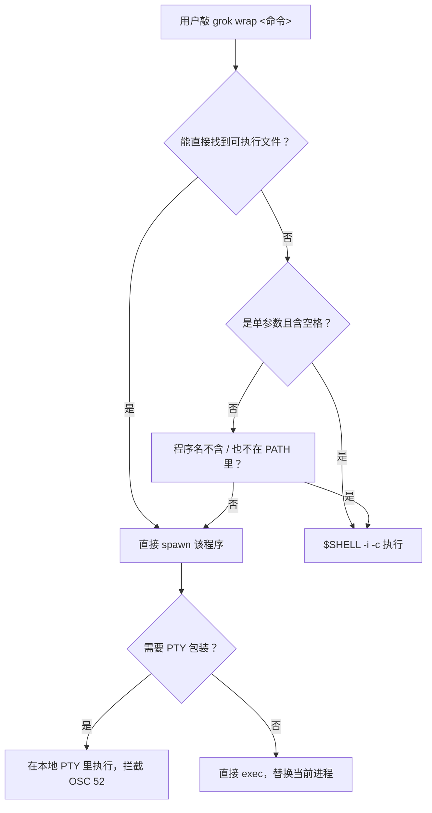

[← 返回首页](index.md)

# 用户命令与功能索引

这是 Grok Build 的日常操作速查页，把所有你能敲的命令、能按的快捷键、能调的配置项都列在这里。需要深入理解某个子系统怎么运转的，页面末尾有交叉链接带你过去。

---

## 斜杠命令完整清单

在聊天输入框里敲 `/` 就会弹出这个菜单。这些命令分两拨：**Shell 内置命令**（后端 xai-grok-shell 处理）和 **Pager 内置命令**（TUI 前端 xai-grok-pager 处理）。你不需要操心哪个是谁处理的，输入框里的自动补全会把它们混在一起列出来。

以下清单从 `crates/codegen/xai-grok-pager/docs/user-guide/04-slash-commands.md` 提取并按功能分组。每个命令后面那句大白话是说"这命令到底是干嘛的"。

### 会话管理

| 命令 | 别名 | 作用 | 一句话说明 |
|------|------|------|-----------|
| `/new` | `/clear` | 开始新会话，把当前对话清空 | 相当于"聊天记录清空，重开一局" |
| `/resume` | — | 打开会话选择器，从磁盘加载之前的会话 | 像打开存档继续玩，不用从头开始 |
| `/compact [context]` | — | 压缩对话历史，给上下文窗口腾地方 | 聊到 50 轮快爆了，自动把老内容总结成摘要塞回去；可以指定"这段别丢" |
| `/context` | — | 展示上下文窗口使用情况和会话统计 | 看看 token 窗口还剩多少空位，系统提示、消息、工具定义各占了多少 |
| `/session-info` | — | 显示会话详情：模型、轮次、上下文用量 | 快速看一眼当前会话是哪个模型、聊了多少轮 |
| `/fork` | — | 从当前会话分支出一个新 agent | 把对话复制一份到新分支，历史保留到分叉点，两条线各聊各的 |
| `/rewind` | — | 回退会话到更早的轮次 | "刚才那几轮不算，退回去重来"，扔掉分叉点之后的一切 |
| `/copy [N]` | — | 复制最近的回复到剪贴板 | 不传数字复制最新一条，传 `/copy 2` 复制倒数第二条 |
| `/export` | — | 导出当前对话到文件或剪贴板 | 把整场对话打包带走 |
| `/quit` | `/exit` | 退出应用 | 下班走人 |
| `/home` | `/welcome` | 退出当前会话，回欢迎界面 | 回到主菜单，不是退出应用 |
| `/rename <标题>` | `/title` | 给当前会话重命名 | 给这场对话起个好记的名字 |

### 模型与模式

| 命令 | 别名 | 作用 | 一句话说明 |
|------|------|------|-----------|
| `/model <名称>` | `/m` | 切换到指定模型 | 换一个 AI 大脑；支持模型 ID 或显示名，不区分大小写 |
| `/effort <级别>` | — | 调整推理模型的努力程度 | 级别有 low/medium/high/xhigh，只在当前模型支持推理努力时有效 |
| `/always-approve` | — | 切换"始终批准"模式 | 打开后所有权限弹窗都自动通过，再敲一次关掉；跟 `/auto` 互斥 |
| `/auto` | — | 切换"自动"模式 | 分类器批准安全工具，危险的还是会弹窗；再次敲关掉 |
| `/multiline` | `/ml` | 切换多行输入模式 | 打开后 Enter 换行，Shift+Enter 发送 |
| `/history` | — | 打开提示历史搜索面板 | 模糊搜索本会话发过的提示，选一条填回输入框 |
| `/compact-mode` | — | 切换紧凑显示模式 | 减少内边距和间距，让屏幕塞更多内容 |
| `/vim-mode` | — | 切换 vim 风格的滚动键位 | 打开后 j/k 上下移动，h/l 折叠展开，跟 vim 一样的肌肉记忆 |
| `/minimal` | — | 切到 minimal 渲染模式 | 不要全屏 TUI，用纯文本输入输出 |
| `/fullscreen` | `/full` | 切回全屏 TUI 渲染模式 | 从 minimal 模式回到标准的 alt-screen 终端界面 |
| `/plan [描述]` | — | 进入计划模式 | 让 AI 先定计划再动手 |
| `/view-plan` | `/show-plan`, `/plan-view` | 查看当前保存的计划预览 | 看一眼 AI 拟好的执行计划 |

### 记忆系统（需要 `--experimental-memory` 或 `GROK_MEMORY=1`）

| 命令 | 别名 | 作用 | 一句话说明 |
|------|------|------|-----------|
| `/memory [on\|off]` | `/mem` | 浏览、查看、管理保存的记忆 | 传 on/off 可以开关记忆功能 |
| `/flush` | — | 立刻把当前会话知识保存到记忆 | 触发 LLM 总结会话中最重要的内容，赶在压缩前留住关键信息 |
| `/dream` | — | 运行记忆整合 | 把会话日志合并整理成有组织的主题 |
| `/remember <内容>` | — | 手动存一条笔记到记忆 | 不等自动总结，自己记："staging 部署用的是 eu-west 集群" |

### 扩展系统

| 命令 | 别名 | 作用 | 一句话说明 |
|------|------|------|-----------|
| `/hooks` | — | 打开扩展面板的钩子页 | 查看、增删、启停钩子。Shell 后端还有子命令如 `/hooks-list`，TUI 里统一进面板 |
| `/plugins` | — | 打开扩展面板的插件页 | 查看、安装、卸载插件，管信任 |
| `/marketplace` | — | 打开扩展面板的市场页 | 浏览并安装插件 |
| `/skills` | — | 打开扩展面板的技能页 | 查看已安装的技能 |

### 媒体生成

| 命令 | 别名 | 作用 | 一句话说明 |
|------|------|------|-----------|
| `/imagine <描述>` | — | 根据文字描述生成图片 | "夕阳下海面上的金色帆船" → 画出来 |
| `/imagine-video <描述>` | — | 根据文字描述生成视频 | 先规划镜头、生成源图、再做成动态视频 |

### 定时任务

| 命令 | 别名 | 作用 | 一句话说明 |
|------|------|------|-----------|
| `/loop [间隔] <提示>` | — | 按周期重复运行一个提示 | "/loop 30m 查部署状态"——每隔 30 分钟查一次，最少间隔 60 秒，自动 7 天后过期 |

### 其它功能

| 命令 | 别名 | 作用 | 一句话说明 |
|------|------|------|-----------|
| `/goal <目标>` | — | 设定或管理自主目标 | 设定一个目标让 AI 跨轮次自动推进，还支持 status/pause/resume/clear 子命令 |
| `/theme` | `/t` | 切换 TUI 颜色主题 | 换个皮肤 |
| `/feedback [消息]` | — | 报告问题或发送反馈 | "这功能不太好使"——直接告诉开发团队 |
| `/btw` | — | 给 agent 捎句话 | 不打断当前任务，悄悄递个纸条 |
| `/mcps` | — | 打开 MCP 服务器管理面板 | 管理外部工具服务器 |
| `/terminal-setup` | `/terminal-check`, `/terminal-info` | 显示终端能力检测和设置信息 | 颜色级别、可用主题、剪贴板路径，还带常见问题修复指引 |
| `/release-notes` | `/changelog` | 查看当前版本的发布说明 | 看看更新了啥 |
| `/docs [web\|标题]` | `/howto`, `/guides` | 浏览 TUI 内的指南或打开在线文档 | `/docs web` 打开网页，`/docs 标题` 跳到指定指南 |
| `/import-claude` | — | 打开 Claude 设置导入面板 | 把 `~/.claude` 里的权限、环境变量、MCP 服务器都搬过来 |
| `/config-agents` | `/agents` | 打开 agent 定义管理面板 | 查看、切换 agent，设默认 |
| `/personas` | — | 管理角色设定 | 创建、编辑、删除角色，子 agent 可以用它定型行为 |
| `/login` | — | 登录或重新认证 | 不离开会话就能刷 token |
| `/logout` | — | 登出并回到登录界面 | 换账号 |
| `/usage` | — | 查看用量或管理账单 | 看看花了多少积分 |
| `/privacy` | — | 显示或切换隐私和数据保留状态 | |
| `/settings` | `/config`, `/preferences`, `/prefs` | 打开设置面板 | 交互式改配置 |
| `/timestamps` | — | 开关消息时间戳 | |

### 技能作为斜杠命令

任何在 SKILL.md 前置元数据里标记了 `user-invocable: true` 的已启用技能，都会自动出现在斜杠命令列表里。如果有重名的，用 `local:技能名` 或 `user:技能名` 来精确指定。内置命令优先级永远高于同名技能。

---

## 快捷键速查表

以下内容摘录自 `crates/codegen/xai-grok-pager/docs/user-guide/03-keyboard-shortcuts.md`。键位是内置的，目前不能自定义。

Grok 有两套输入模式：
- **简单模式**（默认）：方向键导航，`Shift+方向键`在轮次之间跳，空格聚焦输入框，敲任意字母键也自动聚焦输入框。
- **Vim 模式**（需手动开启）：`j`/`k` 导航，`H`/`L` 跳轮次，`J`/`K` 跳回复，`h`/`l` 折叠展开，`i`/`Tab`/`空格` 聚焦输入框。

### 导航（滚动区聚焦时）

| 键 (Vim模式) | 替代键 (简单模式) | 动作 |
|-------------|-----------------|------|
| `j` | `Down` | 选择下一条 |
| `k` | `Up` | 选择上一条 |
| `⇧L` | `Shift+Right` | 跳到下一轮（用户提问） |
| `⇧H` | `Shift+Left` | 跳到上一轮（用户提问） |
| `⇧J` | — | 跳到下一个助手回复 |
| `⇧K` | — | 跳到上一个助手回复 |
| `g` | — | 跳到滚动区顶部 |
| `⇧G` | — | 跳到滚动区底部 |
| `Ctrl+K` | — | 上滚一行（不改变选中） |
| `Ctrl+J` | — | 下滚一行（不改变选中） |
| `PageUp` | — | 上滚一页 |
| `PageDown` | — | 下滚一页 |
| `Ctrl+U` | — | 上滚半页 |
| `Ctrl+D` | — | 下滚半页（VS Code 里用 `Shift+D`） |

### 视图操作（滚动区聚焦时）

| 键 (Vim模式) | 替代键 (简单模式) | 动作 |
|-------------|-----------------|------|
| `h` | `Left` | 折叠选中条目 |
| `l` | `Right` | 展开选中条目 |
| `e` | — | 切换选中条目的折叠状态 |
| `⇧E` | — | 全部展开 / 全部折叠 |
| `Ctrl+E` | — | 展开/折叠所有思考块 |
| `r` | — | 切换选中条目的原始 Markdown 显示 |

### 内容操作

| 键 | 动作 |
|----|------|
| `y` | 复制块内容到剪贴板 |
| `⇧Y` | 复制块元数据（比如 shell 命令）到剪贴板 |
| `Enter` | 在全屏查看器中打开块内容 |
| `Ctrl+F` | 全屏查看器（备用键位） |

### 焦点切换

| 键 | 上下文 | 动作 |
|----|--------|------|
| `Tab` / `Space` / `i` | 滚动区聚焦 | 聚焦输入框 |
| `Tab` | 输入框聚焦 | 聚焦滚动区 |
| `Enter` | 输入框聚焦 | 发送当前内容 |

### Escape 键行为

Escape 不负责切换焦点。它的行为分场景：
- **Agent 正在运行**：Escape 被吞掉不做事（用 Ctrl+C 取消）。
- **Agent 正在取消中**：Escape 重新发送取消信号。
- **空闲 + 输入框有内容 + 输入框聚焦**：800ms 内双击 Escape 清空输入框。
- **空闲 + 输入框空 + 有对话 + 任意聚焦**：800ms 内双击 Escape 打开回退选择器（同 `/rewind`）。
- **空闲 + 输入框空 + 没对话**：Escape 不做事。

### Agent 级别操作

| 键 | 上下文 | 动作 |
|----|--------|------|
| `Ctrl+P` / `?` | Agent 界面 | 打开命令面板（可搜所有快捷键和斜杠命令） |
| `Ctrl+M` | Agent 界面 | 打开模型选择器 |
| `Ctrl+M` | 输入框聚焦 | 切换多行输入模式 |
| `Ctrl+C` | Agent 界面 | 取消当前回合（或先清空非空草稿） |
| `Ctrl+O` | Agent 界面 | 切换始终批准模式 |
| `Ctrl+S` | Agent 界面 | 打开会话选择器 |
| `Ctrl+;` / `Ctrl+'` | Agent 界面 | 切换提示队列面板（VS Code 家族用 `Ctrl+4`） |
| `Shift+Tab` | 输入框聚焦 | 循环模式（Normal → Plan → Always-approve） |
| `Ctrl+G` | Agent 界面 | 把当前任务发到后台 |
| `Ctrl+T` | Agent 界面 | 切换待办事项面板 |
| `Ctrl+B` | Agent 界面 | 切换任务面板 |
| `Ctrl+L` | Agent 界面 | 打开扩展面板（非 VS Code 家族）；VS Code 家族里是插话键 |
| `↑` | 输入框聚焦（空） | 打开历史面板，最近一条提示已填好 |
| `!` | 输入框聚焦（空） | 进入 shell 模式 |
| `Ctrl+.` / `Ctrl+X` | Agent 界面 | 打开快捷键帮助 |
| `F2` / `Ctrl+,` / `Cmd+,` | Agent 界面 | 打开设置面板 |

### 正在运行时插话

Agent 正在生成回复时，你可以插话：

| 终端 | 主键 | 备用键 | 动作 |
|------|------|--------|------|
| 默认 | `Ctrl+Enter` | `Ctrl+I` | 立即发送（取消当前回合，你的话作为下一回合） |
| Apple Terminal | `Ctrl+O` | `Ctrl+Enter`, `Ctrl+I` | 同上 |
| VS Code 家族 | `Ctrl+L` | — | 同上 |

在多行模式下，`Shift+Enter`（或 `Alt+Enter`）发送，`Enter` 换行——除非输入框是空的且有待发队列，此时 `Enter` 发队首那条。

### 全局快捷键

| 键 | 替代键 | 动作 | 需要确认 |
|----|--------|------|----------|
| `Ctrl+N` | — | 创建新会话（可选在 git worktree 里） | 是（1000ms 内双击） |
| `Ctrl+Q` | `Ctrl+D`（VS Code 里） | 退出应用 | 是（1000ms 内双击） |

### 欢迎界面

| 键 | 动作 |
|----|------|
| `Ctrl+S` | 打开会话选择器 |
| `Ctrl+W` | 打开新建 Worktree 对话框（仅在 git 仓库内） |
| `Ctrl+I` | 导入 Claude 设置 |
| `Ctrl+Shift+I` | 关闭 Claude 导入行 |

### 图片粘贴与拖拽

| 操作 | macOS | Linux | Windows |
|------|-------|-------|---------|
| 拖拽文件到输入框 | Finder ✓ | Files/Dolphin ✓ | Explorer ✓ |
| 复制文件后粘贴 | `Cmd+V` | `Ctrl+V` | `Ctrl+V` |
| 截图或"复制图片"后粘贴 | `Cmd+V` | `Ctrl+V` | `Alt+V` |

### 快速参考卡

**简单模式（默认）— 滚动区聚焦时：**
```
导航:     Up/Down (上下条)  Shift+Left/Right (上下轮)
滚动:     Ctrl+J/K (行)  PgUp/PgDn (页)  Ctrl+U/D (半页)
聚焦输入: Space 或任意字母键
```

**Vim 模式 — 滚动区聚焦时：**
```
导航:     j/k (上下)  H/L (上下轮)  K/J (上下回复)  g/G (顶/底)
滚动:     Ctrl+J/K (行)  Ctrl+U/D (半页)  PgUp/PgDn (页)
折叠:     h/l (折叠/展开)  e (切换)  E (全部)
内容:     y (复制)  Y (复制命令)  Enter (全屏)
视图:     r (原始 Markdown)  Ctrl+E (思考块)
聚焦输入: i, Tab, 或 Space
```

**输入框聚焦时：**
```
发送:     Enter
换行:     Shift+Enter 或 Alt+Enter
多行:     Ctrl+M (切换)
粘贴:     Ctrl+V (macOS/Linux 文本/文件/截图)
全选:     Cmd+A (macOS Ghostty 专用)
离开:     Tab (回到滚动区)
取消:     Ctrl+C (运行中，空输入框；非空草稿先清空)
清空:     Esc Esc 800ms 内 (空闲 + 输入框非空)
回退:     Esc Esc 800ms 内 (空闲 + 输入框空 + 有对话)
```

**始终可用：**
```
命令面板:     Ctrl+P 或 ?
模型选择:     Ctrl+M (从滚动区)
取消:         Ctrl+C
始终批准:     Ctrl+O (切换 YOLO)
新会话:       Ctrl+N (再按一次确认，选普通/worktree)
退出:         Ctrl+Q (VS Code 里用 Ctrl+D)
```

---

## 核心配置速查

配置优先级（高到低）：CLI 参数 → 环境变量 → `~/.grok/config.toml` → 托管策略文件 → 内置默认值。下面只列最常用的，完整内容在 `crates/codegen/xai-grok-pager/docs/user-guide/05-configuration.md`。

### config.toml 核心字段

| 字段 | 类型 | 默认值 | 说明 |
|------|------|--------|------|
| `[cli] auto_update` | bool | true | 启动时检查更新 |
| `[models] default` | string | `"grok-build"` | 新会话默认模型 |
| `[ui] simple_mode` | bool | true | prompt 编辑用 readline 风格（false 切 vim 风格编辑） |
| `[ui] vim_mode` | bool | false | 滚动区用 vim 风格键位 |
| `[ui] screen_mode` | string | 不设 | `"fullscreen"` 或 `"minimal"` |
| `[ui] show_thinking_blocks` | bool | true | 在 TUI 里显示思考块 |
| `[ui] group_tool_verbs` | bool | true | 把连续的读/搜/列工具调用折叠成一行 |
| `[ui] collapsed_edit_blocks` | bool | false | 编辑块显示为单行 ± 摘要 |
| `[features] telemetry` | bool | false | 匿名使用遥测 |
| `[features] lsp_tools` | bool | false | 暴露 LSP 工具 |
| `[features] codebase_indexing` | bool | true | 代码图谱索引 |
| `[session] auto_compact_threshold_percent` | int | 85 | 上下文窗口用到 85% 自动压缩 |
| `[session] load_envrc` | bool | true | 加载 .envrc 环境变量 |
| `[tools] respect_gitignore` | bool | false | 所有工具跳过 gitignore 的文件 |
| `[toolset.bash] timeout_secs` | float | 120.0 | 前台命令超时秒数 |
| `[toolset.bash] output_byte_limit` | int | 20000 | 最大捕获输出字节数 |

### 环境变量精选

| 变量 | 说明 |
|------|------|
| `XAI_API_KEY` | 从 console.x.ai 拿到的 API 密钥 |
| `GROK_HOME` | 覆盖配置目录（默认 `~/.grok`） |
| `GROK_MEMORY` | 设为 `1` 开跨会话记忆，`0` 关 |
| `GROK_SANDBOX` | 沙箱配置：off/workspace/devbox/read-only/strict |
| `GROK_LOG_FILE` | 日志写到此路径 |
| `RUST_LOG` | 日志级别过滤（如 `debug`） |
| `GROK_TELEMETRY_ENABLED` | 开关遥测 |
| `GROK_DEPLOYMENT_KEY` | 企业管理 API 密钥 |

### 文件位置

| 路径 | 说明 |
|------|------|
| `~/.grok/config.toml` | 主配置文件 |
| `~/.grok/pager.toml` | TUI 外观配置 |
| `~/.grok/auth.json` | 认证凭据（自动管理） |
| `~/.grok/sessions/` | 持久化会话（按工作目录组织） |
| `~/.grok/memory/` | 跨会话记忆文件和索引 |
| `~/.grok/skills/` | 用户级技能定义 |
| `~/.grok/plugins/` | 用户级插件 |
| `~/.grok/agents/` | 用户级 agent 定义 |
| `.grok/config.toml` | 项目级 MCP 服务器、插件、权限规则 |
| `.grok/skills/` | 项目级技能 |
| `.grok/hooks/` | 项目级钩子 |
| `AGENTS.md` | 项目指令（系统提示） |

---

## CLI 包装入口

除了 TUI 交互界面，Grok Build 还提供了几个命令行包装入口，让你在终端里直接调用。核心实现在 `crates/codegen/xai-grok-pager/src/wrap_cmd.rs`。

### `grok wrap`

把一个命令包在本地 PTY（伪终端）里执行，拦截它的 OSC 52 剪贴板转义序列，写到本地系统剪贴板。这东西的典型场景是跑 Docker 或 kubectl exec 里头的命令——那些环境碰不到你本机的剪贴板，`grok wrap` 帮你把路打通。

```
grok wrap docker exec my-container some-cli-tool
grok wrap "mycli ssh host"    # 单引号字符串走 shell 展开别名
```

Unix 下的路由逻辑：



`should_wrap()` 的判断逻辑很简单：只要 stdin、stdout、stderr 都是 TTY（交互式终端），且平台支持 PTY（Unix `openpty` 或 Windows ConPTY），就包装。它是 `grok ssh` 包装器的泛化版本，但不挑终端品牌——用户主动要求转发剪贴板，直接照做。

---

## 交叉链接

这一页是速查表，要搞懂某个东西为什么这么设计、内部怎么运转的，从这里跳过去：

- 命令怎么注册和匹配的 → [详见《斜杠命令系统》](11-slash-command-system.md)
- 一次完整对话的流转 → [详见《一次完整对话的旅程》](05-one-full-turn.md)
- 会话的创建、分叉、压缩、回退 → [详见《会话管理：从出生到归档》](06-session-lifecycle.md)
- 上下文窗口和自动压缩 → [详见《上下文窗口管理：token 的精打细算》](08-chat-state-context.md)
- 终端渲染流水线 → [详见《终端渲染流水线》](09-tui-rendering.md)
- 滚动回溯块的渲染 → [详见《滚动回溯引擎》](10-scrollback-system.md)
- Agent 调度 → [详见《Agent 调度核心》](15-agent-runtime.md)
- 权限控制决策树 → [详见《终端执行与权限控制》](20-terminal-tools.md)
- 插件和钩子系统 → [详见《插件与钩子系统》](26-plugins-and-hooks.md)
- MCP 协议接入 → [详见《MCP 协议：接入外部工具服务》](25-mcp-integration.md)
- 记忆系统 → [详见《记忆系统：AI 的长期小本本》](31-memory-system.md)
- 沙箱隔离 → [详见《沙箱隔离》](30-sandbox-security.md)
- 配置优先级合并 → [详见《配置体系：三层优先级合并》](28-config-system.md)
- 遥测 → [详见《遥测与可观测性》](29-telemetry.md)
- 自动更新 → [详见《自动更新子系统》](33-update-autoupdate.md)
- ACP 协议 → [详见《Agent Client Protocol：与编辑器通信》](27-acp-protocol.md)
