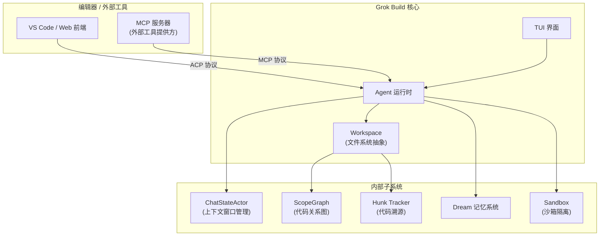
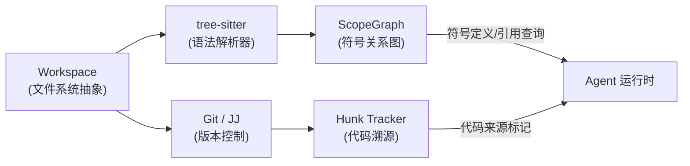
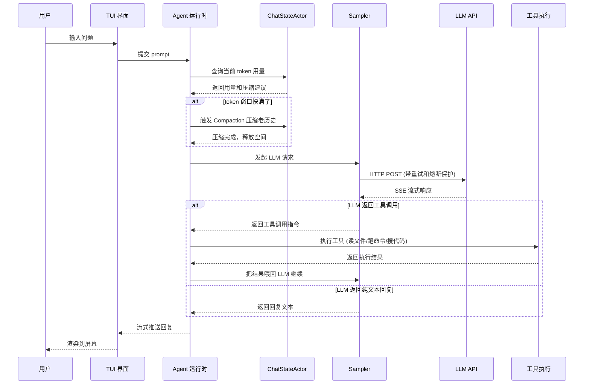
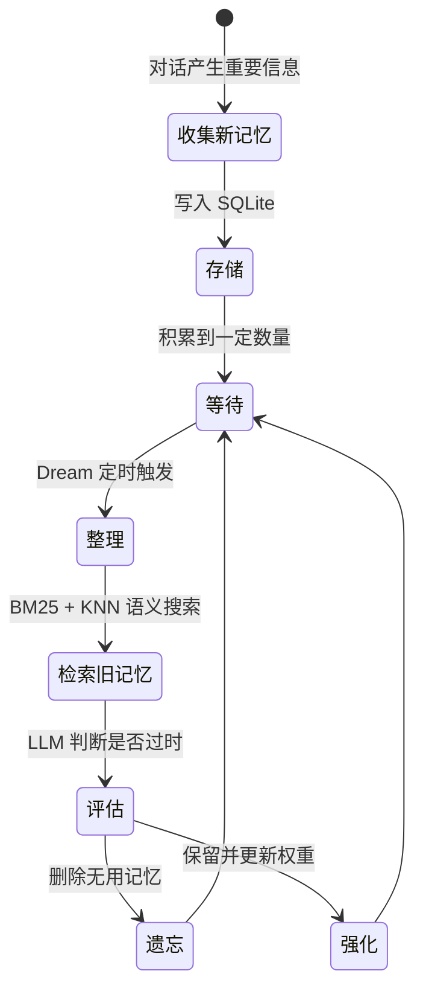

[← 返回首页](index.md)

# 术语速查

刚进这个项目的时候你一定会被一堆缩写砸晕——ACP、MCP、ScopeGraph、Hunk Tracker……每个看起来都像天书。别慌，这一页就是你的"黑话翻译器"，每条术语一句大白话讲清楚它到底是干嘛的。

先看一张全景图，搞清楚这些术语在系统里的位置关系：



---

## 核心协议与接口

| 名称 | 作用 | 一句话说明 |
|------|------|-----------|
| **ACP** (Agent Client Protocol) | 外部编辑器和 Grok Agent 之间的通信协议 | 让 VS Code 或 Web 前端能跟 Grok 对话——编辑器发个请求，Grok 返回 AI 的回复和操作结果。基于 JSON-RPC，支持 stdio / HTTP / WebSocket 三种传输方式。 |
| **MCP** (Model Context Protocol) | 接入外部工具服务的标准协议 | 项目根目录放个 `.mcp.json`，声明你要用哪些外部工具（比如数据库查询、API 调用），Grok 会自动发现、启动、连接它们，变成 Agent 可调用的工具。 |
| **RPC 类型** (Workspace Types) | 客户端和服务端之间传消息的数据结构定义 | 所有网络消息的形状——请求信封、响应块、事件推送——都在 `xai-grok-workspace-types` 这个 crate 里定义好，两端照着编解码就行。 |

ACP 的核心类型都在 `crates/codegen/xai-acp-lib/src/lib.rs` 里暴露：

```rust
// ACP 的核心类型和函数——这就是外部编辑器跟 Grok 说话的全部"词汇"
mod channel;
mod common;
mod gateway;
mod message;
// ...

pub use self::{
    // 通信通道——相当于一条已经接好的电话线
    channel::{AcpAgentChannel, AcpChannel, AcpClientChannel, acp_channels, acp_send},
    // 消息类型——Agent 收到的和发出去的消息
    message::{
        AcpAgentMessage, AcpAgentMessageBox,
        AcpClientMessage, AcpClientMessageBox,
        AcpRequest, AcpMethod, // ...
    },
    // ...
};
```

MCP 的职责说明直接写在 `crates/codegen/xai-grok-mcp/src/lib.rs` 的文档注释里：

```rust
//! MCP integration crate.
//!
//! Two responsibilities:
//!
//! 1. Quarantines rmcp 2.1 and reqwest 0.13.  // 隔离依赖版本冲突
//! 2. Owns MCP-specific integration code:      // 管所有 MCP 相关的集成逻辑
//!    - credentials -- 磁盘上的凭证文件
//!    - oauth -- 浏览器 OAuth 登录流程
//!    - servers -- MCP 传输层和客户端生命周期
//!    - mcp_http_client -- HTTP 客户端的退避重试包装
```

[详见《Agent Client Protocol：与编辑器通信》](27-acp-protocol.md)
[详见《MCP 协议：接入外部工具服务》](25-mcp-integration.md)
[详见《工作区通信协议：RPC 类型字典》](07-workspace-types-protocol.md)

---

## 代码理解与分析

| 名称 | 作用 | 一句话说明 |
|------|------|-----------|
| **ScopeGraph** (代码关系图) | 用 tree-sitter 把整个仓库解析成一张巨大的符号关系网 | 记录每个函数、变量、类的"定义在哪里"、"被谁引用"、"从哪里导入"——支撑代码跳转和符号补全功能。 |
| **tree-sitter** | 增量式代码解析器 | 把源代码拆成一棵语法树，支持实时增量更新（改一行只重解析那部分，不用从头来）。 |
| **Hunk Tracker** (代码溯源) | 记录每一行代码是谁写的——人还是 AI | 把 Git diff 拆成小块（hunk），每块打上来源标记。以后看代码库就能知道哪些是 AI 生成的、哪些是你亲手写的。 |

下面是 Hunk Tracker 和 ScopeGraph 在 Workspace 里的协作关系：



[详见《代码关系图引擎》](22-codebase-graph.md)
[详见《代码溯源：谁写的这行——人还是 AI？》](24-hunk-attribution.md)

---

## Agent 运行时内部

| 名称 | 作用 | 一句话说明 |
|------|------|-----------|
| **Agent** (智能体) | 整个 AI 对话和执行的"大脑" | 收到你的问题后，决定要调用哪些工具、怎么回复、要不要拆成子任务。内部有一个永不停歇的 Run Loop 在驱动。 |
| **Run Loop** | Agent 内部的死循环 | 从 prompt 队列取任务 → 喂给 LLM → LLM 返回工具调用 → 分发给 Extension 执行 → 把结果再喂给 LLM，直到 LLM 说"我搞定了"。 |
| **ChatStateActor** | 对话状态的守护神 | 估算每条消息占多少 token、决定什么时候触发压缩（把老历史总结成摘要）、怎么在有限的上下文窗口里塞进最多有用信息。 |
| **Compaction** (对话压缩) | 把老历史压缩成摘要 | 聊到第 50 轮 token 快爆了的时候，自动把最老的几轮对话总结成一段摘要再塞回去，让 AI 既能"记住"以前聊了啥，又不会超出 token 限制。 |
| **Goal 系统** | 把模糊大任务拆成可执行的小步骤 | AI 接到"帮我重构这个模块"这种模糊指令后，自动做规划、分步执行、每步检查是否跑偏。 |
| **Tool** (工具) | AI 能调用的能力 | 读文件、搜代码、跑 bash、抓网页——每项能力都通过统一的 Tool trait 接入，注册中心负责发现和路由。 |
| **Sampler** (采样器) | 管理 LLM API 请求的 Actor | 发 HTTP 请求、解析 SSE 流、处理限流和超时——还带熔断器，请求连续失败就自动断开等一会儿再试。 |
| **Telemetry** (遥测) | 可观测性三件套 | 产品分析事件、性能追踪 span、Sentry 错误上报，三套体系共存一个 crate，各走各的数据管道。 |

一次 Agent 处理请求的简化流程：



[详见《Agent 调度核心》](15-agent-runtime.md)
[详见《上下文窗口管理：token 的精打细算》](08-chat-state-context.md)
[详见《对话压缩：给 LLM 的上下文瘦身》](17-compaction.md)
[详见《Goal 系统：把大任务拆成小步骤》](16-goal-orchestration.md)
[详见《工具箱：AI 的手和眼睛》](19-tool-system.md)
[详见《采样器与重试策略》](18-sampler-and-retry.md)
[详见《遥测与可观测性》](29-telemetry.md)

---

## 界面与渲染

| 名称 | 作用 | 一句话说明 |
|------|------|-----------|
| **TUI** (Terminal User Interface) | 终端里的全屏图形界面 | 你在终端里看到的所有东西——对话滚动区、输入框、面板、进度条——都是一个 TUI。Grok 用 ratatui 库画出来的。 |
| **Pager** | TUI 的核心渲染模块 | 名字带 "pager" 是历史原因（最早只是个终端分页器），实际上现在 `xai-grok-pager` 是整个 TUI 的主 crate，管滚动回溯、prompt、弹窗、渲染。 |
| **Slash Command** (斜杠命令) | 以 `/` 开头的快捷指令 | 在对话里敲 `/help`、`/compact`、`/model` 等，系统会识别并执行对应操作。50+ 个命令，可以自己扩展。 |
| **Minimal 模式** | 不画 TUI 的极简模式 | 给不喜欢全屏界面的用户准备的——没有滚动回溯、没有面板，就是纯文本输入输出，适合脚本和管道场景。 |
| **Scrollback** (滚动回溯) | 对话历史的"块"模型 | 对话不是连续文本流，而是按"块"组织的——用户消息、AI 回复、工具输出各是一块，每块独立渲染，支持搜索和文本选择。 |
| **Mermaid 渲染** | 把 Mermaid 文本转成 SVG 图片 | 支持纯 Rust 引擎和 mmdc 子进程两种后端。Agent 生成 Mermaid 代码后，由这个模块画成图显示在终端里。 |

[详见《整体架构：TUI → Agent → Workspace 三层协作》](04-architecture-overview.md)
[详见《终端渲染流水线》](09-tui-rendering.md)
[详见《斜杠命令系统》](11-slash-command-system.md)
[详见《Minimal 模式：不画 TUI 也能聊》](14-minimal-mode.md)
[详见《滚动回溯引擎》](10-scrollback-system.md)
[详见《Mermaid 图表渲染》](12-mermaid-rendering.md)

---

## 安全与隔离

| 名称 | 作用 | 一句话说明 |
|------|------|-----------|
| **Sandbox** (沙箱) | 把 AI 的执行环境关进笼子 | 用 Linux namespace 和平台 API 限制子进程能看到什么文件、能访问什么网络——AI 说想 `rm -rf /`，沙箱直接拦住说"你没权限"。 |
| **Permissions** (权限策略) | 控制沙箱内操作的白名单 | 定义哪些目录可以读、哪些命令允许执行、哪些网络地址可以访问。策略由配置文件和多层优先级合并决定。 |
| **Leader 选举** | 多个 grok 实例之间的协调机制 | 同时开着好几个 grok-shell 操作同一个目录时，选出唯一一个 Leader 负责写入，其他只做只读工作——防止互相踩脚。 |

[详见《沙箱隔离》](30-sandbox-security.md)
[详见《终端执行与权限控制》](20-terminal-tools.md)
[详见《Leader 选举：多实例协作》](32-leader-election.md)

---

## 数据持久化

| 名称 | 作用 | 一句话说明 |
|------|------|-----------|
| **Session** (会话) | 一次完整的对话记录 | 从你敲下第一个问题到关闭窗口，中间所有的交互都算一个会话。可以暂停、恢复、分支、压缩、归档。 |
| **Memory / Dream** (记忆系统) | AI 的长期"小本本" | 基于 SQLite + 向量搜索，AI 可以把重要信息记下来。支持 BM25 全文检索和 KNN 语义搜索。还有个 **Dream** 机制定期整理和遗忘旧记忆——就像人睡觉时大脑清理无用信息一样。 |
| **Worktree** (工作树) | Git 的轻量级分支工作区 | 可以在不 clone 第二份代码的情况下，同时在不同分支上工作。Agent 用 worktree 隔离每次任务的修改，搞砸了直接删掉不影响主分支。 |

Dream 机制的运行节奏：



[详见《会话管理：从出生到归档》](06-session-lifecycle.md)
[详见《记忆系统：AI 的长期小本本》](31-memory-system.md)
[详见《工作区与文件系统》](21-filesystem-workspace.md)

---

## 工程支撑

| 名称 | 作用 | 一句话说明 |
|------|------|-----------|
| **Crate** (Rust 包) | Rust 的编译单元 | 一个 crate 就是一个独立的库或可执行文件。Grok Build 有 100+ 个 crate，按职责分在 `crates/codegen/`、`crates/common/` 等目录下。 |
| **Leaf Crate** (叶子包) | 不依赖项目内其它 crate 的独立包 | 在依赖图的最边缘，改了它不会引发连锁重编译，很安全。 |
| **Composition Root** | 把所有模块"组装"成最终二进制的入口 | `xai-grok-pager-bin` 就是这个角色——它自己不写业务逻辑，只是把各 crate 的零件拼成能跑的 `grok` 命令。 |
| **DotSlash** | 管理项目构建工具的工具 | 用 `bin/protoc` 这样的配置文件声明需要什么工具，DotSlash 自动下载正确版本并缓存。 |
| **Telemetry** (遥测) | 产品分析 + 性能追踪 + 错误上报 | 了解用户怎么用产品、追踪慢在哪里、自动上报崩溃——三套体系共享一套基础设施。 |
| **PTY** (Pseudo-Terminal) | 伪终端 | 模拟一个真实的终端设备，用于端到端测试——让测试框架假装自己是用户敲键盘，验证 TUI 的响应是否正确。 |

README 里明确写了构建依赖：

```
Requirements:
- Rust — the toolchain is pinned by rust-toolchain.toml
- DotSlash — required so hermetic tools under bin/ work
- protoc — proto codegen resolves bin/protoc via DotSlash
```

[详见《代码仓库导览》](03-repo-tour.md)
[详见《整体架构：TUI → Agent → Workspace 三层协作》](04-architecture-overview.md)
[详见《测试策略与基础设施》](35-testing-strategy.md)

---

## 其它缩写速览

| 名称 | 全称 / 含义 | 一句话说明 |
|------|------------|-----------|
| **ACP** | Agent Client Protocol | 编辑器跟 Agent 说话用的"语言" |
| **MCP** | Model Context Protocol | 接入外部工具的标准协议 |
| **TUI** | Terminal User Interface | 终端里的图形界面 |
| **PTY** | Pseudo-Terminal | 测试用的假终端 |
| **SSE** | Server-Sent Events | 服务器主动推数据给客户端的 HTTP 流 |
| **LS** (LSP) | Language Server Protocol | IDE 里代码补全和诊断的标准协议 |
| **JJ** | Jujutsu | 一个兼容 Git 的现代版本控制系统 |
| **STT** | Speech-to-Text | 语音转文字 |
| **OAuth** | Open Authorization | 第三方登录授权标准 |
| **JSON-RPC** | JSON Remote Procedure Call | 用 JSON 格式调远程函数 |
| **KNN** | K-Nearest Neighbors | 语义搜索算法——找最相似的 K 个结果 |
| **BM25** | Best Matching 25 | 全文检索的经典算法 |
| **DAG** | Directed Acyclic Graph | 有向无环图——插件依赖解析用这个 |
| **MDM** | Mobile Device Management | 企业设备管理——可以远程推送配置策略 |

[详见《LSP 集成：给 AI 装上 IDE 的大脑》](23-lsp-integration.md)
[详见《语音输入：按住说话、松手转文字》](13-voice-input.md)
[详见《配置体系：三层优先级合并》](28-config-system.md)
